# The Architecture Handbook — How Your Pricing System Works, From First Principles

> Read this and you can design your next system yourself.

## Who this is for & how to read it

This handbook is written for exactly one reader: a business owner who runs a real, money-making software system — the 24 Mantra discount optimizer on this machine — builds with AI rather than writing code by hand, and wants to graduate from "I own this system" to "I can design the next one." It assumes strong business judgment and **zero** software-engineering background. Every technical term is explained in plain language, with an everyday analogy, the first time it appears — no exceptions. If you already know a term, skim the two sentences and move on; if you don't, those two sentences are the whole price of admission.

Every major component in this book is explained three times, at three altitudes. You'll see these labels throughout:

- **Level 1 — like you're new:** an everyday analogy — restaurant kitchens, filing cabinets, couriers, notice boards. No jargon at all.
- **Level 2 — how it actually works:** the real mechanics in *this* repo — the actual files, functions, folders, and port numbers on your machine. Everything here is checkable: open the file and look.
- **Level 3 — how a senior engineer sees it:** the design pattern's proper name, the trade-offs it accepts, and what a professional would worry about as the system grows.

Read Level 1 everywhere on your first pass. Come back for Level 2 when you're working on that part of the system. Level 3 is what turns you into the person who can defend design decisions to an engineer you hire.

**How to read it:** Sections 1 (The Big Picture) and 5 (The Request Lifecycle) are the spine — read those two first, in full. Together they give you the whole map and one complete end-to-end walk through it. The other seven sections are deep dives; use them as reference when you're touching that layer, planning the 10-brand version, or briefing an AI session. The Glossary at the end is your dictionary — every term the book defines, one line each, alphabetical.

Two boundaries, so you know what this book deliberately does *not* cover: the business and statistics logic — what the champion model estimates, why the gates are set where they are, what the numbers mean — lives in `COMPLETE_SYSTEM_GUIDE.md`. The exact commands and cadences for operating the system — what to run on the 1st of the month, every Monday, every quarter — live in `EXECUTION_PLAYBOOK.md`. This book owns the third thing: the *software architecture* — what the parts are, where things live, how they talk, why they're shaped this way, and how that shape changes at 10 brands and at SaaS.

## The system on one page

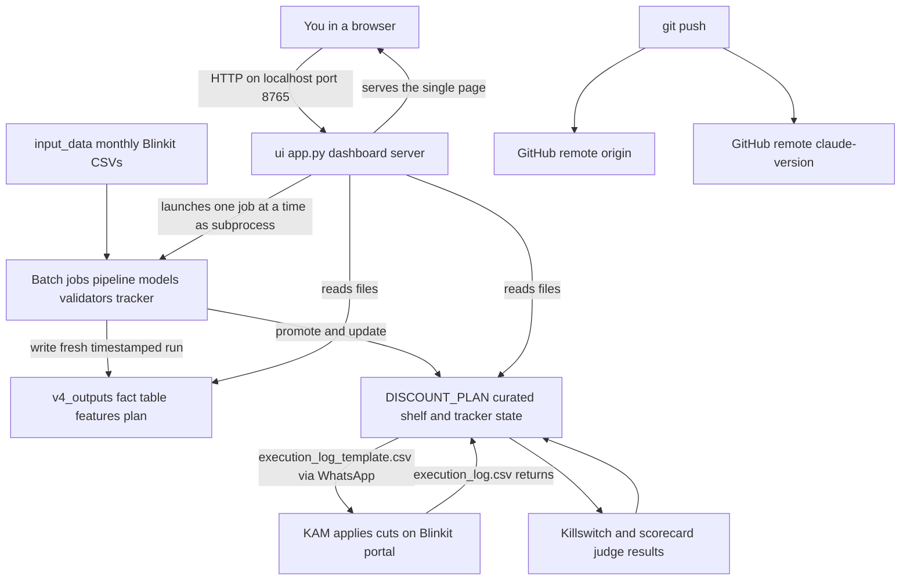

The plain-English tour, ten lines:

1. Once a month, Blinkit's raw sales exports land as CSV files in `input_data/` — the only place raw truth enters.
2. You double-click `launch_ui.bat`; it starts one Python program, `ui/app.py`, which waits at address `localhost:8765` — reachable only from this machine.
3. Your browser opens one page, `ui/index.html` — the entire dashboard — and from then on asks the server small questions and renders the answers.
4. When you click a Run button, the server launches the requested analysis script as a separate program, one at a time, and streams its log to your screen live.
5. The pipeline reads the raw CSVs and writes everything it computes into a fresh, dated folder under `v4_outputs/` — no run ever overwrites another.
6. The models, validators, and gates read that run's fact table and write the plan: which discounts to cut, which to keep, with pass/fail receipts.
7. The blessed, current plan lives in `DISCOUNT_PLAN/` — the one folder the dashboard, the weekly tracker, and your KAM actually work from.
8. Every Monday the tracker writes a work order for your KAM; the KAM applies the cuts in Blinkit's portal and returns a filled-in confirmation file.
9. When fresh data arrives, the system grades its own predictions against reality — and the kill-switch automatically flags any cut that's losing money for reversal.
10. Everything important — code, config, plans, history — is pushed to two GitHub backups, so a dead laptop costs you hours, not the business.

That's the whole system. Everything in this handbook is a zoom-in on one arrow or one box of that picture.

## Table of contents

1. [The Big Picture — what a software system actually is](#1-the-big-picture--what-a-software-system-actually-is)
2. [The Data Layer — where every fact lives](#2-the-data-layer--where-every-fact-lives)
3. [The Compute Layer — models as background jobs](#3-the-compute-layer--models-as-background-jobs)
4. [The Application Layer — your dashboard, taken apart](#4-the-application-layer--your-dashboard-taken-apart)
5. [The Request Lifecycle — every step from double-click to answer](#5-the-request-lifecycle--every-step-from-double-click-to-answer)
6. [The Weekly Loop as an Event System — state, feedback and safety](#6-the-weekly-loop-as-an-event-system--state-feedback-and-safety)
7. [The SaaS Toolbox — every concept you will meet when this becomes a product](#7-the-saas-toolbox--every-concept-you-will-meet-when-this-becomes-a-product)
8. [Architecture at Four Scales — from your laptop to a real SaaS](#8-architecture-at-four-scales--from-your-laptop-to-a-real-saas)
9. [How an Architect Thinks — the decisions in this system, defended](#9-how-an-architect-thinks--the-decisions-in-this-system-defended)
10. [The Glossary](#the-glossary)


---

## 1. The Big Picture — what a software system actually is

You already own a real software system. It finds wasted discount for 24 Mantra Organic on Blinkit, it has survived audits, and it makes money-relevant decisions weekly. What you don't yet have is the *vocabulary and mental model* that lets you reason about it the way an architect would — and that's exactly what stands between "I built this with AI" and "I can design the 10-brand version and sell it." This opening section builds that model from the ground up, using nothing but the code that's already on your machine.

One ground rule for the whole handbook: every technical term gets explained in plain language the first time it appears, with the everyday thing it resembles. If you already know a term, skim the gloss; if you don't, the two sentences are the whole price of admission.

#### What a software system actually is: programs, files, and conversations

Strip away all jargon and a software system is three things:

1. **Programs** — written instructions that a computer can follow, like a recipe a cook can execute.
2. **Files** — saved information on disk, like documents in a filing cabinet. They persist when the power goes off.
3. **Conversations** — the ways programs talk to each other and to you, passing questions and answers back and forth.

Everything else — servers, APIs, databases, the cloud (which just means renting other people's computers over the internet instead of using your own) — is just an arrangement of those three primitives, and each of those words gets its own plain-language explanation in the pages that follow. Your system is a particularly clean example because it uses each one in its plainest form, which makes it the perfect teaching specimen.

Before going further, four foundational terms:

- A **program** is a file of instructions sitting on disk, doing nothing — like a recipe card in a drawer. `pipeline.py` is a program. So is `ui/app.py`. When it's just sitting there, it costs nothing and does nothing.
- A **process** is a program that is currently *running* — the recipe actively being cooked, with a chef assigned, pans on the stove, memory allocated. When you double-click `launch_ui.bat`, Windows takes the program `ui/app.py` and turns it into a process. Close the window and the process dies; the program file remains, unharmed, ready to run again. This distinction matters constantly: "the dashboard is broken" (program has a bug, fix the code) is a completely different problem from "the dashboard isn't running" (no process exists, start it again).
- A **repository** — "repo" for short — is a project folder whose entire history is tracked by a tool called git, like a filing cabinet that remembers every version of every document ever placed in it and who changed what. Your working directory *is* a repo, backed up to two GitHub remotes (GitHub is a website that stores copies of repos).
- A **CSV** file — "comma-separated values" — is the simplest possible spreadsheet: plain text where each line is a row and commas separate the columns. Open one in Notepad and you can read it. The backbone of your data layer — `input_data/*.csv`, `fact_table.csv`, `cut_list.csv` — is CSVs. No special software needed to inspect them, which is a feature, not a limitation, at your scale.

#### The one map: your whole system on a napkin

Here is your entire system as an architect would sketch it. Every box is something you can open and read on your machine. The arrow labels use a few terms — HTTP, JSON, port, subprocess — that each get their own plain-language section just below; for now, read the down-arrows as "asks" and "launches" and the up-arrows as "answers."

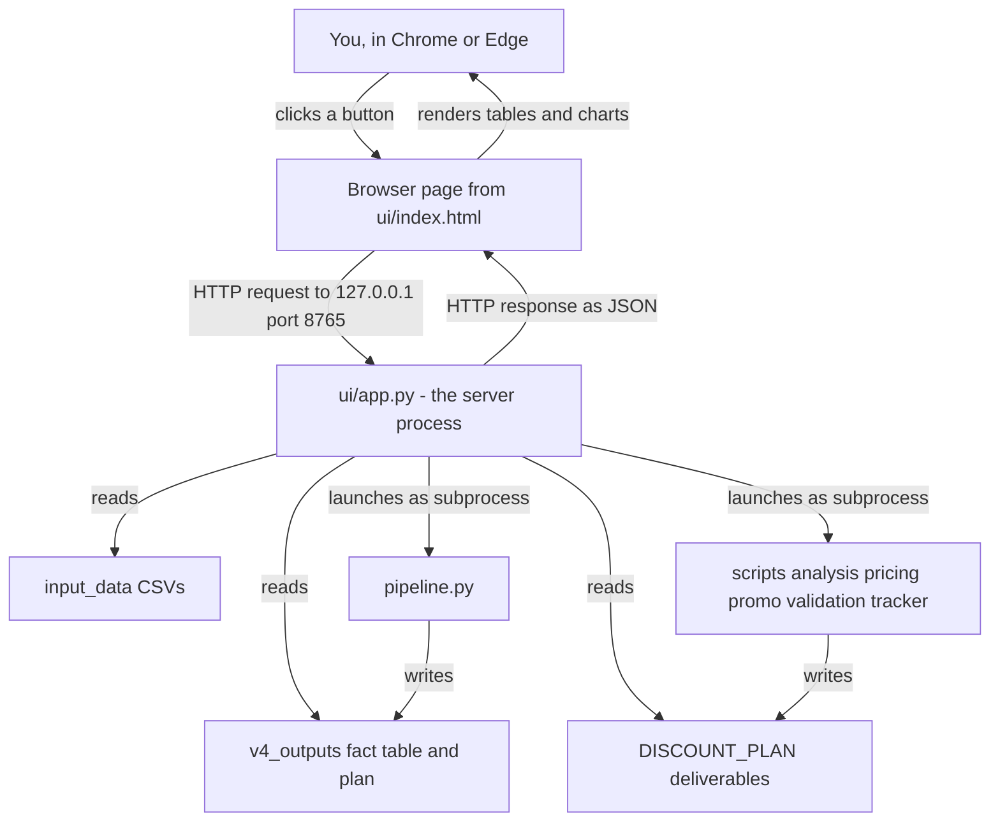

Read it top to bottom: you click a button in your browser; the browser sends a message to `ui/app.py`; `ui/app.py` either reads a file and sends the contents back, or launches one of your analysis programs and streams its progress back. That's the whole system. Roughly eighty Python program files (Python is the programming language nearly all of your system is written in — a language being the fixed vocabulary and grammar for writing instructions a computer can follow), a few hundred CSV and report files, and one program in the middle that answers the browser. Everything in this handbook is a zoom-in on some part of this picture.

#### Client and server: one program asks, one program waits

**Level 1 — like you're new.** Think of a restaurant with exactly one waiter who never goes home. The waiter stands at his station all day, doing nothing, *waiting* for a customer to walk in and ask for something. A customer arrives, asks "table 4's bill, please," the waiter fetches it, hands it over, and goes back to waiting. The customer is the **client** — the one who asks. The waiter is the **server** — the one who waits and answers. Crucially, the server never initiates anything. It cannot walk to your house and give you a bill you didn't ask for. It only ever *responds*.

**Level 2 — how it actually works in your repo.** A **server** is nothing mystical: it is *a program whose main job is to wait*. Look at the two key lines of `main()` at the bottom of `ui/app.py`:

```python
srv = ThreadingHTTPServer(("127.0.0.1", PORT), Handler)
srv.serve_forever()
```

`serve_forever()` is exactly what it sounds like — an infinite loop of "wait for a request, answer it, wait again." When you double-click `launch_ui.bat`, this process starts and then sits idle, consuming almost nothing, until your browser asks it something. Your **client** is the web browser (Chrome, Edge — the program you use to visit websites) running the page defined in `ui/index.html`. Every second while a job is running, that page asks the server "how's the job going?" and the server answers. The browser asks; `app.py` answers; never the reverse. When your dashboard seems "frozen," the first diagnostic question is always: is the waiter still at his station? (Is the `app.py` process running?)

**Level 3 — how a senior engineer sees it.** This is the *client-server pattern*, the single most common arrangement in all of software. Its power is separation: the client can be replaced (a phone app, a different browser, another program) without touching the server, and vice versa, as long as they keep speaking the same agreed language. The trade-offs an engineer weighs: a server is a single point of failure (one waiter — if he collapses, the restaurant stops), it must handle multiple simultaneous customers (yours uses `ThreadingHTTPServer`, meaning it can hold several conversations at once — more on threads shortly), and because the server only responds, the client must *poll* (repeatedly ask) to learn about changes — which is exactly why your dashboard fetches job status every second instead of the server "pushing" updates. Polling is slightly wasteful but drastically simpler; at one user on one machine, it's the correct choice.

#### Localhost and ports: the address system

**Level 1.** Every computer that talks over a network has an address, like a street address for an apartment building. But one building holds many apartments — one computer runs many programs that could each be listening for messages. So an address has two parts: the building (the computer) and the apartment number (which program inside it). The special address **127.0.0.1** — also spelled **localhost** — means "this very building I am standing in." A letter addressed to 127.0.0.1 never leaves your machine; the postal service hands it straight back through your own mail slot. The **port** is the apartment number: a number from 1 to 65535 that identifies which listening program should receive the message.

**Level 2.** Line 25 of `ui/app.py`: `PORT = int(os.environ.get("UI_PORT", "8765"))`. Your server rents apartment 8765 in your own building. When you type `http://localhost:8765` in the browser, you're saying "deliver this to apartment 8765 in this building." (That line also shows an **environment variable** — a named setting the operating system (Windows, on your machine) hands to a program at startup, like a sticky note on the recipe card saying "tonight, use the small oven." `UI_PORT` lets you change the port without editing code.) Two consequences you'll actually hit: (1) if another program already occupies port 8765, your server can't start — the apartment is taken — and you'll see an "address already in use" error; (2) because the server binds to 127.0.0.1 *specifically*, no other computer on your Wi-Fi, and nothing on the internet, can reach it. That single line is your entire security perimeter, and at one operator on one machine, it's a remarkably strong one.

**Level 3.** Engineers call this *binding to loopback*. It is the deliberate choice "this service is for this machine only." The moment you want a colleague on your network to see the dashboard, you'd bind to `0.0.0.0` (all addresses) — and at that instant you'd inherit every security obligation you currently don't have: logins, encryption, permissions. Knowing exactly which line of code holds that door shut is the kind of thing architects keep in their heads.

#### HTTP: the letter format for request and reply

**Level 1.** For the customer and waiter to understand each other, they need a fixed etiquette: how to phrase an order, how to phrase the reply. **HTTP** (HyperText Transfer Protocol) is that etiquette for the web — a rigid letter format. Every letter from client to server states a *verb* (most commonly **GET**, "please give me something," or **POST**, "please do or accept something"), a *path* (what, exactly — like a dish name on the order slip), and optionally a body. Every reply carries a *status code* — a three-digit number meaning "here you go" (200), "never heard of that dish" (404), "kitchen's on fire" (500), or "kitchen busy, can't take that now" (409) — plus the content itself.

**Level 2.** Your `Handler` in `ui/app.py` (a *class* — a named bundle of related functions that travel together, like one employee's full job description) answers requests through exactly two functions, `do_GET` and `do_POST`, one per verb it understands. When the browser sends `GET /api/status`, the handler runs `api_status()` — which reads your config, your input files, your latest plan — and replies with code 200 and the data. When the browser sends `POST /api/run/pipeline`, the handler tries to start the pipeline job and replies 200 ("started") or 409 ("A job is already running — wait for it to finish"). Ask for a table that hasn't been generated yet and you get a 404 with the plain-English message "not generated yet: the cut list (run the monthly rebuild)". Those codes aren't decoration — they're how the browser page decides whether to render data, show your friendly error, or flag a real failure. When you debug the dashboard, the browser's developer tools (a built-in inspection panel every browser ships — press F12 and pick the Network tab) show every one of these letters and its status code, which is usually enough to localize any problem in under a minute.

**Level 3.** HTTP is *stateless*: each letter is self-contained, and the server retains no memory of previous letters from you. Statelessness is why web servers scale so well — any waiter can serve any customer, since no waiter needs to remember your history. Your system keeps its only cross-request memory in the `JOB` object (the currently running job) and, more durably, in files on disk. An engineer would also note your verbs are used correctly: GET never changes anything (safe to repeat endlessly — and your page does, every second), POST changes things (start a job) and is sent only on deliberate clicks. Sloppy systems that mutate state on GET get burned the first time a browser pre-fetches a link.

#### API and endpoints: the printed menu of allowed requests

**Level 1.** A restaurant doesn't take arbitrary requests — you order off the **menu**. An **API** (Application Programming Interface) is exactly that: the fixed, published list of requests a server agrees to answer, each with a defined question format and answer format. Each individual item on the menu — one path the server responds to — is called an **endpoint**. The menu is a contract: the kitchen can be entirely rebuilt, but as long as the menu items and their descriptions stay the same, customers never notice.

**Level 2.** Your dashboard's complete menu, straight from `ui/app.py`:

| Endpoint | Verb | What it answers |
|---|---|---|
| `/api/status` | GET | The whole health snapshot: latest run, config knobs, input files, tracker stats, validation receipts |
| `/api/steps` | GET | The list of runnable playbook steps and the monthly order |
| `/api/table/cuts` (and `reinvest`, `buckets`, `handoff`, `scenarios`, `sensitivity`, `history`) | GET | A named table read from your CSVs |
| `/api/report/readout` (and 7 others in the `REPORTS` dict) | GET | The text of a named report file |
| `/api/job` | GET | Live progress of the running job: status, elapsed time, log tail |
| `/api/run/<step>` | POST | Start one named step from the allowlist |

Six kinds of question. That's the entire surface. And notice the deepest design decision in your whole application layer: `POST /api/run/<step>` accepts **only step ids from the fixed `STEPS` dictionary** (plus one composite id, `monthly_all`, which runs the thirteen monthly steps in order) — an *allowlist*, a pre-approved list where everything not explicitly on it is refused. The browser can never say "run this arbitrary command"; it can only say "run step number 6," and the server looks up what step 6 actually means. Even if something malicious reached your dashboard, the worst it could do is run your own analysis scripts in their intended order.

**Level 3.** This style — plain paths, HTTP verbs, JSON answers — is informally called a *REST-ish API* (REST is a set of conventions for designing HTTP menus; yours follows the spirit without the ceremony). The allowlist is the *command pattern with a whitelist*, and it's the difference between an API and a remote-control vulnerability. An engineer reviewing your code would call this the best line in the file. What they'd flag for the future: the API has no *versioning* (if you change what `/api/status` returns, every client must update in lockstep — fine when you own the only client, untenable when paying customers integrate against it) and no *authentication* (proof of who's asking — unnecessary on loopback, mandatory the day this leaves your machine).

#### JSON: the shared note format

**Level 1.** When the waiter brings your answer, it has to be written in a format both sides can read. **JSON** (JavaScript Object Notation) is the lingua franca note format of modern software: human-readable text with names and values in curly braces, like a structured index card. `{"status": "running", "elapsed": 42.5}` — any programming language can write it, any can read it.

**Level 2.** Every answer your server sends is JSON, produced by one helper: `_send()` in `ui/app.py` calls `json.dumps(body)` — Python's built-in "turn my data into a JSON note" function — and the browser page runs the mirror-image `response.json()` to turn the note back into data it can render as tables and SVG charts (SVG being a way of describing pictures as plain text that every browser knows how to draw — your charts need no charting software at all). Your `plan_summary.json` and `dml_results.json` files on disk are the same format used for storage instead of transmission — one format, two jobs. That's worth imitating everywhere: fewer formats means fewer translation bugs.

**Level 3.** JSON won because it's *schemaless* (no upfront paperwork defining every field) and readable in any text editor — the trade-off being that nothing enforces the shape, so a misspelled field name fails silently at read time rather than loudly at write time. At your scale, eyeballs catch that. In a SaaS, engineers add *schema validation* — an automatic proofreader that rejects malformed notes at the door.

#### Frontend and backend: the dining room and the kitchen

**Level 1.** Split any interactive system down the middle. The **frontend** is everything the user sees and touches — the dining room: menus, table settings, the presentation of the plate. The **backend** is everything that does the real work out of sight — the kitchen: ingredients, recipes, the stove, the pantry. Diners never enter the kitchen; the two halves communicate only via the waiter carrying orders in and plates out.

**Level 2.** Your frontend is one file: `ui/index.html` — an HTML page (HTML is the language describing what a web page contains) with its styling and behavior written in JavaScript (the programming language that runs *inside the browser*, on the diner's side of the divide). It handles hash routing (switching between its six views — Overview, Run Center, Cut Plan, Weekly Loop, Reports, Inputs & Settings — without reloading the page), polling `/api/job` every second during runs, drawing SVG charts, and the light/dark StatIQ Lab themes. It contains **zero business logic** — it does not know what an elasticity is or how a cut is chosen; it only knows how to ask the menu and display the answers. Your backend is `ui/app.py` plus everything it commands: the pipeline, the models, the trackers, the files. This division is why the substantial visual redesigns you've done never once risked corrupting a pricing decision — the kitchen literally cannot be reached from the dining room except through the six menu items.

**Level 3.** Engineers call your frontend a *single-page application* (SPA): one HTML file that rewrites itself in place instead of loading new pages. Yours is *zero-dependency* vanilla JavaScript — no React or other frameworks (a framework being a large pre-built scaffold of code that your app plugs into, gaining structure but inheriting its update treadmill) — which trades some developer convenience for a system with nothing to install, nothing to build, and nothing to break when a package updates. At one page and one developer, that's the right trade. The frontier where it stops being right: when the page grows to dozens of views with shared interactive state, hand-rolled JavaScript becomes the bottleneck and a framework earns its complexity. The frontend/backend split itself, though, is permanent — it survives every rewrite on either side.

#### Threads and subprocesses: how one waiter runs a whole kitchen

Two more terms, because they're the moving parts inside your backend.

A **thread** is a second pair of hands *inside the same process* — the waiter humming a tune while polishing glasses: two activities, one person, shared memory. Your server needs this because a monthly rebuild takes 15–25 minutes, and a waiter who disappears into the kitchen for 25 minutes leaves every customer unanswered. So `start_job()` in `app.py` spins the long work off onto a background thread (`threading.Thread(...).start()`) and the main thread keeps answering `/api/job` — which is how you can watch live logs *while* the pipeline runs.

A **subprocess** is a *separate hired worker* — a whole new process launched and supervised by another. Your server never imports and runs your analysis code inside itself; instead `_run_commands()` launches each step as its own Python process (`subprocess.Popen([sys.executable, ...])`) and reads its output line by line into the log. This isolation is load-bearing: if `discount_plan.py` crashes or leaks memory, it dies *alone* — the dashboard logs "FAILED (exit N)" (the *exit code* — the number every finishing process reports back; 0 means success, anything else means failure) and keeps serving. It's also why your fragile numpy environment is survivable (numpy is the mathematics *library* under all your analysis — a library being ready-made code you install and reuse rather than write, and yours is deliberately *pinned*, locked at version 1.26.4, because a routine install once broke it): each script runs in a clean process, and a crash in one never poisons the others. The one-job-at-a-time rule (the `JOB.lock` and the 409 answer) is the final piece: two pipelines writing `v4_outputs/` simultaneously would corrupt each other, so the server simply refuses to hire a second worker while one is busy. Sequencing through a single choke point is the cheapest concurrency-safety mechanism in existence, and at one operator it costs you nothing.

#### Files as storage: your filing cabinet, and when it stops being enough

**Level 1.** Your system has no **database** — a database being a dedicated program whose only job is storing and retrieving data safely for many simultaneous users, like a bank vault with a full-time librarian who checks IDs, prevents two people from editing the same record at once, and keeps an index of everything. You instead use the filing cabinet: plain CSV, JSON, and **Markdown** files (Markdown is a way of writing formatted documents in plain text — `#` for headings, `**bold**` — which both humans and programs read easily; every report in `DISCOUNT_PLAN/` is Markdown) organized in folders.

**Level 2.** The pattern in your repo is precise and worth naming. `input_data/` holds the raw monthly Blinkit exports. `pipeline.py` writes each rebuild into a *fresh timestamped folder* under `v4_outputs/` — so no run ever overwrites a previous run, and `_latest_run()` in `app.py` finds the newest simply by sorting folder names. The centerpiece of each run is the **fact table** (`fact_table.csv`) — one big cleaned-up table where every row is one product in one city on one day, with everything known about it: price, discount, units sold, availability, competitor price, share of voice. "Fact table" is a data-warehousing term for exactly this: the single table of record that every downstream model reads, so all forty scripts agree on reality. Curated deliverables land in `DISCOUNT_PLAN/`, and the whole tree is versioned by git to two GitHub remotes — which quietly gives you off-site backup and a full audit trail ("what did the plan say in March?") for free. The scripts read these files using **pandas**, the standard Python library for working with tables — it loads a CSV into a **DataFrame** (pandas' name for an in-memory table you can filter, group, and join, a programmable spreadsheet). Look at `api_status()`: `pd.read_csv(...)`, group, count, answer. That *is* your data layer.

**Level 3.** An engineer's honest verdict: **files are the correct database for this system.** The reasons are structural, not accidental. You have one writer at a time (the job lock guarantees it), one reader-operator, monthly-batch data volumes, and — decisively — every file is inspectable in Excel or Notepad by a non-programmer, which for a business owner is worth more than any database feature. Databases earn their complexity when specific pressures arrive, and you should know the tripwires by name: *concurrent writers* (two brands rebuilding at once — file writes aren't *atomic*, meaning all-or-nothing; two programs writing the same file interleave and corrupt it), *queries across runs* ("show week-12 waste across all 10 brands" means opening dozens of CSVs instead of one indexed query — an **index** being the librarian's card catalog that finds records without reading every shelf), *multi-user access control* (files have no concept of "client A may not see client B's folder"), and *transactional safety* (a crash mid-write leaves a half-written CSV; databases guarantee all-or-nothing). At 10 brands run by you alone: files still fine, with discipline. At SaaS with customer logins: a database is non-negotiable. The handbook's data-layer section covers the migration path; the point here is that "no database" is a decision you made correctly *for these constraints* — and constraints, as we'll see in a moment, are the whole game.

#### The three-tier mental model: the shape underneath almost everything

Now zoom out. Nearly every business system ever built — including yours, including Blinkit itself, including any SaaS you'll compete with — decomposes into the same three layers:

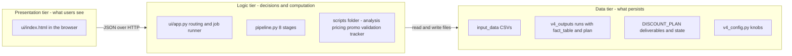

- **Presentation tier**: `ui/index.html`. Shows, asks, never decides.
- **Logic tier**: `ui/app.py` as the traffic director, and the eighty-odd Python files as the actual brains — the RLM champion model (RLM is *robust linear model*, a kind of *regression* — the statistical technique of fitting a line through past data to estimate how one thing, like discount, moves another, like sales — built to resist being dragged around by freak data points; it lives in `scripts/analysis/discount_plan.py` and finds wasteful discount), the Bayesian pricing engine (*Bayesian* — a statistical approach that starts from a sensible prior belief and updates it as evidence arrives, rather than trusting thin data alone), the MILP promo calendar (MILP is *mixed-integer linear programming* — a mathematical technique for choosing the best combination under hard rules, like building the best promo calendar that never violates spacing and budget limits), the C1–C8 gates (eight hard pass/fail acceptance checks the plan must clear before you act on it), the weekly tracker.
- **Data tier**: the filing cabinet just described, plus `v4_config.py` holding the knobs.

Two properties make this shape so durable. First, *dependencies point one way*: presentation depends on logic, logic depends on data, never the reverse — `fact_table.csv` has no idea the dashboard exists, so you can redesign the dashboard with zero risk to the numbers, and you have. Second, *each tier scales and evolves independently*: swap CSVs for a database and the frontend never knows; rewrite the frontend in a framework and the models never know. When you sketch the 10-brand version or the SaaS version, you will draw these same three boxes and ask, tier by tier: what changes, what survives? (Answer, previewed: presentation survives nearly intact, logic needs a "which brand?" parameter everywhere, data needs per-tenant isolation — a *tenant* being one customer whose data must stay walled off from every other customer's — that's the multi-brand section's story.)

One caveat a senior engineer would add: your logic tier is really *two* kinds of logic — the always-on interactive server, and the batch computation it launches. That's a fourth pattern hiding inside the third tier (*online service* vs *batch jobs*), and it's why "the dashboard is instant but the rebuild takes 25 minutes" is not a flaw but two different species of work correctly kept apart.

#### The whole system, three ways

**Level 1 — like you're new.** Your system is a restaurant that serves exactly one diner: you. The dining room is the dashboard. The waiter is `app.py`, standing at apartment 8765 in your own building, answering only questions from a six-item menu. The pantry is your folders of CSVs. The kitchen brigade is dozens of specialist cooks — cleaner, modeler, validator, tracker — each hired for one dish at a time, one at a time, never two at once. The health inspectors (C1–C8 gates, backtest, sensitivity, challenger) taste everything before it reaches the table. And the recipe book that says *when* to cook what is `EXECUTION_PLAYBOOK.md`: monthly rebuild, weekly loop, quarterly governance.

**Level 2 — how it actually works.** `launch_ui.bat` starts a Python process running `ui/app.py`, which binds a `ThreadingHTTPServer` to 127.0.0.1:8765 and serves `ui/index.html` to your browser. The page polls JSON endpoints; GETs read CSVs via pandas and report files from disk; the single POST endpoint starts one allowlisted step, which a background thread runs as a sequence of subprocesses with output streamed into an in-memory log (a `deque` capped at 6000 lines — a rolling notepad that discards the oldest lines so memory can't fill up). Steps write their results back to `v4_outputs/<timestamp>/` and `DISCOUNT_PLAN/`, the next GET reads them, and the loop closes. The human loop closes the same way at weekly scale: the tracker writes `execution_log_template.csv`, your KAM (Key Account Manager — the person who actually operates the Blinkit seller portal for you) applies the cuts in Blinkit and returns `execution_log.csv`, and the scoring step marks predictions against reality — with the kill-switch as the undo button.

**Level 3 — how a senior engineer sees it.** A *local-first, single-tenant, file-backed, three-tier system with a batch-job core behind a thin HTTP facade*. Named patterns in play: client-server, REST-ish API, command-allowlist, single-writer lock, immutable timestamped outputs (each run a fresh folder — no overwrites, free auditability), subprocess isolation, and polling-based progress. Judgments: the security model (loopback + allowlist + no arbitrary commands) is genuinely sound *for its threat model of one trusted operator*; the zero-dependency choice is defensible given a Python environment already proven fragile (numpy pinned at 1.26.4 because one `pip install pymc` — pip being Python's installer for add-on libraries — broke the stack; scars that teach you why engineers dread dependency sprawl). What the engineer worries about, in order: everything lives on one Windows machine (a dead laptop means the git remotes save your *code and outputs*, but the running system is down until you rebuild the environment — and that fragile environment is the slowest part to rebuild); no authentication anywhere (fine today, cliff-edge the day the binding changes); job state held only in memory (kill the server mid-run and the log is gone, though the files on disk survive); and every scale-up axis — brands, users, machines — eventually converges on the same three answers: a database, logins, and a second machine. None needed today. All foreseeable. That foreseeing is the skill you're building.

#### The architect's first lesson: architecture is deciding where things live and how they talk

Here is the definition that the rest of this handbook keeps returning to:

> **Architecture is the set of decisions about where things live and how they talk — made against your actual constraints.**

Where things live: is the logic in the browser or the server? (Yours: server — browser stays dumb.) Is the data in files or a database? (Yours: files.) Do the models run inside the server or as separate workers? (Yours: separate subprocesses.) How things talk: HTTP with JSON between browser and server; launched processes with streamed text between server and models; files-on-disk between every monthly script and the next. Each of those was a real decision with real alternatives — and each is *right or wrong only relative to constraints*.

Your constraints, stated plainly, because they justify nearly every choice above:

1. **One machine.** No network between components → localhost is safe, files are shared trivially, no coordination between computers to design.
2. **One operator (you).** No permissions, no logins, no simultaneous-user conflicts → the one-job lock and loopback binding cover everything.
3. **A fragile Python environment.** numpy pinned, PyMC banned → subprocess isolation and zero-dependency choices minimize the surface where package conflicts can hurt you.
4. **Zero cloud budget.** Everything free and local → a server built only from Python's *stdlib* (the "standard library" — the toolbox that ships inside Python itself, so there is nothing extra to install or update), CSVs, git as backup, no hosting bills.

Against those constraints, your architecture isn't a beginner's compromise — it's close to what a good engineer would deliberately build. The beginner mistake is not "using files instead of a database"; it's *copying big-company architecture without big-company constraints* — bolting on databases, message queues (a *queue* is a waiting line for work handed between programs, like the ticket dispenser at a counter — indispensable when thousands of jobs compete, pure overhead when there's one), and cloud services a one-operator system doesn't need, then drowning in their upkeep. The equal-and-opposite mistake is failing to notice when constraints change: the day you sign a second brand and hand them a login, constraint 2 dies, and with it the justification for no-auth and single-writer files. Architecture isn't a one-time blueprint — it's a standing answer to "given today's constraints, where should things live and how should they talk?", re-asked every time a constraint moves.

The rest of this handbook walks each tier of your system in depth with that question in hand: what this component is, why it exists here, what it talks to, how it fails, and what it becomes at 10 brands and then at SaaS. You now hold the map; the following sections are the territory.


---

## 2. The Data Layer — where every fact lives

Every system you will ever design has to answer one question before any other: **where does every fact live, and who is allowed to touch it?** Get this wrong and nothing downstream can be trusted — not the model, not the dashboard, not the weekly plan your KAM (key account manager — the person on your side who actually keys price changes into Blinkit's portal) executes. Your system answers it with something deliberately humble: **folders full of files on one Windows machine**. This section explains why that is currently the *right* answer, exactly how it works, and precisely when it stops being right.

A few words before we start, because they will appear constantly:

- A **file** is just a named blob of bytes on your disk — like a single sheet of paper in a drawer.
- A **CSV** (comma-separated values) is the simplest possible spreadsheet-as-a-file: plain text where each line is a row and commas separate the columns. Open one in Notepad and you can read it. Open it in Excel and it looks like a table. Your entire data layer is built on CSVs.
- A **repository** (or **repo**) is a project folder whose full history is tracked by a tool called git — every change ever made, who made it, and when. Think of it as a filing cabinet with a built-in time machine: you can rewind any drawer to how it looked last Tuesday. Your whole system lives in one repo.
- **pandas** is the Python library your code uses to work with tables. When pandas loads a CSV into memory it calls the result a **DataFrame** — think of a DataFrame as an Excel sheet living inside the program: rows, named columns, and fast operations across all of them at once.
- **Markdown** is a plain-text format for writing documents — `#` makes a heading, `**bold**` makes bold. Files ending in `.md` (like `PLAN.md`) are Markdown. It is "a Word doc without Word": readable raw, pretty when rendered.
- **JSON** (JavaScript Object Notation) is a plain-text format for structured data — labelled values in nested curly braces, like a printed form with named boxes. Files like `dml_results.json` use it. Programs read and write it trivially; humans can read it in a pinch.

With those in hand, here is the whole layer at a glance:

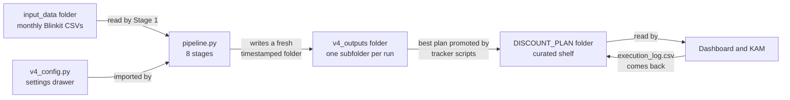

Four rooms, one direction of flow: raw data comes into the **inbox** (`input_data/`), the pipeline processes it and files an **immutable snapshot** (`v4_outputs/<timestamp>/`), the good stuff gets promoted to the **curated shelf** (`DISCOUNT_PLAN/`) that your dashboard and KAM actually use, and one **settings drawer** (`v4_config.py`) controls how the machine behaves. Let's take each room in turn.

---

#### input_data/ — the inbox

##### Level 1 — like you're new

Imagine a physical inbox tray on your desk. Once a month, Blinkit's report lands in it. You never write on these pages yourself — you photocopy them into your working files and leave the originals untouched. That's `input_data/`: the tray where raw monthly exports land, and the *only* place raw truth enters the system.

##### Level 2 — how it actually works in this repo

Right now the folder holds seven files:

```
input_data/
  JAN_2026_BLINKIT_RCA.csv
  FEB_2026_BLINKIT_RCA.csv
  MARCH_2026_BLINKIT_RCA.csv
  APRIL_2026_BLINKIT_RCA.csv
  MAY_2026_BLINKIT_RCA.csv
  JUNE_2026_BLINKIT_RCA.csv
  MY SKU.csv
```

Six monthly Blinkit "RCA" exports plus one SKU-master metadata file. Stage 1 of the pipeline (`stage1_ingestion/ingest.py`, function `ingest_all_sales`) is the only code that reads this folder. It:

1. **Globs the folder** — "globbing" is programmer-speak for collecting every file whose name matches a pattern, like telling an assistant "bring me everything ending in .csv from that tray." It gathers every `*.csv` and `*.xlsx`, deliberately *skipping* lock files (names starting with `~`, which Excel creates while a file is open) and anything named like "my sku" or "sku list", because those are metadata, not sales rows.
2. **Reads CSVs in chunks of 200,000 rows** with every column forced to text (`dtype=str`) — memory-light and type-safe (more on why that matters in the CSV traps section below).
3. **Renames raw columns to canonical names** via the `RCA_RENAME` map ("Product ID" → `PRODUCT_ID`, "Wt. Discount %" → `WT_DISCOUNT_PCT`, …), so the rest of the pipeline never has to know what Blinkit called anything this month.
4. **Filters to your brand only** using `BRAND_NAME` / `OWN_BRAND_PATTERNS` from the config, with two loud tripwires: an *over-match* guard (a generic pattern like "gold" quietly absorbing "Tata Gold") and an *under-match* guard (a spelling like "Mother-Dairy" silently dropped as a competitor). Both raise a hard error rather than proceed with wrong data — a design instinct worth copying everywhere: **fail loud at the door, not quietly in the basement**.
5. **Normalises grammage** so `500`, `'500 g'`, and `'500g'` all become `500g` — otherwise the same product would split into phantom duplicates.
6. **Deduplicates** on (product, grammage, city, date), keeping the last row.

Data in: raw platform CSVs. Data out: one clean combined DataFrame handed to Stage 2. Nothing is ever written back into `input_data/`.

##### Level 3 — how a senior engineer sees it

This is a **landing zone** (sometimes "raw zone" in data-engineering jargon) with an **anti-corruption layer** on top: the rename map and brand filter translate the outside world's messy vocabulary into your internal one at exactly one choke point. The trade-off they'd note: ingestion currently trusts filenames and folder placement — there's no checksum (a short fingerprint computed from a file's exact bytes; if one byte changes, the fingerprint changes) or manifest (a packing list saying what should be present) confirming "June's file is complete and untampered." At one brand with you as the only operator, that's fine; at ten brands with ten upload sources, a senior engineer would add a per-file validation report (row counts, date ranges covered, columns present) written next to each file, so a truncated export gets caught the day it lands, not the day the model looks wrong.

**What breaks without it:** nothing runs — Stage 1 raises `FileNotFoundError` if the folder is empty. **Who calls it / when:** only `pipeline.py` Stage 1, monthly (per your `EXECUTION_PLAYBOOK.md` cadence) when a new export arrives. **Beginner mistake specific to this room:** editing a monthly CSV in Excel "to fix one row" and re-saving — Excel silently rewrites dates, drops leading zeros, and changes the file's encoding. If a source row is wrong, fix it in code (a documented correction in Stage 1/2) or get a corrected export, so the fix is repeatable and visible in git.

---

#### v4_outputs/<timestamp>/ — immutable run snapshots

##### Level 1 — like you're new

Every time the pipeline runs, it doesn't overwrite yesterday's work — it opens a brand-new folder named with the exact second it started, and files *everything* from that run inside. Like a lawyer who never edits a signed contract: each new version is a fresh document, dated, and the old ones stay in the cabinet forever. Want to know what the system believed on July 3rd? Open the July 3rd folder. Nothing to reconstruct, nothing to argue about.

##### Level 2 — how it actually works in this repo

In `pipeline.py`, the very first thing `run_pipeline` does:

```python
timestamp = time.strftime("%Y%m%d_%H%M%S")
run_dir = os.path.join(cfg.OUTPUT_DIR, timestamp)
os.makedirs(run_dir, exist_ok=True)
```

That's the whole versioning mechanism — twelve characters of clock. Your latest run folder, `v4_outputs/20260711_221318/`, contains:

| File | Size | What it is |
|---|---|---|
| `fact_table.csv` | ~30 MB | Stage 2's cleaned table: one row per SKU × grammage × city × day |
| `features.csv` | ~69 MB | Stage 3's model-ready table with engineered columns |
| `elasticity_estimates.csv` | ~160 KB | Stage 4's per-cell price sensitivities |
| `outliers_removed.csv` | ~330 KB | The audit trail of rows excluded from training, and why |
| `recommendations.csv` | ~240 KB | Stage 7's per-cell price recommendations, guardrailed and tiered |
| `waste.csv`, `reinvest.csv`, `WASTE_REINVEST_REPORT.md/.xlsx` | — | Stage 8's business report |
| `per_cell_detail.json` | ~5 MB | Per-cell drill-down data behind the report |
| `BRAND_DASHBOARD.html` | ~2.9 MB | A self-contained visual dashboard |
| `plan/` | — | `cut_list.csv`, `reinvest_list.csv`, `all_cells.csv`, `dml_results.json`, `plan_summary.json` — the decision artifacts |

Notice the shape: each stage hands its output to the next *in memory* during the run (via a `context` dictionary — a labelled tray passed down the line), but also **persists a checkpoint to disk**. Be precise about what those checkpoints buy you: within `pipeline.py` itself the stages only pass data in memory, so `--stages 4 5 6` on its own would fail — a partial run must still start from Stage 1 (the docstring's own example is `--stages 1 2 3`). The checkpoints' real value is *downstream and diagnostic*: the tracker, pricing, and validation scripts read `fact_table.csv` and `features.csv` from the latest run folder instead of re-ingesting raw data, and when a run goes wrong you can open each checkpoint in order and see exactly which stage broke.

##### Why timestamped folders are genuinely smart, not lazy

This pattern buys you three expensive properties for free:

1. **Poor-man's versioning.** You never lose a result. There is no "the numbers changed and I don't know why" — you diff two run folders and see exactly what changed.
2. **Reproducibility.** A run folder is a close-to-complete, self-describing record: the raw inputs still sit untouched in `input_data/`, the settings that shaped the run live in git history (`v4_config.py` is tracked, so you can rewind it to any date), and every intermediate and final output is in the folder. One honest gap: the run folder itself doesn't note *which* config version or input files produced it — today you infer that from dates. When you tell Blinkit's KAM "cut Jaggery 500g in Pune by 3 points," you can show the exact folder that decision came from, forever. When you sell this to other brands, that auditability *is the product's credibility*.
3. **Trivial rollback.** A bad run can't hurt you — it's just one more folder. The kill-switch and the tracker read from the *promoted* plan (next room), so a garbage run sits harmlessly in `v4_outputs/` until you decide to promote it. Compare that with a system that overwrites one "current" table in place: a bad run there *is* an incident.

##### Level 3 — how a senior engineer sees it

This is **immutable, append-only storage** — never edit, only add — **addressed by time**. It's the same philosophy behind "data lakes" (big companies' dumping grounds of raw files, refined in staged copies they call bronze/silver/gold) and behind git itself. Engineers call outputs like these **artifacts**, and the rule "never mutate an artifact, always produce a new one" is one of the most reliable ideas in all of infrastructure. The trade-offs they'd flag: (a) **disk growth is unbounded** — at ~100 MB per run, monthly runs are nothing, but ad-hoc reruns add up; the fix is a retention policy (keep last N runs + one per month) which today is you occasionally deleting old folders; (b) **discovery is by convention** — "latest = the folder name that sorts last alphabetically" works because the timestamp format is built to sort correctly, but nothing *enforces* that a folder is complete (a run that crashed at Stage 5 still left a folder). A senior engineer would have the pipeline write a small `_SUCCESS` marker file as its final act, so consumers can distinguish finished runs from aborted ones. Cheap to add, worth doing before multi-brand.

**Failure & recovery:** if the pipeline crashes mid-run, you simply rerun — the half-finished folder is inert. **How engineers debug it:** open the run folder and read the checkpoints in stage order; the moment a file looks wrong, the bug is in the stage that wrote it. The checkpoint chain turns "somewhere in 8 stages" into "between file X and file Y" — this is why persisting intermediates is worth 100 MB.

---

#### DISCOUNT_PLAN/ — the curated shelf

##### Level 1 — like you're new

A restaurant kitchen produces dozens of test dishes (the run folders), but only the approved menu goes on the pass for waiters to serve. `DISCOUNT_PLAN/` is the pass: the one folder that holds the *current, blessed* plan and its ongoing paper trail. Your dashboard reads from here. Your KAM works from here. If `v4_outputs/` is history, `DISCOUNT_PLAN/` is *now*.

##### Level 2 — how it actually works in this repo

The shelf currently holds three kinds of things:

- **The live plan:** `cut_list.csv` (cells to cut and by how much), `reinvest_list.csv` (cells to push), `defense_hold.csv` (cells to protect), `PLAN.md` (the human-readable plan document).
- **The running state of the experiment:** `tracker_history.csv` (week-by-week actuals vs. predictions), `baselines.json` (the pre-change reference numbers), `params_history.json` (every parameter change, dated), `WEEKLY_TRACKER.xlsx` and `WEEKLY_READOUT.md` (the operator- and human-facing weekly views), `execution_log_template.csv` (what the KAM fills in and returns).
- **The evidence file:** `5L_VERDICT.md`, `MEASUREMENT_SPEC.md`, `DATA_GAPS.md`, `CHALLENGER_REPORT.md`, `PARAMS_REVIEW.md`, `dml_results.json` — the documents that record *why* the plan is what it is.

There are also three sub-shelves — `pricing/`, `promo/`, `validation/` — where the specialist scripts (Bayesian pricing, promo calendar, validation gates) keep their own receipts, plus `competitor_features.csv` for the competitive context.

Producers: the tracker scripts (`scripts/tracker/weekly_tracker.py` and friends) and the plan-generation scripts, which copy/refresh files here from run outputs. Consumers: the dashboard (`ui/app.py` serves tables and reports from here), the KAM (via the exported plan), and *you* every Monday. Note the round trip: `execution_log.csv` — the KAM's record of what was actually changed in Blinkit — comes *back* into this folder, closing the loop between recommendation and reality. That closed loop is what makes the kill-switch and scorecard possible.

##### Level 3 — how a senior engineer sees it

This is a **publish/promote pattern** (also called "blessed directory" or, in ML-flavoured shops, a **model/plan registry**): many candidate artifacts, one promoted pointer that consumers trust. The design keeps a crucial separation — *compute* (run folders) can be messy and experimental; *consumption* (this shelf) is stable and curated. What they'd worry about: promotion here is a file copy with no record of *which run folder* a given `cut_list.csv` came from. When a number on the shelf is questioned six weeks later, you want provenance in one glance. The one-line fix: every promoted file (or a small `PROVENANCE.json` beside them) should carry the source run's timestamp. At one brand your memory covers this; at ten brands it won't.

**What breaks without it:** the dashboard and KAM would have to fish through raw run folders — and would inevitably act on an unvetted run. The shelf *is* the safety boundary between "the model said" and "the business does."

---

#### v4_config.py — the settings drawer

##### Level 1 — like you're new

Every machine has a control panel. Instead of scattering "magic numbers" through thousands of lines of code, this system keeps every dial in one drawer: one file you open, read, and adjust. Want the glide path to close in 8 weeks instead of 12? Change one number. Onboarding a new brand? The comments in the file literally tell you the one line to set.

##### Level 2 — how it actually works in this repo

`v4_config.py` is plain Python — variables with values, organised by pipeline stage and heavily commented. Every stage script does `import v4_config as cfg` and reads what it needs. The dials that matter most to you:

- **Paths:** `SALES_DATA_DIR`, `OUTPUT_DIR` — where the inbox and the snapshot cabinet live. Note they're built with `os.path.join(os.path.dirname(__file__), ...)`, i.e. *relative to wherever the repo sits*, not hard-coded to `C:\Users\cpsge\...`. That single decision is why the disaster-recovery story at the end of this section works.
- **The column dictionary `COL`:** the master mapping from concept ("discount_pct") to raw column name ("WT_DISCOUNT_PCT"). Change platforms, change one map.
- **Modeling dials with their evidence attached:** `OUTLIER_Z_THRESHOLD = 2.0` and `TRAIN_LOOKBACK_DAYS = 180` both carry comments citing the experiments that tuned them ("increased aggregated R² from 0.40 → 0.94"). This is configuration done right: not just *what* the value is, but *why*, and what happens if you move it.
- **Business guardrails:** `MIN_MARGIN_PCT`, `TARGET_TIMELINE_WEEKS`, `MIN_DISCOUNT_CHANGE_PPT`, `STRATEGIC_SKUS` (hero SKUs that can never be auto-cut), `DEFAULT_BUDGET_PCT_CAP`. These encode *policy*, and putting policy in config rather than code means changing your risk appetite never requires touching logic.
- **The onboarding switch:** `BRAND_NAME = "24 Mantra Organic"` with `OWN_BRAND_PATTERNS` and `CATEGORY_MODE` — deliberately designed so a new client is "usually a one-line change."

##### Level 3 — how a senior engineer sees it

**Configuration as code**, single source, imported everywhere — correct at this scale, and the evidence-bearing comments are better practice than most professional shops manage. Three things they'd flag for your future: (1) config-as-Python means a typo can be *executed* (a stray character becomes a syntax error that stops everything — which at least fails loud); (2) there is exactly **one** config file, so "ten brands" currently means ten copies of the repo or careful editing between runs — the multi-tenant version (multi-tenant = one system serving several clients' data side by side, like one apartment building instead of ten houses) is one config *per brand* (e.g. `configs/24mantra.py`, `configs/brandX.py`) selected by a command-line flag, a refactor worth doing *before* brand #3, not after; (3) if any secret ever lands in this file — say an API key (a secret pass-code one program shows another to prove it's allowed in; the application-layer section explains APIs properly) or a password — it's in git history forever — secrets belong in **environment variables** (named values the operating system hands to a program at launch, like a sticky note passed to the chef rather than printed in the cookbook) or a secrets file excluded from git. Today there are no secrets in it, which is the right state.

**Params changes are themselves tracked:** `DISCOUNT_PLAN/params_history.json` and `PARAMS_REVIEW.md` record dial movements over time — governance most one-person systems never build.

---

#### CSV, honestly: the format and its traps

You've bet the data layer on CSV, so you should know exactly what you bought. A CSV file has **no types, no schema, no rules** — a schema is a declared blueprint of a table (which columns exist, what type each must hold); CSV simply doesn't have one. It is text, full stop. The number 42, the string "42", and the date "42" (day 42 of what?) all look identical: `42`. Every program that opens a CSV *guesses* what each column is. That guessing is the source of nearly every CSV bug ever written, including one that bit this very system.

##### Trap 1 — the product_id '.0' bug (you actually hit this)

Here's the anatomy, because it teaches the deepest lesson in this whole section. Your product IDs are numbers like `532393`. When pandas reads a CSV column of numbers that has even one empty cell, it can't use whole-number storage (integers can't hold "missing" in older pandas), so it silently promotes the whole column to decimals (**floats**). `532393` becomes `532393.0`. Write that DataFrame back to CSV and the file now literally says `532393.0`. Now one script produces a plan keyed by `"532393"` and another looks up `"532393.0"` — the keys don't match, the lookup finds nothing, and whatever that lookup was guarding *silently doesn't apply*. No crash. No error.

In your system the near-miss was on the safety side: the weekly tracker matches the KAM's feedback (`agree_with_cut`) against the plan by product ID, and the repo's own comment in `scripts/tracker/weekly_tracker.py` spells out what the mismatch would have done — "silently letting a disagreed cut leak through the gate." A cut your KAM had flagged as wrong would have gone ahead anyway, with no error anywhere. The fix is a small ID-hygiene function — `_clean_pid` in `scripts/pricing/pricing_engine.py` — that strips a trailing `.0` and forces IDs to clean strings, and Stage 1 defends at the front door by reading every CSV column as text (`dtype=str` in `ingest.py`) so pandas never gets the chance to guess. But notice: that same `_clean_pid` convention is now *copy-pasted into six files* (`pricing_engine.py`, `weekly_tracker.py`, `scenario_menu.py`, `elasticity_gates.py`, `cross_price_v2.py`, `promo_calendar_milp.py`). Every copy is a place the fix can drift. That's the tax CSV charges you: **the format can't enforce types, so every program touching the data must re-enforce them, forever.** A database (coming next) makes this entire bug category impossible — the column *is* declared text or integer, and nothing can silently reinterpret it.

##### Trap 2 — encodings

Text files are stored as numbers under the hood, and an **encoding** is the codebook mapping numbers to characters. Two codebooks disagree about anything beyond plain English — the ₹ symbol, a Hindi product name, even a curly quote. Excel on Windows often saves in an old codebook (cp1252 or UTF-16); Python usually expects the modern one (UTF-8). Symptoms: `₹` becomes `₹`, or the load crashes with `UnicodeDecodeError`. Rule of thumb for your system: never round-trip a data CSV through Excel's *Save* button; if you must export from Excel, choose "CSV UTF-8".

##### Trap 3 — everything else

Commas inside product titles (handled only if the field is quoted — pandas copes, naive scripts don't), leading zeros eaten (`08012` → `8012`), Excel converting anything date-shaped ("MAR-1" becomes March 1st), and locale issues (some regions use `;` as the separator and `,` as the decimal point). Your defence is already the right one: **one ingestion choke point** (`ingest.py`) that reads as text, then converts each column deliberately with `pd.to_numeric(errors="coerce")` and `pd.to_datetime(errors="coerce")` ("coerce" = force the conversion, turning anything unparseable into an explicit missing value instead of crashing), and validates before anything downstream runs.

---

#### The data layer against the mentor checklist

Pulling the threads together for the layer as a whole. **What it is:** four folders and a config file that together are the system's entire memory. **Why it exists / problem it solves:** the pipeline, tracker, dashboard, and KAM all need to agree on the facts; the layer gives each fact exactly one home and one direction of flow. **What breaks without it:** with no inbox convention, ingestion becomes ad-hoc; with no snapshots, results are unreproducible; with no shelf, the KAM acts on unvetted numbers; with no config, policy hides inside code. **How it talks to other components:** exclusively through the filesystem — Stage 1 reads the inbox, stages write checkpoints, tracker promotes to the shelf, `ui/app.py` serves shelf files over HTTP to your browser (HTTP is the web's request-and-response language — the standard way a browser asks a program for a page and gets one back; the application-layer section explains it properly). **Data in:** monthly Blinkit CSVs and the KAM's `execution_log.csv`. **Data out:** the promoted plan, weekly readouts, and dashboards. **Who calls it / when / how often:** pipeline monthly, tracker weekly, dashboard on demand — all triggered by you (or the UI's run buttons); nothing is scheduled autonomously. **Where it stores things:** the local disk (NTFS — Windows' file-system format), with code, config, and the curated shelf mirrored to two GitHub remotes; the raw inbox and run snapshots are deliberately *not* mirrored (the DR section below deals with exactly that). **Typical technologies:** here, CSV + JSON + Markdown + xlsx on disk; in a typical SaaS, Postgres for state, S3-style object storage (giant rentable file buckets in the cloud) for artifacts, and a data warehouse (BigQuery/Snowflake — databases specialised for heavy analytical queries) for analytics. **Alternatives + trade-offs and scaling:** the whole next subsection. **Security:** the layer's security *is* your Windows login plus GitHub account security — no encryption at rest beyond BitLocker (Windows' built-in whole-disk encryption) if enabled, no access control between components; correct for one operator, untenable the day a second person or a client's data arrives (the ops section owns the hardening story). **Cost:** effectively zero — disk plus free GitHub; the database alternative starts at ~$0 (SQLite) to ~$25–100/month (managed Postgres) plus, more importantly, *your attention*. **Bottlenecks:** the 69 MB `features.csv` is re-read from scratch by anything that wants features — fine at seconds-per-load, and the first thing a database would fix at 10× the data. **Failure + recovery + debugging:** files fail simply (missing, malformed, or stale) and are debugged by *opening them and looking* — genuinely the killer feature; recovery is git (below).

---

#### Databases from zero — what they are, and when you'll need one

You keep hearing you should "use a proper database." Here's what one actually is, from nothing.

A **database** is a program whose only job is to guard a collection of tables and answer questions about them. Not a file format — a *gatekeeper*. Nobody touches the data directly; every read and write goes through the gatekeeper, and that's precisely where its powers come from. The everyday analogy: a CSV folder is a self-service filing cabinet — anyone can open a drawer and scribble. A database is a records office with a clerk at the counter: you hand requests to the clerk, the clerk enforces the rules, keeps the ledgers consistent, and never lets two people scribble on the same page at once.

The pieces, in plain words:

- **Table:** a named grid with typed columns — like one CSV, except the types are *enforced*. Declare `product_id` as text and nothing can ever store `532393.0` in it. Your '.0' bug dies at birth.
- **Row:** one record in a table — one cell-day of sales, one recommendation.
- **Primary key:** the column (or combination) that uniquely identifies each row — for your fact table, (product_id, grammage, city, date). The database *refuses* duplicates on it. Remember Stage 1's manual `drop_duplicates(...)` step? A primary key is that rule, enforced by the gatekeeper on every single write, forever, for free.
- **Index:** a lookup directory the database maintains so it can find rows without reading the whole table — exactly like a book's index versus reading every page. Ask "all rows for Pune in June" against a 30 MB CSV and pandas reads all 30 MB; ask a database with an index on (city, date) and it reads just those rows. Indexes are *the* reason databases feel fast.
- **SQL** (Structured Query Language): the standard language for talking to the clerk. `SELECT city, SUM(offtake_qty) FROM fact_table WHERE date >= '2026-06-01' GROUP BY city` — closer to English than to Python, and identical across nearly every database, which is why it's the single most transferable skill in data.
- **Transaction:** a group of changes that succeed or fail *as one*. "Deduct from account A and add to account B" must never half-happen. In your world: "replace the old cut list with the new one" as a transaction means no reader can ever see a half-written plan.
- **ACID** is the gatekeeper's four-part promise: **A**tomic (all-or-nothing, per above), **C**onsistent (the rules — types, keys — hold after every change), **I**solated (two simultaneous writers can't corrupt each other; each behaves as if alone), **D**urable (once confirmed, a change survives a power cut). Files give you roughly none of these. A crashed script can absolutely leave a half-written CSV on your disk; it just hasn't hurt you yet because one process writes at a time and the timestamped-folder pattern means a torn file is an inert artifact, not your live state. That last clause is *why* your architecture is safe without ACID — the design routes around the missing guarantees.

##### The honest comparison — and the exact crossover points

**Today — 1 brand, 585 cells, one operator, one machine: files win, and it isn't close.**

- *Inspectable:* every fact opens in Excel or Notepad. Your debugging superpower is `look at the file`. A database needs a query tool and SQL before you can see anything.
- *Git-diffable:* `git diff` shows exactly which rows of a cut list changed between commits. Database contents are invisible to git.
- *Zero operations:* nothing to install, patch, back up separately, or tune. A database is a running service — one more thing that can be down, misconfigured, or out of disk.
- *Perfectly matched to the workload:* one writer (the pipeline), sequential batch runs, human-scale reads. Databases earn their keep on concurrent writers and selective queries over big data. You have neither.

**The middle step — SQLite — when the files themselves get awkward.** SQLite is a full SQL database that lives in a *single ordinary file* (say `pricing.db`) inside your repo — no server (a **server**, here, just means a separate program that runs continuously and answers requests from other programs; SQLite has none — your code opens the file directly), no installation (Python ships with it), no ops. It gives you real types, primary keys, indexes, transactions, and SQL, while keeping the "it's just a file on my disk" simplicity. The signals that it's time: pandas re-loading the 69 MB `features.csv` starts to feel slow; you keep writing loops that a one-line SQL query would replace; or cross-run questions ("show me this cell's recommendation across the last six runs") mean opening six folders. A sensible hybrid keeps the timestamped run folders as the audit trail and *additionally* appends key outputs into SQLite for querying. Its one hard limit: a single writer at a time — fine for exactly your setup.

**The end state — PostgreSQL (Postgres) — when the business shape changes.** Postgres is the industry-default full database *server*: a standalone gatekeeper program that many users and machines connect to over the network. Files (and SQLite) stop being correct when any of these become true:

1. **Concurrent writers.** Two brands' pipelines running at once, or a teammate updating the tracker while a run writes outputs. Files have no clerk; last write wins and the loser's data is simply gone, silently.
2. **Multi-tenant isolation.** The moment you hold Brand A's and Brand B's data as a *service*, "every fact readable by anyone at this keyboard" flips from convenience to liability. Databases give per-user permissions down to rows; folders give you nothing. For a SaaS this isn't optional — it's what clients' security questionnaires ask about on page one.
3. **Queries across brands.** "Which categories are over-discounted across all ten clients?" is one SQL query against Postgres and a morning of folder-crawling scripts against files.
4. **A server product at all.** When the dashboard moves off `127.0.0.1` and clients log in, they'll be reading and writing simultaneously — see point 1.

Map to your roadmap: **brands 1–3 on your machine → files (now) or files + SQLite (soon, for cross-run queries). First hire or first pilot client logging in themselves → Postgres.** Not before — every month you don't run a database is a month of ops you didn't pay for. But *design* for it now with one cheap habit: keep clean, stable IDs and one schema per table (your `COL` map and `_clean_pid` hygiene are already this), because migrating tidy CSVs into Postgres is a day's work, while migrating sloppy ones is a month's.

---

#### Beginner mistakes that destroy data layers

The layer's biggest risks aren't technical — they're habits.

1. **Editing outputs by hand.** Tweaking a number in `recommendations.csv` or the shelf's `cut_list.csv` because "the model's slightly off on this one" breaks the chain of custody: the file no longer matches what the pipeline (or any rerun) would produce, and nobody — including future you — can tell which numbers are model and which are Monday-morning opinion. The rule: *outputs are read-only; opinions go into config or code.* Your system already gives you the honest levers — `STRATEGIC_SKUS` for "never touch this hero SKU," the guardrail dials for risk appetite. Use those; the change is then in git, dated, and applied consistently forever.
2. **No backups until the first disaster.** Your `input_data/` CSVs are the *only* copy of ground truth — Blinkit's portal won't necessarily re-export January forever. And in your repo they are *deliberately excluded from git* (your `.gitignore` — the list of files git is told to ignore — says "Proprietary input data — never commit"), so today they live only on this one laptop's disk. That's a single point of failure with moving parts. The DR section below makes this the number-one action item.
3. **Absolute paths.** Code that says `C:\Users\cpsge\Desktop\data.csv` works on exactly one machine, for exactly one username, until the folder moves. Your config already does this right (`os.path.dirname(__file__)` — "relative to wherever this repo lives"), which is precisely what makes the restore path below a non-event. Keep that discipline in every new script: paths come from `v4_config.py`, never typed inline.
4. **Two half-sources of truth.** The moment a "fixed" copy of a file exists on the Desktop or in Downloads, every future analysis silently forks. One inbox, one shelf, no strays.
5. **Trusting filenames over contents.** `JUNE_2026_BLINKIT_RCA.csv` could contain May's data with June's name. A two-minute habit — glance at the min/max dates Stage 1 prints — beats a month of quietly stale recommendations.

---

#### Backup and disaster recovery — the real story, today

**Disaster recovery** (DR) is just the honest answer to one question: *if this laptop died right now — stolen, drowned, disk dead — how long until the system runs again, and what's lost forever?* For your system the answer is mostly good because of one habit: **git with two GitHub remotes**. A **remote** is a full copy of the repo hosted elsewhere (GitHub is a service that hosts them); yours are named `origin` and `claude-version`, two separate GitHub repositories. Every time you push, the code, the config, the curated shelf (`DISCOUNT_PLAN/` is tracked in git — 57 files including `tracker_history.csv` and `baselines.json`), and all the documentation are mirrored to two independent locations.

But be precise about what is **not** mirrored, because your `.gitignore` deliberately excludes two folders: `v4_outputs/` (the run snapshots — regenerable, so excluding them is fine) and `input_data/` (marked "Proprietary input data — never commit" — *not* regenerable, so excluding it is a real hole). Also excluded: `DISCOUNT_PLAN/pricing/history/`, the local audit trail of pricing snapshots. Today, if the laptop dies, the raw monthly exports die with it unless Blinkit's portal will re-export them — a bet you shouldn't take. **The single most important action in this section: give `input_data/` a second home this week** — a cloud-drive folder (Google Drive, OneDrive) or an external disk you sync after each monthly export lands. Keeping proprietary client data out of GitHub is a defensible choice; keeping it out of *every* backup is not.

Walk the restore path — worth actually rehearsing once, like a fire drill:

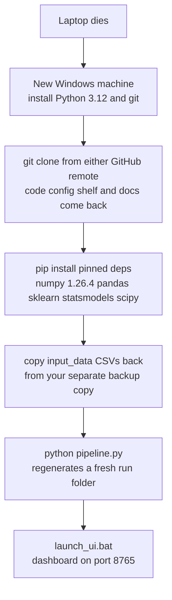

1. **New machine:** install Python 3.12 and git — twenty minutes.
2. **`git clone <remote-url>`:** pulls the repo from either GitHub remote. Because every path in `v4_config.py` is relative to the repo folder, the code doesn't care that it now lives on a different disk under a different username. This is the payoff of mistake #3 avoided.
3. **Reinstall the environment:** `pip install numpy==1.26.4 pandas scikit-learn statsmodels scipy ...`. Note the pin: numpy is held at **1.26.4** because a newer numpy once broke PyMC on this machine. This is exactly why the restore drill matters — the *environment* is part of the system, and there is currently **no `requirements.txt`** in the repo root (a plain-text list of every package at its exact working version). Add one this week, so step 3 becomes one command (`pip install -r requirements.txt`) instead of an archaeology session. Until it exists, your environment is the *least*-backed-up part of the whole system.
4. **Restore `input_data/`:** copy the monthly CSVs back from the separate backup you made above. They do *not* arrive with the clone — remember, they're gitignored. If that backup doesn't exist yet, this is the step where the restore stalls, possibly forever. *Everything else is regenerable; the raw inputs are not.*
5. **`python pipeline.py`:** regenerates a fresh run folder from the raw inputs. Old run folders are gone (they weren't in git) — but that's acceptable, because the curated shelf came back with the clone, so the weekly tracker's continuity (`tracker_history.csv`, `baselines.json`, `params_history.json`) is preserved and the first fresh run rebuilds a current snapshot.
6. **`launch_ui.bat`:** dashboard back on your screen at `localhost:8765` (**localhost** is a computer's name for itself — an address that never leaves the machine; **8765** is the port, a numbered door on that machine where the dashboard program listens; the application-layer section explains both properly).

Realistic time to fully operational: **under half a day**, most of it downloads — *provided the inbox backup exists*. Lost forever: at most the work since your last `git push` plus any inbox files newer than your last inbox sync — which is why the push cadence in `EXECUTION_PLAYBOOK.md` is not bureaucracy but your actual recovery-point guarantee. In a typical SaaS the same story is told with automated database backups, point-in-time recovery, and infrastructure-as-code (server setups written down as re-runnable scripts instead of remembered clicks) — fancier words, identical idea: *everything needed to rebuild lives somewhere the disaster can't reach, and you've proven the rebuild works.* You already have most of the idea. Keep the push habit, add the `requirements.txt`, give the inbox its second home, and your data layer is — for this scale — done right.


---

## 3. The Compute Layer — models as background jobs

One thing before we start: this section deliberately does **not** re-teach the statistics — the confounder-controlled model, Double ML, elasticities, and the MILP promo math are explained in `COMPLETE_SYSTEM_GUIDE.md`, and that document owns them. Here we look at the same scripts through a completely different lens: the *software* lens. What kind of program is each one? Who starts it? How does it know its inputs? How do you know it worked? What happens when one dies halfway? That is the view an engineer takes, and it is the view you need to design systems yourself.

A few words you'll meet immediately, defined once so nothing below is mysterious. A **script** is a program stored as a plain text file that a language runtime reads and executes top to bottom — yours are Python files like `scripts/analysis/discount_plan.py`. **Python** is the programming language everything in this repo is written in (a **repo**, short for repository, is the single folder that holds all of a project's code and files, tracked by version control — the ops section covers that tracking); think of Python as the common tongue all your workers speak. A **CSV** (comma-separated values) file is a spreadsheet saved as plain text — one row per line, commas between columns; it is the currency your jobs trade in (the data-layer section covers it in depth). Your **fact table** is the one big cleaned CSV (`v4_outputs/<run>/fact_table.csv`) where every row is one product in one city on one day — the single source of truth every model reads. **pandas** is the Python library your scripts use to load and manipulate those tables in memory; a loaded table is called a **DataFrame** — picture the CSV lifted off disk into a fast, editable spreadsheet inside the program. Finally, files ending `.md` are **Markdown** — plain text with simple formatting marks (`#` for headings, `**bold**`) that viewers render as a tidy document; your playbook and weekly readout are Markdown.

#### What this layer actually is: a fleet of batch jobs

**Level 1 — like you're new.** Imagine your business has two kinds of workers. The first kind is a shop assistant: a customer walks in, asks a question, and expects an answer in seconds — if the assistant takes ten minutes, the customer leaves. The second kind is a night-shift accountant: once a month you drop a box of receipts on their desk, they work alone for an hour, and in the morning there's a finished report in the out-tray. Nobody stands over them waiting; the *box in* and *report out* are the whole relationship.

Every script in `scripts/` is the accountant, not the shop assistant. That is the single most important design fact about your compute layer.

**Level 2 — how it actually works.** The accountant pattern has a proper name: a **batch job**. A batch job is a program that starts, reads its inputs (files, in your case), does all its work in one go, writes its outputs (more files), prints what it did, and exits. It is *triggered* — by a person, a schedule, or a button — rather than *requested* by a waiting user. The opposite world is **request/response**: a program that sits running forever, and every time someone asks it something it must answer within seconds (your dashboard's API — the small web service inside `ui/app.py` that answers questions like "what's the job status?" — lives in that world; the application-layer section owns it).

Concretely, when you run:

```bash
python -X utf8 scripts/analysis/discount_plan.py
```

the operating system (Windows on your machine — the master program that manages all the others) starts a new **process** — an independent running copy of a program, with its own memory, that lives until the program finishes or crashes. Think of a process as one worker clocked in for one shift. The script finds the newest fact table by itself (`_latest_facttable()` scans `v4_outputs/2026*` folders newest-first and picks the first containing a non-trivial `fact_table.csv` — it even checks the file is bigger than 1,000 bytes, so an empty stub can't fool it), builds its weekly panel, fits the model, writes `plan/all_cells.csv`, `cut_list.csv`, `reinvest_list.csv`, and `plan_summary.json` into that same run folder, prints its findings to the screen, and exits. Total lifespan: a couple of minutes. Then the worker clocks out and the memory is released.

Your dashboard runs these same jobs the same way, just with a button instead of a typed command. When you click a step, `ui/app.py` uses a **subprocess** — one program launching another program as a separate process and watching it — to run exactly the commands listed in its `STEPS` allowlist. The dashboard is the shift supervisor; the scripts are still the night-shift workers.

**Level 3 — how a senior engineer sees it.** This is the classic *batch pipeline* pattern, and at your scale it is the correct choice, not a compromise. Its virtues: each job is independently testable (run it, look at the file it wrote), independently re-runnable, crash-isolated (a dying model run cannot take down your dashboard, because it's a separate process), and brutally debuggable (the inputs and outputs are files you can open in Excel). Its costs: nothing is real-time, ordering is only as reliable as whoever enforces it, and state lives scattered across files instead of one authoritative store. A senior engineer looking at this layer would ask exactly the questions the rest of this section answers: what enforces run order? which jobs are safe to run twice? how do failures surface? and what happens when one machine and one operator becomes ten brands and a team?

#### The job pattern's full contract — what, why, and what breaks

Walk through the mentor checklist for the compute layer as a whole, because every individual script inherits these answers.

**What it is and why it exists.** Roughly twenty Python batch jobs grouped by purpose: `scripts/analysis` (the champion waste model and its three confirmations), `scripts/pricing` (elasticities, the optimizer, budget allocator, scenario menu), `scripts/promo` (the MILP promo calendar — **MILP** means mixed-integer linear programming, a mathematical technique for choosing the best schedule under hard rules; the stats guide explains it, here it's just "job number 8"), `scripts/validation` (backtests and gates), and `scripts/tracker` (the weekly loop). They exist as *separate* jobs rather than one giant program for the same reason a factory has stations rather than one machine that does everything: you can inspect the half-finished product between stations, replace one station without touching the others, and when something breaks you know *which station* broke.

**What problem it solves / what breaks without it.** The compute layer is where data becomes decisions. Without it you have a clean fact table and no opinion about what to cut. Without the *separation* into jobs, you'd have one 10,000-line script where a bug in the promo calendar could silently corrupt the waste model — and you would never be sure which part produced a bad number.

**How jobs talk to each other.** Never directly. No job calls another job's functions while running (with one deliberate exception: `weekly_tracker.py` imports its six sibling modules — `guardrail`, `scorecard`, `seasonality`, `workbook`, `actuals`, `killswitch` — those are one job's internal departments, not separate jobs). Jobs communicate *through files*: `discount_plan.py` writes `all_cells.csv`; hours or days later, `weekly_tracker.py` reads it. The file *is* the message. Engineers call this file-based hand-off; it is the simplest possible integration style, and its great virtue is that the message is inspectable — you can open `all_cells.csv` and see exactly what the tracker will see.

**Who calls them, when, how often.** A human (you), on the cadences the `EXECUTION_PLAYBOOK.md` defines: the 13-step monthly rebuild when a new Blinkit export lands, the weekly tracker every Monday, the parameter review quarterly. Or the dashboard button, which is the same human trigger wearing a nicer shirt. Nothing runs by itself — there is no scheduler on this machine. That is a fact to hold onto for the orchestration discussion below.

**Where they store things.** Model jobs write into the timestamped run folder under `v4_outputs/` (immutable per run — more on why that matters under failures). Tracker jobs write into `DISCOUNT_PLAN/` (mutable, living state: `tracker_history.csv`, `baselines.json`, `execution_log.csv`). That split — *rebuildable outputs* in timestamped folders, *accumulated history* in one living folder — is one of the smartest structural decisions in your system, and you should keep it forever.

**Typical technologies and alternatives.** Yours: plain Python scripts run by hand or by button. The industry ladder above that: **cron** (a built-in scheduler on servers that runs commands at set times — a wall clock that presses your buttons for you), then workflow orchestrators like **Airflow** or **Prefect** (systems that know the whole chain of jobs, run them in order, retry failures, and draw you a live map), then fully managed cloud pipelines. (A **server**, wherever the word appears, just means a computer that runs programs continuously for others to use — usually in a data center, but your laptop plays the role today.) Each rung buys reliability and costs setup, maintenance, and another thing that can break. The trade-off analysis for your scale is below.

**Cost.** Effectively zero: your electricity and 15–25 minutes of machine time per monthly rebuild. This matters strategically — a batch architecture on one machine is the cheapest compute model that exists, and it's part of why your margins as a future SaaS can be excellent if you keep jobs this lean.

#### Triggers: cadence and button, not requests

In the request/response world, *demand* triggers work: a user clicks, a server answers. In your world, *time and events* trigger work, and the playbook is the trigger table:

- **A new monthly Blinkit export lands** → the 13-step monthly rebuild (Section 2.2 of the playbook), starting with `pipeline.py` and ending with the validation quartet.
- **Monday morning** → `weekly_tracker.py` with no arguments: recommend this week's cuts, write `execution_log_template.csv` for your KAM.
- **The next export arrives** → `weekly_tracker.py --actuals <fresh fact_table>`: backfill what really happened, run the kill-switch, update the scorecard. (The **command line** is the text window — Command Prompt or PowerShell on Windows, also called a **terminal** — where you type commands directly to the computer. An **argument** or **flag** like `--actuals` is extra instruction text you pass to a script there — a sticky note on the accountant's box saying "this time, also reconcile against these receipts.")
- **Quarterly** → `params_review.py` and a retrain.

The dashboard's `STEPS` allowlist in `ui/app.py` mirrors this exactly: thirteen `monthly` steps in `MONTHLY_ORDER`, three `weekly` steps (recommend / score / self-test), one `governance` step. The dashboard adds convenience, not new semantics — a button click launches the identical command you would have typed.

Why does this distinction matter for your design education? Because it decides *everything downstream*: batch jobs can take 20 minutes (no one is waiting), can be re-run (the trigger can fire again), and report success after the fact (via files and exit codes) rather than instantly (via a response). When you design a new feature, "is this batch or request/response?" should be your first question, and the answer is usually: *if a human can wait for a file, make it batch.* Batch is simpler in every dimension.

#### Inputs and outputs: files are the contract

Every job's identity is its input files and output files. Here is the real map for the jobs you touch most:

| Job | Reads | Writes |
|---|---|---|
| `pipeline.py` | `input_data/*.csv` (raw exports), `v4_config.py` | new `v4_outputs/<timestamp>/` with `fact_table.csv`, features, waste report |
| `scripts/analysis/discount_plan.py` | newest `fact_table.csv` | `<run>/plan/`: `all_cells.csv`, `cut_list.csv`, `reinvest_list.csv`, `plan_summary.json`, plus two method notes |
| `scripts/analysis/challenger.py` | fact table | `DISCOUNT_PLAN/defense_hold.csv` |
| `scripts/pricing/pricing_engine.py` | fact table (via its panel builder) | `DISCOUNT_PLAN/pricing/`: `elasticities.csv`, `cross_price.csv`, `pricing_reco.csv`, `agreement.csv`, `gates.json` |
| `scripts/tracker/weekly_tracker.py` | newest `plan/all_cells.csv`, `agreement.csv`, `defense_hold.csv`, `execution_log.csv`, `baselines.json`, `tracker_history.csv` | appends to `tracker_history.csv`; rewrites `WEEKLY_TRACKER.xlsx`, `WEEKLY_READOUT.md`, `execution_log_template.csv` |
| `scripts/tracker/verify_loop.py` | tracker state | **deletes and regenerates** `tracker_history.csv`, `execution_log.csv`, `baselines.json` |

Notice something subtle and important about how jobs *find* their inputs: they don't get told, they *look*. `weekly_tracker.py`'s `_latest_plan_csv()` scans every `v4_outputs/2026*` folder newest-first and takes the first one containing `plan/all_cells.csv`. This "latest wins" convention is convenient — you never type a path — but it has a sharp edge we'll hit in the failure section: *latest existing* is not always *latest intended*.

In a typical SaaS the same contract exists but the medium changes: jobs read from and write to a **database** (a program purpose-built to store and query data reliably — a filing cabinet with a librarian who enforces rules; the data-layer section covers why files are the right call for you today) or to cloud storage, and the "latest wins" convention becomes an explicit pointer: a small record saying "the current production plan is run #47." That explicitness is one of the first upgrades you'd make at multi-brand scale.

#### Idempotency: is it safe to run this twice?

**Idempotent** is engineering jargon for a beautifully simple idea: running the job twice gives the same result as running it once — no double-counting, no corruption, no drama. A light switch's OFF button is idempotent (press it five times, the light is still just off); a "withdraw ₹500" button is not. For batch systems this is *the* question to ask about every job, because in real life jobs get re-run constantly — you re-run after a crash, after fixing data, after a doubt, or just by accidentally double-clicking.

Audit your own fleet honestly:

- **`pipeline.py` — safe, by construction.** Every run creates a *brand-new* timestamped folder under `v4_outputs/`. Run it three times, get three folders; nothing is overwritten, ever. This is the gold-standard pattern (engineers call outputs like this *immutable* — written once, never edited) and you got it right without being told.
- **`discount_plan.py`, `dml_estimate.py`, `validate_plan.py`, `challenger.py`, the pricing/promo/validation jobs — safe.** They recompute everything from the fact table and overwrite their own previous outputs in place. Same inputs → same outputs → overwriting is harmless. Re-run freely.
- **`weekly_tracker.py` — NOT freely re-runnable.** It *appends* this week's predictions to `tracker_history.csv` and fills actuals into existing rows. Appending is memory, and memory is history: run the same week's recommendation step twice carelessly and you risk duplicate W1 rows polluting the scorecard that your whole trust-building strategy depends on. Treat the weekly steps as *once per week, deliberately*, and if you must re-run, check `tracker_history.csv` afterward for duplicated week rows.
- **`verify_loop.py` — actively destructive, on purpose.** Read its first steps in the file: it **deletes** `tracker_history.csv`, `execution_log.csv`, and `baselines.json`, then runs the tracker twice against a historical Monday that exists in your data (`SIM_WEEK_DATE = "2026-06-15"`) — once to log W1 predictions, once with `--actuals` to backfill results and fire the kill-switch — to prove the loop closes end to end. It is a fire drill that burns down the building to test the alarms. The dashboard knows this: its `selftest` step runs `verify_loop.py` and *then* a `#reset_state` action plus a fresh tracker run to restore a clean weekly state. If you ever run `verify_loop.py` by hand mid-quarter with real accumulated history in place, you will erase your real scorecard trail. Rule of thumb: **run the self-test only through the dashboard button, or only when you'd be happy to reset tracker state.**

The general design lesson: make every job idempotent if you possibly can (recompute-and-overwrite, or write-to-new-folder), and loudly quarantine the ones that can't be (appenders and deleters). When you spec a new job to an AI assistant, say the word: "make this idempotent." It's one word that prevents a whole category of 2 a.m. incidents.

#### Run order: the 13-step chain, and who enforces it

The monthly rebuild is a chain of thirteen jobs with real dependencies — later jobs read files earlier jobs write:

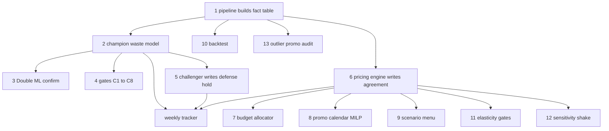

Engineers call this shape a **DAG** — a directed acyclic graph, which is just a precise name for "a flowchart of tasks where arrows show what must finish before what, and you can never loop back." Every batch system on earth is secretly a DAG; the only question is *what enforces it*.

In your system today, three things enforce order, all of them soft: the playbook's numbered steps (a document), your discipline in following them (a human), and the dashboard's `MONTHLY_ORDER` list plus its Run-All button, which executes the thirteen steps sequentially and — this is the one *hard* enforcement you have — stops the chain when a step fails. Notice what does **not** enforce order: the scripts themselves. Nothing in `discount_plan.py` refuses to run against a stale fact table; nothing stops you running the tracker before this month's champion model. The jobs trust that their inputs are fresh because *you* keep the ritual.

**What an orchestrator would add.** Tools like Airflow or Prefect exist precisely to replace the human ritual with software: you declare the DAG once ("step 4 depends on step 2"), and the orchestrator runs steps in order, in parallel where the arrows allow (your steps 3, 4, 5 could run simultaneously after step 2 — they only depend on the plan), retries transient failures, refuses to run downstream steps when upstream ones failed, records every run's history, and alerts you when something breaks at 3 a.m. Cron is the minimal version: pure scheduling, no dependency awareness — it would happily run step 5 after step 2 failed.

**The honest trade-off at your scale.** One brand, one machine, one operator, thirteen steps once a month: an orchestrator is genuinely not worth it. Airflow alone is a heavier piece of software to install, learn, and keep alive than your entire system; it would become the most fragile thing on the machine. Your dashboard's Run-All *is* a tiny orchestrator — sequential, fail-fast, logged — and it is the right amount of orchestration for today. The tipping point is arithmetic: at ten brands, thirteen steps become a hundred and thirty monthly runs plus forty weekly ones, and "did I run everything, in order, for brand seven?" stops being answerable by memory. That is the moment a lightweight orchestrator (Prefect is the gentler on-ramp) or even a well-built runner script with a checklist file earns its keep — not because the pattern changes, but because the *bookkeeping* outgrows a human.

#### Long-running jobs and the timeout question

A **timeout** is a deadline after which a waiting party gives up — web browsers give up on a page after about a minute; many corporate networks kill idle connections far sooner. Timeouts are the tax of the request/response world: whatever a user waits for must fit inside them.

Your compute layer opted out of that tax, and the dashboard shows exactly how the two worlds coexist politely. When you click "Run monthly rebuild," the dashboard does *not* make your browser wait 25 minutes for a response (it would time out, and you'd stare at a spinner). Instead: the button's request returns immediately with "job started"; the job runs in a background **thread** — a lane of work inside a running program, letting the dashboard keep answering questions while the job grinds on (the application-layer section owns threading); and the page then *polls* — asks "how's it going?" once a second — reading the job's status, progress, and log from memory. Long work in the background, short questions in the foreground. This start-then-poll pattern is exactly how every serious system runs long jobs behind a web page, from video renderers to bank statement generators, and you already have it.

The design rule to internalize: **never make a user's click wait on work longer than a few seconds.** If the work is longer, split it — a quick "accepted, job #12 started" response, background execution, and a status the user can check. You'll use this pattern again the moment your SaaS lets a client click "rebuild my plan."

#### Logs and exit codes: how you know a job worked

A **log** is the running commentary a program prints while it works — its diary. Your scripts print theirs to **stdout** ("standard output" — the default channel where a program's printed text goes; when you run a script in a terminal, stdout is simply what appears on screen). The tracker prefixes its diary lines with `[tracker]`; `verify_loop.py` filters for exactly those lines when checking on the tracker it launched. When the dashboard runs a job, it captures the subprocess's stdout into an in-memory rolling buffer (the last 6,000 lines) and streams it to your browser — that live black panel *is* the log.

Logs are the debugging trail, and this is worth saying plainly because it is how engineers actually work: when a job fails, nobody re-reads the code first. They read the log, bottom-up — the last lines before death almost always name the crime ("column X not found", "file not found: all_cells.csv"). The playbook already teaches you this instinct for `pipeline.py` ("the error is at the bottom of the output"). When you write or commission new jobs, insist they narrate: what file they loaded, how many rows, what they decided, what they wrote. A silent job that fails is a mystery; a chatty job that fails is a confession.

The **exit code** is the other half of the contract: a single number every process hands back to whoever launched it when it finishes. Zero means "success"; anything else means "failure" — that's a universal convention across all operating systems, as standardized as a thumbs-up. Your codebase honors the contract in both directions. As a *producer*: `verify_loop.py` ends with `sys.exit(main())`, returning 0 only when the loop provably closed, 1 otherwise. As a *consumer*: the same file's `_run()` helper launches the tracker as a subprocess and checks `r.returncode != 0` — a non-zero code aborts everything with the captured error text. The dashboard's runner does the same for every step, and its Run-All uses non-zero exit codes as its stop signal for the chain. Your smoke tests assert exit code 0 for the same reason: it is the one machine-readable line where a job says "I finished, and I finished well."

The lesson for your future specs: every job must *earn* its zero. A script that hits an error, prints a warning, and still exits 0 is lying to its supervisor — and every automation you ever build on top (orchestrators, alerts, Run-All chains) will believe the lie. When you brief an AI to build a job, include: "exit non-zero on any failure."

#### Failure scenarios: mid-chain death and the stale-output trap

Now the scenario that separates toy pipelines from trustworthy ones. Suppose during the monthly rebuild, step 1 (`pipeline.py`) succeeds — fresh fact table in a fresh timestamped folder — but step 2 (`discount_plan.py`) crashes on a malformed column. What is the state of the world?

Here your timestamped-run design quietly protects you. The new folder contains a fact table but **no `plan/` folder**. Last month's folder still contains last month's complete, coherent plan. Nothing is half-written or corrupted; the failure is *contained* to "the new plan doesn't exist yet." Compare that with the naive design — one fixed output folder that each run overwrites in place: a mid-run crash there leaves a Frankenstein folder, half new, half old, and nothing downstream can tell. Immutable timestamped runs mean a crash can only ever leave you with *less*, never with *wrong*. This is a genuinely good architectural property and you should preserve it in everything you build next.

But the same design has a trap, and you should know it by name: **stale outputs**. Remember that `weekly_tracker.py` finds its plan by scanning runs newest-first for the first `plan/all_cells.csv` it can find. In our crash scenario, the newest folder has no plan — so the tracker silently walks back and picks up *last month's* plan, pairs it with an unstated assumption of freshness, and happily recommends cuts from a stale map. No error, no warning; the failure mode isn't a crash, it's *confidently wrong output*. Your defenses today are procedural: run steps in order, watch each finish (the dashboard's fail-fast Run-All stops before the tracker would ever run after a failed champion step), and glance at the run folder before the weekly loop. The engineering fix, when you're ready for it, is small — and one of your jobs already does half of it: `pricing_engine.py` has a `_stamp_run_outputs()` step that copies each run's pricing outputs into `DISCOUNT_PLAN/pricing/history/<run-stamp>/`, named after the exact `v4_outputs` run they came from, so successive runs are never silently overwritten. What's missing is the *consumer* side: extend the stamping to the plan outputs, and have readers like the tracker *refuse* mismatches — "this plan came from run 2026-07-03, but the newest fact table is 2026-08-02; stopping." Ten lines of code that convert a silent wrongness into a loud stop. Loud stops are always cheaper.

How would an engineer debug the original crash? In this order: read the last 20 lines of the log (names the error and usually the column or file); check which output files exist and their timestamps (locates *where* in the chain reality diverged from plan); re-run just the failed step (cheap, because your jobs are re-runnable); and only then open the code. Files-as-interfaces make this walk possible — every station's out-tray is right there to inspect.

#### Case study: the numpy pin — dependency hell in one act

This story from your own history teaches more about real-world software fragility than any textbook, so let's give it the full treatment.

Three definitions first. A **dependency** is someone else's code your code needs to run — your scripts depend on pandas, numpy (the number-crunching engine underneath nearly all Python data work), scikit-learn, statsmodels, scipy. Think of dependencies as ingredients from suppliers: you didn't make the flour, but your bread fails without it. **pip** is Python's installer — the purchasing department that fetches those ingredients from the public warehouse. A **pin** is an instruction to pip to buy one *exact* version — `numpy==1.26.4` — instead of "whatever's newest."

What happened in your system: several of your statistical libraries ship *compiled* components — machine code built against the exact internal layout of a specific numpy version, the way a lock is milled for one key. At some point PyMC (a Bayesian statistics library) was installed; PyMC demanded a newer numpy, pip obligingly upgraded it, and every compiled library built against the old numpy stopped fitting the new key. The stack broke — not because any code of yours changed, but because one install quietly renovated the foundations under a standing house. Engineers call this whole genre **dependency hell**: conflicting version demands where satisfying one library breaks another.

Your system's recovery encodes three correct responses. First, the pin: the playbook's setup command installs `numpy==1.26.4` explicitly, and warns in bold never to `pip install pymc`. Second, an *architectural* dodge: the pricing engine simply doesn't need PyMC — it uses an analytic Bayesian method instead, and `pricing_engine.py` even carries a graceful fallback in code (`try: import elasticity_bayes ... except: import elasticity_hier`) so that if the preferred method is ever unavailable, the job degrades to the penalized method rather than dying. That try-and-fall-back move is a professional pattern worth noticing: prefer the best tool, survive its absence. Third, institutional memory: the incident is written down where the next operator will read it.

The one classic defense you're *not* using yet: a **virtual environment** — a private, per-project copy of Python and its installed libraries, walled off from everything else on the machine (created with `python -m venv`). It's a separate pantry per kitchen: an install for project B physically cannot upgrade project A's numpy. On a one-project machine you've survived without it; the day this machine hosts a second Python project — or the day a client environment must reproduce yours exactly — a virtual environment plus a written list of pinned versions (a `requirements.txt` file) becomes non-negotiable, and it's a fifteen-minute job to set up.

The beginner mistakes this case study inoculates you against: (1) running `pip install <anything new>` into a working production environment — exactly the PyMC incident; test installs elsewhere first; (2) leaving versions unpinned, so that a reinstall six months later silently fetches different ingredients and "the same setup" no longer is; (3) upgrading dependencies without a reason — in production systems, *newer is not better; tested is better.* When you brief an AI assistant on environment work, the magic words are: "pinned versions, in a virtual environment, never upgrade transitively."

#### Scaling, security, and where it strains first

**Scaling to ten brands.** The beautiful news: batch jobs scale *embarrassingly well* by copying. Ten brands = ten input folders, ten config files, ten runs of the same chain — the jobs don't change at all, and since they're sequential and each takes minutes, even one machine can process ten brands in a night. What breaks first is not compute but *operations*: the bookkeeping of which brand ran, whose gates failed, whose KAM has this week's file. That's the orchestrator threshold discussed above, plus a naming discipline (`v4_outputs/<brand>/<timestamp>/`) you can adopt tomorrow for free. The second strain point is the tracker's mutable state: ten `tracker_history.csv` files with hand-managed baselines is where a real database starts paying for itself — one librarian instead of ten shoeboxes.

**Security.** Today the compute layer's security *is* the machine's security: the scripts read and write local files as you, with no logins of their own — appropriate for one operator on one laptop, covered honestly in the ops section. The compute-specific point worth flagging now: the dashboard's fixed `STEPS` allowlist means the web page can only ever trigger the exact commands listed — it cannot be talked into running arbitrary programs. That allowlist is a genuine security design decision, and it's the pattern to keep when clients get buttons of their own: *users choose from a menu; they never write the order ticket.*

**Bottlenecks.** The slowest jobs are the optimizer-heavy ones — the DE optimizer (deliberately decomposed per category-and-city so it stays tractable — `pricing_engine.py` notes each such group is an independent subproblem versus "one intractable 526-dim DE", and its config trims to 2 seeds because "2 seeds keeps a full run tractable") and the MILP calendar. If runs ever crawl, those are where to look, and the fixes are the standard batch trio: decompose the problem (already done), run independent pieces in parallel, or accept longer wall time — nobody is waiting, which is the whole luxury of batch.

#### Where the AI sits — and where it deliberately doesn't

One distinction matters enormously for how you describe this product, to yourself and eventually to buyers. An **LLM** (large language model — the kind of AI you're conversing with, which writes text and code from instructions) *authored* much of this codebase. But look at the runtime path — the chain of things that actually execute when a plan is produced: raw CSVs → pandas → a regression in statsmodels → an optimizer in scipy → CSVs out. **No AI model is called anywhere in that chain.** No prompt, no API call to an AI service, no network dependency, no per-run AI cost, and — critically — no AI variability: the same inputs produce the same plan, every time, explainable line by line.

This is the honest and *stronger* claim: AI built the machine; deterministic, auditable statistics *are* the machine. When a future client's finance director asks "so the AI decides my discounts?", your answer is no — a transparent statistical model with written acceptance gates decides, and you can hand them the exact formula (it's in the docstring — the explanatory note at the top — of `discount_plan.py`). An AI-in-the-loop product would need to defend hallucination risk, drift, and per-call costs; yours doesn't. The place an LLM might legitimately *join* the runtime later is the same place it sits now: language, not numbers — drafting the plain-English `WEEKLY_READOUT.md` from the computed tables, where a wrong adjective is annoying rather than expensive. Keep the decisions statistical; let AI narrate. That division of labor is a design principle worth writing on the wall.


---

## 4. The Application Layer — your dashboard, taken apart

Your dashboard is the part of the system you actually touch every Monday. It is also, deliberately, the smallest and simplest part: two files (`ui/app.py`, about 500 lines of Python, and `ui/index.html`, one HTML file with all its styling and JavaScript inside) plus a three-line launcher (`launch_ui.bat`). This section takes those files apart piece by piece — because if you understand this layer, you understand roughly 80% of what every web application on earth does, from your dashboard to Netflix.

First, four words you cannot go further without:

- An **application layer** is the part of a system that a human interacts with — the buttons, tables, and charts — as opposed to the parts that crunch numbers or store data. Think of a bank: the vault and the ledgers are the data layer, the tellers' calculations are the compute layer, and the counter with the queue and the forms is the application layer.
- A **server** is just a program that sits waiting for requests and answers them. Not a special machine — a program. Like a waiter standing by the kitchen door: it does nothing until someone asks for something, then it fetches the answer and goes back to waiting. In your system, `ui/app.py` is the server.
- The **backend** is the server-side half of an application — the code that runs on the machine, reads files, launches jobs. `ui/app.py` is your backend.
- The **frontend** is the half that runs inside the web browser — what you see and click. `ui/index.html` is your frontend. (**HTML** — HyperText Markup Language — is the language web pages are written in: nested tags like `<table>` and `<button>` describing what appears on screen. The browser reads it and draws the page, the way a builder reads a floor plan.) The browser downloads it from the backend once, and from then on the two halves talk to each other over the network (even though, in your case, "the network" is a loop inside one machine).

#### What this layer is and why it exists

**What it is.** A local web dashboard: one Python program serving one HTML page, so you can run the playbook, watch logs, and read outputs by clicking instead of typing terminal commands.

**Why it exists.** Before it, running the system meant typing `python -X utf8 scripts/tracker/weekly_tracker.py` and sixteen other commands in the right order, then opening CSV files by hand. (A **CSV** — comma-separated values — is the simplest possible spreadsheet file: plain text, one row per line, commas between columns. The pipeline section owns the full story.) The dashboard exists so the operating knowledge lives in software, not in your memory. That matters twice over: it removes your typos as a failure mode today, and it is the seed of the product you want to sell tomorrow — no brand manager at another CPG company will ever type terminal commands.

**What problem it solves.** Translation. The compute layer speaks in files and exit codes; you think in "run this week's cuts" and "did it pass." The dashboard translates in both directions.

**What breaks without it.** Nothing computational — every script runs fine from a terminal. What breaks is *operability*: the chance of running steps out of order, missing a failed gate, or never noticing a FAIL receipt goes way up. The dashboard is a safety rail, not an engine.

**How it talks to the other layers.** Read-only toward data (it opens the CSV, JSON and Markdown files the other layers wrote — JSON and Markdown are two more plain-text formats, both properly introduced in the API section below — it never writes plan data itself), and arm's-length toward compute (it launches the analysis scripts as separate programs and watches their output; it never imports their code). That separation is a genuinely good design decision, and we'll see why below.

#### The launcher: launch_ui.bat

A **batch file** (`.bat`) is a Windows text file containing terminal commands that run top to bottom when you double-click it — a recorded sequence of keystrokes. Yours is five short lines:

```bat
@echo off
cd /d "%~dp0"
start "" http://localhost:8765
python -X utf8 ui\app.py
pause
```

Line by line: `@echo off` keeps the window quiet; `cd /d "%~dp0"` moves into the folder the `.bat` file lives in, so the path `ui\app.py` works no matter where you double-clicked from; `start` opens your default browser at the dashboard address (that address is explained in the next subsection); the `python` line starts the server — this window staying open *is* the server being alive; and `pause` means that if the server ever crashes, the window waits for a keypress instead of vanishing, so you can actually read the error it died with. That last line is a tiny piece of operational kindness worth copying into every launcher you ever write.

Two more things worth knowing. First, the browser opens *before* the server starts; that works only because the server starts in well under a second — a heavier app would show "connection refused" and need a refresh. Second, that black console window **is** the server: close it and the dashboard dies. This is the smallest possible "deployment" — one program running in plain sight, started by hand, visible on your desk (a **process** is exactly that: one running program with its own private memory — the full story two subsections down). A senior engineer would call this a *foreground process with no service manager*: fine for one operator, the first thing to change when someone else needs it running while you're on holiday.

#### How your browser reaches app.py: HTTP, ports, localhost

Before dissecting the code, the plumbing — four terms, once each:

- **HTTP** (HyperText Transfer Protocol) is the standard letter format of the web: a *request* ("GET me the page at /") travels one way, a *response* ("here it is, status 200, content follows") travels back. Every click in your dashboard is one or more of these letters.
- An **IP address** is a machine's street address on a network. **localhost**, always the address `127.0.0.1`, is the special address that means "this same machine" — a letter you post to yourself, which never touches the actual network. Your server binds to `127.0.0.1` *only* (line 499 of `app.py`), which means no other computer — not even one on your own WiFi — can reach it. That single choice is the outermost wall of your security model.
- A **port** is a numbered door on that address. One machine runs many network programs at once; ports keep their mail separate. Yours listens on door **8765** (overridable with the `UI_PORT` **environment variable** — a named setting the operating system hands to a program at startup, like a sticky note on the door rather than something written into the code).
- A **URL** like `http://localhost:8765/api/status` reads as: protocol `http`, machine `localhost`, door `8765`, and the path `/api/status` telling the server *which* thing you want.

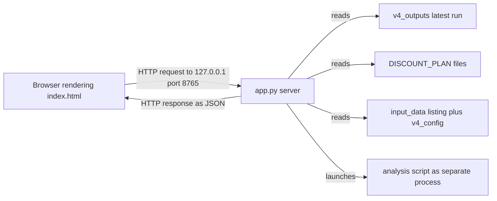

#### ThreadingHTTPServer — many waiters in one restaurant

The single most important line in `app.py` sits at the very bottom, inside `main()` (line 499):

```python
srv = ThreadingHTTPServer(("127.0.0.1", PORT), Handler)
```

**Level 1 — like you're new.** A **process** is one running program — one restaurant, with its own kitchen, pantry and staff, walled off from every other restaurant. A **thread** is one worker *inside* that restaurant. All the threads share the same pantry (the program's memory), so they can step on each other's toes, but hiring one is cheap and instant. `ThreadingHTTPServer` means: every time a customer (an HTTP request) walks in, spin up a fresh waiter (thread) to serve just that one request, then let the waiter go home. The alternative Python offers, plain `HTTPServer`, is a restaurant with exactly one waiter who finishes each customer completely before even looking at the next.

**Level 2 — how it actually works here.** Why does a one-user dashboard need multiple waiters? Because *your one browser is a table of impatient customers*. While a job runs, the frontend fires a request for `/api/job` every second, and page navigation fires `/api/status` — which does real work: it opens and parses a dozen files (`plan_summary.json`, `all_cells.csv`, `tracker_history.csv`, `agreement.csv`, `sensitivity_cells.csv`, backtest files, and more). With a single-threaded server, a slow `/api/status` read would block the `/api/job` poll behind it and your live log would visibly stutter. With threads, the slow read and the quick poll are served by different waiters simultaneously. Note the thing threads do *not* do here: the heavy model runs are **not** threads — they are separate processes (next big section). Threads serve conversations; processes do heavy labor.

**Level 3 — how a senior engineer sees it.** This is the *thread-per-request* model — the oldest concurrency pattern in web serving. Its known costs: each thread consumes memory, and shared memory means you must think about simultaneous access (your code does — see the lock, below). Python adds a twist called the GIL (a rule that only one thread executes Python at a time), which caps how much true parallelism you get — irrelevant here, because your threads spend their time waiting on file reads, exactly the case where threads shine. What a senior engineer would actually flag: `api_status()` re-reads and re-parses every file on every call, with no **cache** (a cache is a kept copy of an expensive answer so you don't recompute it — like writing the day's specials on a board instead of asking the chef each time). At your file sizes that costs maybe tens of milliseconds and is genuinely not worth fixing. At 10 brands × bigger fact tables, `/api/status` becomes the first request to feel slow, and a 30-second cache is the one-line fix. In a typical SaaS you'd see the same idea grown up: a pool of pre-hired workers (gunicorn/uvicorn) behind a **load balancer** — a traffic cop that spreads requests across several server machines. You need none of that at one user.

#### The routing if-chain — a web framework in twenty lines

**Level 1.** When a request arrives, someone has to decide which piece of code answers it. A **web framework** is a pre-built kit that does this deciding (plus form handling, security helpers, page templating…) so you don't write it yourself — Flask and Django are Python's famous ones. A **route** is one rule in that decision: "requests for path X go to function Y." Your dashboard has no framework; it has a receptionist with a short printed list.

**Level 2.** The receptionist is the `Handler` class. Python's built-in server calls `do_GET` for every GET request and `do_POST` for every POST (both verbs defined properly in the API section below), and inside each is a plain if-chain — literally the printed list:

```python
if self.path in ("/", "/index.html"):    -> send the frontend file
if self.path == "/api/steps":            -> send the STEPS dictionary
if self.path == "/api/status":           -> send api_status()
if self.path == "/api/job":              -> send JOB.snapshot()
if self.path.startswith("/api/table/"):  -> send api_table(name)
if self.path.startswith("/api/report/"): -> send the report text
otherwise                                -> 404 not found
```

Everything funnels out through one tiny helper, `_send`, which stamps the envelope: a **status code** (the three-digit result on every HTTP response: `200` OK, `404` not found, `409` conflict, `500` server error — like postal stamps for "delivered," "no such address," "recipient busy," "sorting office fire"), a content-type **header** (headers are the small labels on an HTTP envelope — name-value notes such as what format the contents are in and how long they are), and the body. The error mapping at the bottom of `do_GET` is small but genuinely thoughtful: a missing file becomes `404 {"error": "not generated yet: the cut list (run the monthly rebuild)"}` — the *plain-English* description was planted in the `FileNotFoundError` by the `_need()` helper, and the frontend turns it into a friendly empty-state card with a button pointing at the right step. That's an error-message pipeline designed end-to-end for a non-engineer operator, and most professional teams never bother.

**Level 3.** The pattern's name is *front controller*: one entry point inspects each request and dispatches it. Every framework is this pattern with upholstery. So why is *no framework* right here? Because of one hard constraint from your environment: this repo runs on a numpy pinned to 1.26.4 after PyMC broke it once. Every new package you `pip install` is another chance for the dependency puzzle to stop solving. `http.server` ships inside Python itself — zero new packages, zero new risk. Name the trade-off you accepted, because it's real: **no middleware** (framework-speak for shared steps that run on *every* request automatically — logging, compression, login checks — like a security desk every visitor passes; you'd have to hand-add such logic inside each `if` branch), **no templating** (generating HTML pages from reusable fill-in-the-blank templates on the server; irrelevant to you since your one HTML file builds itself in the browser), and **no auth for free** (**authentication** = verifying who the user is, passwords/logins; **authorization** = what they may do; frameworks hand you both half-built, stdlib hands you nothing). At one operator on localhost, all three absences cost zero. The day two people log in from two machines, all three become the to-do list, and that is precisely the day you adopt FastAPI or Flask rather than hand-building a security desk.

#### The JSON API — every endpoint, walked

An **API** (Application Programming Interface) is a menu of things one program agrees to do for another — named requests with promised responses. Yours is a **JSON API**: **JSON** (JavaScript Object Notation) is the universal plain-text format for structured data — `{"waste": 38000, "cells": [1, 2, 3]}` — readable by every language; the standard shipping container of software. An **endpoint** is one item on the API menu: one URL path with defined inputs and outputs. Two more: HTTP requests come in kinds, and your API uses the classic pair — **GET** means "read something, change nothing" (safe to repeat), **POST** means "do something" (create, launch, change). Engineers loosely call this style **REST** — a set of conventions where URLs name things and GET/POST verbs act on them; your API follows the spirit without the ceremony.

Here is your entire API surface — all seven endpoints. This *is* the contract between your two files; everything else is decoration.

**`GET /`** — returns `index.html` itself, the frontend's one-time download. Called once when you open the browser tab. Reads exactly one file: `ui/index.html`.

**`GET /api/steps`** — returns the `STEPS` dictionary (every runnable step's id, label, plain-English description, group) plus `MONTHLY_ORDER`. Called exactly once, by the frontend's `boot()` function. This endpoint is why the Run Center never goes stale: the buttons, their descriptions, and their order are *generated from the backend's own allowlist*. Add a step to `STEPS` in `app.py` and a button appears — the frontend cannot disagree with the backend about what's runnable, because it doesn't have its own copy.

**`GET /api/status`** — the workhorse. One call assembles the entire Overview and Inputs pages: config knobs from `v4_config.py` (re-imported live, so edits show without restart), the `input_data/*.csv` file listing, tracker summary from `DISCOUNT_PLAN/tracker_history.csv`, plan headlines from `v4_outputs/<latest>/plan/plan_summary.json`, category savings from `all_cells.csv`, two-engine agreement from `pricing/agreement.csv`, sensitivity counts, and the "receipts" — the pass/fail chips computed live from `dml_results.json`, `elasticity_validation.json`, `CHALLENGER_REPORT.md`, `defense_hold.csv`, `backtest_folds.csv` (with a fallback to parsing the report's own verdict line), and `plan_summary.json`'s `meets_target` flag. Called at page load, after every finished job, and every 30 seconds while idle. Note the `_safe()` wrapper around every reader: any individual file being missing or malformed degrades that one panel to a dash instead of killing the whole page. That is *graceful degradation*, and it's the correct posture for a dashboard over files that may not exist yet.

**`GET /api/job`** — returns the job snapshot: step id, status (`idle/running/done/failed`), exit code, elapsed seconds, progress counters, and the whole log as one string. Called every 1 second while a job runs (the polling section below), and once at boot in case a job was already running. Reads no files — it's a photograph of in-memory state, which is why it's fast enough to poll.

**`GET /api/table/<name>`** — seven named tables: `cuts` and `reinvest` (from the latest run's `plan/cut_list.csv` / `reinvest_list.csv`, trimmed to eight display columns and sorted by monthly gain), `buckets` (an aggregation over `all_cells.csv` computed on the fly with pandas — **pandas** being the Python spreadsheet library the whole system leans on; the model section owns the full introduction), `handoff` (`DISCOUNT_PLAN/execution_log_template.csv` — the exact sheet your KAM receives), `scenarios`, `sensitivity`, and `history` (first 200 rows of the tracker). Response shape is always `{"columns": [...], "rows": [[...]]}` — one generic shape lets one generic frontend renderer draw every table.

**`GET /api/report/<key>`** — looks the key up in the fixed `REPORTS` dictionary (eight entries: weekly readout, budget plan, backtest, sensitivity, promo calendar, challenger, params review, elasticity gates), reads that **Markdown** file (Markdown = plain text with light conventions — `#` for headings, `**bold**`, `|` for tables — that renders into formatted documents; your analysis scripts write all reports in it) and returns the raw text for the frontend to render. Unknown key → 404 *before* any file is touched — the same allowlist idea as the job runner: the URL can never name an arbitrary file on your disk.

**`POST /api/run/<step>`** — the only endpoint that *does* anything. Body: none (the URL carries the step id). Response: `{"ok": true, "message": "started"}` and status 200, or status **409 Conflict** with `{"ok": false, "message": ...}` — the message tells you which of the two possible refusals happened: `"A job is already running — wait for it to finish."` or `"Unknown step: <id>"` (a step name that isn't on the allowlist). Who calls it: every Run button in the UI, via one shared click handler. What it triggers is the next section.

A senior engineer reading this API would note its two virtues aloud: it is *read-heavy with a single narrow write* (six safe GETs, one guarded POST — the smallest possible attack surface), and it is *stateless from files* (almost every answer is derived fresh from disk, so restarting the server never corrupts anything, because there is nothing to corrupt).

#### The job runner — thread, subprocess, deque

This is the mechanism behind every Run button, and it's three concepts bolted together.

**Level 1 — like you're new.** When you click "Run full rebuild," the waiter (request thread) must not stand in the kitchen for 20 minutes while the meal cooks — the whole restaurant would seem frozen. So the waiter writes a ticket, pins it to the board, hires a *runner* (a new thread) to supervise the cooking, and immediately returns to you saying "started." The runner, in turn, doesn't cook either: it calls a *separate restaurant entirely* (a subprocess) to do it, and stands at the pass writing down every line the chef shouts onto a clipboard that only keeps the latest 6,000 lines.

**Level 2 — how it actually works.** In code, the ticket is the global `JOB` object; the runner is `threading.Thread(target=_run_commands, daemon=True).start()` (line 195; `daemon=True` means "this thread dies when the program does" — don't keep the restaurant open for it). The separate restaurant is a **subprocess**: a whole new child process, launched with

```python
p = subprocess.Popen([sys.executable, "-X", "utf8"] + cmd, cwd=ROOT,
                     stdout=subprocess.PIPE, stderr=subprocess.STDOUT, ...)
```

`Popen` starts, say, `python pipeline.py` as its own program with its own memory, exactly as if you'd typed it in a terminal. This is why the dashboard *imports none of the model code*: if `discount_plan.py` crashes, leaks memory, or hits the numpy problem, the child process dies and the dashboard doesn't even flinch — the blast wall between a fragile compute layer and a UI that must stay up. **stdout** is a program's standard out-loud channel — everything it `print()`s; the `stdout=PIPE, stderr=STDOUT` arguments say "give me a hose connected to its mouth, and merge its error mutterings into the same hose." The runner thread then loops `for line in p.stdout:` appending each line to `JOB.log` — which is a **deque** (pronounced "deck"): a list with a `maxlen`, here 6,000, that silently drops the oldest line whenever a new one pushes past the limit. A conveyor belt of fixed length: memory can never blow up from a chatty script, at the price that very long logs lose their beginning. Finally `p.wait()` collects the **exit code** — the single number every program reports on death: `0` means success, anything else means failure, by a convention older than Windows itself. Nonzero → the log gets `FAILED <label> (exit N)`, the job status flips to `failed`, and — crucially, for `monthly_all` — *the remaining steps do not run*. A failed pipeline never feeds a champion model. Two small extras: `@latest_fact` in a step's command is resolved at run time — the moment the worker thread launches that command — to the newest run's `fact_table.csv` (so "Score last week" always scores against current data — the **fact table** being the one-row-per-SKU-per-city-per-week master table the pipeline builds; the data-layer section owns it), and `#reset_state` is an internal action, not a shell command — the self-test step uses it to wipe tracker state files between the proof run and the restore run.

**Level 3 — how a senior engineer sees it.** The pattern is an *in-process job queue of depth one, with in-memory state*. Its known trade-offs: job history evaporates on restart (kill the console window mid-rebuild and the browser just shows "idle" — meanwhile, note, the *child* process may briefly keep running, since it's a separate program); there is no cancel button (nothing calls `p.kill()`); logs truncate at 6,000 lines; and progress is step-granular, not percent-granular. All acceptable for one operator who can see the console window. The grown-up version of this exact idea is a *task queue* — Celery or RQ, backed by **Redis** (a shared fast memory store used as, among other things, the pinboard between web servers and workers) — where jobs survive restarts, run on other machines, retry, and report progress. That's the correct architecture at 10 brands with scheduled overnight rebuilds; adopting it today would be building a freight terminal for one parcel a week.

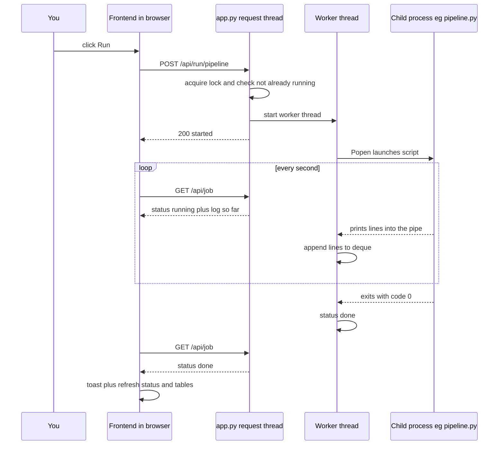

#### One job at a time — the lock, and the two-buttons story

Why does `start_job` refuse a second job instead of running both? Because of the classic bug called a **race condition**: when two threads read and write the same shared thing at almost the same moment, the outcome depends on microsecond timing — it works in every test, then corrupts something on the one Tuesday it matters. The two-buttons-at-once story makes it concrete. Suppose you double-click "Run full rebuild," or click it in two browser tabs a half-second apart. Two request threads (two waiters) both run `start_job`. Without protection, *both* check `JOB.status`, *both* see `"idle"` (neither has updated it yet), and *both* launch a full pipeline — two heavyweight processes now writing `v4_outputs/<timestamp>/` folders and `DISCOUNT_PLAN/` files over each other. Your cut list could end up half from one run and half from the other, with no error anywhere. Silent, plausible-looking, wrong numbers — the worst failure class in a pricing tool.

The defense is a **lock** (also called a mutex): a token that only one thread may hold at a time; anyone else who wants it must wait at the door. In `Job.__init__`, `self.lock = threading.Lock()`, and `start_job` does its entire check-then-start dance *inside* `with JOB.lock:` — so the check ("is anything running?") and the claim ("now I am running") happen as one uninterruptible unit. The second click enters the lock only after the first has finished claiming, sees `status == "running"`, and gets back a polite refusal that the API turns into `409 Conflict` and the frontend turns into a toast message. Notice the second, cosmetic layer: while a job runs, the frontend adds a `job-running` class to the page body and CSS greys out every `data-run` button. A senior engineer will tell you the iron rule this illustrates: *the frontend disabling a button is UX, never security or correctness* — anyone can send the POST directly (you will, when debugging, with one `curl` command — **curl** is a terminal tool for sending raw HTTP requests by hand, no browser involved). Correctness must live server-side, in the lock. Yours does. Whether one-at-a-time is even a limitation is worth asking: for you it's a feature, since the monthly steps are order-dependent and the machine has one CPU budget — a job *queue* would add complexity to enable a thing you don't want.

#### The STEPS allowlist — where security actually lives

**Level 1 — like you're new.** The Run buttons work like ordering by number at a street stall: the menu is printed and fixed, you can shout "number 7," and there is no way to shout a brand-new dish into existence. The kitchen only cooks what is on its own printed card.

**Level 2 — how it actually works.** Look at what `POST /api/run/<step>` does with the step id: it must be `monthly_all` or a key of the `STEPS` dictionary — seventeen steps in all (thirteen monthly, three weekly, one governance) — or the request is rejected with that 409. The commands themselves — `["scripts/tracker/weekly_tracker.py"]`, `["scripts/pricing/budget_allocator.py", "--budget_pct", "0.12"]` — live hard-coded in `app.py`. The browser sends a *name*; the server looks the name up on its own fixed menu. This is the **allowlist** pattern: enumerate the safe things, refuse everything else by default (the opposite — trying to enumerate the dangerous things — always misses one).

To see why this matters, imagine the lazy alternative: an endpoint like `POST /api/run?cmd=python pipeline.py` that executes whatever command string arrives. That is the front door to **command injection** — the attack where input meant to be *data* gets executed as an *instruction*. A request carrying `cmd=del /s /q C:\Users` or `cmd=powershell -c "upload every CSV to attacker.com"` would run with your full Windows account: your data layer exfiltrated or erased by one HTTP request. Command injection has been on the top-ten web vulnerability list for twenty years precisely because "just pass the command through" is always the easiest thing to write. Your design makes it *structurally impossible* — there is no code path from request text to shell. Notice the same pattern repeated twice more in miniature: `/api/report/<key>` only reads paths from the fixed `REPORTS` dictionary, and `/api/table/<name>` only serves its seven named tables. URLs never become file paths.

**Level 3 — how a senior engineer sees it**, the honest full picture: your security is two concentric walls. Wall one — the server binds `127.0.0.1`, so only programs already on your machine can talk to it at all. Wall two — even a local caller can only run the seventeen blessed steps and read the blessed files. What you *don't* have: authentication (no login), authorization (no roles), encryption in transit (**HTTPS** — HTTP wrapped in encryption so nobody between browser and server can read it; pointless when the message never leaves your machine), or audit logging. At the current scale all four absences are *correct* — auth on a localhost single-user tool is a padlock on your own bathroom door. The precise moment they stop being correct: the first time this serves anyone who is not you — a second employee, a KAM viewing from their laptop, and above all the SaaS version. That version needs auth, per-brand data isolation, HTTPS, and audit logs *before* the first external user, not after — retrofitting security is rebuilding, so treat today's design as consciously scoped to one trusted operator, not as a habit.

#### Polling vs push — the right dumb choice

How does the browser know the job finished? The server can't tap you on the shoulder — in plain HTTP, only the browser can start a conversation. Your frontend therefore uses **polling**: asking on a timer. `ensurePolling()` starts a 1-second interval calling `pollJob()`, which fetches `/api/job` and repaints the pill, log, and progress bar; when a poll comes back with the job no longer running, `stopPolling()` shuts the timer off, a toast fires, cached tables are invalidated, and `/api/status` is re-fetched. While idle, a lazier 30-second timer refreshes status only. It's a child on a road trip asking "are we there yet?" every second — annoying between strangers, perfectly fine between your own two programs on one machine.

The alternatives are *push* technologies, worth a one-breath gloss each: **WebSockets** open a persistent two-way phone line between browser and server so either side can speak instantly; **SSE** (Server-Sent Events) is a one-way version — the server streams updates down an open connection. Both deliver log lines with zero delay and zero wasted requests. So why is polling right here? Count the costs. Polling costs: one tiny request per second, to yourself, reading an in-memory snapshot — microseconds of CPU, invisible. Push costs: connection-lifecycle code on both sides (open, keep alive, detect silent death, reconnect with backoff), a server that must track open connections, and harder debugging. You'd be paying real complexity to save a resource you have in infinite supply. The break-even flips in the cloud SaaS: a thousand browsers polling every second is a thousand requests per second of mostly "nothing changed," and there push (or at least a slower, smarter poll) wins. A senior engineer's rule of thumb: *poll until polling shows up in your bills or your latency requirements — then push.* One design subtlety worth stealing for future systems: your poll is *stateless and idempotent* (**idempotent** means safe to repeat — doing it twice has exactly the same effect as doing it once, like pressing a lift button) — each response contains the entire log, not just new lines, so a missed or duplicated poll can never desynchronize the display. Dumb, and therefore unbreakable.

#### The frontend — one file, taken apart

Now the other half: `ui/index.html`, roughly 1,450 lines — a page's worth of HTML skeleton, a long CSS block (styling: colors, spacing, themes), and about 900 lines of JavaScript, the programming language browsers execute.

**Level 1 — like you're new:** if `app.py` is the kitchen, `index.html` is the entire dining room shipped flat-pack — one box that unfolds inside your browser into six rooms, then keeps phoning the kitchen for fresh data. **Level 2 — how it actually works** is the five ideas below. **Level 3 — how a senior engineer sees it** closes the section: this is a hand-rolled version of what React does, and the honest question is when hand-rolled stops being smart.

**It's a SPA.** A **Single-Page Application** loads one HTML page once, and from then on JavaScript redraws parts of the page in place, fetching only *data* from the server — versus the classic model where every click asks the server for a whole new page. Your six "pages" (Overview, Run Center, Cut Plan, Weekly Loop, Reports, Inputs) are six `<section>` elements that all exist in the page at once; navigation just toggles which one is visible. The payoff: navigation is instant, and a 1-second poll can update a log panel without the page flickering white.

**Hash routing.** The URL fragment after `#` (as in `localhost:8765/#run`) is special: changing it never triggers a server request, but the browser records it in history and fires a `hashchange` event. Your `route()` function reads the hash, defaults to `overview`, highlights the right sidebar link, toggles the right section's `on` class, sets the title from `PAGE_META`, and calls that page's loader from `PAGE_LOADERS`. Ten lines, and Back/Forward and bookmarkable deep links work. This is the poor man's version of what React Router does (React is the popular frontend framework you'll meet properly at the end of this section; React Router is its navigation add-on), and at six static pages it is not one line poorer.

**fetch, wrapped once.** **fetch** is the built-in JavaScript function for making HTTP requests from inside a page — the frontend's telephone. Every call in your app goes through one wrapper, `api(url)`, which parses the JSON, and on any non-OK status throws an error carrying the server's `error` message and the status code. That single choke point is why error handling is uniform everywhere: `renderCutPlan` can catch, check `status === 404`, and show the "isn't generated yet — run step X" card with the server's own plain-English hint.

**A state object and a render loop.** All shared knowledge lives in one plain object, `S`: the latest `/api/status` payload, the step list, the current job snapshot, per-step visual states, the current route. Rendering is a family of functions — `renderOverview`, `renderRunCenter`, `renderJob`, `renderCutPlan`… — that each read state, build an HTML string, and assign it to a container's `innerHTML`, replacing that panel wholesale. (The **DOM** — Document Object Model — is the browser's live tree of everything on the page; `innerHTML` is the sledgehammer that replaces a whole branch.) The flow is always one-directional: *event → update state → re-render the affected panel*. That is, at concept level, exactly React's big idea — UI as a function of state — hand-rolled. Three touches show the pattern done carefully. First, **escaping**: every dynamic value passes through `esc()`, which converts `<` and `&` into harmless codes; without it, a product title in a CSV containing `<script>...` would *execute* when rendered — the browser-side cousin of command injection, called **XSS** (cross-site scripting). The little `mdRender` Markdown renderer escapes first, transforms second — the correct order. Second, **caching**: table and report responses are kept in `CUT.cache`/`REP.cache` so tab-switching is instant, and `invalidateData()` empties every cache the moment a job finishes — the cache-freshness rule ("cached until something might have changed it") stated in one function. Third, **anti-flicker discipline**: the log repaints only when its length changes, and auto-scroll pins to the bottom only while you *are* at the bottom (`S.logPinned`), so scrolling up to read an old line doesn't fight you — a one-line courtesy most real products get wrong. Also here: **event delegation** — instead of attaching a listener to every button (buttons that are destroyed and rebuilt on each render), one listener on the whole document catches every click and checks what was clicked (`closest('[data-run]')`…). Rebuilt buttons keep working for free. Theme choice persists in **localStorage** — a small key-value cupboard the browser keeps per site across restarts — and is applied by a tiny script *before first paint* so there's no white flash; charts are hand-built **SVG** (a picture format made of shapes described in text, drawn by the browser at any size — your donut and bar charts are loops that compute path coordinates into strings).

**Why a single file, honestly.** The mainstream way to build this frontend is React (a **component framework**: UI assembled from reusable self-updating pieces) plus a **build step** — a compile stage where a **bundler** (Vite, webpack) transforms modern source files into the final JavaScript the browser loads. What that buys: components, automatic safe rendering (no hand-`esc()`), a huge ecosystem. What it costs *you*: **Node.js** installed on the machine (the tool that runs JavaScript *outside* a browser — a second language runtime to keep healthy alongside Python), a `node_modules` folder of a thousand dependencies, a build to run after every edit, and one more toolchain that can rot — in an environment where you already treat a numpy upgrade as a risk event. Your single file needs a text editor and a browser refresh; it can be emailed; it cannot have a broken build. The honest assessment cuts both ways. At today's complexity — six pages, seven tables, one form-free workflow — vanilla is not a compromise; it is the right call, and the code is disciplined (one state object, one fetch wrapper, one escaping function, delegation). But the approach scales *linearly in pain*: every new page hand-writes its loader, empty state, cache entry, and render function. At roughly 3× today's surface — say, per-brand views for 10 brands, editable settings forms, user accounts — the string-building style becomes where bugs live, and that's the point to move to components (React, or its lighter cousins Preact/Svelte). Plan the SaaS frontend as a rewrite, not a stretch.

#### The mentor checklist, swept

The narrative above covered most of the checklist in flow; here is the remainder, explicitly.

**Data in / data out.** In: HTTP requests from exactly one browser, and the stdout of child processes. Out: JSON, one HTML file, and *no writes* except launching scripts and the narrow `_reset_state()` (which deletes three tracker state files — the only file-destructive line in the layer, reachable only through the self-test step). The dashboard cannot corrupt a plan; the worst it can do is show you a stale one.

**Where it stores things.** Deliberately, almost nowhere. Server side: only the in-memory `JOB` object (gone on restart — and that's fine, because truth lives in the files the scripts wrote). Browser side: only the theme in localStorage. Everything else is derived fresh from the data layer on request. This near-statelessness is the property that makes the whole layer restart-proof and, later, trivially portable to a real server.

**Typical technologies elsewhere.** Your stack (stdlib `http.server` + vanilla JS) sits at the minimal end of a spectrum that runs: Flask/FastAPI + Jinja templates → FastAPI + React + a task queue → the full SaaS kit (managed **database** — a program purpose-built to store and query data reliably for many users at once, which your files-as-store approach consciously postpones; the data-layer section owns that argument — plus Redis, workers, load balancer, **CI/CD**: the automated pipeline that tests and ships every code change). Each step right buys capability for operational overhead. You are correctly positioned at the far left.

**Cost.** Zero marginal: no hosting, no services, electricity only. The real cost is your attention — the server runs only while the console window is open. The first upgrade that pays for itself is not cloud hosting; it's running `app.py` as a Windows scheduled task or service so the dashboard is simply always there.

**Bottlenecks and scaling.** In order of arrival: (1) `api_status()`'s dozen file reads per call as fact tables grow — fixed with a small cache; (2) `api_table` loading whole CSVs to serve 200 rows — fixed with **pagination** (serving rows one screenful at a time on request, like a book instead of a scroll) or **SQLite** (a real database that lives in a single file with no server to run — the natural first step up from CSVs, with an **index**: a database's pre-sorted lookup list that finds rows without reading the whole table); (3) one-job-at-a-time across 10 brands — ten sequential rebuilds serialize a night's work, fixed with a real task queue and per-brand isolation; (4) polling × many users — SaaS-era problem, fixed with push. None are worth fixing before they hurt.

**Failure and recovery.** Port already taken (a previous window still open) → the new server dies instantly with an address-already-in-use error (Windows words it "only one usage of each socket address is normally permitted"); close the old window or set `UI_PORT`. Server killed mid-job → browser shows idle after refresh; the child script may finish or die half-done — recovery is rerunning the step, safe because every script rebuilds its outputs from inputs rather than editing them in place. That idempotence is the quiet property that makes the whole system forgiving, and it's a design value to carry into everything you build next. Page open while server down → the fetch wrapper fails, and `refreshStatus` shows "Can't reach the local server — make sure ui/app.py is running, then reload."

**Beginner mistakes this layer dodges — check for all four in anything you build next.** Trusting the frontend (a greyed-out button) instead of a server-side lock; passing command strings from the browser to the shell instead of using an allowlist; rendering data into the page without escaping (the XSS trap); and forgetting which half needs what after an edit — changing `app.py` requires restarting the server, changing `index.html` requires only a browser refresh. That last one is the single most common "why isn't my change showing?" confusion in all of web development.

#### Debugging walkthrough: a Run button does nothing

The skill to practice is *walking the request path in order* — the same four stations every web engineer walks, on every web app ever built. Front to back:

**1. Browser devtools, Network tab.** Every browser hides a full instrument panel — **devtools** — behind F12. The Network tab lists every HTTP request the page makes, with status codes. Click the button and watch. No `POST /api/run/...` appears at all → the problem is frontend-side: the button is disabled because the UI believes a job is running (check the pill, top right — is it stuck on "Running"?), or a JavaScript error broke the click handler (check the *Console* tab for red lines). The request appears with **409** → the server refused it, and the JSON message says why: either "A job is already running" (a job really is running, or a previous one wedged — check `/api/job`) or "Unknown step: …" (the button's step id isn't in `STEPS` — typical after editing `app.py` and not restarting the server; remember, the button list comes from `/api/steps` at boot, so also refresh the page). **404** → the URL path itself is one the if-chain doesn't know. **500** → the server itself threw; the JSON body carries the exception message. Request appears, **200**, still "nothing happens" → the job started and failed instantly; next station.

**2. The job log — `/api/job`.** Open the Run Center console panel (or browse straight to `localhost:8765/api/job` and read the raw JSON). The log shows the exact command line (`$ python -X utf8 scripts/...`), every line the script printed, and either `OK <label>` or `FAILED <label> (exit N)`. Nine times out of ten the script's own last lines name the problem — a missing input file, the "No run found under v4_outputs/" message from `@latest_fact` resolution, a Python traceback. Use the Copy button; that text is what you paste to whoever (or whatever AI) is helping you.

**3. The script's own stdout, outside the dashboard.** If the log is truncated (the deque's 6,000-line ceiling) or you suspect the dashboard itself, take the dashboard out of the loop: copy the `$` command line from the log, open a terminal at the repo root, and run it yourself. Now you see the full, unclipped output in the environment of record. If it works in the terminal but fails from the dashboard, compare environments — working directory (the runner sets `cwd=ROOT`) and encoding (the runner forces UTF-8) are the usual suspects.

**4. The exit code.** The final verdict. In the dashboard it's in `FAILED ... (exit N)` and the `rc` field of `/api/job`; in a terminal, `echo $LASTEXITCODE` (PowerShell) right after the run. `0` = the script itself believes it succeeded — so if outputs still look wrong, the bug is in *reading* them (an `/api/status` panel, a stale cache) not in producing them. Nonzero = the script failed; `1` is generic failure (read the traceback above it), and Windows' `-1073741515`-style monsters mean a broken native dependency — the numpy-pin scenario. One dashboard-specific wrinkle to remember: `Handler.log_message` is deliberately silenced, so the server's console window stays quiet on purpose — don't stare at it waiting for clues; the clues are in `/api/job` and the JSON error bodies.

The order matters more than the tools: *frontend evidence, then API evidence, then the script in isolation, then the exit code*. Each station either shows the fault or proves it lies further back. That bisecting habit — not any framework — is the actual debugging superpower, and it transfers unchanged to every system you will ever own.


---

## 5. The Request Lifecycle — every step from double-click to answer

Everything your dashboard does — and everything every web application you will ever build or buy does — is a chain of small, boring, mechanical steps. When something breaks, it breaks at exactly one link in that chain, and the error message tells you which one, *if* you know the chain. This section walks the chain twice, end to end, skipping nothing: once for a cold start (double-clicking `launch_ui.bat`) and once for an action (clicking **Run full rebuild**). By the end, "the dashboard is broken" should never again be a sentence you say — you will say "the browser can't open a connection, so the server process isn't running" or "the server answered 409 — a refusal code you'll meet in Walkthrough B — so a job is already holding the lock," and you will know where to look.

Two words before we begin, because the whole section leans on them:

- A **process** is one running program. Windows keeps a list of them (you can see it in Task Manager). Double-clicking Excel starts a process; closing Excel ends it. One program file on disk can be running as several processes at once — like one recipe being cooked simultaneously in three kitchens.
- A **server** is just a process whose job is to wait for questions and answer them. Nothing more mystical than a shopkeeper standing behind a counter: it does nothing until a customer walks up, then it answers, then it goes back to waiting. Your `ui/app.py` is a server. "The cloud" is other people's computers running processes exactly like it.

#### Walkthrough A — Cold start: from double-click to a painted dashboard

##### Step 1: You double-click launch_ui.bat

`launch_ui.bat` is a **batch file** — a plain text file containing commands that Windows executes one line at a time, exactly as if you had typed them yourself into the black command window. Think of it as a laminated card of instructions taped next to a machine: "press this, then this." The program that reads and obeys those lines is the **shell** (on Windows, `cmd.exe`) — the text-based assistant that sits between you and the operating system.

Yours has four working lines:

```bat
cd /d "%~dp0"
start "" http://localhost:8765
python -X utf8 ui\app.py
pause
```

*What could go wrong here:* almost nothing — but if the file were moved out of the project folder, every later line would fail, which is exactly what line 1 protects against.

##### Step 2: cd /d "%~dp0" — stand in the right room

`%~dp0` is shell shorthand for "the folder this batch file lives in." The `cd` command moves the shell's working position there. Why it matters: the next lines refer to `ui\app.py` by a *relative* path (relative to wherever you're standing), so if the shell were standing in `C:\Users\cpsge` it would look for `C:\Users\cpsge\ui\app.py`, find nothing, and die. This one line makes the double-click work no matter where Windows launched it from.

*How you'd see it fail:* remove that line and double-click from a desktop shortcut — the window flashes `can't open file 'ui\app.py'`. This is the single most common beginner bug in all of software: **the program is standing in the wrong folder.**

##### Step 3: start "" http://localhost:8765 — open the browser first

`start` tells Windows: open this address with the default **browser** — the program (Chrome, Edge) whose job is to fetch pages from servers and draw them. The address needs unpacking:

- `http://` — the language the browser will speak (defined in step 10).
- `localhost` — a special name that always means "this same computer." It never leaves the machine.
- `:8765` — the **port**. One computer runs many servers at once, so each gets a numbered door. The address is a street address (`localhost` = this building) plus an apartment number (`8765`). Your server will wait behind door 8765; the browser knocks on door 8765. Ports run from 1 to 65535; yours picked 8765 because nothing else common uses it.

Notice something subtle and deliberate: the browser opens *before* the server starts (that's the next line). Usually the server wins the race, because the browser takes a moment to launch. But on a slow morning the browser can knock on door 8765 before anyone is behind it, and you'll see "This site can't be reached." *That is not a bug in your system.* Wait a second, press reload, and it works — the server is up by then. Knowing this saves you a panicked debugging session someday.

##### Step 4: python -X utf8 ui\app.py — the server process is born

This line asks Windows to find `python.exe` (it searches the folders listed in the PATH — an **environment variable**, which is a named sticky note the operating system keeps for programs to read, like "the printer is down the hall") and start it as a new process, telling it to run your file `ui/app.py`. Python is an *interpreter*: it reads your file top to bottom and does what each line says. `-X utf8` forces it to read and write text as UTF-8, the universal text encoding — without it, Windows defaults to an older encoding and the ₹ symbol in your logs would turn to garbage.

*What could go wrong:* if Python isn't installed or isn't on PATH, the window prints `'python' is not recognized as an internal or external command`. The final line of the batch file, `pause`, exists purely so the black window stays open long enough for you to *read* that error instead of the window vanishing. That's a tiny act of debugging kindness from your past self.

##### Step 5: Imports — Python loads its toolboxes

The top of `ui/app.py` says `import os, re, sys, json, glob, threading, subprocess, time` and pulls in `ThreadingHTTPServer` from Python's standard library. Importing means "load that toolbox into memory before we start." All of these ship with Python, so this takes milliseconds.

One deliberate design choice hides here: **pandas is *not* imported at the top.** pandas is the heavy-duty spreadsheet toolbox for Python — it reads a **CSV** file (comma-separated values: a spreadsheet saved as plain text, one row per line, commas between columns — the format every Blinkit export uses) into a **DataFrame**, which is pandas' name for an in-memory table with named columns you can filter, sort, and total, like a spreadsheet a program can manipulate. pandas takes a second or two to load. Your app imports it *inside* the functions that need it (`api_status`, `api_table`), so the server starts near-instantly and only pays the pandas cost when the first data question arrives. Small thing; senior-engineer habit.

*What could go wrong:* if your Python environment is broken — say numpy (the number-crunching engine pandas itself is built on) got upgraded past the pinned 1.26.4 — an import error appears either here or, because of the lazy import, only when the first `/api/status` call runs. That's why a "server starts fine but the page shows Can't reach the local server errors" symptom can still be an environment problem.

##### Step 6: Bind the socket — claiming door 8765

The last lines of `app.py` run `main()`:

```python
srv = ThreadingHTTPServer(("127.0.0.1", PORT), Handler)
srv.serve_forever()
```

Two new words, both worth owning:

- A **socket** is the operating system's object for one live conversation between two programs over a network — think of it as one telephone handset. Programs don't send bytes to "the internet"; they send bytes into a socket, and the OS handles delivery.
- **Binding** is the act of claiming a door: the server tells Windows "any knock on address 127.0.0.1, door 8765, belongs to me." From that instant, the OS routes those knocks to this process.

`127.0.0.1` is the numeric form of `localhost` — the loopback address, a wire that starts and ends inside your own machine. Binding to `127.0.0.1` (instead of `0.0.0.0`, which means "every door on every network card") is your entire security perimeter: **no other computer on your WiFi, your office network, or the internet can reach this server, physically.** This is why running with no login screen is a defensible choice today — the only person who can knock is the person sitting at the keyboard. The exact day this stops being true is the day the server binds to anything other than 127.0.0.1 so a second person can use it; that day, authentication stops being optional (more in the security section).

*The classic failure lives here:* if you double-click `launch_ui.bat` while a previous one is still running, the second process asks to bind door 8765 and Windows refuses — one door, one owner. Python crashes with `OSError: [WinError 10048] Only one usage of each socket address... is normally permitted`. You'd see that traceback in the black window (held open by `pause`). Recovery: close the older window, or set the environment variable `UI_PORT` to another number (the code reads it: `PORT = int(os.environ.get("UI_PORT", "8765"))`). Engineers hit "port already in use" so often it's practically a rite of passage.

##### Step 7: serve_forever — the shopkeeper takes position

`serve_forever()` is an infinite loop: wait for a knock, handle it, wait again, until you press Ctrl+C or close the window. The console prints one line — `[ui] Discount Optimizer dashboard -> http://localhost:8765  (Ctrl+C to stop)` — and then goes silent (the `log_message` override in the Handler deliberately silences per-request noise). Silence is normal. A quiet black window means a healthy server.

The `Threading` in `ThreadingHTTPServer` matters: it handles each incoming request on its own **thread** — a lightweight worker inside one process. If a process is a kitchen, threads are the cooks in it: they share the same pantry (memory) and can work simultaneously. Without threading, one slow request (say, a table read while pandas chews a big CSV) would block every other request — your 1-second job poll would freeze whenever the status panel refreshed.

##### Step 8: The browser resolves localhost — no DNS needed

Back in the browser. Ordinarily, to reach `www.blinkit.com`, the browser must first ask **DNS** — the internet's phone book, a global service that translates names into numeric addresses — "what number is blinkit.com?" and wait for an answer. For `localhost` that lookup is skipped entirely: every computer hard-codes it to `127.0.0.1`. One less thing to fail, one less millisecond spent. (When you deploy a SaaS, DNS becomes step zero of every customer's request, and misconfigured DNS becomes a whole new way to be down.)

##### Step 9: TCP connection — the handshake

Before any words are exchanged, the browser and server establish a **TCP** connection — the internet's reliability layer, which guarantees bytes arrive complete and in order. In one breath: the browser says "can we talk?", the server says "yes, can we?", the browser says "yes" — three tiny messages, and both sides now hold a live socket. On loopback this takes microseconds. If no process is bound to the door, this handshake is what fails, and the browser renders its "site can't be reached" page — so that error always means *server process not running or wrong port*, never anything about your data.

##### Step 10: GET / — the first HTTP request

Now the browser speaks **HTTP** — HyperText Transfer Protocol, the standardized letter format for asking servers for things. Every HTTP message is a **request** with three parts: a *method* (the verb — `GET` means "give me," `POST` means "here's something, act on it"), a *path* (which thing — here `/`, the front page), and headers (bookkeeping). The server sends back a **response**: a numeric status code (200 = OK, 404 = not found, 500 = server crashed mid-answer), headers, and a body. This request/response exchange *is* the web. Everything else is decoration.

##### Step 11: The server reads index.html from disk and answers

Inside `app.py`, the `Handler.do_GET` method is invoked (Python's `http.server` calls `do_GET` for GET requests — a naming convention, not magic). Its first branch matches:

```python
if self.path in ("/", "/index.html"):
    html = open(os.path.join(HERE, "index.html"), "rb").read()
    return self._send(200, html, "text/html")
```

It opens `ui/index.html` from disk — fresh, every time, no caching (a **cache** is a saved copy kept close at hand so you don't redo slow work — the browser keeps them, servers keep them, and stale ones cause the classic "but I *changed* that!" confusion) — and ships all ~1,370 lines back with status 200 and a `Content-Type: text/html` header, which tells the browser "render this as a page, don't just display the text" (HTML itself — the language the page is written in — gets fully unpacked in the next step). Reading from disk on every request would be a sin at SaaS scale (you'd serve it from memory or a CDN — a content delivery network, i.e., copies of your static files parked on servers near each customer); for one user on one machine it's a *feature*: edit the file, press F5, see the change. No build step (the compile-and-bundle stage bigger web apps need before changes appear), no cache to clear.

*What could go wrong:* if `index.html` were deleted or renamed, the `open()` throws, the `except FileNotFoundError` branch catches it, and the browser gets a 404 with a JSON error body instead of a page — you'd see raw text in the browser. Which brings up **JSON**: JavaScript Object Notation, the universal packing format for structured data between programs — labeled values in curly braces, like `{"status": "running", "elapsed": 42}`. It's a shipping label plus contents, readable by both machines and humans. Every data answer your server gives is JSON.

##### Step 12: The browser parses HTML, CSS, and boots JavaScript

The browser now reads `index.html` top to bottom. Three languages live in that one file — this trio is the entire **frontend** (the half of any app that runs on the user's device; the **backend** is the half that runs on the server — here, `app.py`):

- **HTML** is the structure — the nouns. "There is a sidebar, a top bar, six page sections, a console box." Bones.
- **CSS** is the appearance — the adjectives. Colors, spacing, the StatIQ green, the dark theme. Skin.
- **JavaScript (JS)** is the behavior — the verbs. "When clicked, do this; every second, ask that." Muscles.

Three details in *your* file worth noticing. First, a tiny script at the very top reads your saved theme preference and sets light/dark *before anything paints*, so the page never flashes the wrong color. Second, the font links to fontshare and Google Fonts are the page's *only* external dependencies, and they're loaded with a non-blocking trick — if you're offline, the dashboard still works, just in system fonts. Third, the entire application — styles, charts, router, all of it — is this one file. No **framework** (a pre-built scaffold of someone else's code — React is the famous one — that structures how you write a frontend, at the price of a build step and a learning curve), no build step. At your scale, that's not naivety; it's the removal of a hundred failure modes.

##### Step 13: JS boot — the first questions go out

At the bottom of the file, `boot()` runs:

1. `route()` reads the address bar's hash (`#overview` — this is **hash routing**: using the part of the URL after `#` to decide which page section to show, entirely inside the browser, no server round-trip) and immediately paints gray shimmer placeholders ("skeletons") so the page feels alive before data arrives.
2. It **fetches** `/api/steps` — `fetch` is the JS command for making an HTTP request from inside a page, the browser's way of asking follow-up questions without reloading. Two more essential words: an **API** (Application Programming Interface) is a menu of questions a program agrees to answer — the contract between frontend and backend; an **endpoint** is one item on that menu, one path that answers one kind of question. Your server's menu: `/api/steps` (what buttons exist), `/api/status` (headline numbers and receipts), `/api/job` (what's running), `/api/table/<name>` (a data table), `/api/report/<key>` (a written report), plus one *action* item you'll meet in Walkthrough B — `POST /api/run/<step>` (start a job). Six endpoints. A typical SaaS has hundreds; the idea is identical. This style — plain URLs, HTTP verbs, JSON in and out — is loosely what the industry calls **REST**, a set of conventions for making APIs predictable.
3. `boot()` *waits* for the step-list answer (the Run Center can't draw its buttons without it), then fires `refreshStatus()` (`/api/status`) and `pollJob()` (`/api/job`) back to back — so within the first second, all three questions have gone out.

##### Step 14: The server opens your CSVs and answers /api/status

`api_status()` in `app.py` is where the data layer gets touched. It imports pandas (paying that lazy-load cost now, once), finds the newest folder under `v4_outputs/` by name — worth knowing: the code in `_latest_run()` literally searches for folder names starting with `2026`, a small time-bomb that will silently stop finding new runs in January 2027 until that pattern is widened — then assembles the answer: `plan_summary.json`, a groupby over `plan/all_cells.csv` for category savings, `DISCOUNT_PLAN/pricing/agreement.csv`, `validation/sensitivity_cells.csv`, `tracker_history.csv`, and the pass/fail receipt logic (Double ML present? elasticity gates pass? backtest beats both naive benchmarks?). There is no **database** — no separate always-running program whose only job is storing and querying data, like a warehouse with a full-time librarian. Your files *are* the store, and this function is the librarian, hired fresh for each question.

Every reader is wrapped in `_safe(...)`, which converts any failure (file missing, column renamed) into a `null` in the JSON rather than a crash. That's why a half-built run shows "—" dashes and "not generated yet" cards instead of a dead page — a deliberate, owner-friendly failure posture.

*What could go wrong + how you'd see it:* a malformed CSV (say, a column renamed by a script change) makes one panel go blank while the rest of the page works — that's `_safe` doing its job. A completely broken pandas/numpy environment makes `/api/status` return a 500, and the Overview shows "Can't reach the local server" with the error text. Either way, the symptom points at the layer.

##### Step 15: Render — JSON becomes pixels

The JSON lands back in the browser; `renderOverview()` turns it into KPI cards, an **SVG** donut of buckets (SVG — Scalable Vector Graphics — is a way of describing pictures as text: "circle here, arc there," which the browser draws crisply at any size), the category bar chart, and the receipt chips — all drawn by string-building in **vanilla JS** ("vanilla" is engineer slang for plain JavaScript with no framework added), no chart library. Skeletons are replaced. Total elapsed since your double-click: typically two to four seconds. Afterward, a quiet heartbeat remains: every 30 seconds, if no job is running, the page re-asks `/api/status` so the numbers never go stale.

Here is the whole cold start as a sequence diagram (read top to bottom; each arrow is one of the steps above):

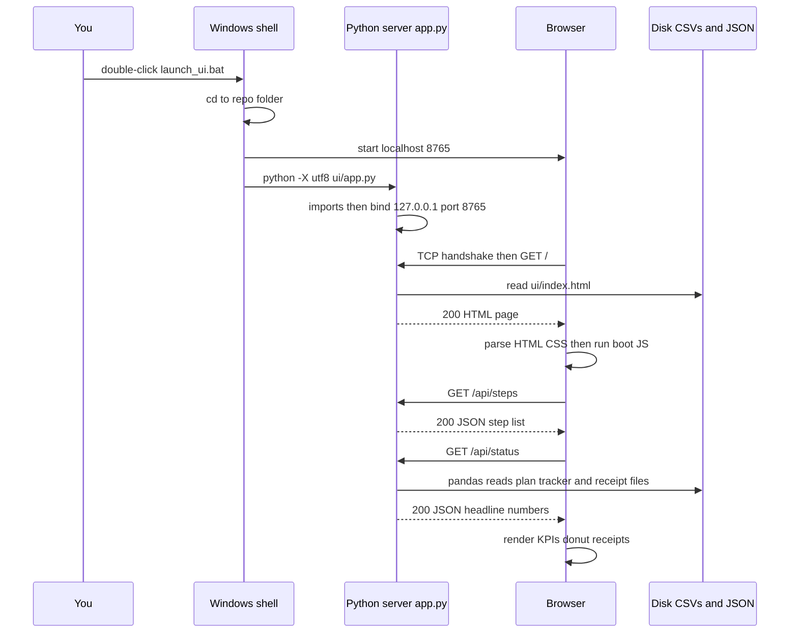

##### The three-level view of what you just watched

**Level 1 — like you're new:** a shopkeeper (the server) unlocked one specific door (port 8765) inside your own house (localhost), and your browser walked up, asked for the menu board (the HTML page), then asked three quick stock questions (the API calls), and arranged the answers on a display shelf (the rendered page).

**Level 2 — how it actually works here:** `cmd.exe` runs four lines; Python binds a `ThreadingHTTPServer` to `("127.0.0.1", 8765)` in `ui/app.py:main()`; `Handler.do_GET` serves `ui/index.html` from disk; the page's `boot()` function fires `fetch('/api/steps')` then `/api/status` and `/api/job`; `api_status()` lazily imports pandas and reads the newest `v4_outputs/` run plus `DISCOUNT_PLAN/` files; JSON returns; vanilla JS renders.

**Level 3 — how a senior engineer sees it:** a single-process HTTP server built from Python's standard library alone (no installed web framework; pandas is the only outside package it leans on) behind a loopback bind, serving a single-file SPA (single-page application — one HTML page that swaps views with JS instead of reloading) that talks to a read-through file store. Pattern names: *client-server*, *REST-ish JSON API*, *lazy import*, *graceful degradation via `_safe`*. What they'd worry about: no caching layer (every status call re-reads CSVs — fine at 1 user, ruinous at 100), a startup race between browser and server (cosmetic), and the fact that the loopback bind is the *only* access control — perfectly sound until the day it isn't.

#### Walkthrough B — An action: clicking Run full rebuild

The cold start was all reading. Now the flow that *changes things* — and the pattern (fire a long job, poll for progress) you will reuse in every serious tool you ever build.

##### Step 1: The click

You press **Run full rebuild** in the Run Center. The page has one global click listener (a technique called event delegation — one guard at the entrance rather than one per button); it sees the button carries `data-run="monthly_all"` and calls `runStep('monthly_all')`.

##### Step 2: POST /api/run/monthly_all

`runStep` sends `fetch('/api/run/monthly_all', { method: 'POST' })`. Note the verb: **POST**, not GET. The convention every web system honors: GET asks and changes nothing (safe to repeat, safe to bookmark); POST *does something* (starts a job, submits an order). Browsers, caches, and tools all rely on this — a GET that mutates state is a landmine, because anything that innocently re-requests the page repeats the mutation.

##### Step 3: The allowlist check — the most important security decision in the file

`do_POST` extracts the step id and calls `start_job("monthly_all")`. Two gates live inside that function; the one that matters most for security: is this id one of the 17 known steps in the `STEPS` dictionary (or the special `monthly_all`)? This is the **allowlist** pattern: the server maps ids to commands *it* defined — `"pipeline"` means `["pipeline.py"]` and nothing else — and refuses everything not on the list. The browser can never say "run *this* command"; it can only say "run item 4 on your menu." Even if something malicious reached this server, the worst possible request is "please run a step of the playbook." The opposite design — accepting a command string from the client — is how servers get hijacked, and it's the number-one thing to never let an AI assistant talk you into "for flexibility." Unknown id → the function returns a refusal and the browser gets a 409 with `Unknown step`.

##### Step 4: The lock check — one job at a time, and the 409 path

The other gate — and in the actual code it runs *first*, before the allowlist look-up: `with JOB.lock:` — a **lock** is a talking-stick for threads. Since the server handles every request on its own thread, two rapid clicks would race into `start_job` simultaneously; the lock forces them through one at a time, and whoever's second finds `JOB.status == "running"` and is refused. Without it, two full rebuilds could run at once, both writing `v4_outputs/` folders and `DISCOUNT_PLAN/` files over each other — corrupted deliverables you might not notice until the KAM executes a garbage cut list.

The refusal travels back as HTTP status **409 Conflict** — status codes are the response's tone of voice: 2xx "done," 4xx "your request has a problem" (404 not found, 409 conflicts with current state), 5xx "I broke." The page's `api()` helper sees the non-OK status, throws, and `runStep`'s catch shows the red toast — the small notification card, bottom-right — with the server's exact words: *"A job is already running — wait for it to finish."* That's the full 409 experience: nothing crashes, you're told why, you wait.

##### Step 5: The job is booked and a worker thread spawns

Gates passed. `start_job` expands `monthly_all` into the 13 tasks of `MONTHLY_ORDER` (pipeline → champion → DML, the Double ML independent causal cross-check from your compute layer → gates C1–C8 → challenger → pricing → budget → promo MILP — mixed-integer linear programming, the solver technique that picks the best yes/no promo schedule under rules like spacing and budget → scenarios → backtest → elasticity gates → sensitivity → outlier audit), resets the `JOB` object, sets `status="running"`, `total_steps=13`, and starts a new thread running `_run_commands`. `daemon=True` means "this worker thread dies when the server dies" — and because closing the black console window also takes down the child programs attached to it, shutting the window ends a half-finished rebuild rather than leaving it running invisibly.

##### Step 6: The server answers immediately — the async job pattern

Here's the move that makes the whole UI feel right: the HTTP response — `200 {"ok": true, "message": "started"}` — goes back within milliseconds, while the 13-step job runs for the next many minutes *on the worker thread*. The request-response cycle is a phone call; a rebuild is a construction project. You don't stay on the phone for the whole build — browsers and networks time out after a minute or two anyway. Instead: "order received, ticket number issued, call back for status." Every heavy feature in every SaaS — report generation, video processing, bulk email — is this same *fire the job, return a ticket, poll for progress* pattern; big systems just add a **queue** (a waiting line for jobs, so many can be accepted and processed in order by a pool of workers) where you have a single lock.

##### Step 7: Subprocess 1 of 13 launches

The worker takes task one and runs:

```python
argv = [sys.executable, "-X", "utf8"] + ["pipeline.py"]
p = subprocess.Popen(argv, cwd=ROOT, stdout=subprocess.PIPE,
                     stderr=subprocess.STDOUT, text=True, ...)
```

A **subprocess** is a child process — the server hires a separate program to do the work rather than doing it in-house. Why not just `import pipeline` and call it? Isolation. A subprocess that crashes, leaks memory, or misbehaves cannot take the dashboard down with it; when it exits, every resource it held is reclaimed by Windows. The server is a foreman, not a laborer. `cwd=ROOT` starts the child standing in the **repo** root (repo, short for *repository* — the project's whole folder tree, whose change history git records; here it's simply your project folder), so `pipeline.py`'s relative paths (`input_data/`, `v4_outputs/`) resolve — step 2's lesson, again. `stderr=subprocess.STDOUT` merges the child's error stream into its normal output stream (**stdout** — the pipe every program's `print` writes to), so the log captures everything in one ribbon.

##### Step 8: stdout streams line-by-line into the deque

```python
for line in p.stdout:
    JOB.log.append(line.rstrip())
```

Every line `pipeline.py` prints is captured *the moment it's printed* and appended to `JOB.log`, a **deque** with `maxlen=6000` — a list that, when full, silently drops the oldest line for each new one. That cap is quiet good engineering: a chatty script printing millions of lines can never balloon the server's memory; you always hold the *most recent* 6,000 lines, which is what you'd want to read anyway. The log lives only in memory — restart the server and it's gone (the *outputs* are on disk; the *narration* is not).

##### Step 9: Meanwhile, the browser polls /api/job every second

The instant `runStep` got its 200, it started `setInterval(pollJob, 1000)` — ask `/api/job` once per second. This is **polling**: the client repeatedly asking "anything new?" rather than the server pushing news. It's the toddler-in-the-backseat protocol — "are we there yet?" — and it is *mildly wasteful and completely fine*: one tiny local request per second, against one server, on one machine. The fancier alternatives (WebSockets — a phone line held open so the server can speak first; server-sent events) buy elegance at the cost of moving parts, and at your scale they'd buy you nothing. Each poll returns `JOB.snapshot()`: status, which command is current, elapsed seconds, done/total step counts, and the entire log joined into one string. `renderJob` repaints the top-bar pill, the console card, and the log (only when the text actually changed — a cheap length check avoids re-rendering 6,000 identical lines).

One nicety worth stealing for anything you build: the log auto-scrolls to the newest line *only if you were already at the bottom*. Scroll up to study something and it stops yanking you down (`S.logPinned` in `index.html`); scroll back to the bottom and it re-pins.

##### Step 10: Progress bar math

Each time a subprocess exits cleanly, the worker increments `JOB.done_steps`. The page computes:

- fill width = `done_steps / total_steps × 100` percent — 4 of 13 done → 31% green;
- caption = `Step min(done+1, total) of 13` — 4 done means step 5 is *running now*.

Honest and slightly lumpy: steps aren't equal length (the MILP promo calendar can dwarf the parameter snapshot), so the bar moves in uneven hops. Per-step time estimates would smooth it; nobody needs that for a monthly ritual. The stepper alongside gives the finer picture — green check per finished step, spinner on the current one.

##### Step 11: A step fails mid-chain

Suppose step 6, the pricing engine, hits a bug — a renamed column, an elasticity file from an older run. The subprocess crashes and Python prints a **traceback**: the crash report that reads *bottom-up* — the last line names the error (`KeyError: 'tgt_disc'`), the lines above trace the path through the code that led there, with file names and line numbers. Because stdout and stderr are merged, the whole traceback streams straight into the deque, so it's sitting in your console card.

Every process ends with an **exit code** — a single number handed back to whoever started it. Zero means "finished fine"; anything else means failure (the universal convention across every operating system). The worker checks it:

```python
p.wait()
if p.returncode != 0:
    JOB.log.append(f"FAILED {label} (exit {p.returncode})")
    JOB.rc, JOB.status = p.returncode, "failed"
    return
```

That `return` is a policy decision: **the chain stops dead.** Steps 7 through 13 never run — correctly, because they'd consume the pricing engine's half-written outputs and produce a confident-looking plan built on garbage. Fail fast, fail loudly, produce nothing rather than something wrong. In a pipeline that ends with a human executing price cuts, this is a safety property, not a convenience.

##### Step 12: The browser learns, the UI tells you

The next 1-second poll returns `status: "failed"`. The page: stops polling; flips the top pill to red *Failed*; marks the failed step with a red cross in the stepper (greens above it stay green — you can see exactly how far it got); shows a red toast — *"Full monthly rebuild failed — check the log in Run Center"*; and clears its cached tables so nothing stale is displayed.

##### Step 13: You read the log — and this is you debugging

You open the console card, scroll to the bottom, and find the `FAILED ... (exit 1)` line with the traceback right above it. Read the traceback bottom-up: last line = what broke, lines above = where. The **Copy** button puts the whole log on your clipboard — paste it to your AI assistant and you've just done, verbatim, what a professional engineer does first in every incident: *reproduce, read the log, isolate the failing step*. Your dashboard has quietly built you that workflow.

Recovery is cheap by design: fix the cause (or the data), then either re-run just the failed step with its own **Run** button, or re-run the whole chain. Both are safe to repeat — the pipeline writes each rebuild into a fresh timestamped folder under `v4_outputs/`, and the deliverable files are rewritten whole. Engineers call an operation that's safe to run twice **idempotent**; it's the property that makes "just re-run it" a legitimate recovery plan instead of a gamble.

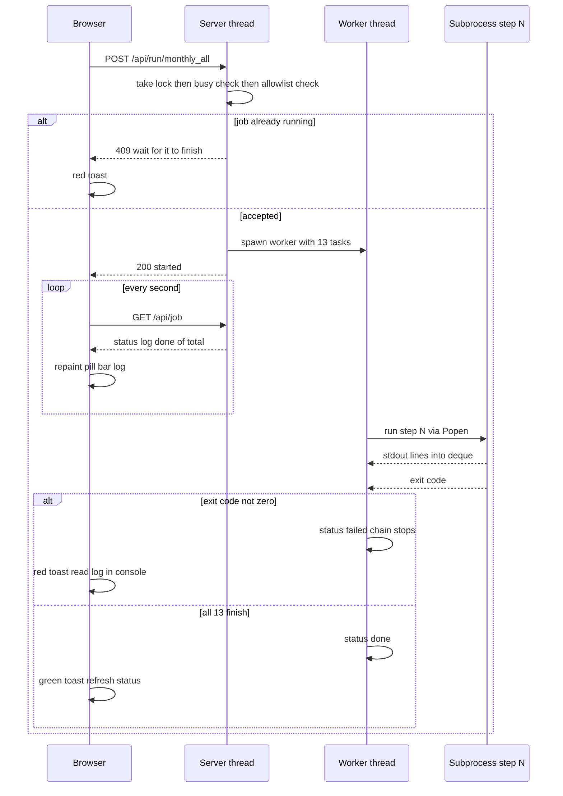

##### The three-level view of the action

**Level 1 — like you're new:** you handed a waiter an order ticket. He checked it's actually on the menu, checked the kitchen wasn't mid-banquet, gave you a ticket number, and the kitchen started a 13-course prep. You glance at the order board every few seconds; if course 6 burns, the whole tasting menu stops — better no dinner than a poisoned one — and the board tells you exactly which course died.

**Level 2 — how it actually works here:** `do_POST` in `ui/app.py` routes `/api/run/<step>` to `start_job`, which takes `JOB.lock`, refuses if busy (409), refuses unknown ids (409), then spawns a daemon thread running `_run_commands`; that thread `Popen`s each script with merged stdout/stderr streaming into a 6,000-line deque; the page's `pollJob()` hits `/api/job` every second and `renderJob()` repaints pill, progress bar, stepper, and log; a nonzero exit code sets `status="failed"` and stops the chain.

**Level 3 — how a senior engineer sees it:** an *asynchronous job runner* with a *mutex* (the lock) instead of a queue, *command-pattern dispatch* through an allowlist, *fail-fast pipeline* semantics, and *polling* instead of push. What they'd worry about: job state lives only in memory (restart the server mid-run and the dashboard forgets a job ever existed, though the subprocess outputs on disk remain); there is no cancel button or timeout (a genuinely hung subprocess holds the "running" status forever — your recovery is closing the black window); and a second user would need a real queue, not a refusal. All three are the right corners to cut for one owner on one machine, and the first three tickets to file the day there are two of you.

#### This is every web app you will ever touch

Strip away the specifics and Walkthrough B is *the* request lifecycle — the same eight stages run every time anyone does anything in Gmail, Shopify, Blinkit's own seller portal, or the SaaS you plan to sell. Learn the general names now and you can read any architecture diagram:

| Stage (general name) | In your system | In a typical SaaS |
|---|---|---|
| 1. User action | Click Run full rebuild | Click Place order |
| 2. HTTP request | `POST /api/run/monthly_all` over loopback | Same, over the internet via DNS + TLS (the encryption layer — the padlock in the address bar) |
| 3. Routing | `do_POST` matching the path | A router library mapping hundreds of paths to functions |
| 4. Authentication + authorization | *Absent* — the 127.0.0.1 bind means only you can knock | Who are you (login/session token), and are you *allowed* this action |
| 5. Validation | The STEPS allowlist + the job lock | Input checks, rate limits, business rules |
| 6. Business logic | Worker thread runs 13 subprocesses | Order service reserves stock, charges the card |
| 7. Storage | CSVs and JSON under `v4_outputs/` and `DISCOUNT_PLAN/` | A database, usually with a cache in front |
| 8. Response + render | JSON back, vanilla JS repaints; polling for the long tail | JSON back, a framework like React repaints; a queue + workers for the long tail |

**Authentication** deserves its one-line gloss since your system skips it: it's the bouncer checking IDs — proving *who* is making the request — and its sibling authorization checks *what that person may do*. You have neither, and at one user on a loopback bind, that's the right amount. Stage 4 is also exactly where multi-brand SaaS gets hard: once ten brands share one system, every request must carry an identity, and every read at stage 7 must be filtered to *that brand's* data. That single sentence is most of the re-architecture between what you have and what you want to sell.

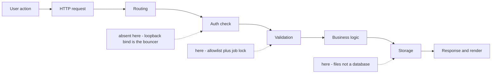

Keep the two walkthroughs as your diagnostic map. Symptoms sort themselves by stage: *"site can't be reached"* = stages 1–2, the server process or port; *red toast on click* = stages 4–5, the gates (read the toast — it carries the server's exact reason); *step fails mid-run* = stage 6, business logic (read the traceback in the console, bottom-up); *panels showing "not generated yet"* = stage 7, the files aren't there yet (run the step that makes them); *numbers look stale* = stage 8, refresh, or check which run folder is newest. When you can name the stage, you can name the fix — and that, more than any framework or tool, is what it means to think like the engineer of your own system.


---

## 6. The Weekly Loop as an Event System — state, feedback and safety

Your weekly loop looks simple from the outside: the tracker recommends cuts, your KAM applies them on Blinkit, the numbers come back, and the system grades itself. But under the hood it is the most architecturally interesting part of your whole system — because it is a **distributed system with a human inside it**.

A quick definition before anything else. A **distributed system** is any system where the work is split across more than one independent actor, and those actors cannot see inside each other — they can only exchange messages and wait. Two chefs in two kitchens sharing one order pad is a distributed system. Your weekly loop qualifies on day one: your Python scripts run on your machine, but the actual price changes happen inside Blinkit's portal, applied by a KAM (Key Account Manager — the person at the retailer or on your team who physically edits discounts in Blinkit's seller interface). Your code cannot reach into Blinkit and cannot reach into your KAM's head. It can only send a request out and wait for an answer to come back. Every hard problem in this section — lost messages, delayed answers, duplicate runs, lying data — is a classic distributed-systems problem, and your system already solves most of them with CSV files and discipline.

(A **CSV** — comma-separated values — is the plainest possible data file: a text file where the first line names the columns and every following line is one row, values separated by commas. Think of a spreadsheet saved as raw text. Your whole loop's memory lives in CSVs.)

The other big idea of this section is **event-driven thinking**. An **event** is simply "a thing that happened, recorded with enough detail that someone else can react to it later" — like a doorbell ring, or an entry in a delivery log. An **event-driven system** is one where components don't call each other directly; instead, one component records that something happened, and other components notice and react in their own time. Your loop is event-driven whether you planned it or not: the tracker records "we recommended these cuts" as rows in a file, the KAM reacts to that record days later, and the scorecard reacts to *the KAM's* record a week after that. Nobody waits on the phone for anybody.

Here is the whole loop as a message flow. A **sequence diagram** reads top to bottom in time — each arrow is one hand-off:

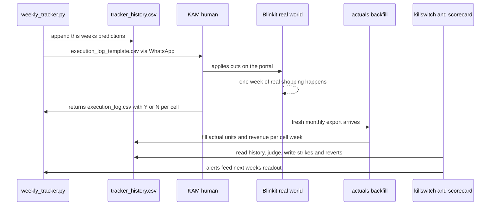

Every arrow in that diagram is a software concept you're about to learn by name: state, message, queue, acknowledgement, reconciliation, circuit breaker. Let's take them one component at a time.

#### tracker_history.csv — the state, and the single source of truth

**State** is a system's memory: everything it needs to remember between one run and the next. A restaurant's state is its order pad and its reservations book — burn those and the restaurant still has chefs and tables, but it no longer knows who ordered what. Your tracker's state is `DISCOUNT_PLAN/tracker_history.csv`.

**Level 1 — like you're new.** Imagine a ledger book at the front of a shop. Every week, before you change any price, you write one line per product: "this week I predict changing the price of X will earn me this much extra." You leave a blank column next to each prediction. When the real numbers arrive weeks later, you fill in the blank — in ink, never pencil — and now anyone can flip through the book and see, week by week, whether your predictions came true. The book is the only place this record exists. That is `tracker_history.csv`.

**Level 2 — how it actually works.** Every run of `scripts/tracker/weekly_tracker.py`, the `append_history()` function adds one row per SKU-city cell with this **schema** (a schema is the fixed list of column names and what each is allowed to contain — the pre-printed headings in the ledger): `week, week_date, cell_id, confidence, scored, pred_net_rev_delta, actual_net_rev_delta, pred_units, actual_units, applied, week_action`, plus columns added later by other modules — `baseline_net_rev_wk, baseline_units_wk, baseline_osa, baseline_sov, actual_osa, actual_sov, strikes, cell_status`. Look at the real first data row of your file: `W1, 2026-07-06, 108382_100g_Ahmedabad, High, True, 0.0, <blank>, 96.25, <blank>, False, hold, 3485.80, ...`. The prediction columns are filled; `actual_net_rev_delta` and `actual_units` are blank. That blank is not sloppiness — it is the whole design. The row is an open bet waiting to be settled.

Notice one property that makes this file trustworthy: rows for past weeks are **effectively append-only** — new weeks are added at the bottom, and once an actual is recorded it is never overwritten (you'll see the exact guard in the reconciliation component below). One deliberate exception: the two *verdict* columns, `strikes` and `cell_status`, are re-stamped on every kill-switch pass — but they are recomputed deterministically from the never-changing actuals, so re-stamping them can only re-derive the judgment, never rewrite what happened. A file where history only accumulates and is never rewritten is called an **audit trail**: a record you can hand a skeptic and say "here is every bet we placed and how each one landed, and nobody edited it after the fact." When you sell this system to other brands, the audit trail *is* the product's credibility. A dashboard claims; an audit trail proves.

Software engineers also call this file your **single source of truth** — the one agreed-upon place where a fact lives. If the weekly workbook, the readout, and the kill-switch each kept their own private copy of "what we predicted in W3," they would inevitably drift apart, and you'd spend Fridays arguing with your own spreadsheets about which number is real. In your system they never disagree, because all three *read from the same file* and none keeps a copy. That is a deliberate architectural choice, not an accident of laziness.

The full checklist, quickly: **who calls it / when** — only the `weekly_tracker.py` run ever saves the file, once a week (`killswitch.py` stamps its verdict columns onto the table in memory, but the tracker does the saving); `scorecard.py` and `workbook.py` only read it, in the same run. **Data in** — this week's plan rows plus backfilled actuals. **Data out** — the settled history every downstream judge consumes. **What breaks without it** — everything downstream: no scoring, no strikes, no reverts, no track record to show a buyer; the system becomes a machine that gives advice and never learns. **Where stored** — one file on one disk, versioned by git (a version-control tool that keeps a snapshot of every change to every file, like an infinite undo history — another section covers it properly), which is your backup. **Typical technology / alternatives** — a real system this shape usually graduates to a **database**: a program purpose-built to store and retrieve structured records, like a filing cabinet with a full-time librarian who guarantees nobody rips a page while someone else is reading it. At your scale — one writer, one machine, 585 rows a week — the CSV is genuinely the right call: zero setup, human-readable, git-diffable, and your KAM can open it in Excel. The CSV stops being right the moment there are **two writers** (two brands' trackers, or you and a colleague running the same week) or the file gets big enough that "read all of it, rewrite all of it" — which is what `pd.read_csv` then `to_csv` does on every run — takes minutes instead of seconds. (**pandas** is the Python library your scripts use to hold tables in memory; a **DataFrame** is its name for one in-memory table, a spreadsheet living in RAM.) **Beginner mistake** — opening the CSV in Excel, "tidying" it, and saving: Excel silently reformats dates and strips leading zeros from IDs, corrupting the keys everything joins on. Treat the file as machine-owned; read it, never hand-edit it. **Security** — it holds your pricing strategy in plaintext (ordinary readable text, no password or scrambling needed to open it); anyone with the laptop has it, which is fine solo and unacceptable as SaaS. **Cost** — zero. **Failure and recovery** — if the file is deleted or mangled, `git checkout` the last committed version; you lose at most one week's rows, and engineers debugging a corrupted state file do exactly that: diff the broken file against git history to find which run damaged it.

**Level 3 — how a senior engineer sees it.** This is the **ledger pattern** (also called an event log): don't store the current state, store the sequence of things that happened, and derive current state by reading the sequence. Banks, accounting systems, and modern event-sourced architectures all work this way, because a ledger answers "how did we get here?" and a snapshot only answers "where are we?". The engineer's worries at your scale: no file locking (two simultaneous runs could interleave writes — see failure scenarios below), no schema enforcement (a typo'd column name fails silently at read time, not loudly at write time), and full-file rewrites (fine at thousands of rows, painful at millions). All three worries have the same eventual answer — a database — and none of them justifies one yet.

#### The duplicate-week guard — idempotency you can point to

Here is one line of code carrying an entire computer-science concept. Inside `append_history()` in `weekly_tracker.py`:

```python
if not ((hist["week"] == week_label).any() if len(hist) else False):
    hist = pd.concat([hist, new], ignore_index=True)
```

In English: *before appending this week's rows, check whether this week's label already exists in the history — and if it does, append nothing.*

An operation is **idempotent** when doing it twice has exactly the same effect as doing it once. An elevator call button is idempotent — press it five times, one elevator comes. A "add ₹500 to my account" button is *not* idempotent — press it twice and you're ₹500 richer than intended. Idempotency matters in any system where a step might accidentally run twice, and in a human-operated system a step *will* accidentally run twice: your machine crashes mid-run and you rerun; you forget whether you ran Monday's tracker and run it again to be safe; the dashboard's run button gets double-clicked.

Without this guard, running the tracker twice in one week would write every cell's prediction rows twice. The scorecard would then count every hit and every miss double, the kill-switch's drift denominator would inflate, and your acceptance rate would silently halve (twice the recommendations "issued," same number applied). Nothing would crash — which is the dangerous kind of bug, the kind you discover three months later when a buyer asks why W7 has 1,170 rows and every other week has 585. The guard makes the entire "recommend" step safe to rerun: second run recomputes the workbook and readout (harmless — they're derived, regenerating them is like reprinting a report) but appends no duplicate state.

The senior-engineer framing: **make every step of a pipeline safe to rerun, because reruns are not an edge case — they are Tuesday.** When you review AI-generated code for your future SaaS, "what happens if this runs twice?" should be one of your standard questions. Note the guard's honest limitation, though: it keys on the week *label*. If two people run the tracker in the same week with different labels (one passes `--week W5`, the other lets `_auto_week_label` derive it), the guard can't save you — more on that in the failure scenarios.

#### baselines.json — immutable reference data, or: why you must never re-freeze

**Level 1 — like you're new.** To judge whether a diet worked, you weigh yourself *once, before you start*, write it on the fridge, and compare every future weigh-in to that number. If you re-weighed "the before" every week, the diet would always look like it just started working. Your baseline file is the number on the fridge.

**Level 2 — how it actually works.** Every prediction in your history is a *delta* — "revenue will change by this much **versus where the cell was before we touched it**." That "before" must be captured once and never move. `scripts/tracker/actuals.py` does the capturing: `freeze_baselines()` computes, per cell, the mean of its last four clean pre-action weeks — units, net revenue, OSA (on-shelf availability, the % of time the product was actually in stock) and SOV (share of voice, your slice of the ad visibility in the category). The result is written to `DISCOUNT_PLAN/baselines.json`. (**JSON** is a text format for structured data — labeled values in nested lists, like a form where every field has its name written next to it; where CSV is a table, JSON is a form.)

The freeze itself is enforced by the first two lines of `_load_or_freeze_baselines()` in `weekly_tracker.py`: *if the file already exists, load it and return — never recompute.* That early return is the entire integrity mechanism, and its comment says why: "re-freezing a mean-reverting cell would fake wins/losses."

Walk through the corruption it prevents, because this is the concept the whole component exists to teach. Sales wobble naturally — a cell that had a freak good month tends to drift back down (statisticians call it mean reversion), no discount change required. Suppose you cut a cell's discount, and suppose the baseline were recomputed from each fresh export instead of frozen. Two weeks after your cut, the "baseline" now *includes post-cut weeks*. Your actual-vs-baseline delta is now comparing the cut against a reference already contaminated by the cut — like moving the finish line mid-race. Cells would show phantom wins and phantom losses that your action never caused, the kill-switch would strike innocent cells and pardon guilty ones, and — worst of all — nothing would look broken. The numbers would all be plausible. They would just be *wrong*, and every week they'd get wronger.

Data that is written once and never changed is called **immutable** (unchangeable) **reference data**. The design rule: any number that other numbers are *measured against* must be immutable, and the code must enforce that mechanically — the early return — rather than relying on you remembering not to delete the file. There is exactly one legitimate way to re-freeze: when you deliberately reset the whole experiment (new baseline period, new history), you delete `baselines.json` *and* `tracker_history.csv` *together*, because a baseline and the deltas measured against it are one inseparable unit. Deleting one without the other is the corruption. One script in your repo performs exactly this joint reset on purpose: `scripts/tracker/verify_loop.py`, the end-to-end loop test, *deletes* `tracker_history.csv`, `execution_log.csv` and `baselines.json` as its very first step so it can simulate a clean two-week cycle on real data. That makes it a great demo and a dangerous thing to run once real history has accumulated — treat it as a factory-reset button, and know that it is one.

Checklist notes: **who writes it** — the tracker, exactly once, on the first run that has actuals to process; after that, read-only forever. **What breaks without it** — deltas can't be formed; `backfill_actuals` leaves `actual_net_rev_delta` blank and nothing gets scored (a graceful degradation — the system would rather know nothing than fake something). **Alternatives** — a database would put these in a reference table with write permissions revoked; big experimentation platforms (the A/B-testing systems at Amazon or Booking.com) freeze control-group definitions the same way and for the same reason. **Beginner mistake** — "the baselines look stale, let me refresh them." Stale is the point. **Level 3** — an engineer recognizes this as the control-group problem from experiment design wearing a software costume, and their worry is precisely the one your code already documents: that a future maintainer (or a future AI assistant!) "helpfully" adds refresh logic. The defense is the loud comment sitting on the function, which your code has. Comments that explain *why not* are worth more than comments that explain *what*.

#### execution_log_template.csv — a message, and the honest truth about your queue

**Level 1 — like you're new.** A restaurant kitchen doesn't shout orders across the room. The waiter writes a ticket — table 4, two curries, no onion — and clips it to the rail. The cook takes tickets off the rail in order, and when a dish goes out, the ticket gets a tick. The ticket is a *message*; the rail is a *queue*; the tick is an *acknowledgement*. Your weekly loop has all three — the ticket is a CSV, the rail is WhatsApp, and the cook is your KAM.

**Level 2 — how it actually works.** A **message**, in software, is a self-contained packet of information sent from one actor to another, carrying everything the receiver needs to act — no phone call required to clarify. After the guardrail settles this week's actions, `write_execution_log_template()` in `weekly_tracker.py` writes exactly such a packet to `DISCOUNT_PLAN/execution_log_template.csv`: one row per acted cell, columns `week, cell_id, product_id, city, recommended_action, recommended_disc, applied` — with `applied` deliberately left blank. Look at your real file: `W3, 126995_500g_Bangalore, 126995, Bangalore, cut, 23.78, <blank>`. That row is a complete work order: *in Bangalore, set product 126995's discount to 23.78%, and when you've done it, write Y in the last column.* The blank column is the message carrying its own reply envelope.

A **queue** is the structure that holds messages between sender and receiver so that neither has to be ready at the same moment. That time-decoupling is the entire value: the tracker runs Monday morning; your KAM applies cuts whenever Blinkit's portal and their calendar allow. Neither blocks the other. In grown-up systems the queue is software — RabbitMQ, Amazon SQS, Kafka are the famous names, essentially post offices for programs, with guaranteed delivery and re-delivery when a receiver was down. Your queue is *a CSV attached to a WhatsApp or email message*. And here is the honest architectural claim this handbook keeps making: **that is genuinely a queue.** It holds the message until the receiver is ready; it decouples sender and receiver in time; the message is durable (it sits in the chat history). What it lacks — and this is the precise, nameable gap, not vague hand-waving — is *delivery guarantees*: nothing detects that the message was never sent, never opened, or answered with last week's file. A software queue would retry, alert, and dead-letter (park an undeliverable message somewhere visible). Your retry mechanism is you remembering to follow up on Thursday. At one brand and one KAM, human memory is a fine retry mechanism and costs nothing. At ten brands with ten KAMs, you will forget, and *that* — not speed, not volume — is what will eventually justify real message infrastructure.

One design detail worth pointing at: the docstring (the explanatory text at the top of a Python function, documentation living inside the code) says "This is a TEMPLATE, never read back by the code." The outbound file and the inbound file are *different files* — the template goes out, and the KAM's answer comes back as `execution_log.csv`. Separating them means a half-filled template can never be mistaken for a real answer. That's a small decision with a big payoff: the system cannot confuse "what we asked" with "what was done."

Checklist: **data in** — the guarded plan; **data out** — the work order; **who calls / when** — the tracker, every weekly run, overwriting last week's template (safe, because the template is derived, not state — the true record of what was recommended lives in `tracker_history.csv`). **What breaks without it** — the KAM works from screenshots and memory, the returned log's cell IDs won't match yours, and the acknowledgement matching below falls apart; the template is what keeps human and machine speaking the same key. **Failure and debugging** — if the KAM says "I never got it," the template is still sitting on disk and in your chat history; regenerating it is free. **Level 3** — an engineer calls this whole shape a **work queue with manual transport**, and the pattern of a message that carries its own response form is a cousin of the *correlation ID* pattern: every reply is pre-linked to its request by `week + cell_id`, so no reply can ever be ambiguous about what it's answering. Their worry: no schema validation on the way back in — the KAM can mistype a cell ID or a week label and the code will just silently not match those rows (a renamed column, by contrast, crashes loudly — silence is the more dangerous failure). A ten-line validation script ("does every returned row match a template row?") is the cheap fix when this starts biting.

#### execution_log.csv — the acknowledgement, and the line between ops-miss and model-miss

**Level 1 — like you're new.** An **acknowledgement** (engineers say "ack") is the receiver's confirmation back to the sender: message received, action taken — the signed delivery slip a courier brings back. Without acks, a sender is blind: it knows what it *asked for*, never what *happened*. Distributed systems are obsessed with acks because the gap between asked and happened is where all the money disappears.

**Level 2 — how it actually works.** Your KAM fills the template's `applied` column with Y or N per cell and returns the file as `DISCOUNT_PLAN/execution_log.csv`. On the next tracker run, `apply_execution_log()` in `weekly_tracker.py` reads it, normalizes the answers (it accepts Y, YES, TRUE, 1 — a small kindness to humans typing in Excel), and flips the `applied` flag on the matching `(week, cell_id)` rows of `tracker_history.csv`.

Then comes the single most important honesty rule in your whole system, one line in `main()`:

```python
scored_hist = hist[hist["actual_net_rev_delta"].notna() & hist.get("applied", False).astype(bool)]
```

**Only cells that were confirmed applied get scored against the model.** Read what that separates. If a cut was never applied and sales stayed flat — that says *nothing* about your model; it's an operations miss, and the readout reports it in the Adoption section as exactly that. If a cut *was* applied and sales tanked — that's a model miss, and the kill-switch takes over. Blur that line and both numbers become garbage in opposite directions: unapplied cuts whose cells wobbled would randomly punish or credit a model that never acted, while your adoption problem would hide inside a fog of "mixed model results." Your system keeps two failure ledgers — *did they do what we said?* (ops) and *was what we said right?* (model) — and never lets one contaminate the other. When you pitch this tool, that separation is a selling point competitors' spreadsheets don't have.

There's a third honesty rule layered on top, in the readout code: a week whose log was never returned reads adoption **"n/a" — never 0%**. Not-confirmed is not rejected; the absence of an acknowledgement is *the absence of information*, not a negative answer. Distributed-systems engineers get this wrong constantly (timeout treated as failure when the operation actually succeeded); your tracker gets it right in `write_readout()`, which even prints the nudge: "Ask the KAM to fill DISCOUNT_PLAN/execution_log_template.csv."

Checklist, compactly: **what breaks without it** — every recommendation would be scored as if executed, model accuracy becomes fiction, and the kill-switch strikes cells for cuts that never happened (`killswitch._acted_mask` requires `applied == True` before judging a cell, precisely to prevent those phantom strikes). **Beginner mistake** — treating a missing log as "assume they did it"; your code's default is `applied = False`, the conservative direction, and that default choice — *unconfirmed means unconfirmed* — is a principle to carry into everything you build. **Level 3** — an engineer sees at-least-once messaging with manual acks and would eventually want a timestamp on the ack (when was it applied? mid-week application makes that week's actuals a blend) and an acked-by field (which KAM?) once there are several. Both are one column each. Add them when the pain arrives, not before.

#### Actuals backfill — reconciliation, and eventual consistency in plain words

**Level 1 — like you're new.** You mail cheques on Monday. Your bank statement arrives at month-end. Only then do you sit down and match statement lines to cheque stubs — that sit-down is called **reconciliation**: matching what you *recorded* against what *actually cleared*, line by line, and settling the differences. Between Monday and the statement, your own ledger is ahead of reality and you simply live with the gap.

That gap has a formal name: **eventual consistency**. A system is eventually consistent when its records are allowed to be temporarily out of sync with reality — or with each other — as long as they are guaranteed to converge once the delayed information arrives. Your loop is eventually consistent by construction and by *calendar*: the tracker writes a prediction today, the KAM acts over days, shoppers shop for a week, Blinkit's export lands with the next data drop, and only then can the blank `actual_net_rev_delta` cells be filled. For that whole stretch — a week or more — your history file contains open bets. This is not a flaw to engineer away. It is the honest shape of measuring the real world: reality reports on a lag, and a system that pretended otherwise (by filling actuals with estimates, say) would be lying to its own scorecard.

**Level 2 — how it actually works.** When you run the tracker with `--actuals <path to a fresh fact_table.csv>` (the **fact table** is the pipeline's one-row-per-product-per-city-per-day master table — the system's raw diary of what happened; another section covers the pipeline that builds it), three functions in `scripts/tracker/actuals.py` do the bank-statement sit-down. `panel_from_fact_table()` rolls the fresh export up to weekly cell numbers. `backfill_actuals()` then walks every history row that is still open — `actual_net_rev_delta` is blank — and tries to find that row's `(cell_id, week)` in the fresh data, matching on either the week label or the calendar date (Blinkit's export speaks in dates, your history speaks in W-labels; `_week_key()` translates so both sides can shake hands). On a match it fills `actual_units`, `actual_osa`, `actual_sov`, and computes `actual_net_rev_delta = units × price − frozen baseline`. No match — the export doesn't cover that week yet — and the row *stays open*, patiently, to be filled by a later export. No penalty, no guess.

Two guards make reconciliation trustworthy. First, **never overwrite a filled actual**: the loop skips any row where the actual is already recorded, so re-running backfill with the same or a different export cannot change history — reconciliation is idempotent, the same concept from the duplicate-week guard now protecting the *answers* instead of the *questions*. Second, a subtler one the code's own test suite celebrates: an already-scored row's *baseline* is never re-stamped either, because a delta and the baseline it was measured against are one inseparable fact — updating one without the other would make the row internally contradictory, a delta that no longer equals actual-minus-baseline.

Checklist: **who calls it / how often** — the tracker's `main()`, only when `--actuals` is passed, so in practice monthly when a fresh Blinkit export lands, settling several weeks of open rows at once. **What breaks without it** — predictions never meet reality; the scorecard shows "track record starts filling from next week" forever; the kill-switch stays blind (it only judges rows with actuals). **Failure and debugging** — the classic failure is a key mismatch: the export's cell IDs or week dates don't line up with history's, and rows silently stay open. An engineer debugs this exactly the way you would: pick one stubborn open row, find its cell in the fresh export by hand, and compare the keys character by character — nine times out of ten it's a `532393` vs `532393.0` formatting quirk, which is why your codebase normalizes IDs so defensively. **Level 3** — an engineer names this the reconciliation job pattern (every payments company runs one nightly against card-network settlement files) and their worry is *partial* fills: an export that covers some cities and not others leaves a week half-settled, which is fine here because each row settles independently — the design already accommodates it. The deeper trade-off they'd note: your loop chose *correct-later* over *estimated-now*. For a decision system with a kill-switch attached, correct-later is the only defensible choice, because the kill-switch reverts real prices based on these numbers.

#### The kill-switch — a circuit breaker for your pricing

**Level 1 — like you're new.** The fuse box in your house exists because wires occasionally carry more current than they can survive, and no human can watch every wire every second. The breaker watches for you, and when a wire runs hot past a threshold, it *cuts the circuit automatically* — no meeting, no judgment call — and stays off until someone resets it deliberately. In software, a **circuit breaker** is the same idea: a component that watches a repeating action for consecutive failures, trips automatically past a threshold, blocks the harmful action, and enforces a cooling-off period before allowing retries. Your kill-switch is a circuit breaker where the "current" is lost sales.

**Level 2 — how it actually works.** `scripts/tracker/killswitch.py` exposes one function, `evaluate(history_df, config)`, which the tracker calls right after actuals backfill — so the brake runs on fresh reality before any new recommendation goes out (safety-first ordering, and the readout mirrors it by printing reverts *above* new cuts). For every cell you actually acted on, it walks the weeks chronologically and files each into one of three verdicts, in a strict order that encodes your system's honesty rules:

1. **Confounded — checked first, always.** If that week's on-shelf availability or share of voice collapsed more than 10% below the cell's frozen baseline, the week is excused entirely. Soft sales during a stock-out say nothing about your cut; blaming the cut would revert good cells and teach you wrong lessons. Crucially, a confounded week leaves the strike count *untouched* — not incremented (the cut isn't guilty) and not reset (the cut isn't vindicated either). The week is simply uninformative, and the code treats it as exactly that.
2. **Strike.** The cut failed this week only if *both* legs fail: actual units missed the promise by more than the 5% tolerance (`VOLUME_DROP_TOLERANCE_PCT` from `v4_config.py` — a config value that existed for months before this module finally consumed it) *and* the cell actually lost net revenue. Requiring both means a cut that shifted a few units but still made money is not punished — you only strike moves that are genuinely underwater.
3. **Clean.** Anything else resets the running strike count to zero. One good week clears the slate; the breaker has no memory of forgiven sins.

**Two strikes and the breaker trips**: the cell's status becomes `reverted`, it lands in the alerts list, and the weekly readout tells you — above everything else — to put that cell's discount back. Then comes the part beginners forget to build: the **freeze**. A reverted cell is frozen for 4 scored weeks, during which it is not judged, not re-struck, not re-reverted. Without a cooling-off window, a breaker flaps — trip, reset, trip, reset — and a flapping breaker is almost worse than none, because the cell's price would yo-yo weekly and your KAM would stop trusting the readout. After the window elapses, the code explicitly thaws the cell back to normal evaluation; the freeze is an expiring window, not a permanent latch (the module's built-in tests prove the two behave differently — run `python scripts/tracker/killswitch.py` and watch every branch assert itself).

There's a second breaker above the per-cell one: the **drift brake**, watching the whole portfolio. If at least 30 acted cells have been scored and the latest week's direction hit-rate — did we at least predict the *sign* of the revenue change right? — falls below 60%, `block_new_cuts` goes up and this week's new cuts are cancelled wholesale (`main()` resets every would-be cut back to its current discount). The reasoning: one wrong cell is a bad bet; a portfolio predicting worse than a coin flip means the *model* has drifted from reality — the market moved, a competitor repriced, the season turned — and the correct response is to stop issuing new bets and retrain, not to keep firing. Note the two breakers protect different things: per-cell strikes protect *individual cells* from a locally wrong model; the drift brake protects *the whole business* from a globally stale one. Existing reverts still fire while the brake is on — safety actions are never blocked, only new risk.

And one more honesty detail that separates this from a naive implementation: the kill-switch judges **only acted cells** — `applied == True` and `week_action` in cut/reinvest. Your history is mostly holds (look at the real W1 rows: `0.0` prediction, `hold`, `applied=False`). Holds carry a zero prediction you never bet on; judging them would manufacture phantom strikes and flood the drift denominator with hundreds of no-ops, making the 60% floor meaningless. The `_acted_mask()` function exists for that one reason.

Checklist: **data in** — the settled history plus thresholds from `v4_config.py`; **data out** — the same history with `strikes` and `cell_status` stamped per row (the audit trail again — you can reconstruct every verdict ever issued), plus an alerts dict the readout renders. **What breaks without it** — the golden rule ("a cut that loses sales two straight weeks was wrong — revert it") lives only in your head and the readout's footer, applied when you remember, skipped when you're busy. The kill-switch is that rule made mechanical, which is the general move this whole handbook keeps recommending: *any rule you'd state in a business review should exist as code that runs without you.* **Alternatives and trade-offs** — the thresholds (2 strikes, 5% tolerance, 10% confounder, 60% floor, 4-week freeze) are judgment calls now living in one config dict — `_ks_config()` in `weekly_tracker.py`, with the 5% tolerance sourced from `v4_config.py` and the rest defined right there — where they can be tuned per brand; a fancier version would learn them statistically, which is complexity you don't need until a buyer's category behaves very differently from yours. **Beginner mistake** — building the breaker but not the freeze, or checking strikes before confounders (order matters: an excuse must be heard before a conviction). **Level 3** — an engineer recognizes the circuit-breaker pattern from service architectures (where it stops a failing downstream service from being hammered) and notes yours trips on *business* damage rather than technical errors — rarer and more valuable. Their worries: threshold sensitivity (2 strikes on noisy low-volume cells will occasionally revert an innocent cut — the price of safety, worth stating plainly to buyers) and the fact that the revert itself is still executed by the KAM, so the breaker's *decision* is automatic but its *action* is human — the breaker can trip and the wire stay hot until Thursday's WhatsApp. Closing that gap needs Blinkit-side automation you don't have; naming it honestly is the next best thing.

#### The scorecard — monitoring the business, not the machine

Software teams run **monitoring**: dashboards of system health — is the machine up, are requests failing, is memory full — with alerts when a needle enters the red. Your `scripts/tracker/scorecard.py` is monitoring aimed at a different target: not *is the machine healthy* but *is the machine right*. Infrastructure monitoring would tell you `weekly_tracker.py` exited successfully; the scorecard tells you whether the advice it printed made money. A pricing system can be 100% up and 100% wrong, and only one of those shows on an infra dashboard.

**Level 1 — like you're new.** A shop has two kinds of checking-up: the electricity meter tells you the shop has power; counting the till at closing tells you whether the day made money. The meter can read perfectly on a day the till comes up short. Infrastructure monitoring is the meter; your scorecard is the till count.

**Level 2 — how it actually works.** Two functions in `scripts/tracker/scorecard.py` — `score_history()` and `acceptance_history()` — are called by the tracker's `main()` on every weekly run: data in is `tracker_history.csv` (the applied-and-settled slice for accuracy, the full history for adoption), data out is a plain set of numbers the workbook and readout render. It computes three families of numbers from the settled history. **Accuracy**: hit-rate (how often the predicted direction matched reality) and predicted-vs-actual fit across scored cells — this is the trust engine, the number that earns the model the right to keep recommending. **Value**: cumulative realized savings to date — predictions settled in rupees, the number a buyer will ask for first. **Adoption**: what fraction of confirmed recommendations were actually executed, benchmarked in the readout against the ~85% acceptance the PepsiCo deployment paper reports — because a plan executed at 30% has projected savings that are, in the readout's own words, fiction. Note which histories feed which metric: accuracy is computed *only* over applied-and-settled cells (the ops/model separation again), while adoption is computed over confirmed weeks only, with unreturned logs reported as awaiting, never as zeros.

**Level 3 — how a senior engineer sees it.** The design lesson generalizes to everything you'll ever build: **every automated decision system needs a metrics layer that scores the decisions, not just the machinery** — and the metrics must be computed from the audit trail, not self-reported by the component being judged. Your scorecard reads `tracker_history.csv`; it does not ask the model how the model thinks it did. **What breaks without it** — the loop still runs, but on faith: no track record to defend a renewal, and no way to notice a slowly degrading model before the kill-switch has to. When this becomes SaaS, the scorecard's outputs *are* the retention feature: the page a customer opens before renewing. Alternatives at scale are metrics stores and BI dashboards (Metabase, Grafana and kin — tools that chart numbers from a database); yours is a section of `WEEKLY_READOUT.md` (**Markdown** — plain text with light punctuation for headings and bold, readable raw or rendered) and sheets in `WEEKLY_TRACKER.xlsx`, which is the correct amount of infrastructure for an audience of one. **Failure and debugging** — the scorecard stores nothing of its own; it is a pure read of the history file, so a number you don't believe is debugged by opening `tracker_history.csv`, filtering the same rows, and redoing the arithmetic by hand — and rerunning it is free.

#### When the loop breaks — three failure drills

A distributed system is defined by how it behaves when a message goes missing. Walk these three, because they're the ones you'll actually hit.

**The KAM never returns the log.** No `execution_log.csv` arrives; `apply_execution_log()` finds nothing; every rec stays `applied=False`. Consequences, all deliberate: nothing gets scored against the model (unconfirmed cells never enter `scored_hist`), the kill-switch stays silent on them (no phantom strikes for cuts that may never have happened), and the readout prints the week's adoption as **n/a, not 0%** — status "log not returned" — with a nudge to chase the KAM. The system degrades to *honest ignorance* instead of guessing — the correct failure mode, and one you should demand of every system you commission. The one real cost: your track record accrues more slowly, which is a relationship problem to manage with the KAM, not a code problem.

**Fake or sloppy data in the ack.** The KAM marks Y on cells never actually changed — to save face, or just Excel fatigue. The code cannot catch this at the gate; it trusts the ack. But the lie has a short life, because the loop *cross-examines*: a Y-marked cut that never happened produces actuals at baseline-ish revenue with no post-cut lift or dip pattern, and systematically, falsely-acked cells will score as inexplicable model misses — strikes on cells where "nothing changed." A cluster of reverts on cuts the KAM swears they applied is your signal to audit: pull the Blinkit portal's own price history for two or three cells and compare. The architectural moral: **an acknowledgement is a claim, and claims from outside your system need spot-audits against an independent source.** The grown-up fix is scraping actual live prices as a second witness — real work, worth it around the time real money rides on adoption numbers.

**Two people run the tracker the same week.** Today this can't happen — one owner, one laptop — which is *why* files-without-locking is currently a correct choice. The moment there are two operators, three doors open: both run with the same week label (the duplicate-week guard saves you — second run appends nothing); they run with *different* labels for the same calendar week (guard defeated — the week is double-counted, and you find out when the scorecard's denominators look fat); or they run at literally the same moment and both rewrite `tracker_history.csv` (last writer wins, the other's rows silently vanish — the classic lost-update problem, and git history is your recovery: `git diff` the file to see what the clobbered run wrote). The escalation path, in order of cost: a human rule ("only Priya runs the tracker, Mondays"); a lock file (the script writes `running.lock` on start, refuses to start if it exists — twenty lines of code); a database, whose librarian makes simultaneous writes physically safe. Notice the pattern that will repeat throughout your SaaS journey: *process rule → cheap mechanical guard → real infrastructure*, and each step is only justified when the previous one actually fails in practice.

#### What the grown-up SaaS version adds

Everything above survives contact with SaaS — the state ledger, the frozen baselines, the ack discipline, the circuit breaker, the ops/model separation are exactly the concepts a funded engineering team would build. What changes is the *transport and the audience*. Three additions, in the order customers would demand them:

**Per-user tasks.** Ten brands means many KAMs, each seeing only their brand's work orders. The execution-log template stops being one CSV and becomes rows in a tasks table inside a database — each row a message addressed to a person, with status (pending, applied, declined) and timestamps. Same message concept you have today; the queue just gains an address label and a librarian. This is also where **authentication** (proving who a user is — the login step; another section owns it) becomes non-optional, because "which rows can this KAM see" only means something once the system knows who's asking.

**Notifications.** Today, delivery is you pressing send on WhatsApp. A SaaS pushes: email, an app ping, or — the term worth learning now because every integration conversation uses it — a **webhook**. A webhook is a standing arrangement between two systems: "when X happens on your side, immediately send the details to this address of mine." It's a doorbell you install on someone else's system — instead of you walking over every hour to check whether anything happened (which is called *polling*, and is how your dashboard currently watches jobs), their system rings you the moment it does. In the SaaS loop: tracker publishes a plan → webhook fires → the KAM's Slack pings with their task list → they act → their submission fires a webhook back → your scorecard updates. Every arrow in the hand-off diagram at the top of this section becomes an automatic doorbell instead of a manual hand-off — and note that *only the arrows change*; the boxes are the system you already built.

**An approvals UI.** Right now the KAM's Y/N answer arrives after the fact, and the brake reverts mistakes retroactively. A grown-up version inserts a checkpoint *before* execution: the week's proposed cuts appear on a web page, the brand manager reviews, approves some, rejects others with a reason, and only approved cuts flow to KAM tasks. Architecturally this is one new state per recommendation — proposed → approved → applied → settled, with rejected as an exit — and each transition stamped with who and when, extending the audit trail from "what happened" to "who decided." Enterprise buyers will not deploy an auto-pricing tool without this human-in-the-loop gate; conveniently, your loop already *is* human-in-the-loop — the KAM's ack is a crude approval — so you'd be formalizing an existing muscle, not grafting a new one.

The through-line to carry out of this section: your weekly loop already contains the six load-bearing ideas of event-driven architecture — durable state, messages with acknowledgements, reconciliation on a lag, idempotent steps, a circuit breaker, and a metrics layer — implemented in CSVs, WhatsApp, and one honest Python orchestrator (an *orchestrator* is simply the script that runs all the other steps in the right order — `weekly_tracker.py` here). Scaling to SaaS is not a rewrite of those ideas. It is upgrading their transport while defending, fiercely, the honesty rules you've already encoded: unconfirmed is not rejected, confounded is not guilty, and the baseline never, ever moves.


---

## 7. The SaaS Toolbox — every concept you will meet when this becomes a product

This chapter is your dictionary. Every term below is one you will meet the moment your pricing tool stops being "a program on my laptop" and starts being "a product other brands log into." The rule for reading it: **for every concept, first ask "do I have this problem yet?"** Most of these tools exist to solve problems you do not have at one brand and 585 rows. Adopting them early is the single most common way beginners burn months and money. So every entry ends with an honest "when you actually need it" line, anchored to your real system.

A few words you'll see throughout, defined once up front:

- **SaaS** — Software as a Service. Instead of selling someone a program to install, you run the software on your machines and customers use it over the internet, usually for a monthly fee. Netflix is SaaS for movies; your goal is SaaS for CPG discount optimization.
- **Server** — a computer (or a program on a computer) whose job is to wait for requests and answer them. Today your server is `ui/app.py` running on your own Windows machine — a small waiter standing at a counter that only you can walk up to.
- **HTTP** — the language browsers and servers speak to each other; every time you open a web page, your browser sends an HTTP request ("give me this page") and the server sends an HTTP response. Think of it as the standardized order form used between customer and kitchen.
- **API** — Application Programming Interface: a menu of requests one program agrees to answer from another program. Your dashboard's API is the set of URLs like `/api/status` and `/api/steps` that `ui/app.py` answers with data instead of pages.
- **Endpoint** — one specific item on that menu; one URL that does one thing. `POST /api/run/pipeline` is an endpoint whose job is "start the pipeline."
- **JSON** — a plain-text format for structured data that both humans and programs can read: `{"status": "running", "step": "pipeline"}`. It's the lingua franca APIs use to pass data around, the way CSV is the lingua franca for tables.
- **CSV** — comma-separated values: a table saved as plain text, one row per line, commas between columns. Your entire data layer (`input_data/*.csv`, `fact_table.csv`) is CSV files.
- **Localhost** — the network name a computer uses for itself. When your dashboard binds to `127.0.0.1:8765`, it is saying "I only answer requests coming from this same machine." No one on the internet — or even on your home Wi-Fi — can reach it. A **port** (the `8765`) is like an apartment number on that address: one machine, many doors, each program listening at its own door.
- **Database** — a program purpose-built to store, index, and query data safely, like a librarian instead of a filing cabinet. You don't run one; your CSV files play this role today. The data-layer chapter owns the full files-vs-database discussion.

Keep those in your pocket. Each entry below runs the same three levels you've seen all through this handbook, compressed to dictionary size: the everyday analogy first, then how it maps onto your real files, then the honest engineer's judgment call on when the tool earns its keep. Now, the toolbox.

#### Authentication and authorization — who are you, and what are you allowed to do?

These are two different questions that beginners constantly blur together. **Authentication** ("authn") asks *who are you?* — the hotel front desk checking your passport. **Authorization** ("authz") asks *what are you allowed to do?* — the keycard that opens your room but not the penthouse. You can be perfectly authenticated (the hotel knows exactly who you are) and still not authorized to enter someone else's room.

**What your system does today: nothing, and that is correct.** Open `ui/app.py` and search for "password" or "login" — you'll find neither. The **docstring** — the explanatory note a Python file carries at its very top, like a label on a jar — states the whole security model in three lines: *binds to 127.0.0.1 only; the run endpoint accepts ONLY step ids from the fixed STEPS allowlist below (never arbitrary commands); one job at a time.* Because the server only answers the machine it runs on, the "who are you?" question has exactly one possible answer — you, the person sitting at the keyboard. Adding a login screen to localhost would be putting a passport check on your own bedroom door. The `STEPS` allowlist is your entire authorization system: even you, the only user, are only *authorized* to run the 17 named steps (plus one `monthly_all` bundle that runs the 13 monthly ones in order) — never an arbitrary command. That's a genuinely good instinct already baked in.

**What breaks the day you have a second user.** The moment your dashboard is reachable by anyone other than you — a teammate, a client, the internet — every request looks identical to the server. It cannot tell you from a stranger, or Brand A's manager from Brand B's. Anyone who finds the URL can view Brand A's margins and click "run pipeline" on Brand B. Authentication is what breaks first when you go multi-user, before any of the fancier concepts below.

**How the pieces work, from zero:**

- **Passwords and hashing.** You never store a customer's actual password. Instead you store a **hash** — the output of a one-way mathematical blender. Feed in "mangoPickle42", get out a long scrambled string; easy to go forward, practically impossible to go backward. At login you blend what the user typed and compare the two scrambled strings. If your database leaks, attackers get smoothies, not fruit. The beginner mistake — storing plain passwords — has ended companies. In practice you never write hashing code yourself: libraries (bcrypt, argon2) or a hosted login service (Auth0, Clerk, Firebase Auth, roughly free to ~$25–100/month at your scale) do it.
- **Sessions and cookies.** HTTP has amnesia — every request arrives with no memory of the previous one. So after a successful login, the server hands the browser a **cookie**: a small note the browser automatically attaches to every future request, like a hotel wristband. The server keeps a matching record (the **session**) saying "wristband #8823 = Priya from Brand A, logged in at 9:02." Wristband on every visit means no re-showing the passport.
- **JWT** — JSON Web Token, pronounced "jot." A signed note the server issues that *contains* the identity claims inside it ("this is Priya, role: admin, expires: 6pm"), sealed with a tamper-evident signature. The hotel analogy: a session cookie is a wristband the desk looks up in their register; a JWT is a laminated day-pass with your photo and permissions printed on it — any staff member can verify it on sight without phoning the front desk. That "no phone call needed" property matters when you have many servers; with one server it buys you little.
- **OAuth** — the "Sign in with Google" pattern. Instead of your product storing passwords at all, you let a passport authority the user already trusts (Google, Microsoft) vouch for them, and they hand your app a limited permission slip. For selling to CPG brands, "Sign in with Google Workspace" is exactly what their IT departments want to see — nobody wants a 40th password.

**Day-1 multi-user checklist for your SaaS:** hosted auth service (don't build it), email+password plus Google sign-in, and a `tenant_id` check on every single endpoint (that's authorization — see multi-tenancy, next). **Beginner mistake:** building login (authentication) and forgetting that every API endpoint still serves anyone who's logged in *anything* — authenticated but never authorized. **Rough cost:** hosted auth is free to ~₹8k/month until thousands of users. **When you actually need it:** the first day the dashboard leaves `127.0.0.1`. Not one day before.

#### Multi-tenancy — one building, many locked offices

A **tenant** is one customer organization — one brand, in your case. **Multi-tenancy** means one copy of your software serves many tenants while each is convinced, and cryptographically assured, that they're the only one in the building. Think of an office tower: one lobby, one electrical system, one cleaning crew — but every office has its own lock, and the tenant in 4B can never wander into 4C.

**Your system today is proudly single-tenant, and the marker is one line.** In `v4_config.py`: `BRAND_NAME = "24 Mantra Organic"`. One brand name, one `input_data/` folder, one `v4_outputs/` tree, one config file. The comment right above it even says the quiet part out loud: *"the ONE thing to set when onboarding"* a new client. That comment is the seed of your multi-tenancy design — the code already knows brand identity should be a parameter, not a hardcoded fact.

**The three classic ways to build it**, in increasing order of sharing:

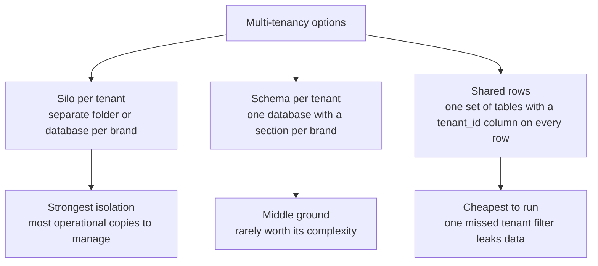

1. **Folder-per-brand (the silo).** Copy your current layout ten times: `brands/24mantra/input_data/`, `brands/tata_sampann/input_data/`, each with its own config and outputs. Strongest isolation — a bug in one brand's run physically cannot touch another's files. Weakest sharing — 10 copies of everything to keep in sync, and "run all ten monthly rebuilds" means 10 separate operations. **This is honestly the right first step for your 10-brand plan**, because it's a two-day change: make `BRAND_NAME`, the input folder, and the output folder things you pass in per run instead of values hardcoded in `v4_config.py`, and loop over the brands.
2. **Schema-per-tenant.** One database (see the pocket list up top; the data-layer chapter covers it in depth), with a separate named section per brand. Middle ground; mostly a relic of specific database ecosystems; skip it.
3. **Row-level tenancy (`tenant_id` on every row).** One `fact_table` for all brands, every row stamped with which brand it belongs to, every query filtered by it. Cheapest to operate at scale and what most modern SaaS does — but one forgotten filter shows Brand A's elasticities to Brand B, which for a *pricing* tool is not embarrassing, it's lawsuit material. Rival brands seeing each other's discount economics is the worst leak your product could have.

**Concrete path for you:** folder-per-brand for brands 2–10 (you keep your files-not-database simplicity), then row-level `tenant_id` in a real database when you move to hosted SaaS — with the tenant filter enforced in *one* shared code path, never re-typed per query. **Beginner mistake:** bolting `tenant_id` on late and hand-auditing hundreds of queries for the missing filter. Decide the isolation model *before* customer #2's data arrives. **Cost:** design time, not money. **When you need it:** brand #2. This is the rare entry where the problem arrives early.

#### Databases — a pointer

The full "files versus database, and when your CSVs stop being enough" discussion lives in the data-layer chapter. The one-line recap: your `v4_outputs/` folders and CSVs *are* your database today — a filing cabinet instead of a librarian — and at one brand, 585 decision cells, and one writer (you), the filing cabinet wins on simplicity. The triggers to revisit: multiple tenants writing concurrently, needing "show me only Brand X's rows" access control, or any question that forces the system to reload hundreds of megabytes to answer a one-row query.

#### Caching — remembering an answer instead of recomputing it

A **cache** is a saved copy of an answer kept somewhere fast, so the next identical question doesn't repeat the slow work. The barista who starts your usual order when you walk in is caching; so is your brain remembering that 7×8=56 instead of re-deriving it.

**Your cache today is "no cache," and it's fine.** When your dashboard needs a table, `ui/app.py` re-reads the CSV from disk with **pandas** — the standard Python library for working with tables in memory; its table object is called a **DataFrame**, essentially a spreadsheet living in RAM. Re-reading a 585-row file takes a few milliseconds. Caching it would save time no human can perceive, at the price of a new failure mode — which brings us to the famous line: *there are only two hard things in computer science: cache invalidation and naming things.* **Cache invalidation** is knowing when your saved copy has gone stale. The instant you cache the fact table, you must answer: what happens after the monthly pipeline writes a new one? If you forget to clear the cache, the dashboard cheerfully serves last month's numbers while looking completely healthy — the most trust-destroying class of bug, because nothing errors. Your current no-cache design *cannot* serve stale data. That property is worth keeping until reads are demonstrably slow.

**Redis**, the name you'll hear constantly, is a small in-memory data store — a shared short-term memory that every part of your app can read and write in under a millisecond. Typical SaaS uses it for caches, sessions, and job queues. **When you actually need caching:** when a page users hit constantly requires an expensive computation and you've *measured* it being slow — e.g., 10 brands × heavy elasticity charts recomputed per page view. Cache the computed result, not the raw file read. **Beginner mistake:** caching before measuring, then debugging stale-data ghosts for a week. **Cost:** managed Redis starts ~$5–15/month; the real cost is invalidation bugs.

#### Queues and workers — the ticket rail and the kitchen staff

First, three words your system already uses. A **process** is one running program with its own memory — every time you double-click something, Windows starts a process. A **subprocess** is a process started by another program: when you click "Build foundation" in your dashboard, `ui/app.py` starts `python pipeline.py` as a subprocess, a manager sending a worker to another room to do a job. A **thread** is a smaller unit *inside* one process — one worker who can juggle several tasks within the same room, sharing the same memory. Your dashboard uses threads so it can keep answering the "how's the job going?" question your browser asks every second during a run, while the subprocess grinds away.

A **queue** is a waiting line for work: jobs go in one end, and **workers** — processes whose only job is to take the next item and do it — pull from the other. The restaurant ticket rail: waiters clip orders on, cooks pull them off, nobody stands idle and nothing gets lost.

**Your system today has a one-slot queue: the job lock.** In `ui/app.py`, the `Job` class holds a `threading.Lock` and the server runs one job at a time — if a job is running, a second "run" click is refused. That's a queue of length zero with one worker (your machine), and for one operator it's the right design: your pipeline steps *should* run one at a time in order, and the refusal message is honest feedback. The job's live log sits in a `deque` (a "double-ended queue" — a list optimized for adding at one end and dropping off the other, capped at 6,000 lines so memory can't grow forever). Small detail, same family of idea.

**What breaks at 10 brands:** it's the 1st of the month and all ten monthly rebuilds are due. With the one-job lock, brand #10 waits ten pipeline-lengths. Worse, if the machine reboots mid-run, queued intentions vanish — they lived only in memory. The grown-up fix is a real queue (Redis-backed, with **Celery** or **RQ** as the standard Python worker frameworks): the dashboard *enqueues* "rebuild Tata Sampann" and returns instantly; two or three worker processes — possibly on separate machines — pull jobs and run them; the queue survives restarts and retries failures. Your `STEPS` allowlist maps beautifully onto this: each step becomes a job type. **Beginner mistake:** reaching for Celery for a single-user tool — it adds a Redis server, worker processes, and a whole new category of debugging ("why is the worker not picking up jobs?") to solve a contention problem you don't have. **Cost:** the frameworks are free; the operational complexity is the price. **When you actually need it:** the first month two brands' rebuilds genuinely collide and waiting is unacceptable — realistically around brands 3–5 if rebuilds stay monthly and staggered, sooner if customers trigger their own runs.

#### Webhooks — the doorbell instead of the door-check

Today you get data by **polling** in the most manual sense: once a month, someone exports CSVs from Blinkit and drops them in `input_data/`. Polling means repeatedly asking "anything new? anything new?" A **webhook** flips the direction: the *other* system calls *you* when something happens. You stop walking to the door every five minutes and instead install a doorbell — Blinkit (hypothetically) sends an HTTP request to an endpoint you expose, `POST /webhooks/blinkit-data`, the moment fresh sales data is ready, and your system reacts by enqueueing a pipeline run.

**Nothing handles this today because nothing can:** Blinkit gives your team file exports, not webhooks, and your server isn't reachable from the internet anyway (localhost, remember). Both would have to change. When you're a real SaaS, webhooks appear on both sides: platforms pushing data *to* you, and you pushing events *to* customers ("your weekly plan is ready" pinging their Slack). **Beginner mistake:** trusting webhook payloads blindly — anyone who discovers your webhook URL can send fake data to it, so real webhook receivers verify a cryptographic signature proving the sender is who they claim. **Cost:** free to receive; the work is building the always-on public endpoint. **When you actually need it:** when a data provider actually offers one, and when monthly-manual becomes the bottleneck. Until then, a well-named folder and a calendar reminder beat infrastructure.

#### File and object storage — S3, the infinite warehouse

Your outputs live in `v4_outputs/<timestamp>/` on one laptop's disk. That disk has a size, lives in one place, and dies with the machine. **Object storage** — Amazon **S3** is the household name; every cloud has a clone (Google Cloud Storage, Cloudflare R2) — is a rented warehouse of effectively infinite shelves: you hand it a file plus a label ("brands/24mantra/2026-07/fact_table.csv"), it stores the file redundantly across multiple physical buildings and hands it back on request from anywhere. No folders in the true sense, no disk to fill, eleven-nines durability (they advertise odds of losing a file so small they're printed with nine 9s).

For your SaaS this is where every brand's uploads and run outputs will live — because your rented server (unlike your laptop) is typically treated as disposable, and files must outlive it. Your timestamped-run-folder convention translates one-for-one into S3 labels, which is convenient. **Beginner mistake:** the accidentally-public bucket — one wrong permission setting and every brand's pricing data is on the open internet; this exact mistake makes the news several times a year. Default everything private. **Cost:** genuinely cheap — about $0.023/GB/month; your entire history for 10 brands would round to a few dollars. **When you actually need it:** the day the system runs on a rented machine instead of your laptop. Before that, your git remotes (below) already do the survival job.

#### Docker — the shipping container for software

Before shipping containers, loading a cargo ship meant hand-stacking barrels, crates, and sacks, and every port did it differently. The container standardized the *box*, so nobody handling it needs to know what's inside. **Docker** does this for software: you write down everything your program needs — exact Python version, exact library versions, files, settings — in a recipe file (a `Dockerfile`), and Docker builds an **image**: a sealed, frozen box containing your app *and its entire environment*. Any machine that can run Docker runs your box identically. A running box is called a **container**.

**You have already lived the exact problem Docker solves.** Your environment notes record that numpy is pinned to 1.26.4 because installing PyMC once broke it. That afternoon of "it worked yesterday, what changed?" is the disease; Docker is the vaccine. Inside an image, numpy is 1.26.4 *forever* — no future `pip install` on the host, no Windows update, no well-meaning cleanup can touch it. "Works on my machine" stops being a prayer and becomes a property. Today that pin lives as a one-line install command in `EXECUTION_PLAYBOOK.md` (`pip install "numpy==1.26.4" "scikit-learn==1.4.0" statsmodels scipy pandas openpyxl`) — you don't even have a `requirements.txt`, the standard plain-text file listing exact library versions that Python's installer can replay in one command. That documented pin plus one machine is a poor man's container — adequate precisely because there *is* only one machine. The moment there are two (your laptop plus a rented server, or your laptop plus a developer you hire), keeping them identical by hand becomes a part-time job, and Docker becomes cheaper than the alternative.

**Beginner mistake:** treating Docker as magic deployment rather than what it is — an environment freezer. It doesn't make code correct, fast, or secure; it makes environments *reproducible*. Second mistake: baking secrets (defined two entries down) into images. **Cost:** free, open source; the learning curve is a weekend with AI assistance. **When you actually need it:** the day your code must run on any second machine. It's also the rare entry where doing it slightly early is defensible — writing the Dockerfile while the system is small is much easier than reverse-engineering three years of an environment's history later.

#### Kubernetes — a manager for many containers (you will not need it for years)

If Docker gives you shipping containers, **Kubernetes** (K8s) is the automated port: it decides which of your many machines runs which containers, restarts crashed ones, adds copies under load, and rolls out new versions gradually. It is genuinely brilliant — for companies running *hundreds* of containers across *dozens* of machines with a team to babysit the port itself.

**Honest guidance: you will not need Kubernetes before roughly 100 brands, and possibly never.** A 10-brand SaaS is comfortably a couple of containers on one rented server, or on a platform (Render, Railway, Fly.io, AWS App Runner) that handles the restart-and-scale babysitting *for* you for $20–100/month. Kubernetes is the most notorious case of the disease this whole chapter warns against: adopting the tool because big companies use it, then spending your product-building months feeding the tool. If a future advisor or hire proposes K8s before you have a scaling problem you can name and measure, that is a signal about the advisor. **When you'd actually need it:** many machines, many services, and a dedicated infrastructure person on payroll — three things that arrive together, late, if ever.

#### CDN — copies of your files, geographically close to users

A **CDN** (content delivery network) keeps copies of your static files — your dashboard's HTML, JavaScript, images — on hundreds of servers around the world, so a user in Delhi downloads from Delhi, not from your server in Mumbai or Virginia. It's a chain of local warehouses instead of one central one; physics (distance = delay) is the problem it solves.

Today this concept is beautifully irrelevant to you: `ui/index.html` travels from `127.0.0.1` to your own browser — the warehouse is inside the store. Even as a SaaS, your users are B2B managers in Indian metros looking at dashboards, not millions of consumers streaming video; a CDN is a cheap checkbox (Cloudflare's free tier, or built into most hosting platforms) rather than a project. **Beginner mistake:** confusing a CDN (delivers static files fast) with hosting (runs your actual application) — a CDN cannot run your pipeline. **When you need it:** effectively free to turn on when you deploy publicly, so just tick the box then; it also absorbs certain attack traffic as a bonus. Zero engineering thought required before or after.

#### Environment variables and secrets — configuration that lives outside the code

An **environment variable** is a named value the operating system hands a program when it starts — a sticky note on the worker's desk rather than an instruction printed in the training manual. Change the note, restart the program, new behavior; the code itself never changes. Your system already uses a handful, and correctly: `ui/app.py` reads `UI_PORT` from the environment (`os.environ.get("UI_PORT", "8765")`) so the dashboard's port can change without editing code, and a couple of scripts use others (`ELASTICITY_SEQ_PRIORS` toggles the sequential-priors mode in `scripts/pricing/elasticity_bayes.py`; `scripts/validation/elasticity_gates.py` checks `PYTHONHASHSEED` for reproducible runs).

A **secret** is any value that grants access — passwords, API keys (a password one program uses to call another program's API), signing tokens. The iron rule: **secrets never go in code, and never, ever into git.** A **repo** (repository) is a project folder whose entire history git preserves — which is precisely the danger: a key committed once lives in the history *forever*, even after you delete it from the current files, and you push that history to GitHub. Automated bots scan public GitHub commits for leaked keys within *minutes* and rack up real bills on stolen cloud accounts. **Your audit today: you have no secrets, and that is a clean bill of health.** No database password, no cloud keys, no payment tokens — nothing to leak. Enjoy it; it ends the day you sign up for your first cloud service. From that day: secrets live in environment variables (loaded from a `.env` file that is *listed in `.gitignore`*, git's do-not-track list) locally, and in your hosting platform's secret manager in production. **Beginner mistake:** `.env` accidentally committed — make the `.gitignore` entry *before* creating the file. **Cost:** free; discipline only. **When you need the discipline:** your first API key, which is probably weeks after you start building the SaaS, so internalize it now.

#### CI/CD — a robot that checks your work on every change

**CI** — continuous integration — means: every time code changes, an automated system runs your checks (tests, at minimum "does it even start?") before the change is trusted. **CD** — continuous delivery/deployment — extends it: changes that pass checks get shipped to the live product automatically. The word **pipeline** here means the same thing it means in your `pipeline.py`: a fixed sequence of stages where each stage's output feeds the next — except this pipeline's product is *confidence in a code change* rather than a fact table.

**Today, your CI is you** — you (or your AI assistant) change code, run a step, eyeball the output. With one committer that's survivable; the risk is the change that breaks step 12 while you were editing step 3, discovered a month later mid-rebuild. **Your realistic first CI is one small file.** GitHub offers **GitHub Actions**: free robots that run commands on GitHub's machines whenever you push. A ~20-line workflow file that installs your pinned libraries (the first chore: copy the playbook's one-line pip install into a `requirements.txt` so the robot can replay it) and runs your existing self-checks — `scripts/tracker/verify_loop.py` already prints `LOOP CLOSED: YES`, and `scripts/analysis/validate_plan.py` already prints `C1-C8: ALL PASS` — would mean every push gets automatically smoke-tested. (One honest caveat: your raw `input_data/` is deliberately never committed, so the robot can't run the full pipeline — it checks that the code starts, imports, and passes its logic self-tests, which is exactly what catches the break-step-12-while-editing-step-3 class of bug.) Broken change? Email within minutes, not a surprise at month-end.

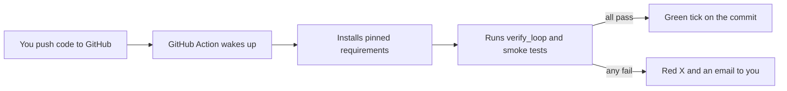

**Beginner mistake:** building an elaborate CD pipeline (auto-deploy!) before having tests worth trusting — automation that ships bugs faster is negative progress. CI first, CD when there's a production to deploy to. **Cost:** free at your volume (GitHub's free tier is thousands of minutes/month). **When you actually need it:** honestly, now-ish — this is one of two entries in this chapter (with backups, which you already have) worth adopting *before* the SaaS, because it protects the single-machine system you already depend on.

#### Monitoring, logging, and alerting — the three dashboards of a running product

Three related but distinct nervous systems, best kept apart in your head:

- **Logging** is the diary: the running program writes down what it did ("started pipeline", "read 585 rows", "wrote plan/"). Your subprocesses print exactly this, and `ui/app.py` captures it into the in-memory deque you watch during a run. The gap: your logs *evaporate* — the deque is capped and cleared, so "what happened during last Tuesday's run?" is unanswerable unless you were watching. Production systems write logs to files or a log service precisely so the past stays queryable.
- **Monitoring** is the pulse: continuous measurements of health. Three altitudes matter — *uptime* (is it even responding? — meaningless today, since if your laptop is off, so are you), *errors* (what fraction of requests fail?), and *business metrics* (is the system achieving its purpose?). Here's the part you've already built without the vocabulary: **your validation receipts panel, the C1–C8 gates, the weekly scorecard, and the kill-switch ARE business-metric monitoring** — arguably the hardest of the three altitudes, and the one most startups build last. You're missing only the boring bottom layers, which are cheap.
- **Alerting** is the smoke detector: monitoring that *interrupts a human* when a threshold trips. Your kill-switch is alerting fused with automatic response — it doesn't just notice a bad cut, it reverts it. What you lack is the mundane kind: nothing pings your phone if a monthly rebuild silently fails while you're away.

**For the SaaS:** uptime monitoring is trivially cheap (UptimeRobot, free — a robot that visits your site every minute and emails you when it can't); error rates come with error tracking (next entry); and your receipts culture ports straight into per-tenant health pages that will genuinely impress buyers. **Beginner mistake:** alert fatigue — wiring alerts to everything, drowning in pings, then ignoring all of them including the real one. Alert only on what demands action. **Cost:** free to ~$50/month for years. **When you need it:** uptime checks the day you have a public URL; the rest incrementally as customers depend on you overnight.

#### Error tracking — Sentry, the crash reporter

Closely related but worth its own entry. When your code throws an unexpected error today, the message lands in the job log and you read it because you clicked the button and you're watching. When *someone else's* click errors at 11pm, nobody is watching. An **error-tracking service** — **Sentry** is the default name — is a small library you add to your app that catches every unhandled crash and sends it to a dashboard: the exact error, the exact line of code, which user, which tenant, how many times this week, grouped so 400 occurrences of one bug show as one issue, not 400 emails. It's the difference between a customer telling you "it's broken" and you telling the customer "we saw it, fixed it, you're good."

**Today nothing handles this because the only user is the developer** — the tightest error-tracking loop that exists. **Beginner mistake:** shipping to real users with no error tracking and mistaking silence for stability; users rarely report bugs, they just quietly churn. **Cost:** free tier covers you for a long time; ~$26/month when you outgrow it. **When you need it:** the literal first day a non-you human uses the product. It's a one-hour integration; there is no excuse to skip it.

#### Backups and disaster recovery — RPO, RTO, and what your git remotes already buy you

Two acronyms, both plain-worded here because they're your vocabulary for the "what if the laptop dies?" conversation:

- **RPO** — recovery point objective — *how much recent work are you willing to lose?* If you back up nightly, your RPO is one day: a lunchtime disaster loses the morning.
- **RTO** — recovery time objective — *how long until you're running again?* If rebuilding your setup on a new machine takes three days, your RTO is three days, and your weekly KAM handoff misses a cycle.

**Your current disaster recovery is real and you should say so plainly: git plus two GitHub remotes.** Everything committed and pushed — code, config, curated `DISCOUNT_PLAN/` deliverables — exists in three places (laptop plus two independent copies on GitHub's infrastructure). Your RPO is *one push*: you lose only what you haven't pushed since. That's a genuinely respectable posture for a single-operator system, and it cost you nothing. The honest gaps: (1) whatever isn't in git — and your `.gitignore` explicitly excludes `input_data/` ("Proprietary input data — never commit") and all of `v4_outputs/`, so your raw data and full run histories have a git-RPO of *infinity*: if the laptop dies, they die, unless Blinkit can re-export them or you keep a separate copy (an external drive or private cloud folder closes this today); (2) your RTO is untested — the real measure is "hours to a working system on a borrowed laptop," and the numpy-pin story suggests environment rebuilding is the risky step (Docker, above, is what turns that from an afternoon of archaeology into one command); (3) git is not a backup for *large data* — when brands' raw data grows, object storage with automatic versioning takes over that job.

**Beginner mistake:** confusing sync with backup — a folder that mirrors your disk (OneDrive-style) faithfully mirrors your *deletions and ransomware* too; a backup keeps history you can rewind to. Git keeps history; that's why it counts. **Cost:** free today; ~$5–20/month for versioned cloud backup later. **When you upgrade:** the day customer data lives on your infrastructure, backups stop being self-protection and become a contractual promise — expect "what is your RPO?" verbatim in enterprise security questionnaires.

#### Payments — Stripe, Razorpay, and the one rule

When brands pay for your SaaS, you will not build payment handling — you'll rent it. **Stripe** (global) and **Razorpay** (India-first, likely your fit for Indian CPG brands, with UPI and local cards) are payment processors: they present the card form, move the money, manage recurring subscriptions, generate invoices, and handle failed-payment retries. Your code's involvement is roughly "create a subscription for tenant X at plan Y" via their API, plus receiving their webhook (see above — this is where you'll meet webhooks in practice) that says "payment succeeded, keep them active."

**The one rule: never store card numbers. Ever.** Card data is guarded by a compliance regime (PCI-DSS) whose full weight would crush a small company; the entire design of modern processors exists so the card number goes from the customer's browser *directly to the processor*, never touching your server. You store only an opaque customer token. This isn't a corner you're tempted to cut for convenience — it's a corner that must never exist. (This rule rhymes with the personal safety rule you may have noticed AI assistants follow: credentials and card numbers are radioactive; only the specialized handler touches them.) **Beginner mistake:** hand-rolling subscription logic — proration (fair partial-month charges when someone upgrades mid-cycle), dunning (the polite automated chase of failed payments), GST invoices — that the processor already does better. **Cost:** no monthly fee; ~2% + a small fixed fee per transaction. On a hypothetical ₹50k/month/brand price, the processing fee is a rounding error. **When you need it:** first paying customer, not before — pilots can pay by bank-transfer invoice while you validate the product.

#### Product analytics — knowing what users actually do

Last, the lightest gloss. **Analytics events** are tiny records your app emits when users act: `viewed_scenario_menu`, `downloaded_kam_handoff`, `clicked_run_pipeline`. Aggregated (Mixpanel, PostHog, Amplitude — free tiers galore), they answer the questions that decide your roadmap: which of your 17 dashboard steps do customers actually use? Do they look at the sensitivity shake or only the headline savings? Where do trial brands stall before converting?

Today nothing handles this and nothing should — you *are* the user, and your usage data is your memory. Don't confuse this with the business-metric monitoring you already excel at: the scorecard measures whether *pricing decisions* work; analytics measures whether *the product* works for its users. You'll want the second only when users' behavior is no longer observable by simply asking them — realistically after your first handful of external brands, when "just call them" stops scaling. **Beginner mistake:** instrumenting fifty events, dashboarding none, deciding by gut anyway. Start with five events tied to questions you'd actually act on. **Cost:** free for years at your volume.

#### The moral of the toolbox

Read back through the "when you actually need it" lines and a pattern emerges, worth making explicit because it's the chapter's real lesson:

| Concept | Do you have the problem today? | When it arrives |
|---|---|---|
| Auth | No — localhost is the lock | First non-you user |
| Multi-tenancy | No — but design NOW | Brand #2 |
| Caching | No — 585 rows read in ms | Measured slowness, much later |
| Queues/workers | No — one-job lock is right | Rebuilds colliding, ~brands 3–5 |
| Webhooks | No — Blinkit doesn't offer them | Provider-dependent |
| Object storage | No — git covers survival | First rented server |
| Docker | Half — numpy pin is the symptom | Second machine; okay to do early |
| Kubernetes | No | ~100 brands, possibly never |
| CDN | No | Free checkbox at public launch |
| Secrets discipline | No secrets yet — clean | First API key |
| CI | **Yes, mildly** | Now — one small file |
| Uptime monitoring | No — no public URL | Public launch day |
| Error tracking | No — you see every error | First external user, day one |
| Backups | **Mostly solved** — code and plans via git remotes; raw data and run outputs are gitignored and unprotected | Copy raw data somewhere second now; upgrade when holding customer data |
| Payments | No | First paying customer |
| Analytics | No — you are the user | After first few external brands |

Three things are worth doing this quarter (CI; a second copy of the gitignored raw data; test your restore once). One is worth *designing* now but building at brand #2 (multi-tenancy). One is worth doing early because it's cheap while small (Docker). Everything else has a trigger, and the trigger is a problem you'll be able to name and measure when it arrives. Engineers call premature adoption "resume-driven development"; the business translation is simpler — every tool above is an employee you're hiring, and you don't hire before there's a job.


---

## 8. Architecture at Four Scales — from your laptop to a real SaaS

Most architecture advice fails business owners in one specific way: it describes the architecture of a company with a million users and implies you should build that now. You should not. Architecture is not one correct answer — it is a *ladder*, and the right rung depends on how many brands, operators, and jobs you are running today. This section walks the ladder at four scales, each mapped to a real stage of **your** journey: today (1 brand, you), next year (~10 brands, 2–3 operators), the sellable product (100–1,000 brand clients), and the mass-scale world you will read about in engineering blogs but probably never need.

For each tier you will get: a sketch of the architecture, what changes versus the previous tier, what deliberately does **not** change, who has to run it, roughly what it costs per month, and — most importantly — the *trigger* that tells you it is time to climb. The trigger discipline is the whole game. Companies die from climbing too early (burning cash and time on infrastructure nobody needs) far more often than from climbing too late.

A few terms before we start, because they recur in every tier. A **server** is just a computer whose job is to wait for requests and answer them — like a shop clerk who stands at the counter all day. Your laptop becomes a server the moment you run your dashboard. A **process** is one running program on a computer; when you double-click `launch_ui.bat`, Windows starts a Python process. A **database** is a program whose only job is to store data safely and answer questions about it quickly — a librarian with a card catalogue, instead of a pile of papers on a desk. You famously do not have one, and at Tier 1 that is correct; we will see exactly when that changes. A **repository** (or **repo**) is a project folder tracked by git, the version-control tool — think of it as a folder with a complete photographic memory of every change ever made to it. Your whole system lives in one repo.

#### Tier 1 — Today: one brand, one operator, one laptop

##### Level 1 — like you're new

Your system today is a well-organized home office. All the paperwork (data files) lives in labeled filing cabinets (folders). One person — you — opens the office, runs the month's analysis by pressing buttons on a control panel, prints the recommendation sheet, and hands it to the KAM. There is no staff, no branch offices, no vault. The "security system" is that the office is inside your house: nobody else can walk in, so you do not need locks on the individual cabinets.

##### Level 2 — how it actually works in this repo

Every part of your architecture is a file or a Python process on one Windows machine:

- **Storage** is the file system itself. Raw monthly Blinkit exports sit in `input_data/` as **CSV** files — CSV means *comma-separated values*, the simplest possible data file: a plain-text table where each line is a row and commas separate the columns, like a spreadsheet with all the formatting stripped away. The pipeline writes each run to a timestamped folder under `v4_outputs/` (containing the **fact table** — one master CSV, `fact_table.csv`, where every row is one product-city-day with all its facts attached: units, price, discount, availability; it is the single sheet of truth every downstream model reads). Curated deliverables land in `DISCOUNT_PLAN/`. There is no database — files *are* the store.
- **Configuration** is one Python file, `v4_config.py` — brand name, budget cap (`DEFAULT_BUDGET_PCT_CAP = 0.12`), hero SKUs, festival calendars, every model knob. One file, readable by a human, versioned by git.
- **Compute** is a set of Python scripts under `scripts/` (analysis, pricing, promo, validation, tracker) run one at a time. One of them, the promo calendar, uses **MILP** — *mixed-integer linear programming*, a mathematical technique for choosing the best combination from many yes/no options under rules, like a wedding seating planner that must satisfy "these two can't sit together" and "table max 8" while maximizing happiness.
- **The control panel** is `ui/app.py` plus `ui/index.html`. Here the vocabulary earns its keep. `app.py` is the **backend** — the part of an application that does the work behind the scenes, like a restaurant kitchen. `index.html` is the **frontend** — the part the user sees and touches, like the dining room and menu. The backend is an **HTTP server**: **HTTP** is the standard language computers use to ask each other for web pages and data — a fixed etiquette for "please give me X" / "here is X", the way postal mail has a fixed format of address, stamp, and envelope. It listens on **port** 8765 — a port is a numbered door on a computer; one machine can run many servers, so each gets its own door number — and only on **localhost** (address 127.0.0.1), which is a computer's name for *itself*. Traffic to localhost never leaves your machine, so your dashboard is physically unreachable from the internet. That, not a password, is your security model, and at this tier it is a strong one.
- The frontend talks to the backend through an **API** — an *application programming interface*, a fixed menu of requests one program agrees to answer for another, exactly like a restaurant menu: you can order anything on it and nothing off it. Each item on the menu is an **endpoint** — one specific **URL** (a web address, the line you type into the browser bar) that does one specific thing: `/api/status` reports system state, `/api/table/cuts` returns the cut list, and `POST /api/run/<step>` starts a job (**POST** is the HTTP verb for "change something," as opposed to GET, which only reads). Answers come back as **JSON** — *JavaScript Object Notation*, a text format for structured data that both humans and programs can read, like a very disciplined bullet-point list with labels: `{"status": "running", "elapsed": 42}`.
- When you press a button, `app.py` checks the step against a fixed **allowlist** (`STEPS` in the code — only these thirteen-plus-four named steps can ever run; the server refuses anything else, so even a malicious request cannot make it run arbitrary commands), then launches the script as a **subprocess** — a child program started and supervised by a parent program, like a manager sending an employee on an errand and reading their report line by line. It does this on a background **thread** — a thread is one worker inside a single process; one process can have several threads doing different things at once, like one kitchen with several cooks — so the dashboard stays responsive while a 20-minute rebuild grinds. One job at a time, enforced by a **lock** (`JOB.lock` in `app.py`) — a lock is the software version of a one-key washroom: whoever holds the key proceeds, everyone else waits at the door. Try to start a second job and the server politely refuses with "A job is already running." The job's log lives in memory in a bounded list capped at 6,000 lines (old lines fall off the front so a chatty script cannot fill your RAM).
- Many of the data readers use **pandas** — the standard Python library for working with tables of data; its core object is the DataFrame, essentially a spreadsheet living inside a program that you manipulate with code instead of a mouse.
- **Operations** is `EXECUTION_PLAYBOOK.md` — a **Markdown** file, which is plain text with light punctuation marks (`#` for headings, `**` for bold) that renders as a formatted document; it is how programmers write documents without a word processor. The playbook defines the three cadences: monthly rebuild (~15–25 min), weekly loop (~5 min), quarterly governance (~30 min).
- **Disaster recovery** is git plus two GitHub remotes — every **commit** (one saved snapshot of the whole project) is pushed to two independent copies in the cloud (in this repo: `origin` and `claude-version`, both on GitHub).

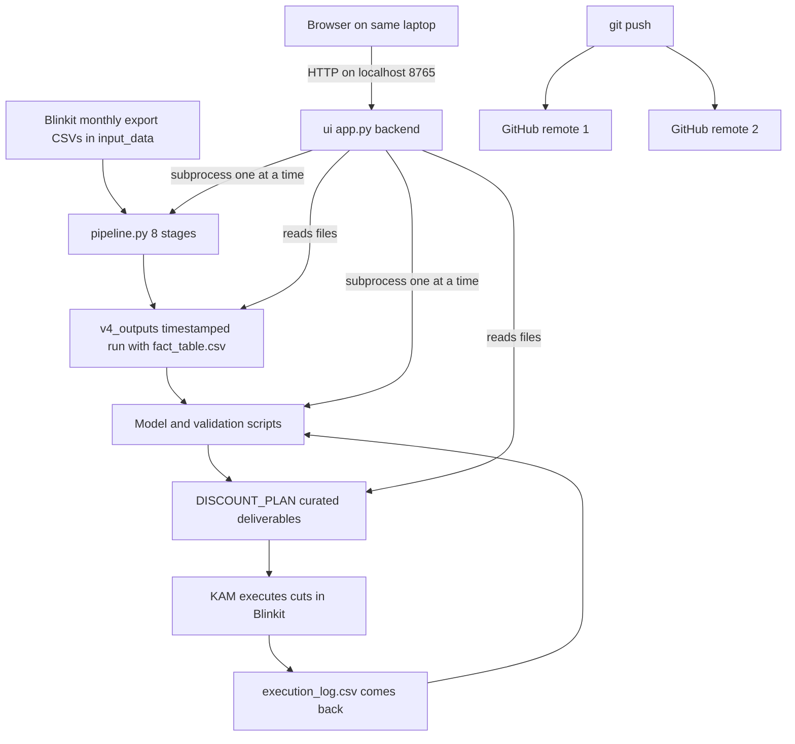

##### Level 3 — how a senior engineer sees it

The pattern names: a **monolith** (everything in one deployable unit — to **deploy** means to put a program onto the machine where it will actually run, so "one deployable unit" means you ship the whole thing together, as one piece), **file-based storage**, a **job-runner UI** over a **batch pipeline**. A senior engineer's honest verdict: *this is the correct architecture for this scale*, and here is the reasoning, because the reasoning is the transferable skill.

**Why files-not-a-database is right here.** A database buys you three things: many simultaneous writers without corruption, fast lookups in huge data, and transactional safety (either the whole change happens or none of it). You have exactly one writer (the pipeline, run by one person, one job at a time — the lock in `app.py` guarantees it), your data fits comfortably in memory, and your "transactions" are whole-file writes into a fresh timestamped folder — which is itself a poor man's transaction: a run either completes and becomes `_latest_run()` or it does not. Meanwhile files give you something a database never will: total inspectability. You can open `fact_table.csv` in Excel, email `cut_list.csv` to the KAM, diff two runs in git. For a solo operator debugging a model, that transparency is worth more than any database feature.

**Why no login screen is right here.** Authentication code is **attack surface** (every extra feature is one more door a burglar could try; the fewer doors, the safer the house) and maintenance burden. Listening only on 127.0.0.1 means the only person who can reach the dashboard is someone already sitting at your logged-in Windows machine — at which point a web password protects nothing. Adding auth today would be security theater.

**What actually keeps them up at night at this tier — the real risks:**

1. **The laptop is a single point of failure for *availability*, not for *data*.** If it dies, the git remotes mean you lose at most the uncommitted work since your last push. Recovery is: buy/borrow a machine, install Python 3.12, run the one pinned **pip** line from the playbook — pip is Python's installer for add-on libraries, the command-line equivalent of an app store (`pip install "numpy==1.26.4" ...`; numpy is pinned to exactly 1.26.4 because a newer numpy once binary-broke the compiled statistics libraries, and the playbook warns that installing PyMC force-upgrades numpy — this pin is load-bearing), then `git clone`, done in an afternoon. Discipline required: commit and push after every monthly rebuild, and note that `input_data/` and `v4_outputs/` must be in the remotes or backed up separately — check what your `.gitignore` excludes (the list file that tells git which files *not* to track), because "the code is safe on GitHub" is not the same as "the data is."
2. **You are the single point of failure for *operations*.** Nobody else can run this. The mitigation already exists and it is the playbook: `EXECUTION_PLAYBOOK.md` plus the dashboard's labeled, ordered buttons mean a competent stand-in could run the monthly rebuild without understanding the models. Test that claim once: have someone else run the weekly loop while you watch silently.
3. **Environment fragility.** The numpy pin is a tripwire; any casual `pip install` (especially PyMC) can break the stack. A senior engineer would freeze the exact environment (`pip freeze > requirements-lock.txt`, committed) so recovery is one command.

**Cost and burden.** Monthly cost: ₹0 in infrastructure (GitHub free tier, your existing laptop, free software). Ops burden: ~1–2 hours/month of your time following the playbook. Team: 1 (you).

**The trigger to move to Tier 2** is not technical — it is business: the moment a second brand's data lands in `input_data/`, or a second person needs to press the buttons, Tier 1's assumptions (one brand's config in `v4_config.py`, one operator at the physical machine) break. Do not move before that.

#### Tier 2 — Ten brands, two or three operators: still remarkably boring

##### Level 1 — like you're new

Your home office becomes a small shared office. Same filing cabinets, but now one *drawer per client*, clearly labeled, so nobody mixes up 24 Mantra's papers with Client B's. The office moves out of your house into a small rented room so any of the three staff can walk in — which means the door now needs a key. A cleaner comes every night and photocopies everything into an off-site box (backup). And instead of you remembering to run the monthly analysis, a wall calendar with an alarm does the remembering.

##### Level 2 — what actually changes

This is your stated next step, and the most important thing to hear about it: **it is not a rebuild.** It is five small, boring additions to exactly what you have. Every model script, the pipeline, the tracker, the validation stack — unchanged.

1. **Folder-per-brand, config-per-brand.** Restructure to `brands/24mantra/input_data/`, `brands/24mantra/v4_outputs/`, `brands/clientB/...`, each with its own copy of the config. Your `v4_config.py` was *built* for this — the comments literally say "onboarding a new client is usually a one-line change (set `BRAND_NAME`)", `CATEGORY_MODE` exists so a new client's messier catalogue still categorizes, and `STRICT_OWN_BRAND_MATCH` fails loud if a client's brand string is ambiguous. The code change is passing a `--brand` argument (or a `BRAND_DIR` **environment variable** — a named value the operating system hands to a program when it starts, like a sticky note on the employee's desk saying "today you're working on Client B"; `app.py` already reads its port this way via `UI_PORT`) so every path in `v4_config.py` resolves inside that brand's folder. The dashboard grows a brand-picker dropdown. That is the entire multi-brand architecture at this tier.

2. **One machine everyone can reach.** Either a beefier PC in your office that stays on, or — better — a small cloud **VM**: a *virtual machine*, a rented slice of a real computer in a data center that behaves exactly like your own PC; you connect to it over the internet and it runs 24/7 without depending on your laptop lid being open. A 2-CPU, 8 GB VM from DigitalOcean, Hetzner, or AWS Lightsail runs $12–24/month. Your stack is plain Python and files, so it moves with a `git clone` and one pip install.

3. **SQLite for the tracker's live state.** Here is your first, gentle step toward a database, and the reasoning teaches the general rule. Most of your files are *write-once* — a run folder is written by one job and only read afterward; files are perfect for that, keep them. But `DISCOUNT_PLAN/tracker_history.csv` and `execution_log.csv` are *read-modify-write* — the weekly loop appends this week's predictions and backfills last week's actuals into earlier rows, and the self-test (`verify_loop.py`, plus the dashboard's own reset action) deletes and rebuilds the whole file. With three operators and ten brands, two people will eventually run steps that touch the same file in the same minute, and CSV read-modify-write has no protection: the second write silently erases the first. **SQLite** is the answer sized to the problem: a full database engine that lives in a single file inside your project — no server to install or administer, but real transactional safety (two simultaneous writers cannot corrupt it; one politely waits). It is the world's most deployed database — it is inside your phone. The migration is small because pandas reads and writes SQLite almost as easily as CSV. *Rule you just learned: move a data store only when its access pattern (concurrent writers) outgrows the current one — not before, and only that store.*

4. **Scheduled runs.** Ten brands × the monthly rebuild is now 10 runs of 15–25 minutes each; a human clicking thirteen buttons per brand is error-prone drudgery. Windows **Task Scheduler** (or **cron** on Linux — both are the operating system's built-in alarm clock: "run this command every Monday at 06:00") triggers a small wrapper script that loops over the brand folders and runs the monthly sequence, writing each brand's log to a file. The dashboard's job then shifts from *running* things to *reviewing* things — which is where your judgment belongs anyway. The one-job-at-a-time lock in `app.py` needs to become one-job-per-brand.

5. **A lock on the door and a nightly photocopy.** The moment the dashboard is reachable from beyond localhost, "no auth" stops being correct — this is the exact boundary we promised to name in Tier 1. You do not need corporate-grade login yet: a single shared password checked by the server, sent over **HTTPS** (HTTP wrapped in encryption so nobody on the network can read it — the sealed envelope instead of the postcard; the **certificate** that makes it work is the digital ID card your server shows browsers to prove it is really you, issued free via Caddy or Let's Encrypt), plus the cloud provider's **firewall** — a gate that only lets through network traffic from addresses you approve — allowing only your three operators' locations. And a nightly **backup**: a scheduled job copies each brand's data folders off the machine (to cheap cloud file storage — "object storage," defined properly in Tier 3 — or even a second git remote). Git protects code history; backups protect the *data* the code chews on. Test a restore once a quarter — an untested backup is a hope, not a backup.

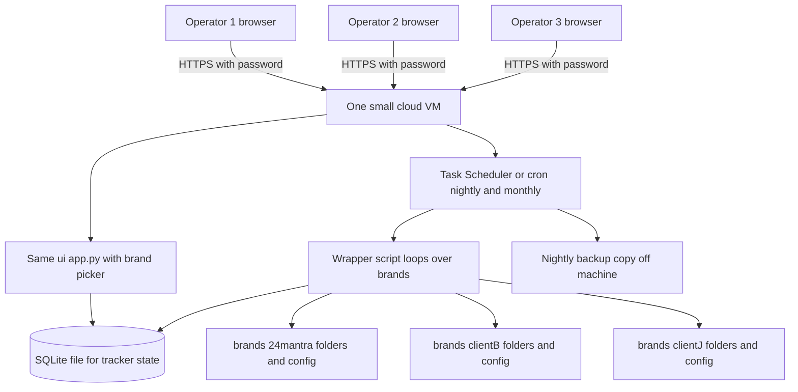

##### Level 3 — how a senior engineer sees it

Pattern names: still a monolith, now **multi-instance by convention** (folder-per-tenant), with a **scheduler** and a **shared-nothing data layout** — each brand's data touches nothing of any other brand's, which is the simplest possible isolation and a genuinely strong one: a bug processing Client B's file cannot corrupt 24 Mantra's plan, because the code never has both open.

What they would worry about: *config drift* (ten copies of `v4_config.py` slowly diverging — mitigate with a shared base config plus a small per-brand override file); *the VM is still a single point of failure for availability* (acceptable — your users are three insiders and your cadence is weekly; a day of downtime costs almost nothing, which is precisely why this tier is so cheap); and *secrets hygiene* (the dashboard password and any data-source credentials belong in environment variables, never committed to the repo).

**What to resist at this tier — and why, not just that.** You will hear that you need **Kubernetes** (a system for orchestrating fleets of *containers* — sealed software shipping boxes, properly explained in Tier 3 — across many machines: an air-traffic-control tower for hundreds of programs) and **microservices** (splitting one application into many small independently-deployed services that talk over the network). Both solve coordination problems that *emerge from scale you do not have*: Kubernetes earns its complexity when you have dozens of services on dozens of machines with independent teams deploying daily; microservices earn theirs when separate teams need to ship without stepping on each other. You have three operators, one codebase, and ~10 scheduled jobs a month. Adopting them now means paying a permanent complexity tax (every debugging session now spans machines and networks) for a benefit that arrives, if ever, at Tier 3+. The single most senior sentence in this handbook: *boring is a feature.*

**Cost and burden.** VM $12–24/mo, backups and misc $5–15/mo: call it **$20–50/month (₹1,700–4,200)**. Ops burden: a few hours a month across three people — mostly reviewing scheduled-run logs and onboarding new brand data. Team: you plus 1–2 operators; no engineers needed, though a freelance developer for the multi-brand refactor (a 1–2 week job) is money well spent.

**The trigger to move to Tier 3:** any one of — a customer wants to log in and see *their own* dashboard themselves (self-serve); brand count pushes past ~20 and the monthly rebuild window (20 brands × 25 min = 8+ hours serial) collides with itself; or you take payment from someone who therefore expects uptime, support, and a contract. All three say the same thing: you are no longer running a tool, you are selling a product.

#### Tier 3 — 100 to 1,000 brand-tenants: the sellable SaaS

##### Level 1 — like you're new

The shared office becomes a real company headquarters with a reception desk. Clients no longer hand you paper — they walk in, show ID at the desk (login), and see only their own floor. Paperwork moves from filing cabinets to a professional records room with a librarian (a real database) because hundreds of clients' clerks now file simultaneously. The monthly analysis is done by a *pool* of clerks working from a shared to-do tray (a queue): jobs go in, whichever clerk is free takes the next one. And the whole building is now built from standardized shipping containers, so you can erect an identical copy anywhere in a day.

##### Level 2 — what actually changes

This is the real rebuild — the only one on the ladder. **SaaS** (*software as a service*): customers use your software over the internet, on your machines, for a subscription, instead of you running it for them. A **tenant** is one customer's walled-off world inside your shared system — one apartment in your building; **multi-tenant** means one building, many apartments, shared plumbing, absolutely no doors between units. Note carefully what is being rebuilt: the *plumbing* — storage, jobs, access. Your models — the champion **RLM** (*robust linear model*: a regression — a line fitted through past data to estimate how one thing moves another — built to refuse being dragged around by freak data points, like an analyst who ignores the one insane day in the data), the Double ML check (the independent causal cross-check the compute-layer section explains), the MILP calendar, the C1–C8 gates — port over close to intact. The moat is the models and the validation discipline; the rebuild is scaffolding around them.

The seven changes, each with its reason:

1. **Postgres, multi-tenant.** **Postgres** (PostgreSQL) is the default serious open-source database — a standalone server program that many applications and hundreds of users can read and write simultaneously, with full transactional safety. Plans, tracker state, tenant accounts, and job records move into it, with a `tenant_id` column on every row and enforcement that queries can only ever see one tenant's rows (Postgres row-level security). Why now and not before: at Tier 2, folder-per-brand isolation worked because *your own staff* were the only users; at Tier 3, *customers* query their data concurrently through the web app, and "we keep the folders separate and are careful" is not an isolation story you can put in a sales contract. You will meet the word **index** here: a database index is a lookup structure that finds rows fast — the index at the back of a book versus reading every page — and it is the first thing an engineer checks when a query is slow.

2. **Object storage for run artifacts.** Fact tables, run folders, Excel workbooks — the big write-once files — go to **object storage** (Amazon S3 or equivalent): an infinitely large, very cheap internet filing cabinet where each file gets a unique address; about $0.023/GB/month, replicated across data centers so a disk failure is not your problem. Note the pattern from Tier 2 repeating at bigger scale: *live, contested state → database; write-once artifacts → cheap file storage.* You never put the fact table in Postgres — it does not need transactions, it needs to be cheap and durable.

3. **A queue and N workers.** This is the heart of Tier 3, because a B2B analytics product scales in *jobs*, not clicks. A **queue** is a waiting line for work — jobs go in one end, and **workers** (identical copies of your pipeline-running process, on separate machines) each take the next job when free. Today `app.py` runs one subprocess with `JOB.lock`; the queue is that same idea industrialized: 300 tenants' monthly rebuilds land in the line, 10 workers chew through them in parallel, and if the pile grows you add workers — no code change, just more clerks at the tray. The queue also gives you retries (worker dies mid-job → job returns to the line) and per-tenant fairness (one giant tenant cannot starve the rest). Typical tools: Postgres-backed queues to start (boring, one less system), Redis/RabbitMQ-backed later — **Redis** being an ultra-fast in-memory data store often used for queues and **caches** (a cache is a scratchpad of recently-computed answers kept close at hand so you do not recompute them — the sticky note by the phone with the numbers you dial daily).

4. **Docker.** **Docker** packages your program with its exact dependencies into a **container** — a sealed shipping box that runs identically on any machine. Remember your numpy 1.26.4 pin and the PyMC incident? Docker is the permanent, structural fix for that entire class of pain: the container image *contains* numpy 1.26.4, forever, and every worker and every deploy runs the exact same box. What was a tripwire at Tier 1 becomes physically impossible at Tier 3.

5. **A managed platform, not raw servers.** Render, Railway, Fly.io, or AWS-lite (App Runner/Lightsail): you hand them containers, they run them, restart them when they crash, and handle networking and certificates. You are buying back ops hours with money, and at 1–2 engineers that trade is overwhelmingly correct. Full AWS/GCP is for later, if ever.

6. **Real auth and billing.** Customer login means **OAuth** — the standard protocol for "log in with Google/Microsoft," where you never store the customer's password; their existing provider vouches for them, like a hotel accepting a government ID instead of running its own identity bureau — via a service like Auth0/Clerk/WorkOS (do not hand-build login; it is the most dangerous code you could write and the least differentiating). Billing means **Stripe**, the standard service for subscription payments: it holds the card data (so you never touch it), retries failed charges, and handles invoices and taxes.

7. **CI/CD, monitoring, and Sentry.** **CI/CD** (*continuous integration / continuous delivery*) is an automatic assembly line triggered by every git push: it runs your tests, builds the container, and deploys — the quality-control station every unit passes before shipping, replacing "I ran it on my machine and it seemed fine." GitHub Actions, free tier, is plenty. **Monitoring** is dashboards and alerts on the system's vital signs (queue depth, job failure rate, database load) so you learn about problems from a page, not from a customer email. **Sentry** is a service that catches every error any user hits in production and files it with a full report — a security camera on your codebase. Your C1–C8 gates and elasticity gates become *per-tenant automated checks*: a tenant whose plan fails gates gets flagged for human review instead of a silently bad recommendation — your validation discipline, industrialized, is precisely the feature competitors will not have.

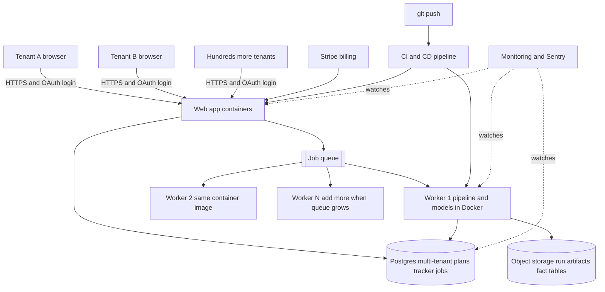

##### Level 3 — how a senior engineer sees it

Pattern names: a **modular monolith** with **asynchronous background workers** — deliberately *not* microservices; one codebase, one deploy, two roles (web app and worker) — plus **managed services for everything undifferentiated** (auth, billing, database hosting, error tracking). This is the consensus architecture for B2B SaaS at this size, and the key insight behind it: the famous "scaling to 100k users" playbook is about surviving *request* floods — thousands of clicks per second. Your product will never see that. A tenant logs in weekly, reads a dashboard, approves cuts. Your load lives in the **job dimension**: 1,000 tenants × a monthly rebuild plus weekly loops ≈ tens of thousands of multi-minute compute jobs per month, which is exactly what the queue-and-workers shape absorbs. Scaling for you means *adding workers*, almost never adding web servers.

What keeps them up at night here: **tenant isolation above all** (one tenant seeing another's pricing data is a company-ending bug — hence row-level security in the database, not politeness in the code, and an isolation test in CI); **noisy neighbors** (one tenant's 10× data volume hogging workers — per-tenant queue fairness); **migration risk** (moving Tier 2's CSVs into Postgres is the single most dangerous project on the whole ladder — run old and new in parallel for a month and diff every output, exactly the champion/challenger discipline you already apply to models); and **cost per tenant** (know your compute-per-tenant so pricing stays above it).

**Cost and burden.** Infrastructure: **$500–2,000/month (₹40k–1.7L)** at low hundreds of tenants — database $50–200, workers $200–800 (scale with tenant count), object storage tens of dollars, Sentry/monitoring/auth/email $100–300. The real line item is people: **one or two engineers** (₹15–40L/year each in India), because Tier 3 is a product with paying customers and someone must answer the pager. Ops burden shifts from "run the playbook" to "keep the service healthy and onboard tenants."

**The trigger to move to Tier 4:** honestly, for B2B CPG analytics, **you may never hit it**. The signals would be: tens of thousands of tenants; users in the product all day (interactive load, not weekly review); data volumes where one Postgres box genuinely cannot cope after tuning and read-offloading; or contractual uptime demands (99.99%) that require surviving a whole data-center failure. Absent those, Tier 3 is the destination, not a waypoint.

#### Tier 4 — Mass scale: recognize the vocabulary, resist the urge

In Level-1 terms: this is no longer an office at all — it is an international airport, with traffic controllers, duplicate runways, and a full-time crew whose only job is keeping the lights on. Tier 4 is taught here honestly: not as a plan, but as a *phrasebook* — so that when an investor, a big-company CTO, or an engineering blog uses these words, you know what they mean, what problem each solves, and why that problem is probably not yours. B2B analytics scales in **tenants and jobs**; Tier 4 exists for products that scale in **requests** — millions of people hammering the same service simultaneously (consumer apps, payments, social). The vocabulary:

- **Load balancer.** A traffic officer standing in front of many identical web servers, spreading incoming requests across them and skipping any that have died. It exists because one server has a ceiling on simultaneous requests. Your tenants' weekly logins would not saturate one modest server, let alone a fleet.
- **Horizontal scaling.** Adding *more machines* rather than a bigger machine (**vertical scaling**). Rule of thumb: scale vertically until the price curve bends — bigger boxes get disproportionately expensive — then horizontally. Your worker pool from Tier 3 already *is* horizontal scaling, applied to the one dimension where you need it.
- **Read replicas.** Live read-only copies of the database that absorb the read traffic (dashboards, reports) so the primary handles writes — several librarians at the reading desks, one master librarian filing new arrivals. Useful at Tier 3.5 if tenant dashboards ever grow heavy; a lever, not a rebuild.
- **Sharding.** When even that is not enough: split the data itself across multiple databases — tenants A–F in database 1, G–M in database 2. It is the most operationally painful word on this page (cross-shard queries, rebalancing, per-shard backups), and the good news is that a multi-tenant B2B product shards *naturally by tenant* if ever forced to, because tenants never query each other. A **CDN** (*content delivery network* — copies of your static files parked in cities near your users so pages load fast worldwide) often gets mentioned alongside; it is cheap and fine to adopt early, unlike everything else in this list.
- **Multi-region.** Running the whole stack in two or more geographic data centers so an entire region can burn down without your service noticing. Doubles-to-triples cost *and* complexity; bought only when contracts demand it.
- **SRE** (*site reliability engineering*). The discipline — and job title — of keeping large systems up: error budgets (an agreed allowance of downtime before feature work stops), on-call rotations (a named person who gets woken at 3 a.m.), postmortems (blameless written analyses of every outage), chaos drills (deliberately breaking things in rehearsal). When people say "Google-scale," they mean an SRE org exists.

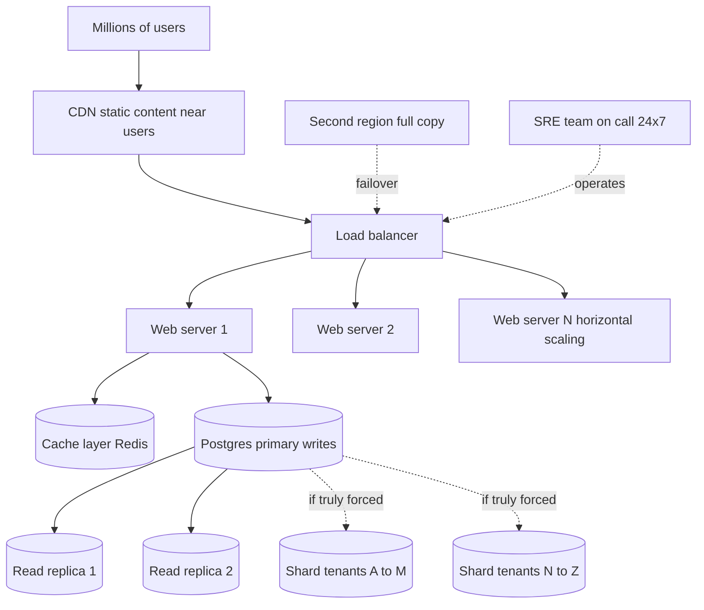

What changes versus Tier 3: everything is N-of-everything, and an SRE function exists. What does *not* change — and this should be striking by now — is the shape you already own: data flows in, jobs transform it, validated outputs flow out, humans act on them. Team: 5–15+ engineers minimum. Cost: **$10k–100k+/month** before salaries. Trigger to be here: you are a different company than the one this handbook is written for.

#### The architect's scaling laws

Four laws fell out of this ladder. They are the transferable part — the things that let *you* make the next architecture call without a mentor in the room.

**1. Scale the bottleneck, not the system.** At every tier, exactly one constraint forced the change: concurrent operators forced SQLite; serial rebuild hours forced the scheduler; concurrent paying tenants forced Postgres and the queue. Everything that was not the bottleneck — your models, your gates, your playbook logic — crossed each tier untouched. When someone proposes an upgrade, ask: *which measured bottleneck does this relieve?* No answer, no upgrade.

**2. Boring beats clever.** Files, SQLite, Postgres, one monolith, a queue: every choice on this ladder is the most-used, best-documented, dullest tool that solves the problem. Boring tools fail in ways thousands of people have already documented; clever ones fail in ways you get to discover alone at 2 a.m. Your dashboard — built from nothing but Python's built-in standard library plus pandas, no web framework at all — is the founding example. Honor it at every tier.

**3. Migrate data stores last.** Code is cheap to change and cheap to revert; data migrations are neither — a botched deploy rolls back in minutes, a botched migration can silently corrupt a year of tracker history. So the ladder defers every storage change to the last responsible moment (files → files+SQLite → Postgres+object storage), moves only the store whose access pattern actually broke, and always runs old-vs-new in parallel with output diffs before cutting over — the same champion/challenger habit you already trust in modeling.

**4. Every tier you skip is complexity you did not pay for.** Complexity is not a one-time purchase; it is a subscription billed in engineer-hours, debugging sessions, and slower changes, forever. The Tier 1 system you own today is not the embarrassing "before" picture of a real architecture — it is the correct rung of the ladder, chosen well. The skill this section aimed to transfer is not any particular diagram; it is the discipline of climbing exactly one rung, exactly when the trigger fires, and not one moment before.


---

## 9. How an Architect Thinks — the decisions in this system, defended

This is the capstone. Everything before this section explained *what* your system is. This section explains *how the person who designs such systems thinks* — using the actual decisions frozen inside your own code as the case studies. By the end you should be able to look at any new feature request — for this system or the ten-brand version or the SaaS — and reason about it the way a senior architect would, even though you build with AI instead of writing every line yourself.

A quick note on the word **architecture** itself: in software, architecture is not the code. It is the set of decisions that are *expensive to change later* — where data lives, what talks to what, what is allowed to fail, what must never fail. A junior engineer asks "how do I write this?" An architect asks "what will this decision cost me in a year?" Your system, small as it is, contains real architectural decisions, and they are mostly *right for your scale*. This section defends them, and — more importantly — tells you the exact trigger that flips each one.

#### 1. The architect's question list

Before an architect draws a single box, they ask five questions. Memorize these; they apply to a pricing tool, a warehouse, or a restaurant.

##### Question 1 — What are the real constraints?

Not the imagined ones. Your real constraints are: one Windows machine, one operator (you), one KAM executing cuts, monthly data drops of a few megabytes, weekly decisions, and a fragile Python environment where **numpy** — a maths library your statistics code depends on — must stay pinned at version 1.26.4 or the whole stack breaks (your `EXECUTION_PLAYBOOK.md` says this in bold, because it happened). A **library**, first time it appears: a bundle of pre-written code your programs borrow instead of rewriting — like buying a spice mix instead of grinding every spice yourself. A **version pin** means "always use exactly this edition of the spice mix, because the newer edition changed the recipe."

Imagined constraints would be: "millions of users", "real-time data", "must run in the cloud." You have none of those today. Architects who design for imagined constraints build expensive, fragile things. The industry has a name for this sin: *premature optimization*.

##### Question 2 — What is the simplest thing that works?

Not the simplest thing conceivable — the simplest thing that *works*, meaning it satisfies the real constraints from Question 1. Your dashboard is a single Python file (`ui/app.py`) plus a single web page (`ui/index.html`). That is close to the theoretical minimum for "owner clicks buttons, sees numbers, watches logs." Every case study in Section 2 below is an instance of this question being answered honestly.

##### Question 3 — What breaks first?

Every system has a weakest link, and the architect's job is to know which one it is *before* it breaks. In your system, ranked: (1) the input data format changes because Blinkit changes an export column — this breaks the pipeline at Stage 1, which is why `v4_config.py` has a `COL` mapping **dictionary** (a lookup table inside the code — "when the raw file says WT_DISCOUNT_PCT, we call it discount_pct") that translates raw column names to internal names in one place; (2) the numpy pin gets violated by an innocent `pip install` (**pip** is Python's installer — the shop where a program fetches its libraries; every `pip install` is a delivery that can jostle the shelves); (3) the machine's disk dies — which is why **git** exists here: the version-control tool that keeps a full snapshot history of your project (Section 5 makes it your undo button), pushed to two **GitHub** remotes — GitHub being the website that stores git projects online, and a **remote** being one such off-machine copy; yours are named `origin` and `claude-version`. Notice none of your first-to-break items are "too many users" — that is the honest answer at your scale.

##### Question 4 — What is reversible, and what is not?

Architects divide decisions into two-way doors (walk back through if wrong) and one-way doors (no going back). Choosing to store data in files is a two-way door — you can migrate files into a database later with a script. Sending your KAM a bad cut list that runs for a month at 24 Mantra is closer to a one-way door — real revenue is lost. That is why the *irreversible* end of your system carries all the armor: glide caps, the two-engine agreement gate, the defense-hold list, the kill-switch. The reversible end (which chart library the dashboard uses) carries none, correctly. **Rule: spend your engineering budget in proportion to irreversibility, not in proportion to how interesting the problem is.**

##### Question 5 — What must never be wrong?

There is usually one thing. In your system it is the **champion model's cut list** — the validated, confounder-controlled recommendation that money is bet on. Everything else can be a little wrong: a chart can render oddly, a log line can be garbled, a report can be a day stale. The architecture reflects this: the champion is surrounded by eight validation steps (Double ML, gates C1–C8, challenger, backtest, elasticity gates, sensitivity, outlier audit, kill-switch), while the dashboard has essentially no tests at all. That asymmetry is not laziness — it is Question 5 answered correctly.

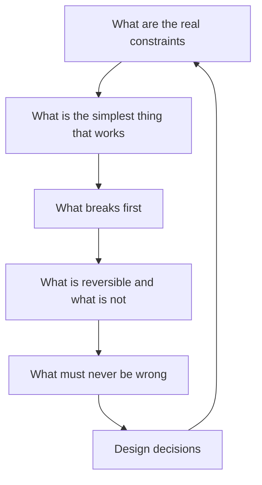

The loop arrow matters: every new feature re-asks all five questions, because constraints change. When you go from 1 brand to 10, Question 1's answer changes, and several decisions below will flip. You will know exactly which ones, because each case study ends with its flip trigger.

#### 2. Eight real decisions in your codebase, defended

Each case study follows the same shape: the decision → the alternatives a typical engineer would have considered → why this one is right *at this scale* → the trigger that flips it. These are not hypotheticals; every one is visible in a file you own.

##### Case 1 — Files as the store, not a database

First, the term. A **database** is a specialized program whose only job is storing and retrieving structured data safely — think of it as a professional warehouse with a full-time clerk who checks items in and out, keeps an inventory ledger, and stops two people from grabbing the same shelf at once. A **CSV** file (comma-separated values) is the opposite: a plain text file where each line is a row and commas separate the columns — a paper ledger anyone can open in Excel.

**The decision.** Your system has no database. `input_data/*.csv` holds the raw Blinkit exports, `pipeline.py` writes each run into a timestamped folder under `v4_outputs/` (containing `fact_table.csv` — the **fact table**, one clean row per product, pack size, city and day, the single source of truth every downstream script reads), and curated deliverables live in `DISCOUNT_PLAN/`. The dashboard reads these files directly with **pandas** — the standard Python library for working with tables of data; its central object is the **DataFrame**, which is essentially a spreadsheet living in the program's memory.

**Alternatives.** SQLite (a tiny database living in one file), PostgreSQL (a full warehouse-with-clerk database server), or BigQuery — a giant rented database running in Google's data centers ("the cloud" gets its full introduction in Case 8).

**Why files win at this scale.** *Level 1 — like you're new:* you run a small shop with one bookkeeper. A filing cabinet with clearly labeled folders beats hiring a warehouse clerk: no salary, no training, and you can open any drawer and read the paper directly. *Level 2 — in this repo* (a **repo** — short for repository — is the project folder git tracks; your versioned filing cabinet)*:* your data is a few megabytes, arrives monthly, has exactly one writer (the pipeline) and a handful of readers (the scripts, the dashboard). The timestamped folders under `v4_outputs/` give you free history — every run preserved forever, diff-able, deletable. You can open `fact_table.csv` in Excel to check a number, which for a non-database-person is worth an enormous amount of debugging power. A database would add installation, backup procedures, a query language to learn, and a layer of opacity — and buy you nothing, because databases earn their keep when there are *many simultaneous writers* or *data too big for memory*, and you have neither. *Level 3 — a senior engineer's view:* this is the "flat-file data lake with immutable runs" pattern. The trade-offs they'd note: no transactional safety (if the pipeline dies mid-write you get a half-written file — mitigated here because a failed run just gets re-run and the timestamped folder isolates the damage), no concurrent-write protection, and lookups scan whole files instead of using an **index** (a database's pre-sorted lookup card that finds a row without reading every page). At megabytes, a full scan takes milliseconds, so the index buys nothing.

**Flip trigger.** Three events, any one of which flips this: (a) two or more processes need to *write* the same data at the same time — e.g. ten brands' weekly trackers running concurrently and updating shared state; (b) any single table exceeds what fits comfortably in memory (~1–2 GB in practice); (c) a customer other than you needs to query the data — SaaS customers cannot be handed your filing cabinet. First step when it flips: SQLite, not PostgreSQL — it keeps the "no server to run" property while adding transactions. PostgreSQL only when multiple *machines* need access.

##### Case 2 — Standard-library web server, not Flask or FastAPI

Terms first, because this case needs several. A **server** is a program that waits for requests and answers them — a shop clerk standing at a counter. A **web server** speaks **HTTP**, the request-and-response language every browser uses ("GET me this page", "POST this form"). A **port** is a numbered door on a machine — one computer can run many servers, each listening at its own door; yours listens at door 8765. **localhost** (address `127.0.0.1`) is a special address that means "this same machine" — a letter you post to yourself that never enters the public mail. The **backend** is the server-side program doing the work; the **frontend** is what runs in your browser showing the results. An **API** (application programming interface) is the fixed menu of requests the backend agrees to answer — like a restaurant's menu: you can order what is printed, nothing else. **JSON** is the text format the answers come back in — human-readable structured text like `{"status": "running", "step": 3}`. Each item on the menu is an **endpoint** — one URL the server answers, like `/api/status`. Python's **standard library** ("stdlib") is the toolbox that ships with Python itself, no installation needed. A **framework** like Flask or FastAPI is a third-party kit that makes building web backends convenient — pre-cut cabinet parts versus raw lumber.

**The decision.** `ui/app.py` builds its backend from raw stdlib parts: `ThreadingHTTPServer` bound to `("127.0.0.1", 8765)`, one `Handler` class with `do_GET` and `do_POST` methods that hand-route each path (`/api/status`, `/api/steps`, `/api/table/<name>`, `/api/report/<key>`, `POST /api/run/<step>`, `/api/job`). Zero web dependencies — a **dependency** being any outside library your code needs installed before it can run.

**Alternatives.** Flask (the classic lightweight framework), FastAPI (the modern one with automatic documentation), Django (the full-featured one).

**Why stdlib wins here.** *Level 1:* you needed a counter with six menu items, served to exactly one customer — you. Buying a restaurant franchise kit (Flask) to serve one person six dishes adds a box of parts to maintain forever. *Level 2:* your environment is *fragile* — the numpy pin exists because one `pip install` already broke the stack once. Every added dependency is another thing that can conflict, and Flask would arrive with five or six of its own sub-dependencies. The stdlib server needs nothing installed, so `launch_ui.bat` (a **.bat** file is a Windows script you double-click to run a saved list of commands) works on a fresh machine the moment Python exists. The routing in `do_GET` is a readable if-chain — at six endpoints, a framework's router saves you nothing. *Level 3:* the engineer's name for this is "minimizing the dependency surface." They would note the real costs: hand-rolled routing gets unwieldy past ~15 endpoints; no automatic input parsing or validation (you do it manually); no middleware for auth when you need it; `BaseHTTPRequestHandler` is genuinely low-level and easy to misuse. They would also nod at `ThreadingHTTPServer` — it serves each request in its own **thread** (an independent line of work inside one program; several clerks sharing one shop) so a slow table read never freezes the status endpoint.

**Flip trigger.** The day any *second person* uses the dashboard, or the endpoint count passes roughly fifteen, or you need authentication (Case study 8 and Section 3). Then FastAPI specifically — it validates incoming data automatically and generates API documentation your future SaaS customers' engineers will read. The migration is mechanical: each `if self.path == ...` branch becomes one decorated function.

##### Case 3 — One HTML file with vanilla JavaScript, not React

**HTML** is the language web pages are written in — the text, headings, and buttons. **JavaScript** ("JS") is the programming language that runs *inside the browser* and makes pages interactive. "**Vanilla** JS" means plain JavaScript with no added framework. **React** is the dominant frontend framework: it manages complex, fast-changing screens by breaking them into reusable components, but demands a build toolchain — a factory line of tools (Node.js, bundlers, package managers) that compile your source files into what the browser actually loads. An **SPA** (single-page application) is a site that loads once and then rewrites itself in place instead of loading new pages — yours is one.

**The decision.** `ui/index.html` is one file containing all markup, styles, and JavaScript: hash-based routing (the part of the URL after `#` picks which panel shows), `fetch` calls to the JSON API (**fetch** is the browser's built-in function for requesting data from a server), hand-drawn **SVG** charts (SVG — scalable vector graphics — describes shapes as text that the browser draws as crisp lines, so your charts need no charting library at all), light/dark themes, the StatIQ Lab brand. No build step. Edit the file, refresh the browser, done.

**Why one file wins.** *Level 1:* a notice board in your office versus a printing press. The press produces glossier posters, but you must maintain the press. For an audience of one, hand-lettering the notice board is faster every single time. *Level 2:* your dashboard has perhaps eight panels, updates once a second during jobs, and is edited by you-plus-AI. A React setup would add `node_modules` (routinely 200+ megabytes of dependencies), a build command that can break independently of your Python stack, and version churn. The single file means the whole frontend travels inside the repo, served by `app.py` reading it straight off disk (`open(os.path.join(HERE, "index.html"), "rb")` in `do_GET`). *Level 3:* engineers call this "zero-build frontend." The honest trade-offs: one file gets painful past roughly two or three thousand lines; no component reuse means repeated markup; no automated frontend tests; two people editing one giant file collide constantly. They would also point out what you *dodge*: the entire supply-chain-security problem of hundreds of frontend dependencies.

**Flip trigger.** A second frontend developer (human or a second AI workstream), or customer-facing screens for the SaaS where polish, per-customer theming, and componentized screens matter. Then React (or Svelte) with a proper build — and that flip is cheap because your API boundary is already clean: the new frontend calls the same six endpoints.

##### Case 4 — Subprocess plus a lock, not a job queue

Terms: a **process** is one running program — one cook in the kitchen with their own station and their own memory. A **subprocess** is a program launched *by* another program — the head chef telling a line cook "make dish 7" and watching them work. A **job queue** is infrastructure for running background work at scale: a ticket rail where any number of waiters clip orders and a pool of cooks pull tickets off — usually a separate program (Celery with Redis, for example; **Redis** being a fast in-memory data store often used as the ticket rail). A **lock** is a token guaranteeing only one actor does a thing at a time — the single key to the store room.

**The decision.** When you click "Run pipeline", `start_job` in `ui/app.py` takes `JOB.lock`, checks `JOB.status == "running"` and refuses with "A job is already running" if so, then starts one worker thread that launches each step as a subprocess (`subprocess.Popen(argv, cwd=ROOT, ...)`), streaming its output line by line into `JOB.log` — a **deque** capped at 6,000 lines (a list that discards the oldest line when full, like a security camera that reuses tape). One job at a time, ever.

**Why this wins.** *Level 1:* you are a kitchen with one chef. A ticket rail system for one chef is pure ceremony — the chef simply refuses new orders until the current dish is out. *Level 2:* your jobs are long (the monthly rebuild takes 15–25 minutes) but *rare* (monthly, weekly), and running two pipeline builds at once would actually be dangerous — both would write `v4_outputs/` folders and fight over `DISCOUNT_PLAN/` files. The one-at-a-time rule is therefore not a limitation; it is a *correctness guarantee* your file-based storage depends on. Note how the two decisions interlock: files-not-a-database (Case 1) is only safe *because* of one-job-at-a-time (Case 4). Architecture decisions are rarely independent. *Level 3:* the pattern name is "in-process worker with a mutex" (mutex = mutual exclusion = the lock). Known weaknesses a senior engineer would list: if `app.py` dies mid-job, the job dies with it and the log in memory is gone (acceptable — you re-run); job state does not survive a restart; you cannot see history of past jobs (partially covered by the receipts each script writes to disk); no retry logic. Also a subtle real one: the running flag lives in one Python object, so if you ever ran *two copies* of `app.py`, each would have its own lock and the guarantee evaporates — one more reason single-machine, single-instance is a real constraint, not a default.

**Flip trigger.** Ten brands. The moment jobs must run *concurrently* (brand A's weekly tracker while brand B's rebuild runs) or *survive a crash* or be *scheduled unattended*, you need a real queue. The intermediate step is cheaper than Celery: one worker process per brand, each with its own folder tree — the current design copy-pasted, which your per-brand folder isolation makes feasible. Full job-queue infrastructure arrives with the SaaS, where customers submit work and expect it to survive your server restarting.

##### Case 5 — Polling, not WebSockets

**Polling** means the frontend asks the backend "anything new?" on a timer — phoning the kitchen every minute to ask if the order is ready. A **WebSocket** is a persistent two-way phone line the server can speak down at any moment — the kitchen calls *you* the instant the dish is plated.

**The decision.** During a job, your frontend calls `GET /api/job` once per second (`setInterval(pollJob, 1000)` in `ui/index.html`); the backend replies with `JOB.snapshot()` — status, elapsed time, the whole log, progress counters. When no job runs, the frontend drops back to a slow status refresh every 30 seconds, so the idle cost is essentially zero.

**Why polling wins.** *Level 1:* if the kitchen is in your own house, walking over once a minute costs nothing; installing an intercom is solving a distance problem you don't have. *Level 2:* one viewer (you), on the same machine, checking once a second — that is one tiny local HTTP request per second, invisible in cost. The entire mechanism is ~10 lines of frontend JS and zero backend code beyond the snapshot method. WebSockets in a stdlib server would mean hand-implementing the WebSocket protocol or adding a dependency (violating Case 2), plus reconnect handling, plus keep-alive logic. *Level 3:* engineers know polling's real costs appear with *many clients* (a thousand dashboards polling every second is a thousand requests per second of mostly "nothing new") and with *latency-sensitive* updates (sub-second trading screens). Neither applies. They'd also note the middle option, **Server-Sent Events** — a one-way live feed simpler than WebSockets — as the natural first upgrade.

**Flip trigger.** Many simultaneous dashboard viewers (SaaS customers watching their own runs), or push-style alerts ("kill-switch fired!" appearing without a refresh). Until then, every second spent on WebSockets is a second not spent on the model.

##### Case 6 — Champion and challenger, never edit-the-model

This one looks like a statistics practice, but read it as *architecture* — it is a safety pattern about how change enters a system that must never be wrong (Question 5).

One term: **RLM** — robust linear model, the statistical engine inside your champion (`scripts/analysis/discount_plan.py`). "Robust" means it automatically down-weights freak days so one crazy spike cannot bend the whole line — a judge who discounts the testimony of obviously drunk witnesses.

**The decision.** When you wanted competitor behavior added to the waste model, nobody edited the champion. Instead `scripts/analysis/challenger.py` fits **Model B = champion + competitor controls** *alongside* the untouched Model A, re-runs every gate, and adopts B only if it wins on a **pre-registered rule** written in the file's docstring (a **docstring** is the explanation block at the top of a Python file — the file's own label): out-of-sample R² ≥ 0.75, all category fits still clear the R² floor, and the competitor coefficient has a sane sign. Three quick glosses: **R²** is a 0-to-1 score of how much of the sales movement a model explains; **out-of-sample** means scored on data the model never saw while learning — the only honest test; a **coefficient** is the number a model assigns to one input — its measured push on sales — and "sane sign" means rivals discounting more must not appear to *raise* your units. The deliverable is a delta report — `CHALLENGER_REPORT.md` — and your dashboard shows "KEEP Model A" as a receipt chip.

**Why this is architecture, not just stats.** *Level 1:* you never let a new chef rewrite the signature dish on the live menu. The new recipe is cooked in parallel, tasted against the original by rules agreed *before* tasting, and replaces it only by winning. Crucially, the rules are written down first — otherwise the taster (you, or an AI, or a motivated analyst) will unconsciously move the goalposts to favor the exciting new thing. *Level 2:* the pre-registered rule is *in the code*, so neither you nor an AI session six months from now can quietly redefine "wins." The champion file is effectively frozen; changes to the money-critical logic can only enter through a challenger that beats it under fixed rules. *Level 3:* engineers know this same shape everywhere change is dangerous: blue-green deployments (run the new version beside the old, switch only when proven), canary releases (give the new version 1% of traffic first), shadow mode (new model sees real inputs, its outputs logged but not acted on). The general principle: **for the component that must never be wrong, change must be additive and evaluated, never editive.** The trade-off is real but acceptable: progress is slower, every improvement needs a full parallel evaluation, and you maintain two models during each trial.

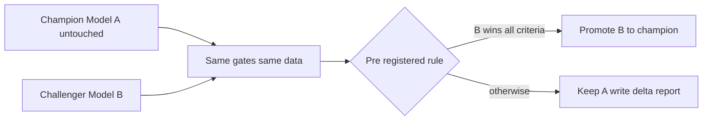

**Flip trigger.** None. This pattern does not flip with scale — it *intensifies*. At ten brands you'll want the challenger run automated per brand; at SaaS scale it becomes your compliance story ("model changes are gated and auditable"). This is the one decision in your system you should carve in stone.

##### Case 7 — Allowlist, not arbitrary execution: security by construction

An **allowlist** is a fixed list of permitted things where everything not on the list is refused — a guest list at the door, as opposed to a blocklist ("everyone except these troublemakers"), which fails the moment a troublemaker you didn't anticipate shows up.

**The decision.** The dashboard's run endpoint does not accept commands. `POST /api/run/<step>` takes only a step *id*; `start_job` looks it up in the `STEPS` dictionary hard-coded at the top of `ui/app.py` — seventeen entries, each mapping an id like `"champion"` to an exact, list-form command like `["scripts/analysis/discount_plan.py"]` (plus one composite id, `monthly_all`, which runs the thirteen monthly steps in order — still entirely hard-coded). Unknown id → `"Unknown step"` refusal. There is no code path by which any text from the browser becomes part of a command line. Even the one dynamic value, `@latest_fact`, is resolved *server-side* by `_resolve()` to the newest run's `fact_table.csv` — the browser never supplies a path.

**Why this matters more than it looks.** *Level 1:* a vending machine versus a waiter who does whatever the note says. The vending machine has buttons for exactly seventeen items; you cannot write "also open the till" on a napkin and push it through the slot. *Level 2:* the single most common catastrophic web vulnerability is **injection** — attacker-controlled text sneaking into a command or query. Your design doesn't *filter* dangerous input (filters have holes); it is *structurally incapable* of executing anything outside `STEPS`. Notice also the command is a Python *list* (`["scripts/...", "--budget_pct", "0.12"]`), not one string — so the operating system receives arguments separately and no shell ever interprets them, closing the "sneak a `&& delete-everything` into an argument" trick by construction. *Level 3:* engineers call this "capability-based design" or "make illegal states unrepresentable" — safety guaranteed by the shape of the code, not by vigilance. It is the cheapest security you will ever buy, because it costs nothing to run and cannot be misconfigured. The trade-off: adding a new runnable step requires editing `app.py` — which is exactly the friction you want on the "what can this server execute" question.

**Flip trigger.** None for the pattern; only the list grows. In the SaaS version the allowlist becomes per-customer (customer A may run steps on customer A's data only) — the pattern generalizes into an authorization model, it never gets abandoned.

##### Case 8 — Local-only, not cloud

The **cloud** means renting computers in someone else's data center (AWS, Azure, Google Cloud) instead of using your own machine — renting a commercial kitchen by the hour versus cooking at home.

**The decision.** Everything — data, models, dashboard — lives and runs on your one Windows machine. The server binds to localhost, so it is unreachable from any other computer even on your own Wi-Fi. The only cloud touchpoint is GitHub holding code backups.

**Why local wins today.** *Level 1:* you cook at home for a household of one. Renting a commercial kitchen adds rent, commute, and a landlord — and the food is the same. *Level 2:* your compute needs are 25 minutes a month of statistics on megabytes of data; any laptop from the last decade handles it. Cloud would add monthly cost, deployment scripts, credentials to protect, and — the big one — your pricing data (competitively sensitive: it reveals your margins and strategy) would leave the building. Local-only means your threat model is "someone steals the physical laptop," which disk encryption addresses. *Level 3:* engineers would frame it as: cloud buys you *elasticity* (scale up and down), *availability* (runs when your laptop is off), and *accessibility* (others can reach it) — and you currently need none of the three. They'd flag the honest weaknesses: no offsite backup of the *data* (git covers code; `input_data/` and `DISCOUNT_PLAN/` deserve a scheduled copy to an external drive or private cloud storage), and everything stops if the machine dies — acceptable when the cadence is weekly, fatal when customers depend on it.

**Flip trigger.** The sharpest one in this list: **the first paying customer**. A SaaS by definition must run when your laptop is shut. Second trigger: ten brands, if runs start overlapping beyond what one machine handles overnight. When it flips, the migration order is: one rented **virtual machine** — a slice of a big server in a data center that behaves like a computer of its own — running exactly this code (cheap, ~minutes of change thanks to the clean layering) → then containers — **Docker** packages your program plus its exact dependencies (that precious numpy pin!) into a sealed, reproducible box that runs identically anywhere, which kills the "fragile environment" problem permanently → then managed services only where pain justifies them.

#### 3. Security as layers — what you have, what is missing, and when missing becomes mandatory

Security architecture is never one wall; it is concentric rings, like a castle: moat, wall, guard, locked room. Any single ring can fail; the attacker must beat all of them. Here are your rings, from outside in.

##### Ring 1 — Network: the localhost bind

`ThreadingHTTPServer(("127.0.0.1", PORT), Handler)` in `ui/app.py` is the moat. Binding to `127.0.0.1` means the operating system itself refuses connections from any other machine — not your router, not your Wi-Fi neighbors, not the internet. This is the strongest ring you have, and it is one line of code. Contrast: binding to `0.0.0.0` (all addresses) would expose the dashboard to your entire network. Many real breaches begin with exactly that one-character-class mistake on an internal tool.

##### Ring 2 — Input validation: the allowlist

Case 7 above. Even if someone were at your keyboard, the server can only run the seventeen predefined steps. The table and report endpoints have the same shape: `/api/table/<name>` matches against a fixed set of names, `/api/report/<key>` checks `key not in REPORTS → 404`. No path from user input to file paths or commands.

##### Ring 3 — Least privilege

**Least privilege** means every component gets only the powers its job requires — the dishwasher doesn't hold the safe keys. Your subprocesses run as your Windows user with cwd pinned to the repo root; the dashboard reads only files under the repo; the KAM receives a CSV, never system access; GitHub holds code, not raw sales data — your `.gitignore` (the list of files git must never track or upload) already excludes `input_data/`, with the comment "Proprietary input data — never commit"; competitively sensitive data never rides along with code pushes. At SaaS scale this ring becomes the tenant-isolation story: customer A's steps can only ever touch customer A's folders.

##### Ring 4 — Secrets hygiene

A **secret** is any string that grants power: passwords, API keys (a key is a password for programs), tokens. Your current system has almost none — the healthiest possible state — because localhost needs no login and files need no credentials. The rules for when secrets arrive (they will, with the first external data feed or cloud deploy): never in code, never in git history (git remembers *forever* — a key committed once and deleted is still in history), always in **environment variables** — named values the operating system hands a program at launch, like a sealed envelope given to the chef rather than a note pinned to the public board. Your code already models the pattern: `PORT = int(os.environ.get("UI_PORT", "8765"))` reads an environment variable with a safe default.

##### The honest missing list — and each item's trigger

None of these are flaws *today*, because Ring 1 makes the dashboard unreachable by anyone but you. Each becomes mandatory at a specific, nameable moment:

| Missing layer | What it is, plainly | Becomes mandatory when |
|---|---|---|
| **Authentication** ("auth") | Proving who you are — a login. Its sibling **authorization** decides what that identity may do. | The first moment anyone-but-you can reach the server — even a colleague on the office network. Not optional at that point; the run endpoint moves prices. |
| **HTTPS / TLS** | HTTP with encryption. **TLS** is the sealing wax: without it, anyone on the network path reads and can *alter* every request — including a POST that triggers price changes. The browser padlock. | The instant traffic crosses a network you don't fully control. Free via Let's Encrypt (a nonprofit service that issues the digital certificates HTTPS needs, at no charge); there is no cost excuse. |
| **Rate limiting** | Capping how often one caller may hit an endpoint — a bouncer who says "you've ordered forty times this minute, slow down." Protects against abuse and runaway scripts. | Public internet exposure. Before then, your one-job lock is a crude natural rate limit on the only expensive endpoint. |
| **Audit logging** | A tamper-evident record of who ran what, when. | The first customer, or the first employee. "Who triggered the cut wave on the 12th?" must have an answer. |
| **Backups of data, not just code** | Git covers code; `input_data/` and `DISCOUNT_PLAN/` history live only on one disk. | Now, honestly. A weekly copy to an external drive is an afternoon's setup. |

The architectural lesson: security is not a product you add at the end; it is rings you consciously *defer* with a written trigger for each. You have deferred correctly — but write the triggers down (this table is that document).

#### 4. The folder structure is the architecture, made visible

**Separation of concerns** — the single most important idea in software design — means each part of a system does one kind of job and holds one kind of knowledge, so you can change one part without understanding or breaking the others. A restaurant separates kitchen, dining room, cash office, and cold store not for tidiness but so the plumber fixing the kitchen never touches the safe.

Your repo enforces this with directories. A stranger — or an AI session with no context — learns your architecture from `ls` alone:

```mermaid
flowchart TD
    IN[input_data raw Blinkit exports] --> ST[stage1 to stage8 folders plus pipeline.py the refinery]
    CFG[v4_config.py all knobs one file] -.controls.-> ST
    CFG -.controls.-> SC
    ST --> VO[v4_outputs timestamped runs fact_table features plan]
    VO --> SC[scripts analysis pricing promo validation tracker the brains]
    SC --> DP[DISCOUNT_PLAN curated deliverables reports handoffs]
    DP --> UI[ui app.py plus index.html the window]
    VO --> UI
```

Read each folder as an architectural statement:

- **`input_data/`** — the loading dock. Raw, untouched, replaceable. Rule: nothing in here is ever edited by hand or by code; the pipeline reads, never writes. This gives you a clean re-run guarantee: delete everything downstream and rebuild from here.
- **`stage1_ingestion/` … `stage8_output/` + `pipeline.py`** — the refinery, one folder per stage (stage 8 spans `stage8_output/`, which holds the final packaging code — Excel report, leakage, track record — and a mostly empty `stage8_monitoring/`). The stage boundaries are concern boundaries: a change to outlier logic lives in one stage folder and cannot silently leak into economics.
- **`v4_config.py`** — every tunable knob in one file, exhaustively commented. This is separation of *policy* (what thresholds, which brand, what caps — business decisions) from *mechanism* (how the math runs — engineering). When you onboard brand number two, the design intent is that you change this file and nothing else — the comments in it literally say "the ONE thing to set when onboarding."
- **`v4_outputs/<timestamp>/`** — the production ledger. Machine-written, append-only in spirit, never hand-edited. Timestamps make every run auditable and comparable.
- **`scripts/`** — the brains, itself layered by concern: `analysis/` (the champion and its confirmers), `pricing/`, `promo/`, `validation/` (the skeptics), `tracker/` (the weekly heartbeat). Note the deliberate separation of *deciders* from *validators*: the code that recommends cuts and the code that checks the recommendation live in different folders and share no logic — so a bug in the decider cannot also blind the checker. That is separation of concerns doing safety work.
- **`DISCOUNT_PLAN/`** — the front office. Curated, human-facing deliverables: reports in **Markdown** (a plain-text format where `#` means heading and `**bold**` means bold — readable raw, pretty when rendered), the KAM handoff CSV, the receipts the dashboard turns into pass/fail chips.
- **`ui/`** — the window. It computes nothing and decides nothing; it reads files others produced and pushes buttons others defined. If you deleted `ui/` entirely, every business function would still work from the command line — the definition of a well-separated presentation layer.

Even your five-line `.gitattributes` is architecture: `* text=auto` normalizes Windows-vs-Unix line endings on commit so git never cries wolf about files that didn't really change, and marking `*.pdf` / `*.xlsx` / `*.pptx` as `binary` stops git from trying to merge spreadsheets and decks like text. Small file, real decision: *keep the change history honest*, because Section 5 depends on it.

The generalization: **in a typical SaaS, these folders become services** — the pipeline becomes an ingestion service, `scripts/` become worker services, `DISCOUNT_PLAN/` becomes a reports store, `ui/` becomes the web app. Because your concerns are already separated by folder, that future migration is a re-homing, not a rewrite. Teams that skip this discipline end up with a "big ball of mud" — everything touching everything — and their migration *is* a rewrite.

#### 5. The AI-native development workflow — how this system actually gets built

You do not write most of this code; you direct an AI that does. That is not a lesser way to build — but it only works with a specific discipline, and you have (mostly by hard experience) converged on the right one. Naming it makes it repeatable.

##### The loop: describe → AI builds → adversarially verify → receipts → commit

1. **Describe** the change in business terms, with the acceptance test stated *up front*: "hero SKUs must never be auto-cut; show me a run where a hero flagged as waste gets held." Deciding what "done" looks like before building is the owner's irreplaceable job.
2. **AI builds.** Fast, and confidently wrong some percentage of the time. Treat every AI claim of "done and working" as a claim, not a fact.
3. **Adversarially verify.** Do not ask "does it work?" — ask "show me it failing to fail." Run the real command on real data; feed the edge case; try to break it. Your validation stack institutionalizes this: gates C1–C8, the backtest against naive benchmarks, the sensitivity shake that deliberately perturbs inputs to count fragile decisions, the challenger's pre-registered rule. These exist because *no one* — not you, not the AI — is trusted on assertion.
4. **Receipts.** Every important step writes a machine-checkable artifact: `plan_summary.json` with `meets_target`, `BACKTEST_REPORT.md` with a PASS/FAIL verdict line, `CHALLENGER_REPORT.md` with "KEEP Model A", the dashboard's receipt chips reading these files live in `api_status()`. **This is the deep insight of your whole workflow: verification receipts substitute for the code-reading ability you don't have.** A CS graduate audits the code; you audit the receipts. At your system's stakes, the receipts are arguably the *stronger* audit — code review catches typos, receipts catch wrong answers.
5. **Commit.** A **commit** is a saved snapshot of the entire project in git (the version-control tool from Question 3) — a save point in a video game. Your history shows the discipline: one coherent change per commit with a message stating what and why ("feat(parity): outlier-vs-promo audit closes the last residual"). Small commits are what make git the **undo button**: when a change turns out bad, you roll back *that one snapshot*, not a week's tangle. Two GitHub remotes mean the save file exists in three places.

```mermaid
sequenceDiagram
    participant O as Owner
    participant AI as AI builder
    participant S as System plus gates
    participant G as Git
    O->>AI: Describe change and the acceptance test
    AI->>S: Build and run
    S-->>O: Receipts pass or fail
    O->>S: Adversarial checks edge cases real data
    alt receipts clean
        O->>G: Small commit clear message
    else receipts dirty
        O->>AI: Reject with the failing receipt
    end
```

##### The frozen-core pattern: never let the AI touch the validated champion

The most dangerous failure mode of AI-native building is *silent regression*: you ask for a small dashboard tweak, and the AI "helpfully" also refactors `discount_plan.py`, subtly changing the model that money rides on — and everything still *runs*, so you never notice. Your defenses, which together form what engineers would call a frozen core:

- **The champion/challenger rule (Case 6)** is the structural defense: improvements to the model *cannot* legitimately arrive as edits, only as challengers that must beat pre-registered gates. Any diff that touches `scripts/analysis/discount_plan.py` directly is by definition suspect.
- **The receipts are regression alarms**: if a "UI-only" change flips a receipt chip — the backtest verdict, the C1–C8 pass, the sensitivity fragile-count — something touched the core, and you know within one dashboard refresh.
- **Git diffs are the audit**: before committing, look at *which files* changed. You don't need to read Python to read a file list. "I asked for a chart fix; why did three files under `scripts/analysis/` change?" is a question a business owner can ask and an AI must answer.

Standing instruction worth giving every AI session verbatim: *"The champion model and the validation gates are frozen. Propose changes to them as challengers only. Any task that requires editing them must stop and ask first."*

##### Why this workflow scales to the SaaS

At ten brands, the loop is unchanged; only the receipts multiply (one receipt set per brand — the dashboard's receipt panel becomes a grid). At SaaS scale, the receipts *are the product's trust story*: "every recommendation your brand receives passed these eight named gates, and here is the audit trail" is a sales page competitors running hand-tuned spreadsheets cannot write. You are not compensating for a missing CS degree; you are accidentally building the compliance architecture regulated industries pay dearly to retrofit.

#### 6. Ten beginner mistakes, ranked by how expensive they are — and the guardrail in this repo that blocks each

Ranked from bankruptcy-grade down to merely annoying. The pattern to notice: **for every one of these, your repo already contains a named, mechanical guardrail** — none of them are prevented by "being careful."

1. **Trusting a model with money without independent verification.** The most expensive mistake in analytics: one plausible model, no cross-examination, big bets placed. *Your guardrail:* the confirmation stack — Double ML (`dml_estimate.py`) confirming causality independently, gates C1–C8 (`validate_plan.py`), the challenger, the rolling backtest against naive benchmarks, and the sensitivity shake. Five independent ways to be told you're wrong before a rupee moves.

2. **No undo for real-world actions.** Software rolls back; a month of bad discounts at retail does not. *Your guardrail:* the glide (`TARGET_TIMELINE_WEEKS`, `MIN_DISCOUNT_CHANGE_PPT` in `v4_config.py`) makes every move small; the kill-switch (`scripts/tracker/killswitch.py`) reverts cuts that hurt; the weekly cadence caps blast radius at seven days.

3. **Silent edits to the validated core.** Covered in Section 5 — the regression you never notice. *Your guardrail:* champion/challenger with pre-registered promotion rules, plus receipts that flip visibly when the core moves.

4. **Exposing an execution endpoint to input it shouldn't trust.** One text field flowing into a command has ended companies. *Your guardrail:* the `STEPS` allowlist plus list-form commands plus the localhost bind — three rings deep (Cases 7, 8; Section 3).

5. **Unpinned dependencies.** "I upgraded one library and nothing works" — the classic Monday morning. You lived this: PyMC force-upgraded numpy and broke the stack. *Your guardrail:* the explicit pin (`numpy==1.26.4`) and the playbook's bolded warning never to install PyMC. The general rule: pin everything, upgrade deliberately, one at a time, with the test suite green before and after.

6. **No version control, or giant tangled commits.** Without git, every mistake is permanent and every experiment is terrifying — so people stop experimenting. *Your guardrail:* git with two remotes, small single-purpose commits, and `.gitattributes` keeping the diff history honest across Windows line endings.

7. **Config scattered through the code.** The budget cap hard-coded in five files means brand number two requires an archaeology dig, and one missed hard-code means brand two runs with brand one's hero SKUs. *Your guardrail:* `v4_config.py` — one file, every knob, commented, plus `params_review.py` snapshotting drift in the knobs since last sign-off (governance for configuration — genuinely uncommon, genuinely valuable).

8. **Cleaning data without an audit trail.** Deleting "outliers" that were actually your best promo days quietly deletes real demand from the model. *Your guardrail:* outliers are flagged, excluded, *and saved* (`outliers_removed.csv` per run, per the comments in `v4_config.py`), then cross-examined against the documented promo calendar by `outlier_promo_audit.py`. Nothing is silently discarded.

9. **Building for imagined scale.** The mirror image of most of this list: a beginner who has read too many engineering blogs builds Kubernetes (a system for orchestrating fleets of Docker containers — a shipping-port control tower) for one laptop's workload, and spends six months on plumbing instead of the product. *Your guardrail:* the discipline this whole section defends — stdlib server, files, polling, local-only — plus, now, the written flip triggers so simplicity never silently becomes negligence.

10. **Confusing "it ran" with "it's right."** The pipeline finishing with no error message proves only that Python was satisfied — not that the plan makes sense. *Your guardrail:* receipts with *verdicts*, not just outputs: `meets_target: true`, "ALL PASS", "LOOP CLOSED: YES" from `verify_loop.py`, the dashboard chips that render red. Every run answers "did it work?" as a checked claim, never an assumption.

Read the list backwards and it is this section in miniature: know the real constraints, build the simplest thing that works, armor the irreversible, freeze what must never be wrong, and demand receipts from everything — including yourself, and especially the AI.


---

## The Glossary

Every important term this handbook defines, one line each. The section where it is taught in depth is the place to go for the analogy and the trade-offs.

| Term | One-line meaning |
|---|---|
| ACID | The four promises a proper database makes about a transaction: it fully happens or fully doesn't, keeps data valid, doesn't collide with others, and survives a crash. |
| Allowlist | A fixed menu of the only things a system will agree to do — your dashboard can run exactly 17 named steps and nothing else. |
| API | The menu of requests one program agrees to answer for another — your dashboard's menu is its `/api/...` URLs. |
| API key / secret | A password one program shows another; never written into code or committed to git. |
| Architecture | Deciding where things live and how they talk, under your real constraints. |
| Audit trail | An append-only record of what happened and when, kept so history can be replayed and disputes settled — your `tracker_history.csv`. |
| Authentication / Authorization | Proving who you are / checking what you're allowed to do. Your dashboard has neither because only you can reach it (localhost). |
| Backend | The part of a system that does the work and holds the data — here, `ui/app.py` and the Python jobs. |
| Backup vs sync | A backup is a copy that survives your mistakes; a sync mirrors mistakes instantly. Git pushes are backups. |
| Batch job | A program that runs start-to-finish on a schedule or a button-press, then exits — every script in `scripts/` is one. |
| Bind (socket) | A program claiming an address+port so the operating system delivers matching traffic to it. |
| Build step / bundler | A compile stage that turns developer-friendly source into browser-ready files; your single-file dashboard deliberately has none. |
| Cache | A faster copy of data kept close by to avoid re-fetching; famously hard part is knowing when the copy is stale (invalidation). |
| CDN | A network of servers around the world that hands static files to users from somewhere nearby. |
| CI/CD | Continuous Integration/Delivery — a robot that tests (and optionally ships) your code on every change; a GitHub Action running your smoke tests would be yours. |
| Circuit breaker | A safety pattern that stops repeating an action once it keeps failing — your kill-switch strikes-then-revert is one. |
| Client / server | The asker and the answerer in any networked conversation — your browser asks, `ui/app.py` answers. |
| Cloud | Renting computers in someone else's data centre instead of owning them. |
| Command injection | An attack where user input gets executed as a command; your fixed step allowlist makes it structurally impossible. |
| Commit | A saved, named snapshot of your code in git you can always return to. |
| Container | A sealed box holding a program plus its exact dependencies so it runs identically anywhere — see Docker. |
| Cookie / session | A ticket the server hands the browser so it recognizes the same visitor on the next request. |
| Cron / Task Scheduler | The operating system's alarm clock for running jobs on a schedule without a human. |
| CSV | Comma-Separated Values — a spreadsheet saved as plain text; simple, inspectable, and full of dtype/encoding traps. |
| DAG orchestrator | A tool (Airflow, Prefect) that runs jobs in dependency order automatically; your playbook + UI ordering does this by hand today. |
| Database | A program whose only job is storing and finding structured data safely for many users at once. |
| Database index | A book's index for a table: pre-sorted lookup so queries don't read every row. |
| DataFrame | pandas' in-memory table — rows and named columns your scripts compute on. |
| Dependency / pin | Code your code needs; pinning (`numpy==1.26.4`) freezes its version so upgrades can't silently break you. |
| Dependency hell | When two libraries demand incompatible versions of a third — your PyMC incident. |
| Deque | A list with a maximum length that forgets the oldest items — your live job log keeps the last 6,000 lines this way. |
| Disaster recovery (DR) | The rehearsed answer to "the machine is gone": clone from GitHub, reinstall pinned packages, restore `input_data/`, rerun. |
| DNS | The internet's phone book, turning names like blinkit.com into addresses; `localhost` skips it entirely. |
| Docker | The standard container tool — it freezes "works on my machine" into a shippable box; the grown-up version of your numpy pin. |
| Endpoint | One item on an API's menu — one URL that answers one kind of question, like `/api/status`. |
| Environment variable | A setting passed to a program from outside its code, like `UI_PORT=8766`. |
| Eventual consistency | Accepting that different parts of a system agree *later*, not instantly — your actuals arrive a week after recommendations. |
| Exit code | The one number a finishing program leaves behind: 0 means success, anything else means failure — the contract your smoke tests check. |
| Fact table | The one big cleaned table every model reads — one row per SKU×city×day in `v4_outputs/<run>/fact_table.csv`. |
| Fetch | The browser JavaScript function for making an HTTP request without reloading the page. |
| Frontend | The part of a system the user sees and touches — here, `ui/index.html` in your browser. |
| Frozen-core pattern | Never editing a validated component; challengers run alongside and must beat it to replace it — your champion model rule. |
| Git / repository | A time machine for a folder of code (git) and the folder it tracks (the repo); your undo button and your backup. |
| Hash routing | A single-page trick where the part of the URL after `#` picks the visible page without asking the server. |
| HTTP / HTTPS | The request-reply letter format of the web; HTTPS is the same letters in a sealed envelope (encryption) — needed the day this leaves localhost. |
| HTTP status codes | The three-digit verdict on every request: 200 OK, 404 not found, 409 conflict (your busy-job answer), 500 server error. |
| Idempotency | Safe-to-run-twice: same result, no double effects. Your tracker's duplicate-week guard makes "recommend" idempotent; `verify_loop` is deliberately not. |
| JSON | The simple text format programs use to pass structured notes: `{"cuts": 48}`. |
| JWT | A tamper-proof signed pass a server issues at login so it doesn't have to look you up on every request. |
| Kubernetes | A fleet manager for many containers across many machines; powerful, heavy, and honestly unnecessary below ~100 tenants. |
| Load balancer | A traffic cop spreading requests across several copies of a server. |
| Localhost / 127.0.0.1 | The address that always means "this machine" — traffic to it never touches the network, which is your dashboard's entire security model today. |
| Lock | A one-at-a-time gate around a shared resource; your job runner's lock is why two Run clicks can't collide. |
| Log | The running diary a program writes as it works — the first place engineers look when something breaks. |
| Mermaid | A text language for drawing diagrams inside Markdown; GitHub renders it automatically. |
| MILP | Mixed-Integer Linear Programming — an optimizer for yes/no decisions under rules, used by your promo calendar. |
| Monitoring / alerting | Watching a system's health continuously and paging a human when it crosses a line; your receipts panel is the business version. |
| Multi-tenancy | One system serving many isolated customers — the architectural heart of your 10-brand and SaaS plans. |
| Object storage (S3) | A cloud bucket for files, priced per GB, where run folders would live in a SaaS. |
| Pandas | The Python library your system uses for reading CSVs and computing on tables. |
| Polling | Repeatedly asking "anything new?" on a timer — your dashboard asks `/api/job` every second during a run; simple, slightly wasteful, correct here. |
| Port | A numbered door on a machine's address; your dashboard listens at door 8765. |
| Process / subprocess | A running program; a subprocess is one program started and owned by another — how the dashboard runs your scripts. |
| Queue / worker | A waiting line of jobs and the programs that consume it; your one-job lock is a queue of length one, Celery/RQ is the industrial version. |
| Race condition | Two things touching shared state at the same time producing corrupted results — what locks prevent. |
| Rate limiting | Capping how often a client may call an API, so one user can't drown the system. |
| Redis | An in-memory data store used for caches, queues and sessions — millisecond-fast, forgets on restart unless configured not to. |
| REST | The convention of exposing an API as nouns-as-URLs acted on by HTTP verbs (GET reads, POST changes). |
| RPO / RTO | Disaster-recovery numbers: how much data you may lose (time since last backup) and how long recovery takes. |
| Sentry | An error-tracking service that collects, groups and alerts on every crash users hit. |
| Separation of concerns | Each part does one job and hides its internals — visible in your repo's folder layering. |
| Server | A program that waits for requests and answers them — `ui/app.py` is one; the word also loosely means the machine it runs on. |
| Single point of failure | Any component whose death takes the whole system down — today, your laptop and you. |
| Socket | The programming handle for one network conversation (address + port + connection). |
| SPA | Single-Page Application — one HTML page that repaints itself from API data instead of loading new pages; your dashboard. |
| SQL / SQLite / Postgres | The language of relational databases; SQLite is the zero-setup single-file one (your tier-2 step), Postgres the multi-user production one (your SaaS step). |
| SSE / WebSockets | Ways for a server to *push* updates to the browser instead of being polled; worth it when many users watch live data. |
| Thread | One worker inside a program; several threads let your server answer you while a job streams logs. |
| Transaction | A group of database changes that succeed or fail as one unit. |
| Virtual environment | A private, per-project set of Python packages so projects can't break each other — the discipline that would have prevented the PyMC incident. |
| Webhook | A reverse API call: the other system calls *you* when something happens, instead of you polling it. |
| XSS / escaping | An attack where data is tricked into running as page code; prevented by escaping — your report renderer escapes before formatting. |

---

*Generated 2026-07-12 for the 24 Mantra Organic discount optimizer. Every technical claim in this handbook was checked against the live repository by an independent reviewer before assembly; the architecture described is the one actually running, not an idealized one. Honest limits: this book teaches the software architecture — the statistics live in `COMPLETE_SYSTEM_GUIDE.md`, the run commands in `EXECUTION_PLAYBOOK.md`, and the paper-parity evidence in `PEPSICO_PARITY_REPORT.md`.*
