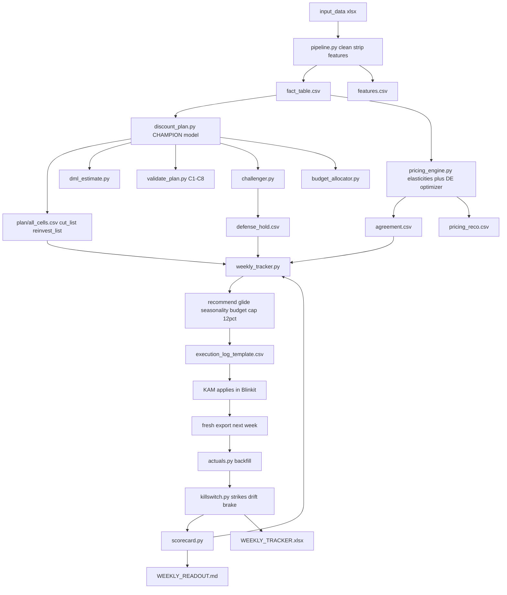

# Complete System Guide — 24 Mantra Organic Discount & Pricing Optimizer

## What this tool does (30-second version)

This tool finds where your discount spend is **wasted** — the product-city combinations where cutting the price gives away margin but doesn't actually sell more units. It doesn't just claim waste; it **proves it five independent ways** (a confounder-controlled causal model, a machine-learning re-estimate, a cross-price cannibalization check, a budget ROI waterline, and a competitor champion/challenger test). It then recommends **safe weekly discount cuts** — small, glided steps with guardrails, engine-agreement checks, hero-SKU shields, and a kill-switch that reverts anything that starts hurting. And it **learns from your actual Blinkit sales every week**, grading its own predictions against the register so it builds a track record you can audit.

Be blunt with yourself about one thing: the headline — **~₹6.98 lakh/month of reclaimable discount** — is **MODEL-PROVEN, not yet register-proven.** It is a well-evidenced forecast, not a number your bank statement has confirmed. The weekly tracking loop and in-market tests are what turn "the model says" into banked cash. Trust the *direction* because five methods agree; trust the *rupees* only once the weekly scorecard fills with real receipts.

## The whole workflow at a glance



## How to read this guide

Start with the **30-second version** and the **workflow diagram** above — together they give you the whole shape in two minutes. Then jump straight to the section that matches whatever file or step you're actually looking at (they're numbered 1–8 below and mirror the workflow left-to-right). Every section opens with plain-English "what it does and why it matters," and most end with a "how to read its outputs" table so you can read a real CSV without a statistician. When a number is model-proven rather than register-proven, the text says so bluntly — don't skip those notes.

## Table of contents

1. [The Data Foundation — what goes in & the "cell" concept](#1-the-data-foundation--what-goes-in--the-cell-concept)
2. [The Discount-Waste Engine — the champion model & the six buckets](#2-the-discount-waste-engine--the-champion-model--the-six-buckets)
3. [The Confirmation Stack — five independent ways the waste survives](#3-the-confirmation-stack--five-independent-ways-the-waste-survives)
4. [The Pricing Engine — elasticities, cross-price & the optimizer](#4-the-pricing-engine--elasticities-cross-price--the-optimizer)
5. [The Budget Allocator — marginal-ROI ladder & the spend waterline](#5-the-budget-allocator--marginal-roi-ladder--the-spend-waterline)
6. [The Weekly Tracker — the closed feedback loop](#6-the-weekly-tracker--the-closed-feedback-loop)
7. [Guardrails & the Kill-Switch — the safety system](#7-guardrails--the-kill-switch--the-safety-system)
8. [How to Run It — commands, order & the weekly cadence](#8-how-to-run-it--commands-order--the-weekly-cadence)
- [Reading the results honestly — the caveats](#reading-the-results-honestly--the-caveats)
- [Glossary](#glossary)

---

## 1. The Data Foundation — what goes in & the "cell" concept

Before the tool can recommend a single price, it has to turn a messy pile of Blinkit exports into one clean, trustworthy table. This section explains exactly what you feed it, the one idea the whole system is built on (the **cell**), what happens to your data on the way in, the handful of settings a non-technical owner might actually change, and what the two foundational tables (`fact_table.csv` and `features.csv`) contain so you know what the modeling engine is looking at.

#### What raw data the tool needs

You drop your Blinkit exports into the `input_data/` folder. These are the platform's daily "RCA"-style reports — one file per month, each a big CSV where every row is *one product, in one city, on one day*. In the current live run there are six monthly files (`JAN_2026_BLINKIT_RCA.csv` through `JUNE_2026_BLINKIT_RCA.csv`), each roughly 200 MB, plus a small `MY SKU.csv` list that the tool deliberately **ignores** during ingestion (any file whose name contains "my sku" or "sku list" is skipped — it's just your SKU roster, not sales data).

The tool doesn't care that the raw column headers are Blinkit's wording. `v4_config.py` holds a translation dictionary called `COL` that names the internal columns the pipeline uses, and `ingest.py` holds a matching `RCA_RENAME` map that turns the platform's raw header wording into those internal names. The columns it reads and what each one means to your business:

| Raw Blinkit column | Internal name | Plain meaning |
|---|---|---|
| `Product ID` | `PRODUCT_ID` | The SKU's unique ID number |
| `Platform` | `GC_PLATFORM` | The sales channel (here, always Blinkit) |
| `Date` | `DATE` | The calendar day of the row |
| `Product Title` | `TITLE` | The product name as shown on the app |
| `Grammage` | `GRAMMAGE` | Pack size (500g, 1kg, etc.) |
| `City` | `GC_CITY` | The city this row's sales are for |
| `Brand` | `BRAND` | Brand name — used to keep only *your* rows |
| `Offtake (MRP)` | `OFFTAKE_MRP` | Gross sales value at full MRP |
| `Offtake (Qty)` | `OFFTAKE_QTY` | **Units sold that day** — the thing we're trying to explain |
| `Selling Price` | `PRICE` | The price shown to the shopper |
| `MRP` | `MRP` | The label ("cross-out") price on the pack |
| `Wt. OSA %` | `WT_AVAILABILITY_PCT` | How in-stock the product was (0–100%) |
| `Wt. Discount %` | `WT_DISCOUNT_PCT` | The day's average discount — **your lever** |
| `Est. Category Share` | `MONTHLY_CAT_SHARE_MRP` | Your share of the category |
| `Overall SOV` / `Organic SOV` / `Ad SOV` | `MONTHLY_OVERALL_SOV` / `MONTHLY_ORGANIC_SOV` / `MONTHLY_AD_SOV` | Share of voice (visibility): total, unpaid, and paid |
| `Wt. PPU` | `WT_AVG_PPU_X100` | Weighted average price per unit |
| `Competitor Price` | `Competitor Price` | Rival's price (used only for competitive positioning; **optional** — RCA exports don't have it, and the tool fills it with blanks and carries on) |

Two things worth knowing: the tool reads these giant CSVs **in 200,000-row chunks** so it never chokes on memory, and it throws away every non-24-Mantra row *as it reads each chunk*, so only your own brand's data ever enters the pipeline. If a required column is genuinely missing, it stops immediately with a plain-English error rather than crashing deep inside the math later.

#### The central idea: the "cell"

**A cell is one product × one pack size × one city.** That's it. `Chana Dal 500g in Bangalore` is one cell; `Chana Dal 500g in Delhi` is a *different* cell; `Chana Dal 1kg in Bangalore` is a *third*. Every cell gets a text ID called `cell_id`, built as `PRODUCT_ID_GRAMMAGE_CITY` — for example `108382_100g_Ahmedabad`.

Why this matters: **pricing is decided per cell, not per product.** The same dal can be price-sensitive in one city and indifferent in another, and a 1kg pack behaves nothing like a 500g pack. Lumping them together would blend those signals into mush. By slicing the world into cells, the tool can say "cut this dal in Delhi but hold it in Bangalore" — which is the whole point of a per-city pricing tool. Think of each cell as its own little shop with its own regulars; you'd never set one price for all your shops at once. In the current live run this comes to **807 cells** across **101 products** and **11 cities** (spanning 112,783 daily rows). Note that not every cell has enough clean data to get its own fitted elasticity — in this run 585 of the 807 cells produced a modeled estimate; the rest fall back to their category/global default downstream.

Grammage is baked into cell identity on purpose. The tool normalizes messy pack-size text first — `500`, `"500 g"`, and `"500g"` all become the canonical `500g`, and `1000` or `"1 kg"` become `1kg` — so a 500g and a 1kg variant are *never* accidentally merged into the same cell.

#### What `pipeline.py` does, end to end

`pipeline.py` is the master conductor. Running `python pipeline.py` executes eight numbered stages in order and drops all results into a fresh timestamped folder under `v4_outputs/` (e.g. `v4_outputs/20260705_161703/`). This section covers the foundational first three stages — the ones that build the data the models later read. The flow:

1. **Ingest (Stage 1).** Read every `.csv`/`.xlsx` in `input_data/`, translate columns via `RCA_RENAME`/`COL`, keep only own-brand rows, normalize grammage, assign each row a **category**, and **deduplicate** to one row per (product, grammage, city, date) — keeping the *last* row if the same cell-day appears twice. It also runs a brand-match safety check that **fails loudly** (raises an error) if your brand name would accidentally swallow a competitor (e.g. a short brand like "Sun" eating "Sunfeast") or drop a legitimate spelling of your own brand — this guard is on whenever `STRICT_OWN_BRAND_MATCH` is left at its default `True`.

2. **Clean & flag (Stage 2 → writes `fact_table.csv`).** This is where the raw numbers become trustworthy:
   - **Fills gaps** — forward/back-fills missing availability and price *within each cell*; fills remaining blanks in units, discount, ad-share, and offtake-MRP with 0.
   - **Computes a `stable_mrp`** — because the raw MRP column drifts day to day, the tool takes the **90th percentile of MRP per product-grammage** as the clean "label price," then derives `selling_price = stable_mrp × (1 − discount/100)` (floored at ₹1). This gives one honest shelf price instead of noisy daily wobble.
   - **Flags each day** — marks out-of-stock days (availability below `OSA_OOS_THRESHOLD` = 50%), festival days, and platform-event days (like Big Billion Days), then marks the rest as `is_regular_day = 1`. Only regular days are trustworthy training data; sale-day spikes and stock-outs would lie to the model.
   - **Strips outliers** — for each cell, on regular days only, it flags any day whose (log) units are more than `OUTLIER_Z_THRESHOLD` (**= 2.0**) standard deviations from that cell's own average, and downgrades it from regular-day status so it's dropped from training. A z-score is just "how many typical days' worth away from normal is this?" — a z of 2 means a day so unusually high or low it's probably a glitch, not real demand. Every removed day is written to `outliers_removed.csv` with the reason, so nothing is hidden. It needs at least `OUTLIER_MIN_OBS_PER_CELL` (**= 30**) days in a cell before it will judge outliers at all.
   - **Assigns each row its `cell_id`.**

3. **Feature engineering (Stage 3 → writes `features.csv`).** Takes the clean fact table and adds the derived columns the model actually learns from — logged units and price, discount surprise vs. the customer's recent reference price, rolling availability and ad averages, calendar dummies, and lagged sales. (The models that consume these are covered in later sections.)

One important honesty note about the **180-day training window**. `TRAIN_LOOKBACK_DAYS = 180` is *the single biggest accuracy lever* in the whole system — but it is **not** applied here in the foundation. `fact_table.csv` and `features.csv` still contain the **full history** you fed in (the live run spans 2026-01-01 to 2026-06-30). The 180-day cut is applied later, inside the Stage 4 modeling step, which trains only on the most recent 180 days of regular days. So don't be surprised that these two foundational files are bigger than 180 days — that's by design; the trimming happens downstream.

#### The handful of knobs a non-technical owner might touch

Everything lives in `v4_config.py`. Most of it you should leave alone, but these are the levers that are genuinely business decisions, not statistics:

| Knob | Default | What it does — in plain terms |
|---|---|---|
| `BRAND_NAME` | `"24 Mantra Organic"` | Your brand. **The one thing to change when onboarding a new client.** Everything not matching this is treated as a competitor. |
| `OWN_BRAND_PATTERNS` | `["24 Mantra Organic", "24 Mantra"]` | Alternate spellings of your brand in the data. Leave empty and it derives from `BRAND_NAME`. |
| `CATEGORY_MODE` | `"column"` | How products get grouped into categories. `"column"` trusts Blinkit's own `Category` column (best when the catalogue is large and clean — the current setting; the raw column it reads is set by `CATEGORY_SOURCE_COLUMN`, default `"Category"`). `"auto"` guesses the category from the product title. `"keywords"` lets you hand-define groups. |
| `TRAIN_LOOKBACK_DAYS` | `180` | How many recent days the model learns from. 180 (≈6 months) avoids being fooled by old price regimes and launch ramps. Set to `None` to use all history (not recommended). |
| `FESTIVAL_DATES` | (dated list) | Indian festival calendar (Holi, Diwali, etc.). Days near these are flagged and excluded from training so a Diwali spike isn't mistaken for normal demand. Edit to add/adjust festivals. |
| `PLATFORM_EVENT_WINDOWS` | (dated ranges) | Blinkit sale windows (Big Billion Days, Black Friday, etc.). Same idea — flagged and excluded. |
| `OSA_OOS_THRESHOLD` | `50` | Below this availability %, a day counts as out-of-stock and is left out of training. |
| `OUTLIER_Z_THRESHOLD` | `2.0` | How aggressively to strip freak sales days. Higher = keep more days (looser). |

If you only ever touch one setting, it's `BRAND_NAME`. If you touch two, add `TRAIN_LOOKBACK_DAYS`.

#### `fact_table.csv` — the clean daily record (what Stage 2 produces)

One row per cell per day, cleaned and flagged. This is the honest, human-readable "ledger" before any modeling math. Column groups:

| Column group | Columns | How to read it |
|---|---|---|
| **Identity** | `PRODUCT_ID`, `TITLE`, `GRAMMAGE`, `GC_CITY`, `GC_PLATFORM`, `BRAND`, `Category`, `category`, `cell_id`, `DATE` | Which product/pack/city/day this row is. Both `Category` (the raw platform column, kept as-is) and `category` (the cleaned category the tool actually uses) are present. `cell_id` is the key you'll sort and filter by. |
| **Price & discount** | `MRP`, `stable_mrp`, `PRICE`, `selling_price`, `WT_DISCOUNT_PCT`, `discount_pct_actual`, `WT_AVG_PPU_X100` | `stable_mrp` = clean label price; `selling_price` = what the shopper paid; `discount_pct_actual` = the cleaned discount (clipped to 0–80%). |
| **Demand** | `OFFTAKE_QTY`, `OFFTAKE_MRP` | `OFFTAKE_QTY` = units sold that day — the outcome the whole system explains. |
| **Availability & visibility** | `WT_AVAILABILITY_PCT`, `MONTHLY_OVERALL_SOV`, `MONTHLY_ORGANIC_SOV`, `MONTHLY_AD_SOV`, `MONTHLY_CAT_SHARE_MRP` | Was it in stock and visible? Low availability or share explains soft sales that have nothing to do with price. |
| **Competitive** | `Competitor Price` | Rival's price where available (often blank in RCA exports). |
| **Day flags** | `is_oos_day`, `is_event_day`, `is_festival`, `event_name`, `is_regular_day`, `is_outlier`, `outlier_reason` | The trust filter. `is_regular_day = 1` means "clean, ordinary day, safe to learn from." A `1` in `is_oos_day`, `is_event_day`, or `is_outlier` explains why a day was set aside. |

#### `features.csv` — the modeling-ready table (what Stage 3 produces)

Same rows as `fact_table.csv`, plus the engineered columns the elasticity model actually reads. You rarely open this by hand, but here's what the modeling layer sees:

| Feature group | Columns | Plain meaning |
|---|---|---|
| **Logged outcomes & price** | `log_units`, `log_revenue`, `log_price`, `discount_pct` | "Logged" just means put on a percentage-change scale so the math reads elasticity cleanly (a 1% price move → X% units move). |
| **Reference-price / deal-signal** | `avg_selling_price_30d`, `price_surprise`, `reference_discount`, `discount_surprise`, `log1p_discount`, `is_deep_promo` | Captures how *surprising* today's price/discount is vs. what the shopper has gotten used to over the last 30 days — the psychology of "is this actually a deal?" |
| **Competitive & availability** | `rpi` (relative price index vs. competitor), `osa_rolling_7d`, `ad_rolling_7d`, `log_ad_sov` | Controls so the model doesn't blame price for a drop that was really a stock-out or lost visibility. |
| **Calendar** | `day_of_week`, `is_weekend`, `month`, `month_2…month_12`, `dow_1…dow_6` | Weekday, weekend, and month indicators so seasonality isn't mistaken for a price effect. |
| **History (lags)** | `lag1_log_units`, `lag7_log_units`, `lag1_log_price`, `lag1_discount`, `rolling_mean_7d_log_units`, `rolling_mean_14d_log_units` | Yesterday's and last-week's sales/price, plus 7- and 14-day running averages — demand has momentum. |

**Bottom line:** the foundation's job is to take raw Blinkit exports, keep only your brand, split the world into 807 per-city/per-pack **cells**, clean the prices, quarantine the days you can't trust (stock-outs, festivals, sale events, freak spikes), and hand the models two tables — a human-readable ledger (`fact_table.csv`) and a math-ready version (`features.csv`). This is descriptive bookkeeping, not modeling — the honesty here is that these tables are *clean inputs*, and every judgment call (which days to drop, what the stable price is) is written down and auditable, not buried.

---

## 2. The Discount-Waste Engine — the champion model & the six buckets

This is the heart of the tool. Everything else feeds it or reacts to it. In one sentence: it takes every product-in-a-city, isolates what your **discount alone** is doing to sales (stripping out stock problems, ad spend, competitor moves and the season), and then sorts every one of those product-city combinations into an action bucket — cut, protect, or leave alone — banking savings **only** where the math proves the discount is losing money.

The whole engine lives in one file: `scripts/analysis/discount_plan.py`. It writes its answers to `<run>/plan/all_cells.csv` (the master ledger — one row per product-city), plus two focused shortlists (`cut_list.csv`, `reinvest_list.csv`) and a scorecard (`plan_summary.json`). The numbers below are from the latest run, `v4_outputs/20260705_161703/`.

#### The one word you need: a "cell"

A **cell** is one product in one city — e.g. *Moong Dal (Dhuli) 500g in Bangalore*. It is the smallest unit the tool makes a decision about, because the same product can be a hero in Bangalore and dead weight in Ahmedabad. This run has **585 cells** across **84 products** and **19 categories**, built from **26 weeks** of data. Think of a cell as a single shelf in a single store — the tool priced each shelf on its own evidence.

---

#### 1. The champion model — what it is and why every term is there

**Plain English:** Sales go up and down for many reasons at once — you ran a discount, but you were also *in stock*, you were *running ads*, a *competitor* moved, and it was a *festival month*. If you just look at "sales went up when I discounted," you'll credit the discount for things it didn't do. This model is a referee that holds all the *other* reasons still, so we can see what the discount **by itself** did. That is the difference between a guess and a receipt.

The exact formula the code fits (from `plan_summary.json` → `formula`, matching `fit_models()` in `discount_plan.py`):

```
np.log1p(units) ~ C(cell_id) + disc + disc_sq + log_osa + log_adsov
                  + comp_share + lag1_lu + lag2_lu + C(month)
```

Translated term by term:

| Term in the formula | Plain-English meaning | Why it's in the model |
|---|---|---|
| `np.log1p(units)` | The thing we're explaining: weekly units sold, on a "percentage" scale (`log1p` = `log(1+units)`, which turns "sold 10% more" into a clean straight-line move). | Sales scale multiplicatively, not by fixed amounts; the log scale is what makes a single discount coefficient mean "X% lift per discount point." |
| `C(cell_id)` | A separate baseline for **every cell**. Each shelf gets its own starting level. | This is the "fixed effect." It absorbs everything permanent about a cell — Bangalore just buys more dal than Ahmedabad — so the discount effect isn't polluted by which cities are naturally big. |
| `disc` | **Own-discount** — the discount % on this cell. Its coefficient is the star of the show. | This is the semi-elasticity: how much sales move per extra point of discount, *with everything else held still*. |
| `disc_sq` | **Curvature** — discount squared. Captures diminishing returns. | The first 10% off does more than the tenth 10% off. Without this, the model wrongly assumes discounts keep paying forever. A negative `disc_sq` means the response *saturates* (bends over). |
| `log_osa` | **On-shelf availability** — the % of time the product was actually in stock, logged. | A discount can't sell what isn't on the shelf. If we don't control availability, an out-of-stock week looks like "the discount failed" when really the shelf was empty. |
| `log_adsov` | **Ad share of voice** — how loud your ads were vs. the category, logged (`log1p`). | Sales lifts from ad spend get wrongly credited to discount unless we hold ad noise still. |
| `comp_share` | **Competitive share** — your category share (logged); higher = you dominate the shelf. | Separates "I sold more because I cut price" from "I sold more because a competitor went out of stock." |
| `lag1_lu`, `lag2_lu` | **Reverse-causality lags** — last week's and the week-before's sales. | This is the subtle, important one. In real life you *react* to demand: a slow week makes you slap on a discount. Without the lags, the model sees "discount + weak sales" and blames the discount for the weakness. Feeding it last week's sales breaks that backwards arrow. The code notes lag1+lag2 lift out-of-sample accuracy to **0.78** (vs 0.73 with one lag). |
| `C(month)` | **Seasonality** — a separate bump for each calendar month. | Festival demand shouldn't be mistaken for discount power. |

**How it's fit, honestly.** The model is fit **one per category** (19 categories), not one per cell — a per-cell model on ~26 weeks would be an overfit fantasy. This is **partial pooling**: every cell in a category shares one discount curve but keeps its own baseline via `C(cell_id)`. It uses a **Huber-robust** regression (`smf.rlm` with `HuberT`) so a couple of freak weeks can't hijack the line, falling back to plain OLS if that fails. A category is only trusted (`ok = True`) if its fit clears **R² ≥ 0.60** (`CAT_R2_FLOOR`). In this run **all 19 categories cleared it**, and the honest out-of-sample check (train on early weeks, predict the last 6) came back at **R² = 0.781**, with **14 of 18** categories individually beating 0.75.

> **The honest caveat, stated once and plainly:** two R² numbers exist. The *full* R² (0.82–0.93 per category) looks huge, but most of it is the per-cell baselines (`C(cell_id)`) — of course the model knows Bangalore-dal is big. The number that matters is the **within-R²** (0.36–0.71), which measures how well the model explains the *week-to-week wiggle* once baselines are removed. That is the real, more modest bar. The tool reports both; don't let the 0.9 headline fool you.

---

#### 2. The `reliably_waste` gate — why a cut is a *cut*, not a guess

**Plain English:** Knowing a discount is *probably* wasteful isn't enough to yank it — "probably" gets you fired. The tool cuts only when the discount is **statistically proven** to be below the point where it pays for itself. It's the difference between "I think this is losing money" and "even on its best day, this can't break even."

Here's the logic in the code (`diagnose()`):

- **Break-even threshold** (`be_beta`): a discount at level *d* only pays if each extra discount point lifts sales by more than `1 / (100 − d)`. Deeper discounts need a *bigger* sales bang just to stand still. Code: `be_beta = 1.0 / max(100.0 - cur_disc, 1.0)`.
- **The discount's actual punch** (`marg_beta`): the *marginal* effect at the current discount, using both the straight and curved terms: `marg_beta = beta + 2.0 * beta2 * cur_disc`.
- **The gate** (`reliably_waste`): cut **only if** even the *optimistic* edge of the discount's effect still falls short of break-even:

```
marg_beta + 1.96 * se < be_beta
```

The `+ 1.96 * se` is the top of the 95% confidence band — the discount's best plausible case. If *even that* can't clear the pay-line, the discount is genuinely dead weight. The mirror rule, `reliably_pays` (`marg_beta − 1.96*se > be_beta`), flags the opposite — discounts so good that even their *worst* plausible case still pays, which is where you might *reinvest*.

This is the tool's spine: **it never cuts on a hunch.** A cell must be *reliably* below break-even, with room to trim, on a trusted category, and the modeled move must actually produce a positive net-revenue gain (`_bucket()` requires `reliably_waste and has_room and cat_ok and net_gain_mo > 0`).

---

#### 3. Break-even discount and the `_units_factor` logic

**Plain English:** "What discount *should* this cell be at?" The tool finds the discount that makes you the most **net revenue** (revenue after giving away the discount), not the most units. Giving away margin to sell more only wins up to a point; past that you're paying customers to take money from you.

- `_units_factor(d, b1, b2)` = `exp(b1*d + b2*d*d)` — how many times more units you sell at discount *d* versus zero discount, per the fitted curve.
- `_breakeven_disc(b1, b2)` grid-searches discounts from 0% to 60% (steps of 0.5) and picks the one maximizing net revenue `(1 − d/100) * _units_factor(d)`. Because the curve saturates (negative `disc_sq`), this finds a real interior peak — the sweet spot — rather than assuming "more discount = more money."

Two guardrails keep the recommendation honest, both in `diagnose()`:
- **No extrapolation below the evidence:** the target discount is floored at the category's 10th-percentile observed discount (`cat_p10`). The tool won't recommend a discount lower than anything it has actually seen work — `tgt_disc = min(cur_disc, max(be_disc, floor))`. It also **never raises** a discount here.
- **No phantom gains:** when computing units at the new discount, the ratio is clamped with `min(ratio, 1.0)` — cutting price can **never** be modeled as *raising* units. This kills any reverse-causality ghost that would otherwise reward cutting.

Net gain per cell = `(target units × target price) − (current units × current price)`, scaled to a month (`× 30/7`).

---

#### 4. The buckets — how every cell gets an action

**Plain English:** Once the model has isolated the discount and diagnosed each cell, `diagnose()` → `_bucket()` drops every cell into exactly one box, and the box *is* the instruction. Crucially, the tool checks the "don't touch" reasons **first** — it will never cut a cell whose problem is really stock or competition.

The routing order in `_bucket()` (first match wins):

| Bucket | What it means | Trigger in the code | Action it implies |
|---|---|---|---|
| **`a_stock`** | Sales are gated by **availability**, not discount. | `osa_mean < 75` (`OSA_LOW`) **or** availability is materially dragging sales down (`c_osa < −0.05`). | **Do NOT cut.** Fix stock. A discount can't sell an empty shelf. |
| **`b_competitive`** | You're **losing category share** — a defensive position. | `comp_pressure` (share fell >15% recent vs. early, `COMP_DROP_PCT`) **or** competition materially dragging (`c_comp < −0.05`). | **Do NOT cut** — pulling discount here may *accelerate* the loss. |
| **`f_monitor`** | Uncertain, or the driver is **visibility** (ad SOV), not discount, or the flat cell has no confident action. | Ad-SOV drag (`c_adsov < −0.05`), **or** the catch-all when nothing else fires. | **Watch, don't bank.** Test if you want, but no confident lever. |
| **`c_waste_cut`** | **Genuine waste** — discount reliably below break-even with room to trim. | `reliably_waste and has_room and cat_ok and net_gain_mo > 0`. | **CUT** to the target discount; this is where savings are banked. |
| **`e_reinvest`** | Discount **reliably pays** and sits below its net-revenue-optimal level. | `reliably_pays and cur_disc < be_disc`. | **Protect / add discount** — an extra rupee here returns more than a rupee. |

Two more labels appear in the code's narration but are worth understanding: **`d_test_trim`** (growing on something *other* than discount → discount may be redundant, trim and measure) is described in `_reason()` but `_bucket()` never actually assigns it in the current logic — the `f_monitor` catch-all absorbs those cells. There is also a **strategic / hero** notion — cells that are genuine growth engines you protect regardless of break-even math — handled through the `reinvest_list.csv` carve-out and the separate test-unlock flow (`test_unlock_list.csv`) rather than as a distinct `_bucket()` return value.

**In this run, the 585 cells split as:**

| Bucket | Cells | Read it as |
|---|---|---|
| `a_stock` | 318 | Over half your shelves — the biggest lever isn't pricing, it's **staying in stock**. |
| `b_competitive` | 117 | Defensive positions — hold the line. |
| `f_monitor` | 87 | No confident call — measure before acting. |
| `c_waste_cut` | 63 | **The money.** Provable discount waste to trim. |

Note there are **zero** `e_reinvest` cells assigned as a bucket this run — the reinvest opportunities surface separately through `reinvest_list.csv` (this run flagged **59** reinvest cells by the headroom rule).

---

#### 5. The headline number — and exactly how honest it is

**~Rs 6.98 lakh/month** (`achievable_savings_mo_highconf = 697,722`) is the banked figure: the net-revenue gain from trimming the **61 high-confidence** waste cells to their target discount. On top of that sit **Rs 27,347/mo** of *experimental* cuts (2 cells the data can't yet confirm — reported as upside-to-test, **never banked**), for an all-confidence total of **~Rs 7.25 lakh/mo**. This clears the Rs 6–10 lakh target (`meets_target = true`).

> **Model-proven, not register-proven.** Be blunt with yourself here. This Rs 6.98L is what the *model* says you'll save if its isolated discount curves are right and you actually execute the trims. It is **not yet a number your bank statement has confirmed.** The confidence gate, the break-even CI test, the no-phantom-gains clamp and the 0.78 out-of-sample R² are what make it *credible* — but the only way "model-proven" becomes "register-proven" is to run the cuts and watch the till. Treat 6.98L as a well-evidenced forecast, not a booked saving.

---

#### 6. Every column of `all_cells.csv`, decoded

This is your master ledger — one row per cell, 40 columns. Open it and read it with this map (the `cut_list.csv` and `reinvest_list.csv` are the same columns, filtered).

| Column | Plain meaning | How to read it |
|---|---|---|
| `cell_id` | Product + pack + city key (e.g. `126995_500g_Bangalore`). | The shelf this row is about. |
| `product_id` | Blinkit product ID. | Join key back to the catalog. |
| `city` | City. | Which market. |
| `category` | Category (drives which model was used). | 19 possible values. |
| `title` | Human product name. | For sanity-checking `cell_id`. |
| `mrp` | Stable list price (₹). | The "before discount" price. |
| `n_weeks` | Weeks of data for this cell. | <8 = thin (see `confidence`). |
| `units_total` | Total units over the window. | Cell size. |
| `cur_units_wk` | Current weekly units (last 4 wks, volume-weighted). | Today's run-rate. |
| `cur_disc` | Current discount % (last 4 wks). | What you're giving away now. |
| `cur_price` | Current avg selling price (₹). | `mrp × (1 − cur_disc/100)`. |
| `osa_mean` | Avg on-shelf availability %. | <75 → stock problem (`a_stock`). |
| `cat_share_drop` | Category-share drop, recent vs. early. | >0.15 → losing share (`b_competitive`). |
| `trend` | `growing` / `flat` / `declining` (±5% band). | Direction of sales. |
| `comp_pressure` | True if share dropped >15%. | True → defensive. |
| `beta_disc` | The isolated discount coefficient for this cell's category. | >0 = discount helps sales; the model's core estimate. |
| `sig_pos` | Is the discount effect reliably positive? (`beta − 1.96·se > 0`) | True = discount provably lifts sales at all. |
| `reliably_waste` | Is discount provably **below** break-even? | **True = safe to cut.** The cut gate. |
| `reliably_pays` | Is discount provably **above** break-even (even worst case)? | True = candidate to protect/reinvest. |
| `marg_beta` | Marginal discount punch at current level (`beta + 2·beta2·cur_disc`). | Compare to `be_beta`. |
| `be_beta` | Break-even threshold `1/(100−cur_disc)`. | If `marg_beta` (with CI) < this → waste. |
| `driver` | Factor that actually moved the cell: discount / osa / ad_sov / competitive / steady. | "steady" = flat with nothing driving it (classic waste). |
| `be_disc` | Net-revenue-optimal discount %. | The sweet-spot discount. |
| `tgt_disc` | Recommended discount % (floored to observed range, never raised). | Where to move `cur_disc` to. |
| `c_disc` | Discount's contribution to recent sales change (log-units). | Big positive = discount is working. |
| `c_osa` | Availability's contribution. | < −0.05 → stock is dragging. |
| `c_adsov` | Ad-SOV's contribution. | < −0.05 → visibility dragging. |
| `c_comp` | Competitive contribution. | < −0.05 → competition dragging. |
| `tgt_units_wk` | Modeled weekly units at target discount (clamped: cut never raises units). | Should be ≤ `cur_units_wk`. |
| `net_gain_mo` | Modeled ₹/month gain from moving to target. | The banked saving for this cell. |
| `marginal_roas` | Revenue returned per ₹ of discount removed. | <1 in `cut` cells = the discount was losing money. |
| `disc_spend_mo` | Current ₹/month spent on this cell's discount. | The pot you're spending now. |
| `cat_ok` | Did this cell's category clear the R² floor? | False → not trusted. |
| `cat_r2` | The category's full-model R². | Remember: inflated by baselines. |
| `cat_med_disc` | Category median discount. | Context for "is this cell high-discount?" |
| `disc_std` | Within-cell discount variation (ppt). | <1.5 → too flat to trust its ROAS. |
| `confidence` | `High` / `Experimental` / `Low`. | Only **High** cuts are banked. |
| `bucket` | The action box (see §4). | Your instruction. |
| `decision_reason` | One-line human rationale. | Read this to understand any single row fast. |
| `reinvest_headroom_pp` | Points of discount headroom below `be_disc` (0 if none). | >1 + `sig_pos` → a reinvest candidate. |

**Worked example (a real `c_waste_cut` row):** `126995_500g_Bangalore` (Moong Dal Dhuli) — `cur_disc = 26.78%`, `marg_beta = 0.00155` vs `be_beta = 0.01366`, so `reliably_waste = True`. Target trims to `2.45%`, units held (`tgt_units_wk 658` ≈ current `711`), producing `net_gain_mo = ₹83,182`. Read plainly: *you're giving away 27% off dal that the discount isn't earning; drop it to ~2% and keep the volume, and you claw back ₹83k/month on this one shelf.*

---

## 3. The Confirmation Stack — five independent ways the waste survives

One number carries this whole tool: "you are spending roughly ₹7L a month on discounts that don't move any extra units." Before you act on a number that big, you should demand proof — and not one flavour of proof, but several that don't lean on each other. This section is that proof. The same waste conclusion is reached from **five independent angles**. When five methods that could each have failed differently all point the same way, the answer is robust — not a fluke of one model's assumptions.

Here's the honest framing up front: the main plan is built on one statistical model (a linear fixed-effects regression — think "a careful average that holds city, stock, ads, and competition constant"). Any single model can be wrong. So we stress-test it. If a second, completely different method disagreed, or if competitor behaviour secretly explained the "waste," you'd want to know **before** you cut prices. Nothing here overturned the number. That's the point.

The five angles:

| # | Angle | File | What it independently checks |
|---|---|---|---|
| 1 | **Double ML** — a machine-learning re-estimate | `scripts/analysis/dml_estimate.py` | Does a totally different (ML-based) engine agree the discount does nothing? |
| 2 | **Validation gates C1–C8** | `scripts/analysis/validate_plan.py` | Does every cut clear 8 pre-set safety checks? |
| 3 | **Competitor champion/challenger** | `scripts/analysis/challenger.py` | Is the "waste" actually price-defence against rivals in disguise? |
| 4 | **Competitor feature build** | `scripts/analysis/competitor_features.py` | Are we even *looking* at what rivals do, or flying blind? |
| 5 | **The reconciliation trail** | `dml_results.json`, `CHALLENGER_REPORT.md`, `defense_hold.csv` | Are the receipts written down and holding? |

---

#### 1. Double ML — a second, machine-learning engine reaches the same verdict

**What it does & why it matters.** The main plan uses a linear model. Double Machine Learning (`dml_estimate.py`) re-estimates the discount effect using a fundamentally different tool — gradient-boosted trees (`HistGradientBoostingRegressor`), a flexible ML method that can catch *curvy, non-linear* relationships a straight-line model misses. If the linear model were fooling itself, this ML method would catch it. It doesn't. That's a genuine second opinion, not a rerun of the same idea.

**The plain-English mechanics.** The problem with measuring "does a discount sell more?" is confounding — other things move at the same time as the discount. When we discount, maybe stock (OSA) was also high that week, or ads (Ad SOV) were heavy, or a rival went quiet. Naively, the discount gets *credit* for sales those other things caused. Double ML strips that out in a specific, defensible way (from the file's own docstring):

1. It uses gradient-boosted trees to predict two things from the confounders `[log_osa, log_adsov, comp_share, lag1_lu, lag2_lu, month]` (stock, ad share, competitive share, last two weeks' sales, and season): (a) how many units you'd *expect* regardless of discount, and (b) what discount you'd *expect* to have run. `XCOLS` in the code is exactly this list.
2. It then looks only at the **leftovers** — the units that the confounders *couldn't* explain (`ỹ`) versus the discount that the confounders *couldn't* explain (`t̃`). The relationship between those two leftovers is the discount's *own* effect, cleaned of everything else. In the code: `theta = np.sum(rt * ry) / denom`.
3. **Cross-fitting** (`KFold`): it trains the ML on part of the data and measures on the held-out part, rotating through the folds, so the model can't "cheat" by memorising. The target is up to `K = 5` folds (`n_splits = min(K, max(2, len(d)//40))`, so smaller categories use fewer folds). This is the "Neyman-orthogonal cross-fitted score" the docstring names — a design that makes the discount estimate robust even when the ML nuisance predictions are imperfect.
4. Cell fixed effects are absorbed by within-cell demeaning (`_demean` subtracts each cell's own mean), so we compare a cell to *itself* over time, never one city against another. A **cell** = one product-size in one city (e.g. `24055_500g_Bangalore`).
5. The error bar (`se`) is **cluster-robust by cell** — it doesn't pretend weeks within the same cell are independent, which would fake a tighter number. See `psi = d.groupby("cell_id")["score"].sum()`.

**The decision rule (the honest bar).** A discount at operating level `d` is declared **reliably waste** only if even the *optimistic edge* of its effect still fails to pay for itself: `theta + 1.96*se < 1/(100−d)`. In plain terms: `1/(100−d)` is the **break-even** — the minimum extra-sales-per-unit-of-discount you'd need just to cover the money given away at that discount depth. If the best-case discount effect is *below* break-even, the discount loses money even on a good day. `1.96*se` is the 95%-confidence cushion, so this isn't "on average it's waste" — it's "waste even accounting for luck."

**What it outputs & how to read it (`dml_results.json`).** One entry per category:

| Column | Plain meaning | How to read it |
|---|---|---|
| `cat` | Category name | e.g. `Dal & Pulses` |
| `theta` | The debiased discount effect (semi-elasticity) | Near **0** = discount does essentially nothing to units |
| `se` | Cluster-robust error bar on `theta` | Small = the near-zero is precise, not just noisy |
| `waste` | Did it clear the reliably-waste bar? | `true` = the ML engine confirms this category's cut |
| `save` | Monthly rupees banked in that category's cuts | The money this confirmation protects |

**The headline result — Dal & Pulses.** This is the single biggest chunk of the plan (`save: 417261.0` — about ₹4.2L/month, over half the total). Its Double ML estimate is `theta = 0.0000483` with `se = 0.00182`. Read that in English: **the discount's causal effect on units is statistically indistinguishable from zero, and measured tightly.** The ML engine, using a completely different method, agrees the Dal discount buys you nothing. In the latest run, **all 10 cut categories** come back `"waste": true`. The script prints a "DML-locked savings" total — the portion of the cut that survives this second, tougher, ML-based test.

> **Honest caveat.** This is *model-proven, not register-proven*. Double ML is a strong causal design, but it's still inference from historical data, not a live A/B test where you actually turned discounts off and watched the till. It dramatically lowers the odds the linear model fooled us; it does not replace real-world confirmation. The weekly tracker (elsewhere in this doc) is where register-proof accumulates.

---

#### 2. Validation gates C1–C8 — eight checks every cut must survive

**What it does & why it matters.** `validate_plan.py` is the pre-flight checklist. Before any cut list is trusted, it runs **eight gates** and prints `PASS`/`FAIL` for each, naming the offending cells. It exits with a failure code unless all pass. This is what stops a plausible-looking but flawed plan from reaching your price screen. Crucially, **gate C8 checks the Double ML result from angle 1** — so the two methods are wired together: the plan literally cannot pass unless the ML second opinion confirms it. (Note: the file's top comment still describes an older "C1–C6" version; the code as it actually runs implements all eight gates below.)

**The eight gates.** Each targets a specific way a discount recommendation could be wrong:

| Gate | What it checks | Why it matters to you |
|---|---|---|
| **C1** | The discount effect is **isolated** from stock (`log_osa`), ads (`log_adsov`), and competition (`comp_share`) — the model formula must contain all three, the competitive control must not be degenerate (all ~0), and every cut names its `driver` and carries a `decision_reason`. | Guarantees "waste" means *waste after controlling for the obvious excuses*, not raw discount-to-sales correlation. |
| **C2** | Every cell is **bucketed** before action; no cut cell is low-stock (`osa_mean < 75`, bucket a) or under competitive pressure (`comp_pressure == True`, bucket b). | You never cut a discount that was only "failing" because you were out of stock or a rival was raiding. |
| **C3** | Every cut has isolated marginal ROAS < 1 (`net_gain_mo > 0`), no confounder is *materially* dragging sales down (`c_osa/c_comp/c_adsov < −0.05`), **no phantom volume** (`tgt_units_wk` must not exceed `cur_units_wk` beyond a 0.1% tolerance), and every cut is CI-backed (`reliably_waste == True`). | No cut relies on the fantasy that cutting price *raises* units, and every cut is below break-even even at the optimistic edge. |
| **C4** | Category fits clear the R² floor (`R2_FLOOR = 0.60`); low-confidence cells are flagged and counted, never treated as certain. | You know which recommendations are High vs Low confidence. |
| **C5** | The money **reconciles**: the sum of cut line-items equals the reported achievable total, and the aggregate is positive. | The headline savings number is not hand-waved — it's the sum of the actual line items. |
| **C6** | Achievable high-confidence savings is measured against the **₹5L target** (`TARGET_LO = 500_000`); if below, the reason is stated. | Honest accounting against the stated goal. |
| **C7** | **Out-of-sample R² ≥ 0.75** (`OOS_R2_BAR = 0.75`) — the model is scored on data it never saw during fitting. | Proves the model *predicts*, not just *memorises*; ~0.75 means it explains most of the sales variation on fresh data. |
| **C8** | **Every banked cut category is confirmed reliably-waste by Double ML** — reads `dml_results.json`, flags any cut category that is `not waste` or has no DML estimate at all. | This is the interlock: the plan fails unless angle 1 (the ML engine) independently signs off on each category. |

**How to read it.** The tail of the run prints `C1-C8: ALL PASS` or `FAIL — see above`, plus the achievable savings and the out-of-sample R². A single failing gate blocks the plan. This is deliberately unforgiving.

---

#### 3. Competitor champion/challenger — is the "waste" actually price-defence?

**What it does & why it matters.** This is the most business-critical stress test. The scary possibility: what if some of your "wasteful" discounts were actually *holding the line* against a rival's promo — and cutting them would quietly cede share? `challenger.py` tests exactly this by building a **challenger model** that adds competitor behaviour and checking whether the story changes.

**The mechanics — never edit the validated model.** The rule is disciplined and pre-registered (decided *before* seeing results, so we can't move the goalposts):

- **Model A (the champion)** — the existing validated model, left completely untouched. Its formula: `log1p(units) ~ C(cell_id) + disc + disc_sq + log_osa + log_adsov + comp_share + lag1_lu + lag2_lu + C(month)`.
- **Model B (the challenger)** — Model A *plus* one new control, `comp_avg_disc` (the average discount rivals were running that week, from `competitor_features.csv`).
- **The pre-registered acceptance rule:** adopt Model B **only if it wins on all counts** — (i) out-of-sample R² still ≥ 0.75, (ii) all category fits still clear the R² floor, (iii) the competitor coefficient has a *sane sign* (rivals discount more → our units not up, i.e. `comp_agg <= 0.02`), **and** (iv) the competitor signal is *materially informative* (`comp_agg < −0.005`) and (v) B doesn't lose accuracy vs A (`oosB >= oosA − 0.005`). Ties go to the champion. This means: we only complicate the model if competition genuinely changes the answer.

**The result — KEEP Model A.** From `CHALLENGER_REPORT.md` (run `20260705_161703`):

| | Model A (champion) | Model B (+ competitor) |
|---|---:|---:|
| Out-of-sample R² | 0.781 | 0.762 |
| Waste-cut cells | 63 | 60 |
| High-conf savings/mo | ₹697,722 | ₹663,660 |
| Competitor coef (agg) | — | **+0.0008 (sane but near-zero)** |

The verdict is **"KEEP Model A (champion) — B did not clear the bar or added nothing material."** The competitor coefficient is `+0.0008` — essentially zero. In plain English: **for this brand, what rivals discount barely moves your units, and is only mildly correlated with your own discounting.** Adding competition *lowered* accuracy (0.781 → 0.762), so the challenger failed the "must not degrade" test. The report's honest read: *"the discount waste is real, not competitive defense in disguise. Model A stands; the challenger confirms its robustness rather than overturning it."*

**The 3 competitive-defence cells — the safety valve.** Even though competition is not a *systematic* confounder, the challenger flagged **3 individual cells** where Model A said "waste" but Model B said "not waste" (bucket `c_waste_cut` → `f_monitor`). These are cells where your discount may have been quietly defending against a rival promo. Rather than gamble, the tool **holds them out of the cut wave** entirely. They're written to `defense_hold.csv`, which the weekly tracker reads to *exclude* them from cuts. This file is **regenerated every retrain**: if a future run finds zero defence cells, it writes an empty file, which correctly *releases* any prior holds. The three held cells:

- `24055_500g_Bangalore`
- `24055_500g_Hyderabad`
- `5793_500g_Bangalore`

**How to read `defense_hold.csv`:**

| Column | Plain meaning |
|---|---|
| `cell_id` | The product-size-city held out of cutting |
| `product_id` | The SKU (e.g. `24055`, `5793`) |
| `city` | The city |
| `reason` | Why it's held: `competitive defense (challenger reclassified c_waste_cut -> f_monitor)` |

The business logic: you'd rather forgo a few thousand rupees of *possible* savings on 3 cells than risk ceding shelf position to a rival. The tool defaults to caution exactly where it should.

---

#### 4. Competitor feature build — proof you're not flying blind

**What it does & why it matters.** Angle 3 can only test "is this competitive defence?" if it actually *knows* what competitors did. `competitor_features.py` is what makes that possible. Your weekly market export (the RCA file) is an **all-brand scan** — every brand's price, discount, and availability in each category-city. Standard ingestion throws away every non-24-Mantra row. This module *keeps* the competitor rows and rolls them into a compact pressure table. Without it, the challenger test in angle 3 would be impossible — you'd be asserting "competition doesn't matter" while having no data on competition at all.

**The mechanics (plain terms).** It reads the raw market files (in memory-safe chunks of 200,000 rows as text, since they can be ~200MB), tolerantly matches column names (`'Wt. Discount %'`, `'wt discount %'`, `'Discount'` all resolve to the same field via case-insensitive "contains" matching), keeps only rows whose brand is **not** own-brand (`own_brand_patterns` like `['24 mantra', '24mantra']`), and aggregates to one row per (Category, City, ISO-week).

**What it outputs & how to read it (`competitor_features.csv`).** One row per category × city × week:

| Column | Plain meaning | How to read it |
|---|---|---|
| `Category`, `City`, `iso_week` | The cell and week (e.g. `Besan & Gram Flour`, `Ahmedabad`, `2026-W01`) | The join keys |
| `comp_median_price` | Typical rival shelf price (median = robust to one weird SKU) | Where rivals are pricing |
| `comp_avg_disc` | Mean rival discount % | The signal fed into Model B |
| `comp_max_disc` | Deepest rival discount that week | The scariest promo |
| `comp_p75_disc` | 75th-percentile rival discount | Upper-band pressure, less noisy than max |
| `comp_avg_osa` | Mean rival availability % | Are rivals in stock and taking demand? |
| `n_comp_skus` | How many rival SKUs backed the numbers | Low count = thin week, low trust |

A real row (first data line): `Besan & Gram Flour, Ahmedabad, 2026-W01` had `comp_avg_disc = 25.1%`, `comp_max_disc = 52.6%`, backed by `n_comp_skus = 40` rivals. The module ships with a built-in smoke test that proves own-brand rows are excluded and the aggregates compute correctly — so the competitor numbers feeding angle 3 are themselves verified.

---

#### 5. Why five angles = robust (the reconciliation trail)

Any one method can be wrong in its own way. A linear model can miss curvature. An ML model can overfit. A validation gate can be too lenient. A competitor test can lack data. The strength here is that these failure modes are **independent** — and all five point the same direction:

- **Angle 1 (Double ML)** attacks it with a completely different engine (gradient-boosted ML, cross-fitted). Verdict: Dal `theta ≈ 0`, all 10 cut categories `waste: true`.
- **Angle 2 (C1–C8)** attacks it with eight pre-set safety gates. Verdict: the plan only ships on `ALL PASS`, and C8 forces angle 1 to sign off.
- **Angle 3 (challenger)** attacks the scariest business risk — "is this defence, not waste?" Verdict: KEEP Model A, competitor coefficient `+0.0008`, savings survive intact; 3 borderline cells held out as a safety valve.
- **Angle 4 (competitor build)** proves angle 3 had real data to work with.
- **Angle 5 (the receipts)** — `dml_results.json`, `CHALLENGER_REPORT.md`, and `defense_hold.csv` — writes it all down, regenerated every retrain, so the confirmation isn't a one-time claim but a *standing check* that reruns and can flip if the world changes.

The honest bottom line: this stack makes it **very hard for the waste number to be an artifact of one model's assumptions**. It is model-proven from five independent directions. It is not yet register-proven — that's the weekly tracker's job. But if you were waiting for the moment where a second, tougher method disagreed with the plan before you'd act, that moment was tested for, and it didn't come.

---

## 4. The Pricing Engine — elasticities, cross-price & the optimizer

This is the **PricingAI** half of the tool — a scaled-down version of the PepsiCo "PricingAI" blueprint, rebuilt to run on your laptop (no Gurobi solver licence, no cloud). It answers three business questions the per-cell discount tool cannot: *how much do units actually move when I move price?* (elasticity), *do my own SKUs steal sales from each other?* (cannibalization), and *what discount on every SKU×city maximizes revenue without wrecking margin or lurching prices?* (the optimizer). It ends by producing one small file — `agreement.csv` — that acts as a **second signature**: a discount cut only fires downstream when this engine AND the discount planner both agree.

Everything below is read straight from the code and the latest run (`20260705_161703`, 84 SKUs × 11 cities). Where a number is model-produced rather than register-proven, it says so bluntly.

---

#### 1. Elasticity in plain English — and why ours comes with a wide error bar

**What it is.** *Own-price elasticity* is one number that says: *if I drop this product's price by 1%, how many percent do units go up?* An elasticity of **−1.0** means "cut price 1%, sell 1% more units." **−2.0** means very price-sensitive (a 1% cut lifts units 2%); **−0.3** means barely sensitive (shoppers buy about the same no matter the price). It's always negative — cheaper sells more. *Cross-price elasticity* is the sibling version: *if my Rice 1kg gets more expensive, how much does my Rice 5kg pick up the slack?*

**Why it matters.** This is the dial the whole optimizer turns on. If a SKU is elastic, discounting it grows the pie; if it's inelastic, a discount just gives away margin on units you'd have sold anyway. Get elasticity wrong and you either leave money on the table or bleed it.

**How we estimate it (`scripts/pricing/elasticity_bayes.py`).** The active method — confirmed by `gates.json` showing `"method": "conjugate_bayes_empirical_hierarchical"` — is a **Bayesian conjugate regression**, not a black-box guess. Two design choices matter to you:

- **We start with an opinion (an "informative prior"), then let data update it.** Bayesian just means "start from a sensible belief, move it toward what the data shows." The code seeds each category with the belief that own-price is about **−1.0** (`OWN_PRIOR_MU = -1.0`, `OWN_PRIOR_SD = 0.8`) and cross-price is a small positive **+0.15** (`CROSS_PRIOR_MU = 0.15`, `CROSS_PRIOR_SD = 0.4`) — i.e. "assume goods are moderately elastic and siblings are mild substitutes, unless the data screams otherwise." A thin, noisy category gets pulled back toward that plausible value **with a wide error bar**, instead of being estimated wild and then hard-clipped. The file header is explicit: *"never estimated wild then clipped."*

- **Categories borrow strength from each other ("empirical-Bayes hierarchical shrinkage").** The code fits every category once (Stage 1), pools them into a single global own-price mean `mu_g` (`gates.json` → `global_own (mu_g) = -1.005`), then refits each category shrunk toward that global anchor (Stage 2). A category with little data leans on the whole portfolio's behavior rather than trusting its own noisy slope.

Before any of that, it cleans out confounders using **Frisch–Waugh–Lovell residualization** (`_residualize`): it strips out each cell's baseline level (cell fixed effects), promo flags, on-shelf-availability (`ln_osa`), and month seasonality *first*, so the leftover price↔units wiggle is closer to a true price effect and not "we happened to be in stock that week."

**Why not a "real" Bayesian sampler (PyMC)?** The header answers this directly: PyMC forces `numpy>=2`, which **binary-breaks** the repo's numpy-1-compiled `sklearn`/`statsmodels` stack — they can't coexist. So the code uses the **closed-form conjugate posterior** instead (the `_bayes()` function: `Sn = (S0⁻¹ + XᵀWX/σ²)⁻¹`, `mn = Sn(S0⁻¹m0 + XᵀWy/σ²)`). This is a genuine Bayesian posterior — mean *and* a real uncertainty (SD) — without the dependency war. There is **no hard clip** on the final number; a `WIDE_SD = 0.6` threshold merely *flags* low-confidence cells, it doesn't squeeze them.

**What it outputs & how to read it — the blunt truth.** In the latest run (`elasticities.csv`, 585 cells):

| What the run shows | Value | How to read it |
|---|---|---|
| Median own-elasticity | **−1.01** | Portfolio looks moderately elastic on paper: 1% cut ≈ 1% more units. |
| Median own_sd (error bar) | **±0.76** | The error bar is nearly as big as the number. That's huge. |
| Cells flagged low-confidence | **585 / 585 (100%)** | **Every single cell** is low-confidence. |
| Low-confidence categories | **19 / 19** (`gates.json`) | Not one category is cleanly identified. |

Read this honestly: **the median elasticity is essentially the prior, not a discovery.** With own_sd around ±0.76 on a −1.0 estimate, a cell could plausibly be −0.25 (barely worth discounting) or −1.75 (very worth it) — the data can't tell you which. The report itself says it out loud: *"once confounders are controlled, within-cell price variation barely identifies own-price."* This matches your prior validation memory — discount barely drives sales once OSA/SOV/competition are controlled. **The elasticity engine is telling you the same wall exists, but shows it as an honest wide band rather than a fake-precise point estimate.** The practical rule the report enforces: *low-confidence cells should be acted on only via a live test, never banked as a booked saving.*

(One more honest note: `promo_elast` is written as **0.0** for every cell in the Bayes path — there is no separate promo-lift term in this engine. Don't read anything into that column.)

---

#### 2. Cross-price / cannibalization — siblings stealing each other's sales

**What it is & why it matters.** If you deepen the discount on your Wheat Atta 1kg, some of the extra units don't come from competitors — they come from your *own* Wheat Atta 5kg or Multigrain Atta. That's **cannibalization**. The per-cell tool is blind to it: it sees "Atta 1kg sales held after we cut its discount" and calls it a win, missing that the volume just migrated across your own shelf and the *portfolio* didn't grow. This matrix is what lets the tool say "the portfolio gained," not just "this SKU held."

**How it's built.** For each category, the Bayesian fit produces one category-level cross coefficient. That single number is split evenly across the siblings in each city: `ce = category_cross / (number_of_siblings − 1)` (see `estimate_elasticities`, the `cross_rows` loop). Pairs are only created *within the same category and city* — substitution happens where the shopper actually stands. Near-zero pairs (`abs(ce) < 1e-4`) are dropped.

**Where it's used — the demand formula.** In `de_optimizer.py`, `demand_model()` predicts each cell's weekly units with the log-linear PricingAI equation (the section header calls out `V_i = q0*exp(sum E_ij * dln p_j)`):

```
price_i = mrp_i * (1 − disc_i/100)
dln p_i = ln(price_i) − ln(p0_i)          # % price move vs. baseline, bounded to reachable range
V_i     = q0_i * exp( own_i*dln p_i  +  Σ_j cross_ij*dln p_j  +  PPP_term )
```

In words: a cell's predicted units = its baseline units, scaled up/down by **its own price move** (own elasticity), nudged by **every sibling's price move** (the cross terms — that's the cannibalization), plus a small psychological-price bump.

**Outputs (`cross_price.csv`, 2,594 links this run).** Columns: `product_i`, `product_j`, `city`, `cross_elast`. Read a row as: *"in this city, when `product_j`'s price rises, `product_i`'s units change by `cross_elast`% per 1% move."* Positive = substitutes (siblings pick up your slack); across the 2,594 pairs in this run, **77.0% are non-negative** — the economically sane direction. (A separate gate, `gates.json` → `frac_pos_cross = 0.947`, measures something narrower: the fraction of the **19 category-level** cross coefficients that are non-negative, i.e. 18 of 19 categories — not the per-pair fraction.) **Caveat, same as elasticity:** these cross numbers inherit the same wide-band weakness — they're directional portfolio physics, not register-proven per-pair magnitudes.

---

#### 3. The optimizer — searching for the best discount on every cell

**What it is & why it matters.** This is the "decide the discount" engine. Given the elasticities, the cross matrix, and where each cell is priced today, it searches for the discount % per (product, city) that maximizes your chosen business goal — **without** letting revenue fall through the floor, **without** lurching discounts week to week, and **while** keeping bigger packs cheaper per gram than small packs.

**How it searches — differential evolution, decomposed.** It uses *differential evolution* (`scipy`), a search that tries a whole population of candidate discount plans and breeds better ones over generations — good for a bumpy landscape with no clean formula. Two seeds run and the best feasible result is kept (`n_seeds: 2` in `pricing_engine.CONFIG`).

The clever cost-saver is `optimize_decomposed()` in `pricing_engine.py`. Optimizing all 585 cells at once is intractable. But **cross-price only links SKUs in the same category *and* city**, so each (category, city) group is a completely independent puzzle. The code splits the problem into those small groups (largest ~18 SKUs) and solves each separately. The header notes this is **exact, not an approximation** — there's genuinely no coupling across groups — and it's what makes a full run finish on a laptop.

**The honesty clamps (the whole point — no free lunch).** `demand_model()` refuses to invent demand:

| Clamp | What it does | Why it protects you |
|---|---|---|
| **Reliability kill-mask** | A price *cut* only earns extra volume where own-elasticity is *reliably* negative: `own_elast + 1.64*own_sd < 0` (`Z_RELIABLE = 1.64`). | Given every cell is low-confidence (wide SD), most cells **fail** this test — so the optimizer will NOT "discover" fake demand from cutting an uncertain cell. This is the guard that stops it burning margin chasing phantom lift. |
| **Power-law cap** | Predicted units are capped at the pure power-law response `q0*(price/p0)**own_elast` × a bounded sibling multiplier (`exp` of the cross term clipped to ±0.5). | The `exp()` in the demand curve can never run away to an absurd volume. |
| **Δln-price bounds** | The price-move term is clipped to the discount range actually reachable (`dln_lo`, `dln_hi`). | No extrapolating demand beyond discounts you've ever actually run. |

**The constraints (the guardrails).** Handled as penalties in `_penalized_objective` plus a hard clip afterwards:

| Knob (`CONFIG` in `pricing_engine.py`) | Value | Business meaning |
|---|---|---|
| `kpi` | `revenue` | What it maximizes. Options in code: `revenue`, `volume`, `nrw` (net revenue per kg — a margin proxy), `share`. |
| `revenue_floor_frac` | `0.98` | Optimized revenue must stay ≥ 98% of today's — it can't tank revenue chasing volume. |
| `max_disc_change_ppt` | `3.0` | **Glide rule**: no cell's discount may move more than 3 percentage points in one week. Prices walk, never lurch. This is a *hard* limit — even a cell whose current discount sits outside the allowed band only steps 3ppt toward it per week. |
| `disc_lo` / `disc_hi` | `0` / `45` | Discounts are boxed between 0% and 45%. |
| `ladder_tol` | `1.0` | **Price ladder**: a bigger pack's per-gram price must be ≤ the smaller pack's. A deterministic "ladder repair" pass after the search fixes any tiny inversions exactly, and any residual violation is *reported, not hidden*. |
| `psych_prices` | `[49, 99, 149, …, 999]` | Small ±3% nudge toward landing just under round price points (₹199 beats ₹203). |

**Outputs (`pricing_reco.csv`, 585 cells).** One row per cell:

| Column | Plain meaning | How to read |
|---|---|---|
| `product_id`, `city` | The cell. | — |
| `base_disc` | Discount today. | Your starting point. |
| `opt_disc` | Discount the optimizer recommends. | The move. |
| `base_price`, `opt_price` | Selling price now vs. recommended. | — |
| `pred_units_delta_pct` | Predicted % change in units. | **Model-predicted, not measured.** |
| `pred_rev_delta_pct` | Predicted % change in revenue. | Same caveat. |

**How to read this run bluntly:** with the glide cap at 3ppt and the reliability clamp killing most volume upside, most recommended moves are **small** — the top rows of `pricing_reco.csv` (sorted by predicted revenue Δ) show a handful of ~3ppt cuts with predicted revenue gains up to ~+9%, but the majority of cells barely nudge off `base_disc` with deltas rounding to ~0.0%. Across the run the optimizer projects **+3.1% revenue / +1.5% volume** and moves **73 cells up / 482 down**. That's the honesty clamps doing their job: where the data can't prove a cut pays, the optimizer stays put. Don't expect a dramatic across-the-board jump — expect it to tell you where a *small, safe* move is defensible.

---

#### 4. The what-if simulator — instant portfolio impact of a manual edit

**What it is & why it matters (`scripts/pricing/whatif.py`).** The pricing manager edits **one** SKU's discount in one city and instantly sees the *whole* portfolio move: that SKU sells more, but its category siblings sell a little less (cannibalization). No optimizer runs — it's pure algebra, so it returns in microseconds. The blueprint rule quoted in the file: *"simulate must not call the solver — interactivity is an adoption requirement."*

**The crucial design point: it shares the optimizer's exact brain.** `whatif.simulate()` does **not** carry its own demand equation. It calls `de_optimizer.build_problem(...)` and `de_optimizer.demand_model(...)` — the **same clamped kernel** the optimizer uses internally, including every honesty guard (reliability kill-mask, Δln bounds, power-law cap, within-city cross terms). The audit string in the file confirms it: `_DEMAND_SOURCE = "de_optimizer.demand_model (shared kernel via build_problem)"`. The file's own smoke test even *asserts* the what-if volumes match the optimizer's term-for-term. **Business payoff:** the what-if can never promise volume the optimizer would refuse to bank — the two views can't quietly disagree.

**Outputs.** A `per_cell` list (`disc_before`, `disc_after`, `units_delta_pct`, `rev_delta_pct`) and a `portfolio` roll-up (`revenue_delta_pct`, `volume_delta_pct`, `nrw_delta_pct`). Cells you didn't edit still move if a sibling's price changed — that's the cannibalization made visible. Edits that don't match a real cell are reported under `unmatched_edits`, not silently dropped.

---

#### 5. Orchestration & the engine-agreement handshake (`pricing_engine.py`)

**What it does.** `main()` chains the four modules end to end: build the weekly panel (`pricing_panel.build_pricing_panel`) → estimate elasticities + cross matrix (`estimate_elasticities`) → optimize per category×city (`optimize_decomposed`) → and write everything to `DISCOUNT_PLAN/pricing/`. It picks up the newest `v4_outputs/2026*` run automatically. It also runs a **cannibalization check** on your existing waste-cut list (feeding those cuts through `whatif.simulate`): this run reports the 63 waste-cuts *hold at portfolio level* (**+0.62% revenue**, 86 sibling cells gain) — i.e. the cuts don't just leak into siblings.

**The part that actually gates money — `agreement.csv`.** This is the second-signature interface, **produced here and consumed by the weekly tracker**. The rule (verbatim from the code's own contract):

> `agree_with_cut = True` **iff** the cell is a discount-plan waste cut (bucket `c_waste_cut`) **AND** the pricing optimizer *also* lowers its discount (`pricing_action == 'cut'`).

`pricing_action` per cell is decided by `_classify_action`: `opt_disc < base_disc − 0.5` → **cut**; `opt_disc > base_disc + 0.5` → **raise**; otherwise **hold**. A waste cut only fires downstream when *both* engines say cut; otherwise the tracker **holds and tests first**. This is the whole safety mechanism: two independent engines must both point the same way before real money moves.

**Columns of `agreement.csv`:**

| Column | Plain meaning | How to read |
|---|---|---|
| `cell_id` | Cell identifier (carried from the cut-list, else `<product_id>_<city>`). | — |
| `product_id`, `city` | The cell. | — |
| `pricing_action` | The optimizer's intent: `cut` / `raise` / `hold`. | What *this* engine wants. |
| `agree_with_cut` | `True` only if it's a waste cut AND the optimizer also cuts. | **This is the trigger.** Only `True` rows get cut by the tracker. |

**How to read this run (agreement stats):** across 585 cells the optimizer wants to **cut 425**, **hold 103**, **raise 57** — but `agree_with_cut` is `True` for only **51** cells. That gap is the point: the optimizer cutting a cell is *not* enough; the cell must *also* be on the discount planner's waste-cut list for the two to agree and for money to move. Of the **63** discount-plan waste-cuts, the optimizer independently agrees to cut 51 (and would instead hold 9 / raise 3). Fifty-one double-confirmed cuts is your defensible action list this run; everything else waits for a test.

---

#### Bottom line for the owner

The Pricing Engine adds the one thing your per-cell tool structurally can't: **portfolio physics** — cannibalization, ladders, glide limits, and a demand kernel that refuses to invent volume. But it is scrupulously honest about its own limits: **every elasticity this run is low-confidence**, the median is essentially the prior, and the honesty clamps deliberately keep recommended moves small. Treat its outputs as *model-proven direction*, not *register-proven magnitude* — and note that the whole thing is wired so a cut only ever fires when **both** engines sign off (`agree_with_cut = True`).

---

## 5. The Budget Allocator — marginal-ROI ladder & the spend waterline

This tool asks one blunt money question: **if I have a fixed discount budget, where does each rupee of discount actually earn its keep — and where is it just margin I'm giving away?** It answers with two artifacts from a single engine (`scripts/pricing/budget_allocator.py`): a **marginal-ROI ladder** that shows, cell by cell, exactly where discount stops paying, and a **greedy waterline allocator** that fills a hard budget cap with only the best discount rupees. The headline finding is uncomfortable: at a 10% cap it spends almost nothing, because on this portfolio discount barely clears break-even anywhere.

Everything below runs off the **same demand kernel as the main optimizer** (`de_optimizer.demand_model` — imported, never re-copied), so the ladder and the allocation can't quietly disagree with the pricing engine.

#### Marginal ROI, break-even, and the "elbow" — in shopkeeper terms

**Marginal ROI** = *rupees of net revenue you get back for each extra rupee of discount you spend.* It's not the ROI of the whole discount — it's the ROI of the **next step down** in price. Think of walking down a discount staircase: 0% → 2.5% → 5% → … Each step costs you some margin (that's the "spend") and hopefully sells enough extra units to bring in more revenue (that's the "return"). Marginal ROI is the ratio of those two for that one step.

- **Marginal ROI = 1.0** is **break-even**: the extra rupee of discount brings back exactly one rupee of net revenue. You broke even on that step.
- **Marginal ROI > 1** = that step *made money* — worth taking.
- **Marginal ROI < 1** = that step *lost money*. And when volume goes completely flat (an inelastic staple that sells the same units no matter the price), the ratio pins at **−1.0**: you're handing over a rupee of pure margin and getting zero extra units for it. You can see this in `roi_ladder.csv` — product `3581` in Others holds at ~30.3 units across nearly every discount step, so almost every step reads `marginal_roi ≈ -1.0` (a couple of deep steps dip slightly, but the picture is a flat, inelastic staple giving margin away for nothing).

The **elbow** is the punchline of the whole ladder: it's the **last (deepest) discount step whose marginal ROI is still ≥ 1.0.** Beyond the elbow, every further rupee of discount destroys net revenue. In the code (lines 56–61) it's computed per cell as the highest `disc` among steps with `marginal_roi >= 1.0`, flagged `is_elbow = True`. If a cell has no step that clears 1.0, it has no elbow at all — its profit-optimal discount is zero.

> Mechanics note: the ladder is built by walking a discount grid `np.arange(0, 45 + step/2, step)` with `STEP = 2.5` and `DISC_MAX = 45.0` (line 28) — i.e. **0% to 45% in 2.5-point steps** — varying **one cell at a time** while all its siblings are held at their baseline discount (`dv = disc0.copy(); dv[i] = d`, line 41). So each cell's curve is its *own* isolated response, not a whole-portfolio move.

#### The greedy waterline allocator — buy the best discount rupees first

Once you know every cell's step-by-step ROI, allocation is a shopping problem. You have a budget; you want the highest-return discount rupees you can buy before the money runs out. That's the **waterline** (`allocate_budget`, lines 65–110):

| Step | What it does | Where in code |
|---|---|---|
| Set the cap | `budget = budget_pct × baseline weekly revenue`, where baseline revenue = `sum(q0 × p0)` | lines 67–68 |
| List every increment | For each cell, each ladder step's extra spend `d_sp`, extra net revenue `d_nr`, and its `marginal_roi` | lines 70–78 |
| Sort best-first | Rank all increments across the whole portfolio by marginal ROI, highest first | line 79 |
| Pour until full | Walk the sorted list; buy each increment that clears the rules; stop when the next one would breach the cap | lines 83–91 |

Three rules gate every increment before it's bought:

1. **`roi < 1.0` → skip.** Below break-even is never worth it, budget or no budget (line 85). This is the hard floor.
2. **Contiguity.** You can't jump to a 15% discount without first buying 2.5%, 5%, … up to it. Steps must be taken in order from 0 (`taken_k`, lines 87–88).
3. **The cap binds.** The moment the next increment's spend would push total `spent` over `budget`, the allocator stops and records that increment's ROI as the **`waterline_roi`** — the ROI of the last rupee it *couldn't* afford (lines 89–91). If it never hits the cap, waterline defaults to 1.0 (lines 92–93).

The name "waterline" is the right picture: budget is the water level, discount increments are stacked cheapest-margin-first, and only the ones below the line get funded. Because rule 1 already throws out everything under break-even, the allocator **structurally** pours money into genuinely elastic cells (where deeper discount still returns >1) and pours **zero** into inelastic staples.

#### What the last run actually did — the honest finding

Here's where you should get skeptical *for* the tool, not against it. Reading the real output (`BUDGET_PLAN.md`, latest run):

| Number | Value | What it means |
|---|---|---|
| Baseline revenue | **₹7,700,798/wk** | the reference the cap is a percentage of |
| Cap @ 10% | **₹770,080/wk** | the budget the allocator was *allowed* to spend |
| Current discount spend | **₹1,254,156/wk (16.3% of revenue)** | what's being spent today — already **over** the 10% cap |
| Actually allocated | **₹793/wk** | what the allocator chose to spend |
| Waterline ROI | **1.00** | it stopped at break-even, not at the budget |
| Actions | **557 cut · 1 raised · 27 held** | out of 585 cells |

The allocator was handed a **₹770,080 budget and spent ₹793 of it** — about one-tenth of one percent. It didn't run out of money; it ran out of discount rupees worth buying. Across the whole portfolio, **only 11 cells** (out of ~585) have *any* discount step that reaches marginal ROI ≥ 1.0 — those are the only 11 elbows in `roi_ladder.csv`. For everyone else, the profit-optimal discount is **zero**, because once volume flattens the marginal ROI sits at −1 (pure giveaway).

This is the **fourth independent confirmation** that discount is mostly waste on this portfolio, and it's the *most aggressive* of the four: it says the profit-optimal discount is near-zero — even more cutting than the **₹6.98L cut list** produced elsewhere. Different method (a spend-ceiling shopping algorithm), same verdict, no shared assumptions with the earlier confounder-controlled and Double-ML checks beyond the demand kernel.

#### The caveat you must not skip

This is **model-proven, not register-proven.** The whole ladder rests on the **wide-band, roughly unit-elastic Bayesian elasticities** — estimates with genuinely wide uncertainty. The plan itself says it in bold: *"do NOT slash all discount overnight… it's a directional cross-check, not an execution plan"* (`BUDGET_PLAN.md`). The glide path, reliability gates, engine-agreement checks, and in-market A/B tests exist **precisely because** these elasticities are uncertain. Read the waterline as a **strong directional signal that discount is over-spent**, not as a same-day instruction to zero out 557 cells.

#### `roi_ladder.csv` — the per-step proof artifact

One row per (cell × discount step). ~11,115 data rows — every cell's full curve from 0% to 45%. This is the receipt behind every cut/keep call.

| Column | Plain meaning | How to read it |
|---|---|---|
| `product_id` | SKU id | join key |
| `city` | city bucket (a "cell" = one SKU in one city) | join key |
| `disc` | this rung of the discount staircase, % (0 → 45 in 2.5 steps) | walk it top to bottom to see the cell's response |
| `units` | modeled weekly units at this discount | flat across rows = inelastic (discount does nothing) |
| `net_rev_wk` | modeled weekly net revenue at this discount | if it *falls* as `disc` rises, discount is destroying revenue |
| `disc_spend_wk` | weekly rupees of discount given away at this step | the "cost" side of marginal ROI |
| `marginal_roi` | return per extra discount rupee **vs the row above**; blank on the 0% row (no prior step) | ≥1 = this step paid; <1 = lost money; −1 = pure giveaway |
| `is_elbow` | `True` on the **deepest** step with `marginal_roi ≥ 1`; `False` everywhere else | the cell's profit-optimal discount ceiling; `False` on every step (no elbow) = optimal discount is 0% |

*How to spot a waste cell at a glance:* `units` barely moves and `marginal_roi` sits around `-1.0` on nearly every step (e.g. `3581, Others`). *How to spot a real elastic cell:* an elbow at a meaningful discount — e.g. `21491, Delhi-NCR` elbows at **7.5%** with marginal ROI **1.223** (that step returns ₹1.22 per discount rupee).

#### `budget_allocation.csv` — current vs. budget-optimal, with the verdict

One row per cell (~585 rows). The side-by-side of what you discount today vs. what the waterline would fund.

| Column | Plain meaning | How to read it |
|---|---|---|
| `product_id` | SKU id | join key |
| `city` | city bucket | join key |
| `cur_disc` | the cell's **current** average discount, % | your status quo |
| `budget_disc` | the discount the **waterline allocator** funded, % (0 for almost all cells) | the profit-optimal-under-cap target |
| `action` | `cut` if `budget_disc < cur_disc − 0.5`; `raise` if `budget_disc > cur_disc + 0.5`; else `hold` | the ±0.5-point deadband stops noise flips (line 102) |

In the last run this is **557 `cut`, 1 `raise`, 27 `hold`** — the `cut` rows are cells where you're discounting today (`cur_disc > 0`) but the allocator funds `budget_disc = 0` because no step there ever cleared break-even. The lone `raise` and the 27 `hold`s are near the 11 real elbows.

#### Running it

```
python -X utf8 scripts/pricing/budget_allocator.py [--budget_pct 0.10]
```

`--budget_pct` defaults to **0.10** (line 114) and sets the cap as a fraction of baseline weekly revenue. Writes `roi_ladder.csv`, `budget_allocation.csv`, and `BUDGET_PLAN.md` to `DISCOUNT_PLAN/pricing/`. This is a **separate constraint mode** from the KPI optimizer — use it when you want a hard *spend ceiling*, not a *revenue floor*.

---

## 6. The Weekly Tracker — the closed feedback loop

This is the part that turns the model from a one-time report into a **living system**. The model tells you *what* to cut once. The Weekly Tracker is what runs *every week* — it takes the model's plan, softens it into a safe weekly step, writes down exactly what it predicted, waits for the real Blinkit numbers to land, and then grades itself on what actually happened. Predict → act → measure → grade → repeat. That grading loop is the whole point: it means the tool builds a track record you can check with receipts, instead of asking you to trust it.

The orchestrator that runs the whole cycle is `scripts/tracker/weekly_tracker.py`. Everything below is one pass through its `main()`.

#### The one-command weekly cycle

You run one command each week:

```
python -X utf8 scripts/tracker/weekly_tracker.py --actuals path/to/fresh_export/fact_table.csv
```

- With **no `--actuals`**, it just logs this week's *predictions* (week 1, or any week before fresh data arrives).
- With **`--actuals`** pointing at a fresh export, it *first* backfills last week's real results and grades them, *then* logs this week's new predictions.
- You don't even type the week number — it auto-derives `W1`, `W2`, `W3`… from history (covered below).

Everything the loop produces lands in the `DISCOUNT_PLAN/` folder: the running ledger `tracker_history.csv`, the Excel file `WEEKLY_TRACKER.xlsx`, the plain-English `WEEKLY_READOUT.md`, and a to-do sheet `execution_log_template.csv` for whoever changes prices on the portal (the "KAM" — the Key Account Manager who operates the Blinkit dashboard).

---

#### Step 1 — Map the model's plan onto the weekly plan (`build_plan_df`)

**What it does & why it matters.** The model outputs a big table, `all_cells.csv`, with one row per **cell** (a cell = one product in one city, e.g. Ragi Flour in Bangalore). Not every cell is a candidate to cut. This step decides, for each cell, whether the tool should actually touch its discount this week — and it deliberately touches very few.

The rule is bucket-driven. Each cell carries a `bucket` label from the model. **Only cells in the `c_waste_cut` bucket get their discount cut.** Everything else is *held* at its current discount:

| Bucket | Plain meaning | Weekly action |
|---|---|---|
| `c_waste_cut` | Discount is genuinely wasteful — reliably below break-even | **Cut** (glide the discount down) |
| `a_stock` | Flatness explained by stock/availability, not the discount | Hold |
| `b_competitive` | Flatness explained by a rival's promo | Hold |
| `f_monitor` | Not enough signal — watch another week | Hold |
| `e_reinvest` | Discount here reliably *pays* — a candidate to spend MORE | Surfaced as a **test**, not auto-applied |

The reasoning baked in (`build_plan_df`, lines 86–97): *never cut a cell whose flatness a confounder explains.* If sales are flat because the shelf was empty or a competitor was blitzing, cutting the discount would be the wrong call — you'd be blaming the discount for something it didn't cause. So only proven waste is cut; the reinvest cells are flagged for you to test deliberately (a higher discount for 2 weeks), never spent automatically, because spending more money should be your call, not the tool's.

There's also a hard override: any product in the `STRATEGIC_SKUS` list (your hero/flagship items) is **never auto-cut regardless of the math**, even if it lands in `c_waste_cut`. (That list ships empty by default in `v4_config.py`, so it only bites once you name specific hero SKUs.)

For each cut cell, `suggested_disc` is set to the model's target discount (`tgt_disc`) and `pred_units_wk` to the model's target units (`tgt_units_wk`); held cells keep their current values. The step then computes the derived economics for every cell: `suggested_price = mrp * (1 - suggested_disc/100)`, current weekly net revenue, current weekly discount spend, and the predicted net-revenue delta (`pred_net_rev_delta_wk`).

Two extra safety gates run right after, both *before* the discount is glided:
- **Engine agreement** (`apply_agreement`): if a separate pricing optimizer wrote `DISCOUNT_PLAN/pricing/agreement.csv` and it does *not* also want to cut a given cell, that cell is **held** ("engines disagree - test first"). If the file is absent, behavior is unchanged.
- **Competitive-defense hold** (`apply_defense_hold`): cells that a challenger analysis reclassified from "waste" to "rival-promo defense" are listed in `DISCOUNT_PLAN/defense_hold.csv` and **held** ("competitive defense - hold, do not cut").

---

#### Step 2 — Freeze the baseline once, reuse it forever (`baselines.json`)

**What it does & why it matters.** To grade a cut honestly, you need a fixed "before" picture to compare against. The **baseline** is where the cell sat *before* you touched it — specifically, the average of its **last 4 clean weeks** of units, price, on-shelf availability (OSA), and share of voice (SOV). This is computed by `freeze_baselines` in `scripts/tracker/actuals.py` and saved to `DISCOUNT_PLAN/baselines.json`.

The critical discipline: **freeze once, never re-freeze.** The orchestrator's `_load_or_freeze_baselines` checks if `baselines.json` already exists — if it does, it loads it and never recomputes. Here's why this matters in shopkeeper terms: a lot of demand naturally bounces around and drifts back toward its own average (statisticians call this "mean reversion"). If you re-measured the "before" number every week, a cell that simply drifted back up on its own would look like your cut *won*, and one that drifted down would look like it *lost* — pure illusion. Locking the baseline at the moment of action means every win or loss you later score is measured against the same honest yardstick. `actuals.py` even guards against re-stamping a locked baseline onto an already-scored row (lines 284–297), so a later run with different numbers can't quietly rewrite history.

The baseline window is 4 weeks (`BASELINE_WEEKS = 4`), and it degrades gracefully — if a cell only has 2 weeks of history, it averages the 2 it has.

---

#### Step 3 — Recommend, then write the to-do sheet (`execution_log_template.csv`)

**What it does & why it matters.** Between the model saying "cut this" and the price actually changing on Blinkit, a human has to log into the portal and do it. That handoff is where plans quietly die. This step produces a clean checklist so nothing is lost and — just as important — so the tool later knows what was *really* done versus merely recommended.

After the discount is glided (Step 4) the orchestrator calls `write_execution_log_template`, writing **one row per acted cell** (cut or reinvest) to `DISCOUNT_PLAN/execution_log_template.csv` with these columns:

| Column | Plain meaning | How to read |
|---|---|---|
| `week` | Which week (e.g. `W1`) | Ties the row back to the plan |
| `cell_id` | Product + pack + city key | The exact cell to change |
| `product_id` | Blinkit product id | Find it on the portal |
| `city` | City / region | Where to change it |
| `recommended_action` | `cut` or `reinvest` | What to do |
| `recommended_disc` | The exact discount % to set (the glided `week_disc`) | Type this into Blinkit |
| `applied` | **Blank** — the KAM fills `Y`/`N` | Did we actually do it? |

The KAM fills the `applied` column and returns the file, renamed to `execution_log.csv`. The template is *never read back* by the code — it's a form. The real, filled-in `execution_log.csv` is what the loop consumes next week. In the last real run, this to-do sheet had **48 acted rows, all cuts** (reinvests were 0 that week), across products like Ragi Flour, Tur/Arhar Dal, Idly Rava, Jaggery, and Sattu.

---

#### Step 4 — The guardrail: glide, protect revenue, cap the budget

**What it does & why it matters.** The model might want to slash a discount from 27% to 20% in one shot. That's risky — a big overnight price jump can spook shoppers. The guardrail (`scripts/tracker/guardrail.py`, `apply_guardrail`) is the seatbelt that turns the model's target into a safe *weekly step*. It enforces three rules:

1. **Glide, max 3 points a week** (`MAX_STEP_PPT = 3.0`). Instead of the full cut, it moves at most 3 percentage points toward the target this week. So 27% → 24% this week, not 27% → 20% at once. `week_disc` is the actual discount you set this week.
2. **Revenue-protective** — for cuts, it scales the predicted net-revenue delta to the fraction of the move actually taken, and if a partial cut wouldn't hold revenue it holds the cell instead.
3. **Budget cap** — total weekly discount spend must stay under a ceiling expressed as a fraction of gross sales. The cap precedence is: the `--budget_pct` flag > `v4_config.DEFAULT_BUDGET_PCT_CAP` (0.12) > the current live baseline spend. If the plan would breach the cap, reinvests are blocked first.

The guardrail returns each cell's `week_disc`, `week_price`, `week_action` (`cut`/`hold`/`reinvest`), and `week_saving_inr` (the rupee gain from *this week's step only*), plus a portfolio summary: `status`, `headroom_inr`, `n_cut`/`n_hold`/`n_reinvest`, and `projected_week_saving_inr`. The status band is: **GREEN** when spend is at or under 95% of the cap, **AMBER** when spend is within a 5% buffer of the cap (95%–105% of cap), and **RED** when spend is more than 5% over the cap.

In the last real run the readout showed: *"Budget: RED — discount is 13.6% of sales (cap 12.0%), headroom ₹-139,701/wk. This week: cut 48 · hold 537 · reinvest 0. Projected saving ₹32,164/week."* The RED status is the tool being blunt: you're currently *over* your own budget cap, and the cuts are how you get back under it.

---

#### Step 5 — Next week: backfill the actuals (`actuals.py`)

**What it does & why it matters.** A week passes. A fresh Blinkit export arrives. Now the tool can fill in "what actually happened" against the frozen baselines. This is `backfill_actuals` in `actuals.py`, triggered when you pass `--actuals`.

For every open history row (one whose `actual_net_rev_delta` is still blank) whose cell + week now appears in the fresh data:
- `actual_units` = the real units from the export
- `actual_net_rev` = real units × real price
- **`actual_net_rev_delta` = actual_net_rev − frozen `baseline_net_rev_wk`** — the honest before-vs-after
- `actual_osa`, `actual_sov` = the real availability and share-of-voice that week (needed to catch confounders)

Two honesty rules are enforced: **never overwrite an actual already recorded** (line 288 skips filled rows), and a row with no matching fresh data is simply **left open** to fill later. Nothing is faked to look complete.

Immediately after backfilling, the **kill-switch** (`scripts/tracker/killswitch.py`) runs. This is the automatic brake that enforces your golden rule — *"if a cut loses sales for 2 straight weeks, revert it."* It only judges cells you actually acted on (applied cut/reinvest). A week only earns a "strike" if units missed the promise by more than tolerance (`actual_units < pred_units × (1 − 5%)`) **and** the cell lost net revenue; and crucially, if OSA or SOV collapsed that week (a ≥10% drop vs baseline), the week is marked **confounded** and *not* held against the cut — because empty shelves, not your price, caused the soft sales. Two strikes → the cell auto-reverts and freezes for a cooling-off window (4 weeks). If the whole portfolio's latest-week hit-rate drops below 60% over enough cells (at least 30 scored), it raises a **drift brake** that blocks *new* cuts until accuracy recovers.

---

#### Step 6 — Score ONLY the applied cells (`scorecard.py`)

**What it does & why it matters.** Here's the fairness principle that makes the track record trustworthy: **an unapplied cut is an operations miss, not a model miss.** If the model said "cut this" but nobody changed it on the portal, grading the model on that cell would be blaming it for the KAM's inbox. So the scorecard only grades cells that were *both* applied (`applied == True` from `execution_log.csv`) *and* have actuals.

The orchestrator applies the execution log (`apply_execution_log`), then filters to `actual_net_rev_delta.notna() & applied == True`, and passes only those rows to `score_history` in `scorecard.py`. That function reports, with no clamping or flattering:

| Metric | Plain meaning |
|---|---|
| `hit_rate` | Share of calls where we got the *direction* right (a "no move" call only counts as a hit if reality also didn't move) |
| `pred_vs_actual_r2` | How well predicted deltas track actual deltas (can go **negative** — reported honestly, never hidden) |
| `units_mape` | Average % error on volume |
| `revenue_bias_inr` | Are we systematically over- or under-promising in rupees? (+ = we were conservative) |
| `cumulative_realized_saving_inr` | Sum of **actual** deltas — the money that truly hit the P&L, not the money predicted |
| `by_confidence` | Hit rate broken out by High / Experimental / Low confidence |
| `weekly` | The week-by-week timeline |

On the first run there's nothing to grade, so it returns a clean "no actuals yet" scorecard and the readout says the track record *"starts filling from next week, once this week's cuts meet the register."*

---

#### Step 7 — Auto week-label & festival handling (`seasonality.py`)

**Auto week-label.** `_auto_week_label` reads the existing history, finds the highest `W<number>`, and returns the next one — so week numbering is derived from the ledger, not typed by a human (which would eventually go wrong).

**Festival handling** (`scripts/tracker/seasonality.py`, `apply_seasonality`). Around Indian festivals, demand spikes and you *intentionally* run deep discounts. Without knowing this, the waste engine would see a deep Diwali discount and scream "waste — cut it!" — exactly the wrong call at your highest-volume moment. This module ships a `DEFAULT_FESTIVAL_CALENDAR` for H2 2026 (Raksha Bandhan, Independence Day, Onam, Janmashtami, Ganesh Chaturthi, Navratri, Dussehra, Karva Chauth, Dhanteras, Diwali, Bhai Dooj, Year-End/New Year — approximate, editable windows). When the current week lands inside a festival window it does two things: tags those cells `is_festival_week=True` and sets `scored=False` so **planned festival discounts are excluded from waste scoring**, and relaxes the budget cap by `FESTIVAL_UPLIFT_PCT` (0.5, i.e. +50%). Ordinary weeks: everything scored normally, uplift 0.

---

#### Step 8 — Prove the loop closes (`verify_loop.py`)

**What it does & why it matters.** This is the self-test that proves the whole cycle actually works end-to-end on real numbers, with no new data needed. `scripts/tracker/verify_loop.py` treats a real historical week (`2026-06-15`) from the existing data as if it were a "fresh export," so it can watch the full loop run:

1. Wipe the loop's state (`tracker_history.csv`, `baselines.json`, `execution_log.csv`).
2. Run the tracker for `W1` dated to a week that exists in the data → logs predictions.
3. Write an execution log marking the cut cells as `applied = Y`.
4. Re-run with `--actuals` pointed at the fact table → backfills actuals, runs the kill-switch, scores only applied cells.
5. **Assert the loop closed:** actuals got filled (`filled > 0`), scored cells > 0, and the kill-switch columns (`strikes`, `cell_status`) exist.

If all of that holds, it prints **`LOOP CLOSED: YES`**. That single line is your proof that predict → act → measure → grade → brake all ran on real numbers, not a toy example.

---

#### Step 9 — Build the Excel workbook (`workbook.py`)

`build_workbook` in `scripts/tracker/workbook.py` renders everything into `DISCOUNT_PLAN/WEEKLY_TRACKER.xlsx` — a single file a non-technical owner can open and act on. Five tabs:

| Tab | What's on it |
|---|---|
| **Weekly Plan** | One row per cell: current price/discount, this-week discount & price, Action, Confidence, Reason, weekly saving. Colour-coded: **amber = cut, blue = reinvest, green = hold**. |
| **Guardrail** | The budget safety check — gross sales, discount spend, discount %, budget cap %, headroom, and a big **GREEN/AMBER/RED status box**. Plus discount spend by category. |
| **Accuracy Scorecard** | Last week's predictions vs reality: hit rate, R², units error, revenue bias, cumulative realized saving, and a week-by-week table. Shows "No actuals yet — fills in from week 2" on the first run. |
| **Seasonality** | This week's festival status and the editable festival calendar with suggested uplifts. |
| **How to use** | Plain-English, top-to-bottom operating steps — including the golden rule in a highlighted box: *if a cut loses sales for 2 weeks in a row, REVERT it.* |

---

#### The ledger: `tracker_history.csv` columns

This is the running memory of the whole loop — one row per cell per week, appended forever. The real columns (from the file header) are:

| Column | Plain meaning | How to read |
|---|---|---|
| `week` | Week label (`W1`, `W2`, …) | Auto-derived; groups a week's rows |
| `week_date` | Real calendar date of that week | The true date key when `week` is just a label |
| `cell_id` | Product + pack + city (e.g. `5460_500g_Others`) | The cell this row is about |
| `confidence` | Model's confidence: `High` / `Experimental` / `Low` | High = act now; Experimental = try small; Low = watch |
| `scored` | Whether this cell is in-scope for waste scoring | `False` on festival cells (planned deep discount, not waste) |
| `pred_net_rev_delta` | Predicted rupee net-revenue change this week | The promise we made |
| `actual_net_rev_delta` | Actual rupee change vs frozen baseline | Blank until the fresh export lands; then the receipt |
| `pred_units` | Predicted weekly units | The volume we expected |
| `actual_units` | Actual weekly units | Blank until backfilled |
| `applied` | Did the KAM actually change it on the portal? | `False`/blank = not confirmed → **not scored** |
| `week_action` | `cut` / `hold` / `reinvest` | Only cut/reinvest rows are bets we grade |

Once actuals + the kill-switch have run, `actuals.py`/`killswitch.py` add more columns to the same file: `baseline_net_rev_wk`, `baseline_units_wk`, `baseline_osa`, `baseline_sov`, `actual_osa`, `actual_sov`, `strikes` (running strike count), and `cell_status` (`active` / `confounded` / `reverted` / `frozen`, or blank = "not yet judged").

In the last real run, `tracker_history.csv` held W1 with 585 cells: 48 marked `week_action = cut`, the other 537 `hold`, every `actual_*` column still blank (waiting for the next export), and `applied = False` everywhere until the execution log comes back. That's exactly what an honest, freshly-logged first week should look like.

---

#### How to operate it, in one breath

Every week: run the tracker with last week's fresh export as `--actuals`. Open `WEEKLY_TRACKER.xlsx`, read the **Weekly Plan** tab, apply the amber-cut discounts on Blinkit, mark them `Y` in the execution log, and check the **Guardrail** status box isn't RED before you push. Watch the **Accuracy Scorecard** grow — a rising hit rate and realized saving is the tool earning its keep on receipts. And obey the golden rule the kill-switch enforces for you: a cut that loses sales two weeks straight gets reverted, because the model was wrong on that cell.

> **Honest caveat.** As of the latest run this is a *model-proven* loop, not yet a *register-proven* one. The mechanics are verified end-to-end (`LOOP CLOSED: YES` on real historical numbers), but the accuracy scorecard only fills with genuine week-over-week receipts once you've run several real weeks with actual applied cuts. The first week's readout says as much: the track record *"starts filling from next week."*

---

## 7. Guardrails & the Kill-Switch — the safety system

The single scariest thing about an automated pricing tool is a **bad auto-cut** — the model gets one cell wrong, slashes its discount, sales fall off a cliff, and you don't notice until the register bleeds for a month. This whole layer exists so that can't happen quietly. Think of it as the seatbelt, airbags, and dashboard warning lights around the model: the model is the engine, but nothing it says reaches the shelf without passing through these rails first.

Every rail below is **conservative by design** — it can only *soften* the model (turn a cut into a hold, hold a cell out of the wave, put a discount back). No rail ever invents a cut, deepens one, or tightens harder than the model asked. When in doubt, the system does *less*, not more.

Here is the whole safety system at a glance, then each rail in detail.

#### The layered-defense table

| # | Rail | What it prevents | Where it's set / lives |
|---|------|------------------|------------------------|
| 1 | **The Glide** | A price "cliff" — a big discount cut landing all at once and shocking sales | `MAX_STEP_PPT = 3.0` in `scripts/tracker/weekly_tracker.py`; enforced in `guardrail.py` (Rule 1). Model-stage glide knobs `TARGET_TIMELINE_WEEKS = 12`, `MIN_DISCOUNT_CHANGE_PPT = 3`, `USE_DYNAMIC_GLIDE` in `v4_config.py`. |
| 2 | **Revenue-protective hold** | Taking *this week's* small step when even the model predicts it loses money | `guardrail.py` Rule 2 (`apply_guardrail`) |
| 3 | **Budget cap + GREEN/AMBER/RED band** | Total discount spend blowing past your ceiling | `DEFAULT_BUDGET_PCT_CAP = 0.12` in `v4_config.py`; band logic in `guardrail.py` |
| 4 | **Engine-agreement gate** | Cutting a cell when only *one* of your two models thinks it's waste | `apply_agreement` in `weekly_tracker.py`, reads `DISCOUNT_PLAN/pricing/agreement.csv` |
| 5 | **Competitive-defense hold** | Slashing a discount that was quietly holding the line against a rival's promo | `apply_defense_hold` in `weekly_tracker.py`, reads `DISCOUNT_PLAN/defense_hold.csv` |
| 6 | **Hero / strategic-SKU shield** | Auto-cutting a flagship product no matter what the math says | `STRATEGIC_SKUS` in `v4_config.py`; enforced in `build_plan_df` |
| 7 | **Seasonality uplift** | Flagging a *planned* festival discount as "waste" and cutting it at peak season | `scripts/tracker/seasonality.py` (`apply_seasonality`) |
| 8 | **The Kill-Switch (strikes → revert)** | Letting a cut that's actually hurting bleed week after week | `scripts/tracker/killswitch.py` (`evaluate`) |
| 9 | **Portfolio drift brake** | Rolling out *new* cuts while the whole engine's accuracy is slipping | `killswitch.py` drift block; wired in `weekly_tracker.py` |

The order matters: rails 4–7 decide *which cells even enter the cut wave*, rail 1–3 decide *how far and how fast* an entering cell moves this week, and rails 8–9 watch what *actually happened* and pull the plug after the fact.

---

#### 1. The Glide — cells walk to target, never jump

**What it does & why it matters.** When the model wants to cut a cell's discount from, say, 20% down to 8%, it does *not* do it in one week. That 12-point drop would be a price *cliff* — customers who anchored on the deep discount see the price jump and stop buying. Instead the cell **walks** toward the target a few points per week. Same destination, gentle ramp.

**The mechanics.** In `guardrail.py`, Rule 1 (the `GLIDE`) computes the full move the model wants (`suggested_disc - cur_disc`) and clamps it to at most `max_step_ppt` per week:

```
step      = clip(suggested_disc - cur_disc, -max_step_ppt, +max_step_ppt)
week_disc = cur_disc + step   (then clipped into [0, 100])
```

The weekly tracker hard-codes `MAX_STEP_PPT = 3.0` and passes it into the guardrail config, so **no cell moves more than 3 discount points in a single week**, in either direction. A 12-point cut therefore takes at least four weeks; a 2-point cut happens in one. (If the tracker ever passed a partial config, `apply_guardrail` falls back to its own `max_step_ppt = 3.0` default — same seatbelt.)

*Two glide systems — don't confuse them.* The `v4_config.py` knobs `TARGET_TIMELINE_WEEKS = 12` ("close every cell's full gap within ~3 months"), `MIN_DISCOUNT_CHANGE_PPT = 3`, and `USE_DYNAMIC_GLIDE = True` govern the **plan-building stage** upstream — they decide each cell's *target* and pacing when the plan is first drawn. The weekly tracker then applies its *own* absolute `3.0`-point-per-week seatbelt on top. Bottom line for you: a cell can never lurch more than 3 points a week, and its full gap is designed to close within 12 weeks.

**What it outputs & how to read it.** Each cell row gets `week_disc` (this week's glided discount), `week_price` = `mrp × (1 − week_disc/100)`, and `capped_by_guardrail = True` if the glide clamp (or any later rail) changed what the model asked. In the weekly readout, cuts are shown as e.g. `20% → 17%` — that's the glide step, not the final target.

---

#### 2. Revenue-protective hold — refuse a step that loses money

**What it does & why it matters.** Even a small, glided step is only taken if the model's *own* prediction says the step won't lose net revenue this week. If the math says "this 3-point move is underwater," the guardrail refuses the step and **holds** the cell at its current discount. The model is never allowed to talk the system into a move it itself predicts is a loser.

**The mechanics.** Rule 2 in `apply_guardrail` scales the model's predicted revenue effect (`pred_net_rev_delta_wk`) down to the *fraction of the full move* actually taken this week (`frac`, clamped to `[0,1]`), giving `week_pred_net_rev_delta`. For any cell that is a *cut* (`week_disc < cur_disc`) whose scaled predicted delta is **negative**, the cell is reverted to `cur_disc` (`hold_mask`). Note it is a linearly-scaled model prediction — **model-proven, not register-proven**; it's the model refusing its own bad idea, not the cash register vetoing it. That final veto is the kill-switch (rail 8).

**What it outputs & how to read it.** A held cell shows `week_action = 'hold'`, `week_saving_inr = 0`, and `capped_by_guardrail = True`. The summary counts it under `n_hold`.

---

#### 3. Budget cap and the GREEN / AMBER / RED band

**What it does & why it matters.** This is your hard ceiling on total discount spend, expressed as a share of gross sales. It answers: "across everything, am I giving away more discount than I'm comfortable with?" The default ceiling is **12% of gross** (`DEFAULT_BUDGET_PCT_CAP = 0.12`), chosen as a "mild trim ~2 points below today." You can override it per-run with `--budget_pct` on the command line. (Precedence in `weekly_tracker.main`: `--budget_pct` flag → `DEFAULT_BUDGET_PCT_CAP` → live baseline. If no config were loaded at all, `apply_guardrail`'s own internal fallback is `0.11`, but in normal runs the `0.12` config value wins.)

**The mechanics.** In `apply_guardrail`, gross is estimated as `Σ(cur_units_wk × mrp)` and discount spend as `Σ(cur_units_wk × mrp × week_disc/100)`. The cap in rupees is `budget_pct_cap × gross`. Crucially, when spend is over the cap, the rail **only blocks reinvests** (spend-*increasing* moves — deepening a discount), reverting them to `cur_disc`. It **never forces extra cuts** just to hit the number. So RED blocks new giveaways, not the tightening you already wanted.

**The status band** (`total_disc_spend_wk` vs the cap):

| Band | Condition | Plain meaning |
|------|-----------|---------------|
| **GREEN** | spend ≤ 95% of cap | Comfortably under ceiling |
| **AMBER** | 95% of cap < spend ≤ 105% of cap | Right at the ceiling — early warning |
| **RED** | spend > 105% of cap | Over the ceiling — reinvests blocked |

**What it outputs & how to read it.** The summary carries `status`, `disc_pct` (spend as a share of gross), `budget_pct_cap`, and `headroom_inr` (rupees of room left, negative if over). The readout prints e.g. *"Budget: GREEN — discount is 10.4% of sales (cap 12.0%), headroom ₹X/wk."* AMBER/RED is a "you're at your spend limit" light, not a "something broke" light.

*Festival relaxation:* during a festival week the cap is loosened by `festival_uplift_pct` (see rail 7).

---

#### 4. Engine-agreement gate — two models must both say "cut"

**What it does & why it matters.** You actually run *two* independent models: the waste-scoring engine (which flags a cell as `c_waste_cut`) and the pricing optimizer. This gate says a waste-cut only fires if **both** engines agree the discount should come down. If they disagree, the safer read is "we're not sure" — so the cell is **held and tested first**, not cut.

**The mechanics.** `apply_agreement` in `weekly_tracker.py` reads `DISCOUNT_PLAN/pricing/agreement.csv`, produced by the pricing engine.

| Column | Plain meaning | How to read |
|--------|---------------|-------------|
| `cell_id` | The SKU × city cell | Its unique tag |
| `product_id`, `city` | The match keys | Cell matched on `(product_id, city)` |
| `pricing_action` | What the optimizer wants: `cut` / `raise` / `hold` | The second engine's vote |
| `agree_with_cut` | `True` only if waste-bucket **and** optimizer also cuts | The gate: `False` → hold |

For each `c_waste_cut` cell, if the cell is present in the file with `agree_with_cut = False`, its `suggested_disc` is reset to `cur_disc` (a hold) and `decision_reason` is stamped **"engines disagree - test first."** If the file is absent, or the cell isn't in it, the gate is **backward-compatible** — it does nothing (no signal ≠ block). In the current agreement file, 585 cells carry a vote.

**What it outputs & how to read it.** The run prints *"ENGINE DISAGREEMENT — N waste-cut cell(s) HELD."* Those cells read as holds with reason "engines disagree - test first."

---

#### 5. Competitive-defense hold — spare the cells fighting a rival

**What it does & why it matters.** Some cells look like waste to the primary model but are really **holding the line against a competitor's promo** — the discount is doing defensive work, not bleeding. A challenger pass re-flags these, and this rail keeps them **out of the first cut wave** so you watch them instead of slashing them.

**The mechanics.** `apply_defense_hold` reads `DISCOUNT_PLAN/defense_hold.csv`:

| Column | Plain meaning |
|--------|---------------|
| `cell_id` | The exact cell to hold (matched first) |
| `product_id`, `city` | Fallback match keys if `cell_id` doesn't match |
| `reason` | Why it was reclassified (e.g. "competitive defense (challenger reclassified c_waste_cut -> f_monitor)") |

Any listed `c_waste_cut` cell has its `suggested_disc` reset to `cur_disc` and `decision_reason` stamped **"competitive defense - hold, do not cut."** File absent or empty → no-op (backward-compatible). The current file lists exactly **3 cells** — product `24055` in Bangalore and Hyderabad, plus product `5793` in Bangalore — the three challenger-flagged cells held out of the wave.

**What it outputs & how to read it.** The run prints *"COMPETITIVE DEFENSE — N cell(s) HELD (challenger flagged as defense, not waste); watch, do not cut."*

---

#### 6. Hero / strategic-SKU shield — flagships are never auto-cut

**What it does & why it matters.** Some products are too important to hand to an algorithm — a flagship whose price you'd never want auto-slashed on a model's say-so. Any product ID you put in `STRATEGIC_SKUS` is **permanently exempt from auto-cuts**, no matter how confidently the model flags it as waste.

**The mechanics.** In `build_plan_df` (`weekly_tracker.py`), the cut mask is `(bucket == 'c_waste_cut') & (~product_id.isin(STRATEGIC_SKUS))` — a strategic product is stripped out of the cut set before anything else runs, so its `suggested_disc` stays at `cur_disc`. This is defined in `v4_config.py`:

```python
STRATEGIC_SKUS = []   # SKU IDs with override rules
```

**What it outputs & how to read it.** It ships **empty by default** — meaning *no* hero protection is active right now; cuts fire purely on the model plus the other gates. To shield a flagship, add its `product_id` (e.g. `[24055, 5793]`) to this list. This is the one rail that is **off until you turn it on**.

---

#### 7. Seasonality uplift — don't cut a planned festival discount

**What it does & why it matters.** Indian grocery demand spikes hard around festivals, and you *intentionally* run deeper discounts then. If the waste engine sees a deep Diwali discount without knowing it's a planned festival play, it will flag it as "reliably wasteful" and tell you to cut — exactly the wrong call at peak volume. This rail teaches the system the festival calendar.

**The mechanics.** `apply_seasonality` in `seasonality.py` carries a `DEFAULT_FESTIVAL_CALENDAR` (H2 2026: Raksha Bandhan, Independence Day, Onam, Janmashtami, Ganesh Chaturthi, Navratri, Dussehra, Karva Chauth, Dhanteras, Diwali, Bhai Dooj, Year-End / New Year). If the tracker week falls inside a festival window, covered cells get `is_festival_week = True` and — critically — `scored = False`, which **excludes them from waste scoring that week** so a planned discount is never mislabeled. The festival also **relaxes the budget cap** by `festival_uplift_pct`, which the tracker sets via `FESTIVAL_UPLIFT_PCT = 0.5` (a +50% relaxation). Windows are inclusive and editable each year.

**What it outputs & how to read it.** `season_info` carries `active`, `festival_name`, `budget_uplift_pct`, and `window`. The readout prints *"Festival week: <name> — budget relaxed +50%; these cells are not scored as waste this week."*

---

#### 8. The Kill-Switch — strikes, auto-revert, and confounder honesty

**What it does & why it matters.** Everything above is *pre-flight*. The kill-switch is the *black box* — it watches what **actually happened** after each cut and automatically **puts the discount back** on a cell that's clearly hurting, *before* it bleeds another week. This is the code that finally enforces the golden rule: *"if a cut loses sales for 2 straight weeks, revert it — the model was wrong on that cell."*

**The mechanics** (`evaluate` in `killswitch.py`). It walks each cell's weeks in date order and classifies every scored week:

| Verdict | Test | Effect on the running strike count |
|---------|------|-----------------------------------|
| **Confounded** | Actual OSA **or** SOV fell below baseline × (1 − `confounder_pct`); `confounder_pct = 0.10` (a 10% drop) | Checked **first**. Strike count **untouched** — the week is uninformative (the shelf went empty / we lost visibility, so soft sales aren't the cut's fault) |
| **Strike** | Units missed the promise by more than tolerance (`actual_units < pred_units × (1 − 0.05)`, i.e. `vol_tol_pct = 0.05` from `VOLUME_DROP_TOLERANCE_PCT = 5%`) **AND** the cell actually lost net revenue (`actual_net_rev_delta < 0`) | Strikes **+1** |
| **Clean** | Neither of the above | Strikes **reset to 0** — one good week clears the slate |

When running strikes reach `strikes_to_revert = 2`, the cell is **REVERTED** (discount put back) and **FROZEN** for a cooling-off window of `freeze_weeks = 4` scored weeks so it isn't poked every week. The freeze is a real *expiring* window — after four scored weeks the cell re-enters normal evaluation, it is not a permanent latch.

Two honesty guards make the strikes trustworthy:
- **Confounders are excused first.** Requiring *both* a volume miss *and* a revenue loss means a cut that shuffled a few units but still made money is **not** a strike. And an out-of-stock / lost-visibility week is excused entirely — blaming a cut for an OOS week would revert good cells and destroy your trust in the tool.
- **Only cells we actually MOVED are judged.** A row is scored only if `applied == True` **and** `week_action ∈ {cut, reinvest}`. Our own "hold" recommendations, and cuts never confirmed on the portal, carry no bet — judging them would fabricate phantom strikes and reverts. (For older history without those columns, it falls back to "acted = predicted delta ≠ 0," which still refuses to judge a zero-prediction hold.)

**What it reads / writes** (`DISCOUNT_PLAN/tracker_history.csv`, one row per cell per week). The live file's header is `week, week_date, cell_id, confidence, scored, pred_net_rev_delta, actual_net_rev_delta, pred_units, actual_units, applied, week_action`; the kill-switch then adds/overwrites `strikes` and `cell_status`:

| Column | Plain meaning | How to read |
|--------|---------------|-------------|
| `week`, `week_date` | The week label (`W1`…) and its date | Weeks are ordered by date, or numerically by label if date is blank |
| `cell_id` | The SKU × city cell | The row key |
| `confidence`, `scored` | Model confidence tier; whether the cell is scored this week | `scored=False` on festival-excluded cells |
| `pred_net_rev_delta`, `actual_net_rev_delta` | Promised vs realized weekly net-revenue change | Actual is blank until a fresh export fills it |
| `pred_units`, `actual_units` | Promised vs realized weekly units | Drives the volume-miss test |
| `applied` | Was the move confirmed on the portal? | Only `True` rows are judged |
| `week_action` | `cut` / `reinvest` / `hold` | Only cut/reinvest are judged |
| `strikes` | Running strike count at that week (written by killswitch) | `NaN` = not yet judged; `0` = judged clean |
| `cell_status` | `active` / `confounded` / `reverted` / `frozen` (written by killswitch) | Blank = not judged |

**What it outputs & how to read it.** `evaluate` returns an `alerts` dict: `reverts` (cells that hit the threshold *this pass* — historical reverts don't re-fire), `frozen`, `confounded`, plus a plain-English `note`. The readout puts reverts **first**, above any new cuts: *"N cells auto-REVERTED (lost sales 2 weeks running): put their discount back — the model was wrong on these."*

---

#### 9. Portfolio drift brake — stop new cuts if the engine's aim slips

**What it does & why it matters.** The kill-switch catches *individual* bad cells. The drift brake catches the whole *engine* losing accuracy. If your predictions start missing across the board, the safe move is to stop rolling out **new** cuts until the model is retrained — while still letting existing reverts fire.

**The mechanics.** Inside `killswitch.evaluate`, once enough acted cells have been scored (`drift_min_cells = 30`), it measures the **direction hit-rate** on the *latest* scored week — the share of cells where the predicted sign of the revenue change matched the actual sign (`sign(pred_net_rev_delta) == sign(actual_net_rev_delta)`). If `hit_rate < hit_rate_floor = 0.60` (predictions right less than 60% of the time), it raises `block_new_cuts = True`. Two fairness details: only **acted** cells count toward the denominator (holds and stock-outs are excused, exactly as with strikes), and the "latest week" is picked by real date / numeric order, so `W10` correctly beats `W9` (not lexical string order).

When the brake trips, `weekly_tracker.main` resets every `c_waste_cut` cell's `suggested_disc` back to `cur_disc` for the week — so **no new cuts glide out** — and prints *"DRIFT BRAKE ON — new cuts blocked this week (hit-rate below floor)."* Existing reverts still execute.

**What it outputs & how to read it.** `alerts` carries `block_new_cuts` (bool), `hit_rate`, and `n_scored`. The readout leads with: *"Drift brake ON — recent predictions are missing too often (hit rate X%). NEW cuts are blocked this week; existing holds continue. Model needs a retrain."*

---

#### The bottom line

Nine rails, one philosophy: **the model proposes, the guardrails dispose, and the register has the final word.** A cut has to survive a gentle glide, its own revenue prediction, your budget ceiling, agreement between two engines, a competitive-defense check, the hero shield, and the festival calendar just to *reach the shelf* — and then the kill-switch and drift brake watch the actual register and yank anything that's genuinely hurting. Nowhere in that chain can a rail invent, deepen, or force a cut. The system's failure mode is doing **too little**, never too much — which is exactly what you want from a machine touching your prices.

---

## 8. How to Run It — commands, order & the weekly cadence

This is the runbook: the exact commands, in the exact order, to go from a raw sales export to a weekly discount plan with receipts. Two rhythms run at different speeds. The **slow rhythm** (once on setup, then every ~4 weeks) rebuilds and re-proves the model. The **fast rhythm** (every Monday) turns that model into this week's price moves and grades last week's calls. Keeping them separate is deliberate — you don't want to re-fit a model on one noisy week of data, and you don't want to wait a month to catch a cut that's bleeding sales.

> **Windows note:** every command uses `python -X utf8`. The `-X utf8` forces UTF-8 so the reports (which contain `₹` and `→` arrows) don't crash on a Windows console. Run everything from the repo root. On a fresh clone, `run.bat` double-clicks the pipeline for you.

---

#### 0. First, configure two things you own

Before the first real run, open `v4_config.py` and set two values. These are *yours* — the model will not guess them.

| Setting | Default in repo | What it means | What to do |
|---|---|---|---|
| `STRATEGIC_SKUS` | `[]` (empty) | A list of hero/flagship SKU IDs (matched by `product_id`) that are **never auto-cut**, no matter what the math says. A "cell" = one SKU in one city. | Add your flagship product IDs, e.g. `STRATEGIC_SKUS = [126995, 532393]`. Leave `[]` if you want every cell judged purely on model + gates. |
| `DEFAULT_BUDGET_PCT_CAP` | `0.12` | The ceiling on discount spend, as a fraction of gross sales (12%). "Mild trim, ~2 ppt below today." Blocks the tracker from spending more than this on discount. | Already sensible at `0.12` for the first wave. Revisit quarterly. You can override any single week with `--budget_pct` on the command line. |

**How the budget number is chosen each week** (precedence, highest wins): the `--budget_pct` flag on the command line → then `DEFAULT_BUDGET_PCT_CAP` (0.12) from config → then, only if both are absent, the current live spend ratio (`_baseline_budget_pct`). The manual is blunt about this: the config default (0.12) is a *real* cap you chose; the live-baseline fallback is "merely current spend" and isn't a real target. Set a real number.

---

#### 1. ONE-TIME / on a fresh data drop — build the model and prove it

Run this the first time, and any time a genuinely new batch of history lands (the 4-weekly refresh, R2 in the ops manual, uses the same chain). Each step feeds the next, so **order matters**.

```bash
# 1 — Clean the raw exports into the daily fact table (the single source of truth)
python -X utf8 pipeline.py

# 2 — Engine #1: the confounder-controlled causal model → cut/keep/reinvest buckets
python -X utf8 scripts/analysis/discount_plan.py     # -> v4_outputs/<run>/plan/

# 3 — Confirm every banked cut with a second, independent method (Double ML)
python -X utf8 scripts/analysis/dml_estimate.py      # -> plan/dml_results.json

# 4 — Acceptance gate: does the plan pass all the honesty checks?
python -X utf8 scripts/analysis/validate_plan.py     # C1–C8 must PASS (exit 0)

# 5 — (optional) Competitor champion/challenger delta report
python -X utf8 scripts/analysis/challenger.py        # -> DISCOUNT_PLAN/CHALLENGER_REPORT.md

# 6 — Regenerate the plain-English deliverables
python -X utf8 scripts/analysis/build_report.py      # -> DISCOUNT_PLAN/PLAN.md, DATA_GAPS, SPEC

# 7 — Engine #2: portfolio / cross-price optimizer → the two-engine handshake
python -X utf8 scripts/pricing/pricing_engine.py     # -> DISCOUNT_PLAN/pricing/agreement.csv

# 8 — (optional) Budget-constrained allocation + marginal-ROI ladder proof
python -X utf8 scripts/pricing/budget_allocator.py --budget_pct 0.10
#     -> DISCOUNT_PLAN/pricing/roi_ladder.csv, budget_allocation.csv, BUDGET_PLAN.md
```

**What each step is doing, in plain English:**

- **`pipeline.py`** — reads the raw `input_data/` exports, filters to your brand, cleans them, and writes `v4_outputs/<timestamp>/fact_table.csv` — the cleaned daily panel every later step reads. The timestamp is `%Y%m%d_%H%M%S` (e.g. `20260705_161703`). A new run-stamped folder appears each time; nothing is ever overwritten.
- **`discount_plan.py`** (Engine #1) — the causal model. It asks, per cell, "once I control for stock availability (OSA), ad visibility (SOV), competition, and last week's momentum, does discount *actually* move volume?" It sorts every cell into a **bucket**: `c_waste_cut` (discount reliably wasted → cut), `e_reinvest` (discount reliably pays → spend more), or `a_stock` / `b_competitive` / `d_test_trim` / `f_monitor` (a confounder explains the flatness, or the evidence is uncertain → hold/test, don't bank a cut). Writes `plan/all_cells.csv` (its full verdict) plus `cut_list.csv`, `reinvest_list.csv` (and `optimization.csv`, `plan_summary.json`). *(The separate `test_unlock_list.csv` is produced by `unlock_estimate.py`, not this step.)*
- **`dml_estimate.py`** (Double ML) — a second, independent causal method that strips out *non-linear* confounding a plain regression can miss. A cut is only trusted if it survives this too. Writes `plan/dml_results.json`.
- **`validate_plan.py`** — the acceptance gate. Prints PASS/FAIL for conditions **C1–C8** (C1 discount effect isolated from confounders; C2 no cut is really a stock-out or competition cell; C3 every cut has controlled marginal ROAS < 1; C4 category R² floor; C5 money reconciles; C6 savings vs the ₹5L target; C7 out-of-sample R² ≥ 0.75; C8 every cut category DML-confirmed waste). Exits 0 only if **all of C1–C8** pass. **If it FAILs, do not ship the new plan** — keep operating on the last valid run.
- **`challenger.py`** *(optional)* — fits the model *with* competitor controls beside the untouched champion and reports how much of the savings survives once competition is controlled. Adopt the challenger only on a pre-registered rule (out-of-sample R² ≥ 0.75, sane competitor sign). Champion stays unless it clearly loses.
- **`build_report.py`** — turns the numbers into the human deliverables in `DISCOUNT_PLAN/`.
- **`pricing_engine.py`** (Engine #2) — the portfolio optimizer. It asks the question Engine #1 can't: "if I cut this staple, does the volume just leak to its sibling SKU?" It produces `DISCOUNT_PLAN/pricing/agreement.csv` — the handshake file that records, per cell, whether **both** engines agree on a cut. A cut only executes later when both say yes. Takes no arguments.
- **`budget_allocator.py`** *(optional)* — the proof artifacts: `roi_ladder.csv` shows, per cell, exactly where each extra discount point stops paying (marginal ROI < 1 = the "elbow"); `budget_allocation.csv` spends a fixed budget on the highest-ROI increments first. `--budget_pct` here defaults to `0.10` (10%) if you omit it.

> **Honest note:** steps 5 (challenger) and 8 (allocator) are "planned / your-call" extras in the ops manual, not part of the mandatory weekly path. The four load-bearing confirmation steps are **2, 3, 4, and 7**. Steps 3–4 are what make the savings claim *model-proven* rather than a guess — but nothing here is *register-proven* yet. That's what the weekly tracker (below) exists to earn.

---

#### 2. WEEKLY — run the tracker every Monday

This is the fast loop. It does **not** re-fit the model (that's the 4-weekly chain above). It takes the latest saved plan, turns it into small, guarded price moves for this week, and grades the calls you made in prior weeks.

**Step A — Drop the new export and refresh the fact table.** Export last week's sales in the same format as `input_data/`, drop it in, and rebuild the cleaned panel:

```bash
python -X utf8 pipeline.py     # a new v4_outputs/<NEW_RUN>/fact_table.csv appears
```

**Step B — Run the tracker, pointing `--actuals` at the fresh fact table:**

```bash
python -X utf8 scripts/tracker/weekly_tracker.py --actuals v4_outputs/<NEW_RUN>/fact_table.csv
```

The `--actuals` flag is what closes the loop: it backfills what *actually* happened for every open prior week and lets the kill-switch and scorecard grade the model. Useful flags:

| Flag | Default | When to use it |
|---|---|---|
| `--actuals <path>` | none | **Every week from week 2 on.** Path to the fresh export's `fact_table.csv`. Without it, no actuals get filled and nothing gets scored. |
| `--budget_pct 0.125` | `DEFAULT_BUDGET_PCT_CAP` (0.12) | Override the discount-spend cap for this one week. |
| `--week W3` | auto-derived from history | Rarely needed. The tracker reads the last week label from `tracker_history.csv` and increments it (W1 → W2 → …) automatically. |
| `--date 2026-07-06` | `2026-07-06` | Only to override the week's date stamp. |

**What the tracker does, in order** (and what the console tells you): holds any waste-cut cell Engine #2 disputes (`ENGINE DISAGREEMENT`) or the challenger flagged as competitive defense; backfills prior weeks' actuals from `--actuals`; runs the kill-switch on **only the applied cut/reinvest cells** (`REVERTS: …` if any); applies seasonality (festival weeks excluded from waste-scoring); applies the guardrail (glide ≤3 ppt/week, budget GREEN/AMBER/RED); logs this week's predictions; and writes the three outputs.

**Step C — Read the readout (you, ~10 min).** Open `DISCOUNT_PLAN/WEEKLY_READOUT.md`. Read top-down: the **⚠ REVERT / ALERT** block first (cells to put back, drift-brake status) — this outranks everything; then the **budget** line; then **this week's cuts** (each a ≤3-ppt glide step with projected ₹/week); then the **track record** line (hit rate + realized ₹, which fills in from week 2).

**Step D — Hand off to the KAM.** Send them `DISCOUNT_PLAN/WEEKLY_TRACKER.xlsx` (the Weekly Plan sheet) plus `DISCOUNT_PLAN/execution_log_template.csv`. Its columns:

| Column | Plain meaning | How to read |
|---|---|---|
| `week` | Which week's plan (e.g. `W1`) | Groups the rows |
| `cell_id` | SKU × grammage × city (e.g. `126995_500g_Bangalore`) | The exact thing to change |
| `product_id` | The SKU id | For the KAM to find it on the portal |
| `city` | The city | For the KAM to find it on the portal |
| `recommended_action` | `cut` or `reinvest` | What to do |
| `recommended_disc` | The new discount % to set (e.g. `23.78`) | The target for this step |
| `applied` | **Blank — the KAM fills Y/N** | Y = they made the change; N = they skipped it (+ a reason) |

**Step E — Collect it back.** The KAM fills the `applied` column and returns the file. **Save it as `DISCOUNT_PLAN/execution_log.csv`** (drop the `_template`). This is non-negotiable: only KAM-confirmed cells get scored. Without this file the scorecard honestly refuses to grade — you'll see `scored cells: 0`, which means "not applied," not "model wrong."

**Next week:** repeat from Step A with the newest `fact_table.csv` as `--actuals`. Those actuals grade the cells the KAM confirmed last week. The loop closes.

---

#### 3. The self-test — prove the machinery works end to end

Before go-live (and after any machine/sync change), run the loop simulator:

```bash
python -X utf8 scripts/tracker/verify_loop.py
```

It fakes a two-week cycle using a real historical week as the "fresh export": logs W1 predictions → writes an execution log marking cuts as applied → backfills actuals → runs the kill-switch → scores. **Success looks like the last line printing `LOOP CLOSED: YES ✓`.** That proves actuals fill, only-applied scoring works, and the kill-switch fires — all on real numbers.

> **⚠ Warning:** `verify_loop.py` **resets** `tracker_history.csv`, `baselines.json`, and `execution_log.csv` (it removes those three files at the start). Run it only before go-live or on a copy — **never mid-season**, or you'll wipe your real track record and frozen baselines.

---

#### 4. The clean sequence, at a glance

| Cadence | Command sequence |
|---|---|
| **Once, before go-live** | Edit `v4_config.py` (`STRATEGIC_SKUS`, `DEFAULT_BUDGET_PCT_CAP`) → `verify_loop.py` (expect `LOOP CLOSED: YES`) |
| **On a fresh data drop / every 4 weeks** | `pipeline.py` → `discount_plan.py` → `dml_estimate.py` → `validate_plan.py` (C1–C8 must PASS) → `build_report.py` → `pricing_engine.py` → *(optional: `challenger.py`, `budget_allocator.py`)* |
| **Every Monday** | `pipeline.py` → `weekly_tracker.py --actuals v4_outputs/<NEW_RUN>/fact_table.csv` → read `WEEKLY_READOUT.md` → send `WEEKLY_TRACKER.xlsx` + `execution_log_template.csv` to KAM → collect back as `execution_log.csv` |

Absolute paths for reference: the tracker is `C:\Users\cpsge\.gemini\antigravity\scratch\Optimal Price Finder - New Version - Copy\scripts\tracker\weekly_tracker.py`; the self-test is `...\scripts\tracker\verify_loop.py`; config is `...\v4_config.py`.

---

## Appendix — every output file at a glance

One-line map of everything the system writes, so you always know which file answers which question. Detailed column tables live in the section named in the last column.

**Analysis run — `v4_outputs/<timestamp>/`** (one folder per pipeline run):

| File | What it is | Detailed in |
|---|---|---|
| `fact_table.csv` | the cleaned per-cell-per-day modeling table (what every model reads) | §1 |
| `features.csv` | engineered features (discount, OSA, ad SOV, lags, seasonality) | §1 |
| `outliers_removed.csv` | audit of the rows the outlier filter dropped, and why | §1 |
| `elasticity_estimates.csv` | Stage-4 per-cell elasticity estimates | §1 |
| `plan/all_cells.csv` | **the master table** — every cell's bucket, discount, target, savings (40 columns) | §2 |
| `plan/cut_list.csv` | the waste-cut cells only (the actionable subset of `all_cells`) | §2 |
| `plan/reinvest_list.csv` | growth-reinvest candidates (elastic cells worth *more* discount) | §2 |
| `plan/test_unlock_list.csv` | cells to act on **only via a live A/B test** first (key cols: `p_stay` = modelled chance units hold, `exp_gain` = expected ₹ if they do) | §2, §8 |
| `plan/optimization.csv` | `all_cells` **plus** optimizer columns: `opt_disc`, `cap_disc`, `action2`, `delta_nr_mo`, `delta_spend_mo` | §4 |
| `plan/plan_summary.json` | the headline totals (cells, cuts, ₹ savings) for the run | §2 |
| `plan/PLAN.md` · `plan/DATA_GAPS.md` · `plan/MEASUREMENT_SPEC.md` | narrative plan, known data limitations, and how each metric is measured | §2, §8 |

**Curated deliverables — `DISCOUNT_PLAN/`:**

| File | What it is | Detailed in |
|---|---|---|
| `dml_results.json` | Double ML causal estimate (θ per category) — confirmation method #2 | §3 |
| `CHALLENGER_REPORT.md` | champion-vs-challenger verdict (KEEP Model A; competition not a confounder) | §3 |
| `competitor_features.csv` | competitor average discount per category×city×week (the challenger's input) | §3 |
| `defense_hold.csv` | the 3 competitive-defense cells held out of the cut wave (`cell_id, product_id, city, reason`) | §3, §7 |
| `5L_VERDICT.md` | the write-up of the ₹5-lakh-target investigation (why ~₹2.9L is rock-solid, ~₹5L hinges on tests) | §3 |
| `IMPLEMENTATION_STATUS.md` | repo build-audit (which blueprint pieces are built) — a status doc, not a run output | — |
| `tracker_history.csv` | the weekly log: predictions + back-filled actuals + scoring flags | §6 |
| `baselines.json` | each cell's frozen pre-action baseline (frozen once, reused forever) | §6 |
| `execution_log_template.csv` | the KAM fill-sheet (`week, cell_id, product_id, city, recommended_action, recommended_disc, applied`) | §6, §8 |
| `WEEKLY_TRACKER.xlsx` · `WEEKLY_READOUT.md` | the weekly workbook (tabs) and its plain-English narrative | §6 |

**Pricing engine & budget — `DISCOUNT_PLAN/pricing/`:**

| File | What it is | Detailed in |
|---|---|---|
| `elasticities.csv` · `cross_price.csv` | own-price elasticities and the cannibalization (cross-price) matrix | §4 |
| `pricing_reco.csv` | the optimizer's per-cell recommended discount | §4 |
| `agreement.csv` | the **engine-agreement** file (`agree_with_cut`) the tracker consumes | §4, §7 |
| `gates.json` · `PRICING_PLAN.md` | the pricing acceptance gates and the pricing narrative | §4 |
| `roi_ladder.csv` · `budget_allocation.csv` · `BUDGET_PLAN.md` | the marginal-ROI ladder, the waterline allocation, and its narrative | §5 |

---

## Reading the results honestly — the caveats

- **Every number here is MODEL-PROVEN, not register-proven.** The model says discount is mostly waste; only the weekly tracker's actual-vs-predicted scorecard, on real Blinkit sales, turns that into banked savings. Until several real weeks of applied cuts have filled the scorecard, treat the ₹6.98L as a well-evidenced forecast, not cash in the drawer.

- **The elasticities are wide-band (mostly low-confidence).** Every cell this run is flagged low-confidence, and the median elasticity is essentially the prior, not a discovery. Treat the pricing/budget optimizer as a **directional cross-check**, not a precise execution plan — where it can't prove a cut pays, it deliberately stays put, and so should you.

- **Never slash discount overnight.** The glide (≤3 ppt/week), engine-agreement gate, defense-hold, hero-SKU shield, budget cap, and kill-switch all exist *because* the estimates are uncertain. Cut a little, watch the scorecard, widen only when reality confirms. The system's designed failure mode is doing too little, never too much.

- **The waste finding survived FIVE independent methods** — the confounder-controlled champion model, Double ML, the cross-price cannibalization check, the budget ROI waterline, and the competitor champion/challenger test. Agreement across five methods that could each have failed differently is the reason to trust the **direction**; the weekly receipts are the reason to trust the **rupees**. Don't conflate the two.

---

## Glossary

| Term | Plain one-line definition |
|---|---|
| **Cell** | One product × one pack size × one city (e.g. `Chana Dal 500g in Bangalore`) — the smallest unit the tool prices, each on its own evidence. |
| **Bucket** | The action box a cell lands in: `c_waste_cut` (cut), `e_reinvest` (spend more), `a_stock` / `b_competitive` / `f_monitor` (hold/watch). The bucket is the instruction. |
| **Discount %** | How far below the label MRP the shopper actually pays — your main lever; e.g. 27% off a ₹100 pack = ₹73 selling price. |
| **Break-even** | The discount depth where the extra units sold exactly pay for the margin given away — marginal ROI = 1.0. Below it you make money on the cut; above it you lose. |
| **Elasticity** | How many percent units move for a 1% price change. −1.0 = a 1% cut sells 1% more; −0.3 = barely price-sensitive; always negative. |
| **Cross-price / cannibalization** | When cutting one SKU's price steals units from your *own* sibling SKU rather than growing the portfolio; measured by the cross-price elasticity. |
| **Marginal ROI** | Rupees of net revenue returned for each *extra* rupee of discount on the *next* step down in price. ≥1 = that step paid; <1 = lost money; −1 = pure giveaway. |
| **Elbow** | The deepest discount step whose marginal ROI is still ≥1.0 — a cell's profit-optimal discount ceiling. No elbow = optimal discount is 0%. |
| **Double ML (Double Machine Learning)** | A second, ML-based causal method (gradient-boosted trees, cross-fitted) that re-estimates the discount effect after stripping confounders — an independent check on the linear model. |
| **Confounder** | Something that moves alongside discount and can steal its credit — stock (OSA), ad share (SOV), competitor moves, season. Controlled for so "waste" means waste, not correlation. |
| **Champion / challenger** | Champion = the validated model, left untouched. Challenger = the same model plus a competitor control; adopted only if it wins on pre-registered rules. Here the champion stood. |
| **Glide** | Walking a cell's discount toward its target ≤3 percentage points per week, so prices never lurch and shock shoppers. |
| **Engine-agreement** | A cut fires only if *both* the waste-scoring engine and the pricing optimizer agree (`agree_with_cut = True`); disagreement → hold and test first. |
| **Kill-switch strike** | A demerit a cut earns in a week where units missed the promise *and* the cell lost net revenue. Two strikes → auto-revert. |
| **Drift brake** | A portfolio-wide brake that blocks *new* cuts when the latest-week direction hit-rate falls below 60% (over ≥30 scored cells) — the model needs a retrain. |
| **Baseline freeze** | Locking each cell's "before" numbers (last 4 clean weeks) once and never re-measuring, so wins/losses are graded against a fixed, honest yardstick. |
| **OSA (On-Shelf Availability)** | The % of time a product was actually in stock. A discount can't sell an empty shelf, so low OSA is a hold reason, not a cut reason. |
| **Ad SOV (Share of Voice)** | How visible your ads were vs. the category. Controlled so an ad-driven sales lift isn't wrongly credited to (or blamed on) discount. |
