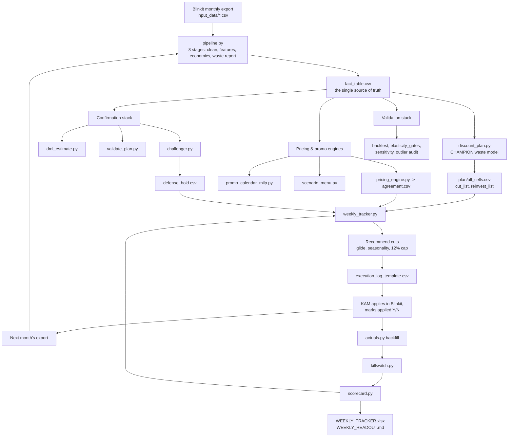
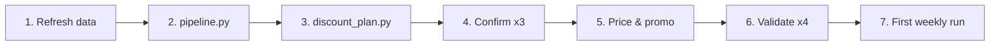
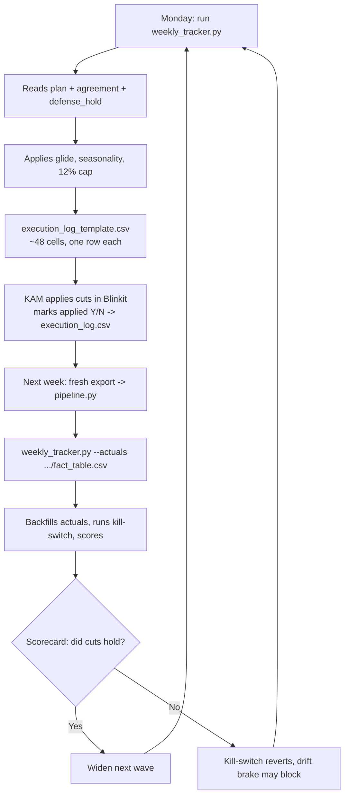
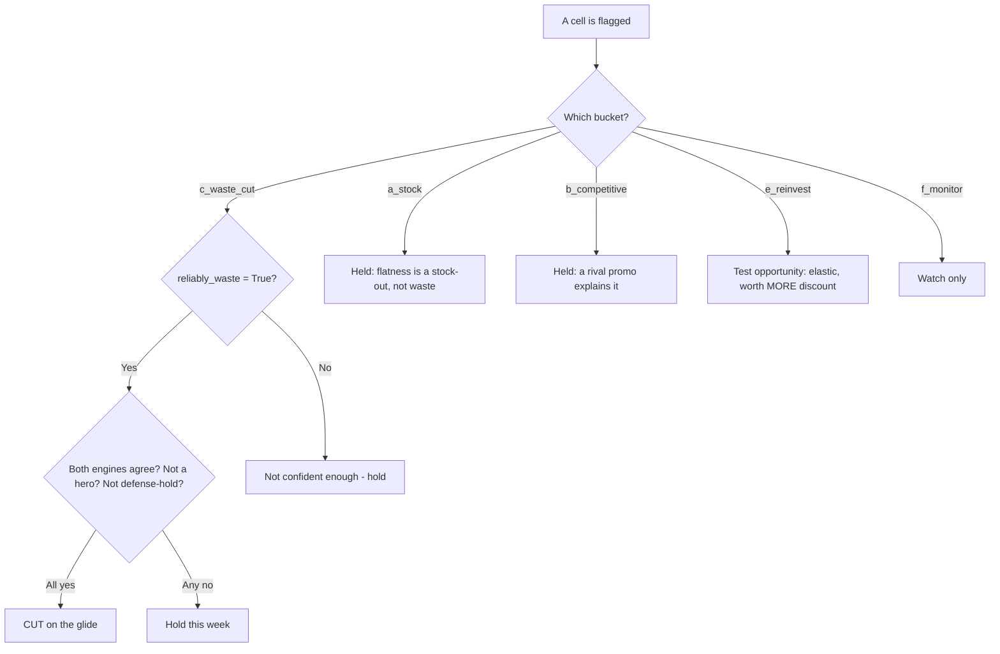
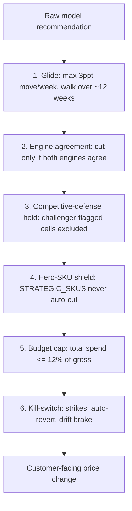

# Execution Playbook — Discount & Pricing Optimizer
### How to run the system, end to end, with the exact commands, cadences, controls, and decision rules

*Prepared as the operating manual for the 24 Mantra Organic (Blinkit) deployment. Every command below is copy-pasteable and matches the code in this repository. Read the Executive Summary first; run from Section 2; keep Appendix A open while you work.*

---

## Executive summary

**The system turns six months of Blinkit sales data into a weekly, guard-railed set of discount changes, then learns from what actually happened.** You run it on one machine, with free software, in three rhythms: a **monthly rebuild** (refresh the data, regenerate the plan, prove it five ways), a **weekly operating loop** (recommend a few safe cuts, hand them to your KAM, score last week against reality), and a **quarterly governance review** (re-check the knobs and retrain). Nothing goes to a customer without passing through a glide, a two-engine agreement gate, a competitive-defense hold, and a kill-switch.

**The single most important idea:** the model tells you *where* discount is likely wasted; the **weekly loop is what converts that from a forecast into banked cash.** Treat month-one numbers as a well-evidenced hypothesis (~₹725k/month of reclaimable discount, proven five independent ways) and let the scorecard turn it into proof over four to eight weeks.

**What you must supply** before go-live is small and specific: your hero SKU IDs (so flagships are never auto-cut) and, when you have them, real per-SKU costs (so profit numbers become bookable). The budget ceiling is already set to 12%.

**Three numbers to remember:** run the full stack **monthly**, run the tracker **weekly**, retrain **every four weeks**. Everything else in this document supports those three.

---

## Exhibit 1 — The operating model, end to end



**How to read Exhibit 1.** The left column is data and models built monthly. The centre is the three proof layers (confirmation, pricing/promo, validation) that make the recommendation trustworthy. The right column is the weekly loop that executes and learns. The one arrow that closes everything is *actuals → scorecard → tracker*: that feedback is what makes the system improve rather than repeat itself.

---

## 1. The three cadences

The whole system reduces to three repeating rhythms. Getting the cadence right matters more than any single command.

| Cadence | When | What you run | Output you act on | Time |
|---|---|---|---|---|
| **Monthly rebuild** | Each new Blinkit month lands | Full stack (Section 2.2) | A fresh, five-ways-proven plan | ~15–25 min |
| **Weekly loop** | Every week | `weekly_tracker.py` (Section 2.3) | A handful of safe cuts for the KAM | ~5 min |
| **Quarterly governance** | Every ~12 weeks | `params_review.py` + retrain (Section 2.4) | A signed-off set of knobs | ~30 min |

The **weekly loop is the heartbeat** — it is cheap, fast, and the only thing that produces real-world receipts. The monthly rebuild refreshes the map; the weekly loop walks the territory.

---

## 2. Execution — step by step

### 2.1 Phase 0 — One-time setup

Do this once per machine. You will not repeat it.

**Environment.** The system needs Python 3.12 with a specific, tested set of libraries. The one non-obvious constraint: **numpy must stay at 1.26.4** (a newer numpy binary-breaks the compiled statistics libraries). Install in one line:

```bash
pip install "numpy==1.26.4" "scikit-learn==1.4.0" statsmodels scipy pandas openpyxl
```

Do **not** `pip install pymc` — it force-upgrades numpy and breaks the stack. The system deliberately uses an analytic Bayesian method instead, so PyMC is never needed.

**Configuration.** Open `v4_config.py` and set the three things that are yours to decide:

| Setting | What it is | Action |
|---|---|---|
| `BRAND_NAME` | Your own brand string | Already `"24 Mantra Organic"` — change only for a new client |
| `STRATEGIC_SKUS` | Hero/flagship product IDs never auto-cut | **Currently `[]` — put your flagship product IDs here** |
| `DEFAULT_BUDGET_PCT_CAP` | Weekly discount-spend ceiling | Already `0.12` (12% of gross) — leave unless you want a tighter trim |

Also glance at `FESTIVAL_DATES` and `PLATFORM_EVENT_WINDOWS` — these calendars tell the model which spikes to ignore. Refresh them once a quarter.

**Costs (optional but valuable).** The profit and margin calculations run on proxies (50% COGS, 15% commission, ₹10 fulfillment) until you supply a real cost sheet. Directional decisions are fine without it; *bookable* profit numbers need it.

---

### 2.2 Phase 1 — Monthly rebuild (the full stack)

Run this whenever a new month of Blinkit data arrives. It rebuilds the plan and proves it. Run the blocks in order; each depends on the one before.

#### Exhibit 2 — The monthly rebuild sequence



**Step 1 — Refresh the data.** Drop the new month's file into `input_data/` (same format as the existing `*_BLINKIT_RCA.csv` files). Nothing else to touch.

**Step 2 — Build the foundation.** This runs all eight stages (clean → features → model → economics → guardrails → waste report):

```bash
python -X utf8 pipeline.py
```

You will see a new folder appear under `v4_outputs/` (timestamped) containing `fact_table.csv` and the stage-8 `WASTE_REINVEST_REPORT.xlsx`. *If it fails, the error is at the bottom of the output — usually a malformed input column.*

**Step 3 — Run the champion waste model.** This is the confounder-controlled engine that decides which cells are genuinely wasteful:

```bash
python -X utf8 scripts/analysis/discount_plan.py
```

Produces `v4_outputs/<latest>/plan/all_cells.csv` (the master per-cell table), `cut_list.csv`, and `reinvest_list.csv`.

**Step 4 — Prove the number three ways.** Run all three; each is an independent check:

```bash
python -X utf8 scripts/analysis/dml_estimate.py       # Double ML causal confirmation
python -X utf8 scripts/analysis/validate_plan.py      # C1-C8 acceptance gates
python -X utf8 scripts/analysis/challenger.py         # competitor champion/challenger + defense_hold.csv
```

`validate_plan.py` should end with **C1–C8: ALL PASS**. `challenger.py` writes `defense_hold.csv` — the cells to hold out of the cut wave.

**Step 5 — Pricing, promo & scenarios.** The pricing engine is what produces the two-engine *agreement* the tracker relies on:

```bash
python -X utf8 scripts/pricing/pricing_engine.py                 # -> agreement.csv, pricing_reco.csv
python -X utf8 scripts/pricing/budget_allocator.py --budget_pct 0.12
python -X utf8 scripts/promo/promo_calendar_milp.py             # 12-week promo calendar (MILP)
python -X utf8 scripts/pricing/scenario_menu.py                 # optional: negotiation menu
```

**Step 6 — Validate the models.** These four are your honest receipts — they will tell you where the model is strong and where it is not:

```bash
python -X utf8 scripts/validation/backtest_rolling.py          # walk-forward vs naive benchmarks
python -X utf8 scripts/validation/elasticity_gates.py          # 3-stage acceptance protocol
python -X utf8 scripts/validation/sensitivity.py               # shake inputs, count fragile cuts
python -X utf8 scripts/validation/outlier_promo_audit.py       # removed-spike vs promo cross-check
```

Read their `*_REPORT.md` files. **Where a gate fails, believe it** — a failed elasticity gate means "direct with this, don't bank on it yet," which is exactly the signal you want before touching prices.

**Step 7 — Kick off the first weekly run** (Section 2.3). At this point the monthly rebuild is complete.

> **The shortcut.** Double-clicking `run.bat` runs the parameter review and `pipeline.py` and opens the Excel report — good for a quick refresh, but it does **not** run the champion model, confirmations, pricing, or tracker. For a true rebuild, run Steps 2–7 above.

---

### 2.3 Phase 2 — The weekly operating rhythm

This is the loop you run every week. It is the engine of trust: it recommends, executes through your KAM, then scores itself against reality.

#### Exhibit 3 — The weekly loop



**Week 1 — Recommend.** With a fresh plan in place, generate this week's recommendations:

```bash
python -X utf8 scripts/tracker/weekly_tracker.py
```

You will see something like `W1 ... cut 48 hold 537 ... budget cap 12.0%`. It writes `DISCOUNT_PLAN/execution_log_template.csv` — one row per recommended cut. **Hand that file to your KAM.**

**During the week — Execute.** Your KAM changes the discounts in Blinkit for the recommended cells, then marks each row `Y` or `N` in the applied column and saves it back as `DISCOUNT_PLAN/execution_log.csv`. This is the human-in-the-loop control: only cells the KAM actually applied get scored.

**Week 2 onward — Score against reality.** When the next export lands, rebuild the fact table (`python -X utf8 pipeline.py`) then run the tracker *with* the fresh actuals:

```bash
python -X utf8 scripts/tracker/weekly_tracker.py --actuals v4_outputs/<newest-run>/fact_table.csv
```

This backfills what actually happened, runs the kill-switch (strikes, auto-revert, drift brake), and updates the accuracy scorecard. Read `DISCOUNT_PLAN/WEEKLY_READOUT.md` for the plain-English "what changed and why," and open `WEEKLY_TRACKER.xlsx` for the tabs.

**Any time — Self-test.** To confirm the whole loop is wired correctly:

```bash
python -X utf8 scripts/tracker/verify_loop.py
```

It should print **LOOP CLOSED: YES**.

---

### 2.4 Phase 3 — Quarterly governance

Every ~12 weeks, and before any major retrain, review the knobs and record that you did:

```bash
python -X utf8 scripts/tracker/params_review.py            # shows drift since last review
python -X utf8 scripts/tracker/params_review.py --ack --note "Q3 review"   # sign off
```

At the same cadence, refresh `FESTIVAL_DATES`, revisit `STRATEGIC_SKUS`, and re-run the full monthly rebuild so the model retrains on the latest window. The **retrain cadence is four-weekly**; the quarterly review is the deeper governance checkpoint on top of it.

---

## 3. Reading the outputs — the decision rules

The system never asks you to trust a black box. Every recommendation carries its reason. Use this decision tree when you open `all_cells.csv` or the weekly readout.

#### Exhibit 4 — How to read a cell's recommendation



**The rules in words.** A cut only fires when four things line up: the cell is genuine waste (`c_waste_cut`), the effect is *reliably* below break-even (`reliably_waste = True`), the pricing optimizer *also* wants to cut (engine agreement), and the cell is neither a hero SKU nor a competitive-defense hold. Everything else is held — because a flat-selling cell explained by a stock-out or a rival promo is not waste, and cutting it would be a mistake the system is designed to avoid.

The honest caveat that runs through every output: these are **model-proven, not register-proven**. The scorecard, filled from real Blinkit sales over several weeks, is what earns the word "proven."

---

## 4. The control stack

Six independent controls sit between a model number and a customer-facing price change. This is why the system is safe to run with a small team.

#### Exhibit 5 — Layered controls



| Control | What it prevents | Where it lives |
|---|---|---|
| Glide | A price cliff that shocks demand | `guardrail.py`, `MAX_STEP_PPT = 3.0` |
| Engine agreement | Acting on one model's opinion alone | `weekly_tracker.apply_agreement`, `agreement.csv` |
| Defense hold | Cutting a cell that's holding off a rival | `apply_defense_hold`, `defense_hold.csv` |
| Hero shield | Auto-cutting a flagship on thin math | `STRATEGIC_SKUS` in `v4_config.py` |
| Budget cap | Over-spending discount portfolio-wide | `DEFAULT_BUDGET_PCT_CAP = 0.12` |
| Kill-switch | Letting a bad cut run | `killswitch.py` (strikes / revert / drift brake) |

---

## 5. Roles & cadence

#### Exhibit 6 — Who does what, when

| Activity | Owner | Cadence | Reads / produces |
|---|---|---|---|
| Drop new data, run monthly rebuild | You / analyst | Monthly | `input_data/` → full stack |
| Review validation receipts | You | Monthly | `*_REPORT.md`, gates |
| Set hero SKUs, budget, costs | You (owner) | As needed | `v4_config.py` |
| Run weekly tracker | You / analyst | Weekly | `execution_log_template.csv` |
| Apply cuts, mark applied Y/N | KAM | Weekly | `execution_log.csv` |
| Read scorecard, decide next wave | You | Weekly | `WEEKLY_READOUT.md` |
| Parameter review & sign-off | You (owner) | Quarterly | `params_review.py` |

---

## 6. Risks & mitigations

The system is honest about its own limits. The four that matter, and what the design already does about each:

**The elasticities are wide-band.** Most cells are low-confidence — the model knows the *direction* (discount is mostly wasted) more than the exact magnitude. *Mitigation:* the optimizer stays put where it can't prove a cut pays, and the sensitivity check (0 of 63 cut cells fragile in the first run) confirms the cut wave is robust to this uncertainty.

**Costs are proxies until you supply real ones.** Profit and margin optimization runs on 50%/15%/₹10 assumptions. *Mitigation:* revenue-based decisions don't depend on costs; feed a real cost sheet and the profit numbers become bookable. Nothing breaks in the meantime.

**A competitor or platform move mid-wave.** No model can foresee this. *Mitigation:* the weekly kill-switch reverts underperforming cuts within a week, and the drift brake blocks new cuts if the hit-rate falls.

**Model-proven is not register-proven.** The ₹725k/month is a forecast until the scorecard fills. *Mitigation:* the entire weekly loop exists to convert it — start small, watch the scorecard, widen only as reality confirms.

---

## Appendix A — Command reference card

Copy-paste, in order. `<latest>` = the newest folder under `v4_outputs/`.

```bash
# ── ONE-TIME SETUP ───────────────────────────────────────────────
pip install "numpy==1.26.4" "scikit-learn==1.4.0" statsmodels scipy pandas openpyxl
# then edit v4_config.py: STRATEGIC_SKUS, (BRAND_NAME), (DEFAULT_BUDGET_PCT_CAP already 0.12)

# ── MONTHLY REBUILD ──────────────────────────────────────────────
python -X utf8 pipeline.py
python -X utf8 scripts/analysis/discount_plan.py
python -X utf8 scripts/analysis/dml_estimate.py
python -X utf8 scripts/analysis/validate_plan.py
python -X utf8 scripts/analysis/challenger.py
python -X utf8 scripts/pricing/pricing_engine.py
python -X utf8 scripts/pricing/budget_allocator.py --budget_pct 0.12
python -X utf8 scripts/promo/promo_calendar_milp.py
python -X utf8 scripts/pricing/scenario_menu.py
python -X utf8 scripts/validation/backtest_rolling.py
python -X utf8 scripts/validation/elasticity_gates.py
python -X utf8 scripts/validation/sensitivity.py
python -X utf8 scripts/validation/outlier_promo_audit.py

# ── WEEKLY LOOP ──────────────────────────────────────────────────
python -X utf8 scripts/tracker/weekly_tracker.py                                   # week 1: recommend
#   -> hand DISCOUNT_PLAN/execution_log_template.csv to the KAM; collect as execution_log.csv
python -X utf8 scripts/tracker/weekly_tracker.py --actuals v4_outputs/<latest>/fact_table.csv   # week 2+: score
python -X utf8 scripts/tracker/verify_loop.py                                      # self-test -> LOOP CLOSED: YES

# ── QUARTERLY GOVERNANCE ─────────────────────────────────────────
python -X utf8 scripts/tracker/params_review.py
python -X utf8 scripts/tracker/params_review.py --ack --note "quarterly review"
```

---

## Appendix B — Where every output lives

| Folder | Contains |
|---|---|
| `v4_outputs/<stamp>/` | Per-run: `fact_table.csv`, `features.csv`, waste report |
| `v4_outputs/<stamp>/plan/` | Champion outputs: `all_cells.csv`, `cut_list.csv`, `reinvest_list.csv` |
| `DISCOUNT_PLAN/` | Curated deliverables: `tracker_history.csv`, `WEEKLY_TRACKER.xlsx`, `WEEKLY_READOUT.md`, `execution_log_template.csv`, `defense_hold.csv`, `CHALLENGER_REPORT.md`, `dml_results.json` |
| `DISCOUNT_PLAN/pricing/` | `agreement.csv`, `pricing_reco.csv`, `elasticities.csv`, `roi_ladder.csv`, `scenario_menu.csv`, gates |
| `DISCOUNT_PLAN/promo/` | `promo_calendar.csv`, `PROMO_CALENDAR.md` |
| `DISCOUNT_PLAN/validation/` | Backtest, elasticity-gate, sensitivity, outlier-audit reports |

---

## Appendix C — Go-live checklist

Before the first live cut wave, confirm each of these:

- [ ] Environment installed, `numpy==1.26.4` (not upgraded)
- [ ] `STRATEGIC_SKUS` populated with your hero product IDs
- [ ] Monthly rebuild run clean; `validate_plan.py` shows **C1–C8 ALL PASS**
- [ ] `verify_loop.py` prints **LOOP CLOSED: YES**
- [ ] The three competitive-defense cells confirmed held out of wave 1
- [ ] KAM briefed on the `execution_log.csv` mark-back process
- [ ] Weekly and monthly cadences on the calendar

---

*This playbook is the how-to. For the why and the deep mechanics, see `COMPLETE_SYSTEM_GUIDE.md`; for paper-parity evidence, see `PEPSICO_PARITY_REPORT.md`.*
