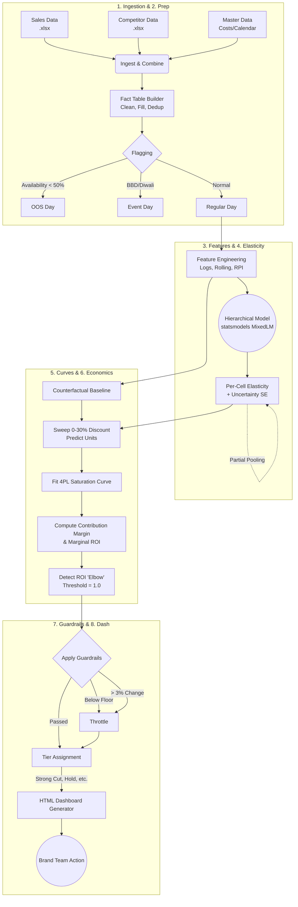

# Optimal Price Finder — V4

A production-grade, end-to-end pricing and elasticity pipeline designed for scalable execution across hundreds of product cells (SKU × City). 

This system moves beyond single-SKU ad-hoc modeling by utilizing a **Hierarchical Elasticity Model**, dynamically generating **Saturation Curves**, and applying an automated **Elbow Detection** algorithm to find the exact point of maximum marginal ROI.

## 🏗️ Architecture & Pipeline Flow

The system executes a rigid, 8-stage pipeline to ensure reproducible outputs, ending with the generation of an interactive HTML Dashboard for the Brand Team.



## 📁 Repository Structure

The repository has been restructured to cleanly separate each computational stage. Legacy code has been moved to the `archive/` folder.

```text
Optimal Price Finder/
├── v4_config.py                   # Central configuration (Paths, Thresholds, Flags)
├── pipeline.py                    # Master Orchestrator to run Stages 1-7
│
├── stage1_ingestion/              # Loads & merges Excel files, detects categories
├── stage2_preparation/            # Builds 'fact_table' at SKUxCity grain, flags anomalies
├── stage3_features/               # Calculates rolling features, price gaps, logs
├── stage4_model/                  # Hierarchical Mixed-Effects Model (Elasticity)
├── stage5_curves/                 # 4PL Curve Fitting by sweeping 0-30% discount
├── stage6_economics/              # Contribution margins & Marginal ROI elbow detection
├── stage7_guardrails/             # Floor limits, change throttling, and priority Tiering
├── stage8_monitoring/             # [Phase 2] Action logger & Drift detection
│
├── dashboard/                     # HTML generator for the 4-View Brand Team interface
├── data/                          # Input data directory
│   └── master/                    # Master cost/commission mappings
├── v4_outputs/                    # Run outputs (timestamped folders containing Dashboard)
└── archive/                       # Legacy V3 single-SKU monolithic codebase
```

## 🚀 How to Run

1. **Verify Configuration:** Ensure data paths and business rules (e.g., Target Discount, Max Change %) are set correctly in `v4_config.py`.
2. **Execute Full Pipeline:** Run the orchestrator from the command line:
   ```bash
   python pipeline.py
   ```
3. **Specific Stages:** To run only specific stages (e.g., skipping ingestion/preparation if the fact table is already built):
   ```bash
   python pipeline.py --stages 4 5 6 7
   ```
4. **View Results:** The pipeline will output an interactive `BRAND_DASHBOARD.html` file in a timestamped folder inside `v4_outputs/`.

## 📊 The 4-View Brand Dashboard

The final output is not a raw CSV, but an operational HTML Dashboard designed for the Brand Manager's Monday workflow:
1. **Portfolio Summary:** Executive view of glide-path to target discount and aggregate weekly savings.
2. **Action Queue:** Sortable data table grouping recommendations into Tiers (`Strong Cut`, `Trade-off`, `Increase`, `Hold`).
3. **Cell Detail:** Deep-dive view showing current vs recommended economics, visual plotting of the Saturation Curve, and plain-text explanation of *why* the model made the recommendation.
4. **Export:** Bulk download of approved actions into Blinkit-compatible CSVs.
