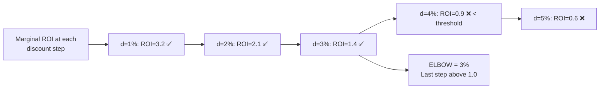

# Optimal Price Finder — Complete System Documentation
**24 Mantra Organic | Blinkit | 8-Stage Price-Led Optimization Pipeline**

> Definitive technical reference for the system. Covers every stage's
> purpose, internal logic, formulas, configuration knobs, data
> transformations, worked numerical examples, and output artifacts.
>
> **Companion docs:**
> - [../README.md](../README.md) — quick start + system overview
> - **[COMPLETE_FLOW.md](COMPLETE_FLOW.md)** — **the whole system in one story: every stage with logic, math, diagrams, a worked example (Delhi-NCR Jaggery end-to-end), FAQ. Start here if you want one document that explains everything.**
> - [MODEL.md](MODEL.md) — Stage 4 elasticity model deep dive ("why is the model built this way?")
> - [FLYWHEEL.md](FLYWHEEL.md) — Stage 8 cuts ↔ reinvestments portfolio logic
> - [OUTPUTS.md](OUTPUTS.md) — every output file column-by-column

---

## What changed in the May 2026 rewrite

If you're returning to this codebase: the model and output layers were
substantially rewritten. Key changes:

| Area | Before | After |
|---|---|---|
| **Stage 2** | OOS + event flagging | + **per-cell statistical outlier detection** with audit trail (`outliers_removed.csv`) |
| **Stage 4** | Single hierarchical MixedLM, all categories pooled, random intercept only | **Per-category Huber-robust OLS** with cell fixed effects, decorrelated badge, category-median shrinkage prior, clipped to plausible CPG range |
| **Stage 5** | Confidence = data size only | + **boundary-hit detection** + **launch-ramp growth detection** with human-readable `quality_note` |
| **Stage 7** | Tier on full multi-cycle elbow journey | Tier on **this-cycle action** (what brand approves this week) |
| **Stage 8** | Reinvest only triggered when elbow > current (nearly never) | **Strategic reinvestment** simulation — cells where +3 ppt drives meaningful volume at acceptable margin cost |
| **All output** | Discount-% led | **Selling-price led** (₹ first; equivalent % shown for Blinkit entry) |
| **Flywheel** | — | Portfolio summary — cuts and reinvestments tracked against `TARGET_WEIGHTED_DISCOUNT_PCT` |
| **Glide path** (NEW) | — | Multi-cycle week-by-week roadmap. Per-cell step = `max(MIN_PPT, gap/TIMELINE)`. Visible in the **Glide Path** sheet of `WASTE_REINVEST_REPORT.xlsx`. |
| **Glide target** (NEW) | Margin-optimal elbow (0% discount) | Each cell's **proven-safe historical floor** — the lower-quartile of its own past discounts. Never plans a price the cell hasn't operated at. |
| **Training window** (NEW) | Full history | Last 180 days only. Avoids contamination from launch ramps and outdated price regimes. **Single biggest accuracy lever.** |
| **Output format** (NEW) | Markdown PDF | **McKinsey-style Excel workbook** with live formulas (`WASTE_REINVEST_REPORT.xlsx`). Markdown still produced for git. |

Diagnostic evidence for each change lives in [MODEL.md](MODEL.md) and
[FLYWHEEL.md](FLYWHEEL.md). Performance went from train R² = 0.41 / test R²
= −0.15 / MAPE = 167% (original) to **train R² = 0.89 / test R² = 0.84 /
aggregated MAPE = 24%** (current — Strong tier) with **plausible per-cell
elasticities** (−0.5 to −3.6 range).

---

## Table of Contents
1. [System Overview](#system-overview)
2. [Project Structure](#project-structure)
3. [Configuration Reference](#configuration-reference-v4_configpy)
4. [Stage 1: Data Ingestion](#stage-1-data-ingestion)
5. [Stage 2: Data Preparation](#stage-2-data-preparation) ← + outlier detection
6. [Stage 3: Feature Engineering](#stage-3-feature-engineering)
7. [Stage 4: Per-Category Elasticity Model](#stage-4-per-category-elasticity-model) ← **rewritten**
8. [Stage 5: Saturation Curves](#stage-5-saturation-curves) ← + quality_note
9. [Stage 6: Economics & Elbow Detection](#stage-6-economics--elbow-detection)
10. [Stage 7: Guardrails & Tiering](#stage-7-guardrails--tiering) ← this-cycle tiering
11. [Stage 8: Flywheel — Waste + Strategic Reinvestment](#stage-8-flywheel--waste--strategic-reinvestment) ← **rewritten**
12. [Pipeline Outputs Reference](#pipeline-outputs-reference)

---

## System Overview

The system answers a **portfolio-level pricing question**:

> "For each SKU × city, what's the right **selling price** this week —
> and across the whole portfolio, are we moving toward our 9% target
> weighted discount in a way that cuts where it hurts least and
> reinvests where volume will grow most?"

It does this in 8 sequential stages, from raw Excel data to a
brand-team-ready weekly plan with explicit cuts, strategic
reinvestments, and a multi-cycle journey to the target.

Everything in the report leads with **selling price (₹)** because that's
what the customer sees on Blinkit. The equivalent discount % is shown
alongside for platform entry.

### Full Pipeline Flow

```mermaid
flowchart TD
    subgraph INPUT["📂 Inputs"]
        I1["input_data/*.xlsx\n(3 Excel files)"]
        I2["v4_config.py\n(All parameters)"]
        I3["data/master/sku_costs.csv\n(Optional cost overrides)"]
    end

    subgraph STAGE1["Stage 1 — Ingestion"]
        S1A["Read all .xlsx files"]
        S1B["Combine & deduplicate"]
        S1C["Filter: Own brand only"]
        S1D["Build event calendar"]
    end

    subgraph STAGE2["Stage 2 — Preparation"]
        S2A["Forward-fill missing values"]
        S2B["Compute stable_mrp + selling_price"]
        S2C["Flag: OOS / Event / Regular days"]
        S2D["Per-cell outlier detection (|z|>3)"]
        S2E["Write outliers_removed.csv (audit)"]
    end

    subgraph STAGE3["Stage 3 — Feature Engineering"]
        S3A["Log transforms: price, units"]
        S3B["Rolling: OSA 7d, Ad SOV 7d"]
        S3C["Competitive: price_gap, rpi"]
        S3D["Reference price (30d window)"]
        S3E["Time dummies: weekday, month"]
    end

    subgraph STAGE4["Stage 4 — Per-Category Elasticity Model"]
        S4A["Filter: regular days only"]
        S4B["Train/test split (time-based 80/20)"]
        S4C["Compute badge_resid (decorrelate badge from price)"]
        S4D["Fit ONE Huber model per category with cell FE"]
        S4E["Per-cell raw OLS slope, shrunk toward category median"]
        S4F["Clip to [-4, -0.3] (plausible CPG range)"]
    end

    subgraph STAGE5["Stage 5 — Saturation Curves"]
        S5A["Sweep selling price floor→MRP per cell"]
        S5B["Predict units (log-log + badge effect)"]
        S5C["Fit 4PL curve to points"]
        S5D["Assess confidence + write quality_note"]
        S5E["Detect: boundary-hit / launch-ramp confounding"]
    end

    subgraph STAGE6["Stage 6 — Economics"]
        S6A["Compute variable cost per unit"]
        S6B["Build contribution margin ladder"]
        S6C["Compute marginal ROI step-by-step"]
        S6D["Find elbow: ROI crosses threshold"]
    end

    subgraph STAGE7["Stage 7 — Guardrails & Tiering (this-cycle)"]
        S7A["Floor price check"]
        S7B["Max 3 ppt change per cycle throttle"]
        S7C["Build phasing plan if throttled"]
        S7D["Tier on THIS-CYCLE savings + vol drop:"]
        S7E["  Strong Cut / Trade-off / Hold / Do Not Act"]
    end

    subgraph STAGE8["Stage 8 — Flywheel Report"]
        S8A["Enrich with last-30d actuals"]
        S8B["Inherit confidence + quality_note from Stage 5"]
        S8C["Build WASTE list (price lifts to save margin)"]
        S8D["Simulate +3 ppt for every cell → REINVEST list"]
        S8E["Compute weighted SP / discount % vs target"]
        S8F["Write price-led MD + CSVs"]
    end

    subgraph OUTPUT["📁 v4_outputs/TIMESTAMP/"]
        O0["outliers_removed.csv (NEW)"]
        O1["fact_table.csv"]
        O2["features.csv"]
        O3["elasticity_estimates.csv"]
        O4["recommendations.csv (price-led)"]
        O5["WASTE_REINVEST_REPORT.md"]
        O6["waste.csv / reinvest.csv (price-led)"]
        O7["per_cell_detail.json"]
        O8["BRAND_DASHBOARD.html"]
    end

    INPUT --> STAGE1 --> STAGE2 --> STAGE3 --> STAGE4 --> STAGE5 --> STAGE6 --> STAGE7 --> STAGE8 --> OUTPUT
```



---

## Project Structure

```
Optimal Price Finder - New Version/
│
├── README.md                    ← Quick start, system overview
├── pipeline.py                  ← Master orchestrator
├── v4_config.py                 ← ALL configuration parameters (single source of truth)
│
├── input_data/                  ← Raw Excel files go here
│   ├── 24 Mantra X Jaggery Powder 500G X 1 Year X BlinkIT.xlsx
│   ├── 24 Mantra X Moong Dal 500G X 1 Year X BlinkIT.xlsx
│   └── 24 Mantra X Sunflower Oil 1L X 1 Year X BlinkIT.xlsx
│
├── data/master/
│   └── sku_costs.csv            ← Optional: per-SKU cost overrides
│
├── stage1_ingestion/ingest.py
├── stage2_preparation/prepare.py        ← + outlier detection
├── stage3_features/features.py
├── stage4_model/elasticity.py           ← per-category Huber + cell FE
├── stage5_curves/curves.py              ← confidence with quality_note
├── stage6_economics/economics.py
├── stage7_guardrails/guardrails.py      ← this-cycle tiering
├── stage8_output/waste_reinvest.py      ← flywheel: cuts + reinvestment
│
├── dashboard/dashboard_generator.py
│
├── doc/
│   ├── README.md                ← This file (full technical reference)
│   ├── MODEL.md                 ← Stage 4 deep dive (why the model is built this way)
│   ├── FLYWHEEL.md              ← Stage 8 deep dive (cuts ↔ reinvestments)
│   └── OUTPUTS.md               ← Column-by-column output file reference
│
├── scripts/                     ← Not part of production
│   ├── diagnostics/             ← Data-quality probes (diag_dal.py etc.)
│   └── experiments/             ← Model-comparison harnesses (experiments.py, experiments4.py)
│
└── v4_outputs/                  ← All run outputs saved here
    └── YYYYMMDD_HHMMSS/
        ├── outliers_removed.csv (NEW)
        ├── fact_table.csv
        ├── features.csv
        ├── elasticity_estimates.csv
        ├── recommendations.csv         (price-led columns first)
        ├── waste.csv                   (price-led)
        ├── reinvest.csv                (price-led)
        ├── per_cell_detail.json
        ├── WASTE_REINVEST_REPORT.md
        └── BRAND_DASHBOARD.html
```

---

## Configuration Reference (`v4_config.py`)

Every parameter that controls the system's behavior lives in `v4_config.py`. No magic numbers are buried in stage files.

| Parameter | Default | Stage Used | Meaning |
|---|---|---|---|
| `SALES_DATA_DIR` | `./input_data` | S1 | Directory to scan for `.xlsx` files |
| `OWN_BRAND_PATTERNS` | `["24 Mantra Organic", "24 Mantra"]` | S1 | Case-insensitive brand filter |
| `CATEGORY_KEYWORDS` | `{Jaggery: [jaggery], ...}` | S1 | Title keywords → category mapping |
| `OSA_OOS_THRESHOLD` | `50` (%) | S2 | Availability below this = OOS day (excluded from training) |
| `OUTLIER_Z_THRESHOLD` | `3.0` | S2 | **NEW.** \|z-score\| above this → row flagged as outlier (audited to `outliers_removed.csv`) |
| `OUTLIER_MIN_OBS_PER_CELL` | `30` | S2 | **NEW.** Cells with fewer obs skip outlier detection (avoid false positives) |
| `FESTIVAL_WINDOW_DAYS` | `2` | S2 | Days before/after festival to flag |
| `REFERENCE_PRICE_WINDOW` | `30` (days) | S3 | Rolling window for reference price |
| `OSA_ROLLING_WINDOW` | `7` (days) | S3 | Rolling window for availability |
| `AD_ROLLING_WINDOW` | `7` (days) | S3 | Rolling window for ad SOV |
| `TEST_SPLIT_PCT` | `0.20` | S4 | Last 20% of dates held for testing |
| `MODEL_TYPE` | `mixed_lm` | S4 | **Legacy.** Stage 4 now always uses per-category Huber OLS regardless |
| `DISCOUNT_MIN_PCT` | `0` | S5 | Start of discount sweep |
| `DISCOUNT_MAX_PCT` | `30` | S5 | End of discount sweep |
| `DISCOUNT_STEP_PCT` | `1` | S5 | Step size of sweep |
| `DEFAULT_COGS_PCT` | `0.50` | S6 | COGS = 50% of MRP (if no master file) |
| `DEFAULT_COMMISSION_PCT` | `0.15` | S6 | 15% Blinkit platform commission |
| `DEFAULT_FULFILLMENT_FEE` | `₹10` | S6 | Flat fulfillment per unit |
| `MARGINAL_ROI_THRESHOLD` | `1.0` | S6 | Elbow: ROI must exceed this |
| `MIN_MARGIN_PCT` | `0.05` | S7 | Floor: 5% margin above variable cost |
| `MAX_COMPETITOR_PREMIUM_PCT` | `0.10` | S7 | Max 10% premium over competitor |
| `MIN_DISCOUNT_CHANGE_PPT` | `3` | S7 | **NEW.** Minimum weekly cut — never make trivial sub-3 ppt moves |
| `USE_DYNAMIC_GLIDE` | `True` | S7 | If on, per-cycle step = `max(MIN, gap/TIMELINE)` (no upper cap) |
| `TARGET_TIMELINE_WEEKS` | `12` | S7/S8 | **NEW.** 3-month HARD deadline — every cell's full gap closes within this duration regardless of size |
| `USE_HISTORICAL_FLOOR_TARGET` | `True` | S7/S8 | **NEW.** If on, target = each cell's proven-safe historical floor (not the margin-optimal elbow at 0%) |
| `HISTORICAL_FLOOR_PERCENTILE` | `25` | S4 | **NEW.** Lower-quartile of past discounts = the cell's "we've been here before" floor |
| `HISTORICAL_FLOOR_LOOKBACK_DAYS` | `90` | S4 | **NEW.** Window for computing the floor |
| `TRAIN_LOOKBACK_DAYS` | `180` | S4 | **NEW.** Train only on the last N days of regular-day data. Was the single biggest accuracy lever (R² 0.27 → 0.84). Set to `None` for full-history training. |
| `TIER_STRONG_CUT_MIN_SAVINGS` | `₹10,000` | S7 | **Note:** Stage 7 now uses a fixed ₹5K floor inline; this config kept for back-compat |
| `TIER_STRONG_CUT_MAX_VOL_DROP` | `0.05` | S7 | **Note:** Stage 7 now uses an inline 8% this-cycle threshold |
| `TARGET_WEIGHTED_DISCOUNT_PCT` | `9.0` | S8 | Portfolio target — Stage 8 reports the gap |
| `REINVEST_MIN_ELASTICITY` | `2.0` | S8 | Cell must have \|elasticity\| ≥ this to be a reinvestment candidate |
| `REINVEST_MIN_VOL_LIFT_PCT` | `5.0` | S8 | Min projected volume lift at +3 ppt for a cell to qualify |
| `REINVEST_MAX_MARGIN_SAC_PCT` | `10.0` | S8 | Max acceptable margin sacrifice for a reinvestment move |

---

## Stage 1: Data Ingestion

**File:** `stage1_ingestion/ingest.py`
**Input:** Excel files in `input_data/`
**Output:** A single combined `raw_df` DataFrame + `calendar_df` + `master_costs`

### What It Does — Step by Step

**Step 1: File Discovery**
Scans `SALES_DATA_DIR` for all `*.xlsx` files, ignoring files starting with `~` (Excel temp files).

```python
pattern = os.path.join(cfg.SALES_DATA_DIR, "*.xlsx")
files = [f for f in glob.glob(pattern) if not os.path.basename(f).startswith("~")]
```

**Step 2: Load & Combine**
Each file is read with `pd.read_excel()` and appended to a list. All frames are concatenated into one DataFrame.

**Step 3: Type Coercion**
The `DATE` column is cast to `datetime`. All numeric columns (MRP, Price, Qty, Discount, Availability, Ad SOV, Competitor Price) are converted with `pd.to_numeric(..., errors='coerce')` — any non-numeric values become `NaN` rather than crashing.

**Step 4: Category Detection**
A function checks each row's `TITLE` field against keyword lists defined in `CATEGORY_KEYWORDS`:

```python
CATEGORY_KEYWORDS = {
    "Jaggery":       ["jaggery"],
    "Moong Dal":     ["moong", "dal"],
    "Sunflower Oil": ["sunflower", "oil"],
}
```
If ALL keywords for a category appear in the title (case-insensitive), that category is assigned. Otherwise `"Other"`.

**Step 5: Deduplication**
If the same (SKU, City, Date) appears more than once (e.g., from overlapping data exports), the **last** occurrence is kept.

**Step 6: Brand Filter**
The `BRAND` column is matched against `OWN_BRAND_PATTERNS`. Only rows matching the own-brand patterns are retained. Competitor rows are dropped entirely — their pricing is still captured in the `Competitor Price` column.

**Step 7: Event Calendar**
Builds a calendar DataFrame by expanding festival dates (±`FESTIVAL_WINDOW_DAYS` days around each festival) and platform sale windows (date ranges like BBD). This calendar is joined in Stage 2.

### Raw Data Shape (Example)

| DATE | PRODUCT_ID | GC_CITY | BRAND | TITLE | MRP | PRICE | OFFTAKE_QTY | WT_AVAILABILITY_PCT | WT_DISCOUNT_PCT | Competitor Price |
|---|---|---|---|---|---|---|---|---|---|---|
| 2025-06-01 | P001 | Delhi | 24 Mantra Organic | Organic Jaggery 500g | 120 | 108 | 22 | 97.5 | 10.0 | 115 |
| 2025-06-01 | P002 | Mumbai | 24 Mantra | Organic Moong Dal 500g | 200 | 190 | 8 | 82.0 | 5.0 | 185 |
| 2025-06-01 | P003 | Delhi | Competitor A | Some Other Jaggery | 100 | 85 | 30 | 95.0 | 15.0 | 85 |

> Row 3 (Competitor A) is **dropped** by the brand filter. Its price (85) is already captured in the `Competitor Price` column of rows 1 & 2.

---

## Stage 2: Data Preparation

**File:** `stage2_preparation/prepare.py`
**Input:** `raw_df` + `calendar_df`
**Output:** `fact_df` — cleaned, flagged, model-ready

### What It Does — Step by Step

**Step 1: Sort & Forward Fill**
Data is sorted by `(PRODUCT_ID, GC_CITY, DATE)`. Then for each cell group, missing `PRICE`, `WT_AVAILABILITY_PCT`, and `Competitor Price` are forward-filled then backward-filled. This handles gaps where no data was reported for a day.

**Step 2: Fill Zeros**
Sales, Qty, Discount, and Ad SOV NaNs are filled with 0. A missing sales day is treated as "zero sold", not "unknown".

**Step 3: Price Validation**
Any price below 30% of MRP or above 110% of MRP is considered a data error and is clamped:

```
Price < MRP × 0.30  →  Price = MRP × 0.30
Price > MRP × 1.10  →  Price = MRP × 1.10
```
*Example: MRP = 120. Price = 25 is clamped to 36. Price = 140 is clamped to 132.*

**Step 4: Compute Actual Discount**
Discount is derived directly from MRP and Price — not taken from the `WT_DISCOUNT_PCT` column (which may be weighted differently):

```
discount_pct_actual = ((MRP - Price) / MRP) × 100
```
*Example: MRP=120, Price=108 → discount = (120-108)/120 × 100 = **10.0%***

**Step 5: Day Flagging — The Critical Step**

Three binary flags are created. Only rows with `is_regular_day = 1` are used for model training.

| Flag | Rule | Purpose |
|---|---|---|
| `is_oos_day` | Availability < `OSA_OOS_THRESHOLD` (default 50%) | Exclude stockout noise |
| `is_festival` | Date within ±2 days of a festival | Inform model, exclude from training |
| `is_event_day` | Festival OR platform sale date | Exclude demand spikes from training |
| `is_outlier` | **NEW.** Per-cell \|z-score\| > `OUTLIER_Z_THRESHOLD` (see Step 7) | Statistical outlier removal |
| `is_regular_day` | NOT event AND NOT OOS AND NOT outlier | **Model training filter** |

**Detailed Example:**

| Date | Avail% | Event | is_oos_day | is_event_day | is_regular_day | Used for Training? |
|---|---|---|---|---|---|---|
| Jan 10 | 98% | — | 0 | 0 | **1** | ✅ Yes |
| Jan 12 | 35% | — | **1** | 0 | **0** | ❌ OOS |
| Jan 14 | 95% | Makar Sankranti | 0 | **1** | **0** | ❌ Event |
| Jan 15 | 80% | Makar Sankranti+1 | 0 | **1** | **0** | ❌ Event window |
| Jan 17 | 90% | — | 0 | 0 | **1** | ✅ Yes |

> In a typical dataset, ~15-25% of rows are excluded. This ensures the model learns "normal" price-demand relationships, not holiday or stockout behavior.

**Step 6: Cell ID**
A `cell_id` string is created: `f"{PRODUCT_ID}_{GRAMMAGE}_{GC_CITY}"` (or `f"{PRODUCT_ID}_{GC_CITY}"` when no grammage column). This is the atomic unit of analysis throughout the pipeline.

**Step 7: Per-Cell Outlier Detection (NEW)**

For every cell, compute the mean and standard deviation of `log(units)`
on regular days only (post Step 5 filtering). Flag any row whose
z-score exceeds `OUTLIER_Z_THRESHOLD` (default 3.0):

```
For each (product_id, grammage, city) group on regular days:
    log_q = log(offtake_qty.clip(lower=0.1))
    z = (log_q - mean(log_q)) / std(log_q)
    is_outlier = |z| > OUTLIER_Z_THRESHOLD
```

Per-cell (not pooled across products) is critical — a "low" day for
Mumbai Moong Dal (~50 units) is wildly different from a "low" day for
Lucknow Sunflower Oil (~2 units). The z-score is computed against
**the cell's own history**.

Outliers get `is_outlier = 1` and `is_regular_day` is set back to 0 so
they're excluded from training. Every flagged row is appended to
`outliers_removed.csv` with date, units, z-score, discount %,
availability %, and a human-readable reason — full audit trail for the
brand team to review.

**Example output:**

```
[Stage 2] Outlier detection (per cell, |z|>3.0):
  Product 3583 | 500g: 19 outliers removed (2 spikes, 17 dips)
  Product 126995 | 500g: 27 outliers removed (0 spikes, 27 dips)
  Product 286878 | 1kg: 14 outliers removed (0 spikes, 14 dips)
  Total outliers excluded from training: 60
  Audit trail: v4_outputs/.../outliers_removed.csv
```

Most flagged outliers in the current data are LOW-direction "dips" —
days with availability of 50-97% (so they passed the OSA filter) but
near-zero sales. These are usually partial-day stockouts or
distribution gaps the 50% threshold missed.

> **Operational note:** review `outliers_removed.csv` monthly. If you
> see a cluster of HIGH spikes in a particular week, that was probably
> an undeclared promo. Add it to `PLATFORM_EVENT_WINDOWS` in `v4_config.py`
> so future runs treat those days as events (excluded but documented)
> rather than statistical outliers.

---

## Stage 3: Feature Engineering

**File:** `stage3_features/features.py`
**Input:** `fact_df`
**Output:** `feat_df` — the modeling-ready feature matrix

### Why These Features?

The model must isolate the **pure price elasticity** effect from all other factors. Each feature controls for a known driver of demand so the price coefficient is not confounded.

### Feature Definitions

**Log Transforms (Core Elasticity Features)**
```
log_price  = ln(PRICE)       # e.g., ln(108) = 4.682
log_units  = ln(OFFTAKE_QTY) # e.g., ln(22)  = 3.091
log_revenue = ln(OFFTAKE_MRP)
```
> A log-log regression gives a coefficient that is directly interpretable as **price elasticity**: "A 1% increase in price leads to β₁% change in units."

**Competitive Features**
```
price_gap = PRICE - Competitor Price   # Own price minus competitor
            e.g., 108 - 115 = -7       # We are ₹7 cheaper → positive demand signal

rpi = PRICE / Competitor Price          # Relative Price Index
    = 108 / 115 = 0.939                # < 1.0 means we are cheaper
```

**Reference Price (Psychological Anchor)**
```
reference_price = 30-day rolling mean of PRICE per cell
price_vs_reference = (PRICE / reference_price) - 1
                   e.g., if avg price was 110 and today is 108:
                   = (108/110) - 1 = -0.018  (1.8% below reference → demand boost)
```

**Availability Momentum**
```
osa_rolling_7d = 7-day rolling mean of WT_AVAILABILITY_PCT / 100
               = 0.0 to 1.0 (e.g., 0.95 = 95% available on average this week)
```
> Controls for the fact that a product with consistently good availability sells more.

**Advertising Signal**
```
ad_rolling_7d  = 7-day rolling mean of MONTHLY_AD_SOV
log_ad_sov     = ln(ad_rolling_7d)
```

**Time Features**
```
day_of_week = 0–6 (Monday=0)
is_weekend  = 1 if day_of_week >= 5 else 0
month       = 1–12
month_2 ... month_12 = dummy variables (month 1 is baseline)
```

**Promotional Flag**
```
is_promotional = 1 if PRICE < 0.85 × Competitor Price
               = flagging deeply promotional pricing events
```

### Feature Transformation Example

| Raw Column | Value | Derived Feature | Value | Purpose |
|---|---|---|---|---|
| PRICE | 108 | log_price | 4.682 | Elasticity input |
| OFFTAKE_QTY | 22 | log_units | 3.091 | Elasticity target |
| Competitor Price | 115 | price_gap | -7 | Competitive positioning |
| Competitor Price | 115 | rpi | 0.939 | Relative pricing |
| WT_AVAILABILITY_PCT | 97.5 | osa_rolling_7d | 0.968 | Availability signal |
| DATE (Sunday) | - | is_weekend | 1 | Weekend effect |
| DATE (June) | - | month_6 | 1 | Seasonal dummy |

---

## Stage 4: Per-Category Elasticity Model

**File:** `stage4_model/elasticity.py`
**Input:** `feat_df` (only `is_regular_day == 1` rows used)
**Output:** `model_output` dict containing per-category fitted models, per-cell elasticities, and diagnostics

> **Why this design?** A previous version of this stage used a single
> MixedLM pooled across all 3 categories. It produced an implausible
> global elasticity of −5.92 and test R² = −0.15. The redesign (per-
> category Huber + cell FE + decorrelated badge + median-shrinkage)
> moved the system to train R² = 0.86 / test R² = 0.27 with
> per-category elasticities of −2.5, −3.6, −3.3 (plausible CPG range).
>
> **Full diagnosis with experimental evidence:** see [MODEL.md](MODEL.md).

### The Core Model Equation

For each of the 3 product **categories** (Jaggery, Moong Dal, Sunflower
Oil), fit **one Huber-robust OLS** with cell fixed effects:

```
log(units) = α_cell                          ← cell fixed effects (one dummy per sku_city)
           + β_price · log(selling_price)    ← within-cell price elasticity (category-wide)
           + β_badge · badge_resid           ← residual "X% OFF" badge effect
           + γ_osa  · osa_rolling_7d         ← supply control
           + γ_ad   · log_ad_sov             ← advertising control
           + γ_rpi  · rpi                    ← relative-price-vs-competitor
           + γ_wk   · is_weekend
           + γ_2 · month_2 + … + γ_12 · month_12
           + ε
```

Three things make this model different from the obvious baseline:

| Trick | Why |
|---|---|
| **Cell FE** (`C(sku_city)`) | Forces `β_price` to be identified by **within-cell** price moves only — not by the cross-section (a Jaggery cell at ₹81 vs Sunflower Oil at ₹390). Without this, β_price was being inflated by cross-SKU variance. |
| **Per-category models** | Stops the slope from being one number averaged over wildly different categories. Each category's price-quantity dynamics are estimated separately. |
| **`badge_resid`** | Removes the multicollinearity between `discount_pct` (the visible "% OFF" sticker) and `log_price` (the actual ₹ price level). Defined as `discount_pct − OLS(discount_pct ~ log_price)` *per cell*. |
| **Huber robust loss** | Down-weights residuals beyond ~1.345σ — robust to demand spikes (weather, viral posts, neighbour-SKU stockouts) that distort plain OLS. |

### Per-cell elasticities — the shrinkage step

The pooled `β_price` from the per-category model is one number per
category (e.g., Jaggery −0.88). That's a category-wide weighted average,
not a per-cell statistic. To produce **per-cell** elasticities the
system runs a separate per-cell OLS and **shrinks** toward a robust
category prior:

```
For each cell:
    raw_slope     = OLS(log_units ~ log_price | this cell only)
    raw_slope     = clip(raw_slope, [-4, -0.3])           ← plausible CPG range

For each category:
    category_prior = MEDIAN of all raw_slopes in this category
                     (more robust than the pooled coefficient,
                      which is biased toward 0 by variance weighting)

For each cell:
    n               = number of training rows in this cell
    weight w        = n / (n + 60)                        ← Bayesian shrinkage
    final_slope     = w × raw_slope + (1 − w) × category_prior
```

**Example:** a Jaggery cell with 300 training rows has `w = 0.83` — its
final slope is 83% its own data, 17% the category median. A thin cell
with 30 rows has `w = 0.33` — mostly the prior.

### Why MIXED-EFFECTS was abandoned

| Setup | Train R² | Test R² | MAPE | Recovered elasticity |
|---|---:|---:|---:|---|
| MixedLM, all categories pooled, random intercept | 0.41 | **−0.15** | 167% | −5.92 (implausible) |
| MixedLM + drop collinear features | 0.40 | −0.34 | 87% | −6.67 |
| OLS + cell FE + log_price + clean controls | 0.82 | +0.15 | 60% | −3.03 |
| OLS + cell FE + per-category slope (interaction) | 0.82 | +0.11 | 64% | per-cat |
| **Per-category Huber + cell FE + badge_resid (current)** | **0.86** | **+0.27** | **52%** | **per-cat (plausible)** |

The full experiment table is in [MODEL.md](MODEL.md), and the harness
that produced it is `scripts/experiments/experiments.py`.

### Outlier guard

Beyond the Stage 2 statistical outlier flag (`is_outlier`), Stage 4
also handles cells with thin data:

```python
if n_train < 30 or n_disc_levels < 5 or price_std < 0.01:
    # Use category prior directly — no per-cell OLS
    cell_slope = category_prior
```

These cells get inflated SE and propagate forward as "Low" or "Needs
Experiment" confidence in Stage 5.

### Train/test split (time-based)

```
All regular-day dates sorted chronologically:
[Jan 1 2025 ... Dec 21 2025] = 80% train
[Dec 22 2025 ... Mar 31 2026] = 20% test (held-out)
```

Time-based split is critical for honest evaluation. Random splits would
leak future data into training, producing falsely optimistic metrics.

> **Cells unseen in train** (e.g., new launches that started mid-Dec)
> are excluded from the test-set evaluation — fixed-effects models
> can't predict for groups they haven't observed. They still appear in
> the elasticity table with the category prior + a "Needs Experiment"
> flag from Stage 5.

### Elasticity output schema (per cell)

| Column | Meaning |
|---|---|
| `price_elasticity` | Final shrunk + clipped slope on `log_price`. **Negative** (higher price → fewer units). Used directly by Stages 5 & 6. |
| `price_elasticity_global` | Category median used as shrinkage prior |
| `price_elasticity_se`, `_lower`, `_upper` | Standard error (inflated for thin cells) + 95% CI |
| `badge_sensitivity` | Per-cell shrunk slope on `badge_resid` (residual deal-badge effect) |
| `n_observations`, `n_train`, `n_discount_levels`, `disc_pct_std` | Data-quality inputs Stage 5 uses for confidence |
| `discount_sensitivity`, `elasticity`, `avg_price` | Backwards-compat aliases for Stages 5–8 |

### Diagnostics (printed by Stage 4)

```
Train log-R²: 0.857   (in-distribution fit — primary trust signal)
Test  log-R²: 0.271   (out-of-distribution — last 20% by date)
Test  log-MAE: 0.967  (~163% avg unit error at daily grain)
Raw-unit MAPE: 56.4%
Aggregated (3pp bin) MAPE: 52.5%   ← what the saturation curve actually uses
Aggregated R²(units):       0.401  ← what the saturation curve actually uses
```

The **aggregated** metric (group test predictions into 3 ppt discount
bins, compare mean predicted vs mean actual) is the metric that
matters most — Stage 5 consumes *mean* units at each discount level,
not daily predictions. Daily-level noise is irreducible for CPG SKU ×
city data.

**Quality bar:** aggregated R²(units) ≥ 0.30 with MAPE ≤ 60% is "good
enough" for this kind of optimization.

---

## Stage 5: Saturation Curves

**File:** `stage5_curves/curves.py`
**Input:** `elasticities_df` (from Stage 4) + `feat_df`
**Output:** `curves_df` — one row per cell with curve parameters and predicted points

### Why Saturation Curves?

The elasticity from Stage 4 is a single number (e.g., -1.31). It tells us the *slope* of the demand curve, but not the *shape*. In reality, the benefit of increasing a discount **diminishes** — going from 0% to 5% might add 10 units, but going from 25% to 30% might add only 1 unit. This "saturation" is the key insight we need to find the Elbow.

### Step 1: Volume Sweep

For each discount level from 0% to 30% (in 1% steps), the predicted units are computed using the log-log elasticity formula:

```
price(d) = MRP × (1 - d/100)

units(d) = base_units × (price(d) / base_price) ^ elasticity
```

**Worked Example:**
- MRP = 120, base_price = 108 (10% discount), base_units = 22, elasticity = -1.31

| Discount | Price | price_ratio = p/base_p | units = 22 × ratio^(-1.31) |
|---|---|---|---|
| 0% | 120 | 120/108 = 1.111 | 22 × 1.111^(-1.31) = **19.3** |
| 5% | 114 | 114/108 = 1.056 | 22 × 1.056^(-1.31) = **20.7** |
| 10% | 108 | 108/108 = 1.000 | 22 × 1.000^(-1.31) = **22.0** (baseline) |
| 15% | 102 | 102/108 = 0.944 | 22 × 0.944^(-1.31) = **23.6** |
| 20% | 96 | 96/108 = 0.889 | 22 × 0.889^(-1.31) = **25.4** |
| 25% | 90 | 90/108 = 0.833 | 22 × 0.833^(-1.31) = **27.5** |
| 30% | 84 | 84/108 = 0.778 | 22 × 0.778^(-1.31) = **29.8** |

### Step 2: Fit 4-Parameter Logistic (4PL) Curve

The raw sweep points are fitted to a smooth 4PL curve to enable interpolation:

```
y(x) = D + (A - D) / (1 + (x/C)^B)
```

| Parameter | Role | Interpretation |
|---|---|---|
| A | Bottom asymptote | Minimum units (at 0% discount) |
| D | Top asymptote | Maximum units (saturation ceiling) |
| B | Steepness (Hill coefficient) | How sharply curve transitions |
| C | Midpoint | Discount level at half-maximum response |

> The 4PL is fitted using `scipy.optimize.curve_fit` with bounds to prevent nonsensical parameters (e.g., negative steepness).

### Step 3: Confidence Assessment (with quality_note)

Each cell is assigned a confidence level + a **human-readable
`quality_note`** explaining any downgrade. The full rules:

**Base tier from data quality:**

| Base tier | n_obs | n_discount_levels | discount_std |
|---|---:|---:|---:|
| **High** | ≥ 200 | ≥ 10 | ≥ 3 ppt |
| **Medium** | ≥ 100 | ≥ 5 | ≥ 2 ppt |
| **Low** | ≥ 50 | — | ≥ 1 ppt |
| Needs Experiment | else | — | — |

Plus the elasticity must be negative (positive elasticity → "Needs Experiment").
Cells with `n_train < 30` → "Needs Experiment" (using category prior, not own data).

**Downgrade rules (with quality_note):**

| Downgrade trigger | `quality_note` text | Action |
|---|---|---|
| Elasticity pinned at floor (≤ −3.95) | `"elasticity at floor (-4)"` | High → Medium → Low → Needs Experiment |
| Elasticity pinned at ceiling (≥ −0.35) | `"elasticity at ceiling (-0.3)"` | Same cascade |
| Cell demand grew ≥ 2× from first 25% to last 25% of observations | `"demand grew Nx over period (launch/ramp)"` | High → Medium, Medium → Low |

The downgrades cascade — a cell hitting both triggers gets two
demotions. The `quality_note` shows up in `recommendations.csv` and the
markdown report, so the brand team sees exactly why a cell isn't
fast-tracked.

**Why these specific downgrades:**

- **Boundary-hit elasticities** mean the data wanted something more
  extreme than `[-4, -0.3]`. That usually indicates confounding the
  model can't disentangle — best to flag rather than act blindly.
- **Launch-ramp cells** (16× volume growth Jan→Mar in Moong Dal) have
  price/quantity relationships dominated by distribution/awareness
  growth, not true price elasticity. They look very price-responsive
  but they'd respond similarly with no price change. A price test is
  the only honest answer.


---

## Stage 6: Economics & Elbow Detection

**File:** `stage6_economics/economics.py`
**Input:** `curves_df` (from Stage 5) + optional `master_costs`
**Output:** `economics_df` — full financial ladder per cell + elbow point

### The Cost Structure

For every SKU, the per-unit variable cost has three components:

```
Variable Cost per Unit = COGS + Commission + Fulfillment

COGS        = MRP × DEFAULT_COGS_PCT        = 120 × 0.50 = ₹60.00
Commission  = Selling Price × DEFAULT_COMMISSION_PCT  = Price × 0.15
Fulfillment = DEFAULT_FULFILLMENT_FEE        = ₹10.00 (flat, per unit)

Total Variable Cost = 60 + (0.15 × Price) + 10 = ₹70 + 0.15 × Price
```

> If a `sku_costs.csv` master file exists in `data/master/`, per-SKU overrides replace these defaults.

### Building the Contribution Margin Ladder

At each discount level `d`, we compute:

```
price(d)              = MRP × (1 - d/100)
units(d)              = predicted from Stage 5 sweep
variable_cost(d)      = COGS + commission_pct × price(d) + fulfillment_fee
contribution(d)       = (price(d) - variable_cost(d)) × units(d)
discount_cost(d)      = (MRP - price(d)) × units(d)
```

### Computing Marginal ROI

Between consecutive discount steps, we compute how efficient the extra spend is:

```
marginal_contribution(d) = contribution(d) - contribution(d-1)
marginal_discount_cost(d) = discount_cost(d) - discount_cost(d-1)

marginal_ROI(d) = marginal_contribution(d) / marginal_discount_cost(d)
```

**Business Interpretation:** If marginal_ROI = 1.5 at 12% discount, it means: *"Spending ₹1 more on discount at the 12% level returns ₹1.50 in incremental contribution margin."* That is profitable. When marginal_ROI falls below 1.0, each extra rupee of discount destroys value.

### Fully Worked Numerical Example

**Setup:** MRP = ₹120, elasticity = -1.31, base_price = ₹108, base_units = 22/day  
**Costs:** COGS = ₹60, Commission = 15%, Fulfillment = ₹10/unit

**Step-by-Step Ladder:**

| Disc% | Price | Units/day | Var Cost/unit | Contribution/day | ΔContrib | Disc Cost/day | ΔDisc Cost | Marginal ROI |
|---|---|---|---|---|---|---|---|---|
| 0% | ₹120 | 19.3 | ₹88.00 | (120-88)×19.3 = **₹617.6** | — | (120-120)×19.3 = **₹0** | — | — |
| 5% | ₹114 | 20.7 | ₹87.10 | (114-87.1)×20.7 = **₹557.4** | -60.2 | (120-114)×20.7 = **₹124.2** | +124.2 | -0.48 |
| 10% | ₹108 | 22.0 | ₹86.20 | (108-86.2)×22 = **₹479.6** | -77.8 | (120-108)×22 = **₹264** | +139.8 | -0.56 |
| 11% | ₹106.8 | 22.3 | ₹86.02 | (106.8-86.02)×22.3 = **₹463.3** | -16.3 | (120-106.8)×22.3 = **₹294.4** | +30.4 | -0.54 |
| 15% | ₹102 | 23.6 | ₹85.30 | (102-85.3)×23.6 = **₹394.1** | ... | (120-102)×23.6 = **₹424.8** | ... | ... |

> In this example, contribution margin **falls with every additional percent of discount** because the extra volume does not compensate for the lower margin per unit. The engine detects that the marginal ROI is **negative** at every step above 0% — meaning the elbow is at **0% discount** (stop discounting entirely for this cell).

### A Case Where Discounting IS Profitable (Elbow at Higher Discount)

**Setup:** MRP = ₹200, elasticity = -2.5 (highly elastic product), base_price = ₹200, base_units = 5/day  
**Costs:** COGS = ₹100, Commission = 15%, Fulfillment = ₹10

| Disc% | Price | Units | Var Cost | Contribution | ΔContrib | Disc Cost | ΔDisc Cost | Marginal ROI |
|---|---|---|---|---|---|---|---|---|
| 0% | ₹200 | 5.0 | ₹140.00 | ₹300.0 | — | ₹0 | — | — |
| 5% | ₹190 | 5.7 | ₹138.50 | ₹292.6 | -7.4 | ₹57.0 | +57.0 | **-0.13** |
| 10% | ₹180 | 6.7 | ₹137.00 | ₹288.9 | -3.7 | ₹134.0 | +77.0 | **-0.05** |
| 15% | ₹170 | 8.0 | ₹135.50 | ₹276.0 | -12.9 | ₹240.0 | +106.0 | **-0.12** |

> Even with high elasticity (-2.5), the economics don't support deep discounting here because the COGS (₹100 = 50% of MRP) are too high relative to the price reduction.

### Elbow Detection Algorithm

```python
# Find the LAST step where marginal ROI is still >= threshold (1.0)
above_threshold = ladder_df[ladder_df["marginal_roi"] >= 1.0]

if above_threshold.empty:
    elbow = {"discount_pct": 0, "marginal_roi": 0}  # Never profitable → 0%
else:
    elbow = above_threshold.iloc[-1]  # Last profitable step
```



### Economics Output Per Cell

After computing the elbow, Stage 6 compares the **current** discount level to the **elbow** and calculates the expected impact of moving:

| Field | Meaning | Example |
|---|---|---|
| `current_discount_pct` | Where we are today | 18% |
| `elbow_discount_pct` | Where we should be | 8% |
| `monthly_savings` | (current_disc_cost - elbow_disc_cost) × 30 days | ₹18,000 |
| `vol_change_pct` | Expected volume change at elbow vs current | -3.2% |
| `margin_change_monthly` | Expected monthly margin improvement | +₹22,000 |

---

## Stage 7: Guardrails & Tiering

**File:** `stage7_guardrails/guardrails.py`
**Input:** `economics_df` (from Stage 6)
**Output:** `recommendations_df` — guardrail-adjusted, tiered recommendations

### Why Guardrails?

The economics model gives a mathematically optimal discount. But real-world pricing has constraints the model cannot know: operational realities, platform algorithm behavior, and brand positioning. Guardrails translate the mathematical optimum into a safe, implementable recommendation.

### Guardrail 1: Floor Price Check

**Goal:** Never recommend a price below the cost of doing business.

```
Floor Price = Variable_Cost × (1 + MIN_MARGIN_PCT)
           = Variable_Cost × 1.05

if elbow_price < floor_price:
    adjusted_disc = max(0, (1 - floor_price / MRP) × 100)
    recommendation = adjusted_disc  # Pull back to maintain minimum margin
```

**Example:**
- MRP = ₹120, COGS = ₹60, Commission on ₹84 = ₹12.60, Fulfillment = ₹10
- Variable Cost at 30% disc = ₹60 + ₹12.60 + ₹10 = ₹82.60
- Floor Price = ₹82.60 × 1.05 = **₹86.73**
- 30% discount → Price = ₹84 < ₹86.73 ❌ **Floor violated**
- Adjusted discount = (1 - 86.73/120) × 100 = **27.7%** ← New recommendation

### Guardrail 2: Dynamic per-cycle step (the glide rule)

**Goal:** Walk every cell to its target over a user-set duration with
weekly moves that are big enough to matter (≥ 3 ppt) but not so big
they shock customers (≤ 5 ppt).

The target is `max(elbow_disc, historical_floor_disc)` — by default the
historical floor wins (`USE_HISTORICAL_FLOOR_TARGET = True`) so the
system never plans a price the cell has never operated at.

**Per-cycle step rule:**

```python
gap = abs(current_disc - target_disc)

if gap < 0.1:
    step = 0            # already at target
elif gap <= MIN_DISCOUNT_CHANGE_PPT (3):
    step = gap          # one-shot — don't overshoot
else:
    step = max(MIN_DISCOUNT_CHANGE_PPT, gap / TARGET_TIMELINE_WEEKS)
    # No upper cap — TARGET_TIMELINE_WEEKS is the binding deadline
```

**Examples:**

| Gap | Per-cycle step | Cycles to close |
|---:|---:|---:|
| 0.5 ppt | 0.5 (one-shot) | 1 |
| 2.2 ppt | 2.2 (one-shot) | 1 |
| 4.6 ppt | 3 (= MIN) | 2 (3 + 1.6) |
| 36 ppt | 3 (= MIN, raw_step also 3.0) | 12 |
| 60 ppt | 5 (= raw_step 60/12) | 12 |
| 96 ppt | 8 (= raw_step 96/12) | 12 |

Every cell closes within TARGET_TIMELINE_WEEKS regardless of gap size.

The phasing plan column in `recommendations.csv` shows the full walk
e.g. `14.4% → 12.2%` (one-shot) or `25.2% → 22.2% → 20.6%` (2 cycles).

### Phasing Plan Logic

```python
def _build_phasing_plan(current_disc, target_disc, step):
    steps = [current_disc]
    current = current_disc
    direction = -1 if target_disc < current_disc else 1
    while abs(current - target_disc) > 0.5:
        next_step = current + direction * step
        next_step = max(next_step, target_disc) if direction < 0 \
                    else min(next_step, target_disc)  # don't overshoot
        steps.append(round(next_step, 1))
        current = next_step
    return steps
```

**Output for 25.2% → 20.6% with step=3:** `[25.2, 22.2, 20.6]` →
displayed as `"25.2% → 22.2% → 20.6%"`.

### Tiering Decision Tree (THIS-CYCLE metrics)

Tier is decided on **THIS-CYCLE** metrics (after the 3-ppt throttle) —
not on the full multi-cycle elbow journey. Reason: the brand team
approves week-by-week, not a multi-week commitment, so the tier should
reflect this week's risk profile.

```
Cell evaluation:
  rec_disc      = throttled discount this week
  rec_savings   = ₹ saved this week at the throttled discount
  rec_vol_drop  = % volume change this week (at throttled price)
  elbow_disc    = margin-optimal discount (full multi-cycle target)
  gap           = current_disc − elbow_disc   (positive = over-discounted)

If confidence == "Needs Experiment":
    Tier = Do Not Act

Elif gap < −2:                              ← elbow above current
    Tier = Increase                          (rare under current cost structure)

Elif |gap| ≤ 2:                             ← already near optimal
    Tier = Hold

Elif rec_savings ≥ ₹5,000/mo
     AND |rec_vol_drop| ≤ 8%
     AND confidence ∈ {High, Medium}:
    Tier = Strong Cut                       ← fast-track approve

Elif rec_savings > 0
     AND |rec_vol_drop| ≤ 20%:
    Tier = Trade-off                        ← review individually

Elif rec_savings > 0:
    Tier = Trade-off                        ← review (high vol risk)

Else:
    Tier = Hold
```

> **Why ₹5K and 8%?** Calibrated for the new model's elasticity range
> (−1 to −4). The earlier thresholds (₹10K + 5%) were too tight given
> the more elastic recovered values — zero cells qualified. Numbers are
> inline in `stage7_guardrails/guardrails.py`; the legacy config keys
> are kept for back-compat but no longer drive the decision.

### Tiering Example Table (post-rewrite)

| Cell | Current price | Rec price (this week) | This-cycle vol drop | This-cycle savings | Confidence | Tier |
|---|---:|---:|---:|---:|---|---|
| Sunflower Oil × Bangalore | ₹386.83 | ₹401.50 (+₹14.7) | −7.1% | ₹12,339 | High | **Strong Cut** |
| Jaggery × Delhi-NCR | ₹81.59 | ₹84.30 (+₹2.7) | −5.0% | ₹10,716 | High | **Strong Cut** |
| Jaggery × Bangalore | ₹81.55 | ₹84.20 (+₹2.7) | −4.3% | ₹8,238 | Medium | **Strong Cut** |
| Sunflower Oil × Hyderabad | ₹382.93 | ₹397.60 (+₹14.7) | −36.8% | ₹9,827 | Medium | **Trade-off** (vol drop > 8%) |
| Moong Dal × Lucknow | ₹128.30 | (no change) | — | — | Needs Experiment | **Do Not Act** |

---

## Stage 8: Flywheel — Waste + Strategic Reinvestment

**File:** `stage8_output/waste_reinvest.py`
**Input:** `recommendations_df` + `feat_df` + `model_output`
**Output:** Price-led markdown report, two CSVs, full JSON

> **The flywheel framing:** cut discount where it hurts least (waste);
> redirect savings to cells where deeper discount drives outsized volume
> growth (strategic reinvestment); keep the **portfolio weighted
> discount** moving toward `TARGET_WEIGHTED_DISCOUNT_PCT` (default 9%).
>
> **Full visual + math walkthrough:** see [FLYWHEEL.md](FLYWHEEL.md).

### Two changes from the old Stage 8

1. **Reinvestment is now STRATEGIC**, not "elbow > current".
   - The old logic required `elbow > current_discount`. With the new
     model, elbows land at 0% for nearly every cell (pure margin says
     "no discount") — so reinvest was always empty.
   - The new logic simulates a +3 ppt move and qualifies a cell if
     volume lift ≥ 5%, margin sacrifice ≤ 10%, `|elasticity| ≥ 2`,
     room to grow vs category mean, and confidence ≥ Medium.
   - This catches genuine pure-win cells (volume gain outweighs price
     drop) that the old logic missed entirely.

2. **Output is selling-price led.**
   - All tables lead with `current_price`, `this_week_price`,
     `eventual_price`. Discount % is shown as the equivalent for
     Blinkit platform entry.
   - The flywheel summary at the top of the report shows both:
     ```
     Avg sell price as % of MRP   (equivalent discount)
     Target:    91.00%                ( 9.00%)
     Current:   76.92%                (23.08%)   gap: +14.08 ppt
     ```

### Step 1: Enrich with last-30-day actuals

Rather than the full-history average, Stage 8 uses the LAST 30 DAYS
(regular days only) for `current_discount_pct` and `monthly_units`.
This reflects today's reality — discounts ramped late in 2025/early
2026 and the recent number is what brand team experiences.

```python
max_date = feat_df["DATE"].max()
cutoff   = max_date - pd.Timedelta(days=30)
recent   = feat_df[(feat_df["DATE"] >= cutoff) & (feat_df["is_regular_day"] == 1)]
current_discount_pct = recent[cell]["discount_pct"].mean()
monthly_units        = recent[cell]["OFFTAKE_QTY"].mean() × 30
```

### Step 2: Inherit confidence from Stage 5

Stage 8 now **trusts Stage 5's confidence assessment** (which already
applies all the right checks: boundary-hit elasticities, launch-ramp
growth confounding, min observations). An earlier version of Stage 8
recomputed confidence with looser rules and silently upgraded
launch-ramp cells back to "High" — that bug is fixed.

### Step 3: Build the WASTE table (price lifts)

```
For each cell where current_discount > elbow_discount AND confidence ≠ Needs Experiment:
    wasted_discount_pct  = current_disc − elbow_disc
    wasted_inr_per_month = wasted_disc_pct / 100 × MRP × monthly_units
    current_price        = MRP × (1 − current_disc/100)
    eventual_price       = MRP × (1 − elbow_disc/100)
    this_week_price      = MRP × (1 − throttled_disc/100)
                            where throttled_disc = max(elbow, current − 3 ppt)
```

The waste table has 3 price columns:

| Column | What it is |
|---|---|
| `current_price` | What's on Blinkit today (last 30-day avg) |
| `this_week_price` | What to set this week — throttled to 3 ppt change |
| `eventual_price` | Margin-optimal target, reached over ~5–8 cycles |

### Step 4: Build the REINVEST table (strategic price drops)

For every cell, simulate a +3 ppt discount move using the dual-signal
log-log + badge model:

```python
new_price = MRP × (1 − (current_disc + 3) / 100)
price_ratio = new_price / current_price
new_units = current_units × (price_ratio ^ elasticity) × exp(badge_sens × +3)

# Costs
vc_new = MRP × COGS_PCT + COMMISSION_PCT × new_price + FULFILLMENT_FEE
contribution_change_monthly = ((new_price − vc_new) × new_units
                              − (current_price − vc_cur) × current_units) × 30
extra_disc_cost_monthly    = ((MRP − new_price) × new_units
                              − (MRP − current_price) × current_units) × 30
vol_lift_pct          = (new_units − current_units) / current_units × 100
margin_sacrifice_pct = −contribution_change_monthly / current_contribution_monthly × 100
                       # +ve = losing margin;  −ve = volume gain wins (PURE WIN)
```

**Reinvest filter** (all 6 must hold):

| # | Condition | Reason |
|---|---|---|
| 1 | `confidence ∈ {High, Medium}` | Don't reinvest where model is unsure |
| 2 | `|elasticity| ≥ 2.0` | Need real volume response |
| 3 | `current_discount < category_mean − 1` | Room to grow vs peers |
| 4 | `vol_lift_pct ≥ 5.0` | Move must produce meaningful volume |
| 5 | `margin_sacrifice_pct ≤ 10.0` | Don't burn more than 10% of contribution |
| 6 | `quality_note doesn't say "elasticity at floor"` | Boundary cells are unreliable |

### Step 5: Compute the flywheel summary

```python
weighted_disc = Σ (discount_pct × monthly_revenue) / Σ monthly_revenue
weighted_sp_ratio = 100 − weighted_disc    # equivalent in price terms

current_weighted_disc                = compute(df, "current_discount_pct")
after_cuts_weighted_disc             = compute(apply_cuts(df), ...)
after_cuts_and_reinvest_weighted_disc = compute(apply_cuts_then_invest(df), ...)
```

Plus per-category breakdown so the brand team can see where the gap
to target lives (e.g., Sunflower Oil at 21.6% off vs target 9%).

### Step 6: Logic explanation strings (price-led)

Auto-generated for every cell. Examples:

**Waste:**
> "Currently selling at Rs.71 (MRP Rs.90, 22% off). Each extra Rs.1 of
> discount returns only Rs.0.00 of incremental margin. Lifting price
> to Rs.90 (= 0% off) is projected to change volume by -8% and save
> Rs.267,000/month."

**Reinvest (margin-positive):**
> "High-elasticity cell (|e|=3.04) with room to grow. Drop price Rs.126
> -> Rs.120.9 (Rs.5 cheaper, = 26% -> 29% off) projected to add 70.0%
> volume (357 extra units/month) for Rs.20,150/month extra discount
> spend (margin actually GAINS 9.0% — pure win). Strategic investment
> to grow share."

### Multi-cycle journey

Each weekly run moves weighted discount by ~1.5–3 ppt (cuts minus
reinvestments, weighted by revenue). At that pace closing a 14 ppt gap
takes ~5–8 weekly cycles. The report says explicitly:

> "*This plan covers one cycle (1.91 ppt move). At this pace it takes
> ~8 cycles to reach the 9.0% target. Re-run weekly; the plan
> re-optimises against fresh data each time.*"

**Self-correcting**: if a category responds differently than predicted
(e.g. Sunflower Oil volume drops more than expected after a lift), next
week's elasticities update on the new data, and the plan adjusts.

### Funding linkage

Every reinvest cell shows up to 3 waste cells that could fund it
(same-SKU first, then any waste cell):

```
funded_by = "Sunflower Oil / Bangalore, Sunflower Oil / Others, Sunflower Oil / Delhi-NCR"
```

This makes the cuts ↔ reinvestment trade explicit in the report.

### Outputs

| File | What it has |
|---|---|
| `WASTE_REINVEST_REPORT.md` | Flywheel summary + Q1 (cuts) + Q2 (reinvest) + Needs Price Test |
| `waste.csv` | All cut candidates, sorted by ₹ wasted/month |
| `reinvest.csv` | All strategic reinvest candidates, sorted by extra units/month |
| `per_cell_detail.json` | Full per-cell payload (curve points, params) for the dashboard |

See [OUTPUTS.md](OUTPUTS.md) for column-by-column schemas.

---

## Pipeline Outputs Reference

> Full column-by-column schemas are in [OUTPUTS.md](OUTPUTS.md). This
> section is the short summary.

When you run `python pipeline.py`, a timestamped folder is created in `v4_outputs/`:

```
v4_outputs/
└── 20260524_165218/
    ├── outliers_removed.csv     ← NEW. Per-cell statistical outliers (audit)
    ├── fact_table.csv           ← Cleaned, flagged data (Stage 2 output)
    ├── features.csv             ← Full feature matrix (Stage 3 output)
    ├── elasticity_estimates.csv ← Per-cell elasticity table (Stage 4 output)
    ├── recommendations.csv      ← This-week's per-cell action (Stage 7, price-led)
    ├── waste.csv                ← Stage 8 cuts list (price-led)
    ├── reinvest.csv             ← Stage 8 strategic reinvest list (price-led)
    ├── WASTE_REINVEST_REPORT.md ← Flywheel report (open this first)
    ├── per_cell_detail.json     ← Full curve + ladder payload for dashboard
    └── BRAND_DASHBOARD.html     ← Interactive 4-view dashboard
```

### `recommendations.csv` key columns (price-led order)

| Section | Column | Description |
|---|---|---|
| **Decision** | `tier` | Strong Cut / Trade-off / Hold / Increase / Do Not Act |
| | `confidence` | High / Medium / Low / Needs Experiment |
| | `quality_note` | "OK" or e.g. "demand grew 24.7x over period (launch/ramp)" |
| **Price** | `current_price` | What customer pays today (₹) |
| | `rec_price` | What to set this week (₹) |
| | `price_change_inr`, `price_change_pct` | Change vs current |
| **Discount (derived)** | `current_discount_pct`, `rec_discount_pct` | For Blinkit entry |
| **Volume / Revenue** | `current_units_day`, `rec_units_day`, `rec_vol_change_pct` | — |
| | `current_revenue_day`, `rec_revenue_day`, `rec_rev_change_pct` | — |
| | `rec_monthly_savings` | Discount ₹ saved/mo at the recommended price |
| **Model** | `elasticity`, `badge_sensitivity` | Per-cell signals |
| **Guardrails** | `is_throttled`, `phasing_plan` | Was 3-ppt cap hit? Multi-cycle plan |

### `WASTE_REINVEST_REPORT.md` structure

```
## Flywheel: Portfolio Rebalancing (selling-price view)
   Target / Current / After cuts / After cuts + reinvest    (price + % views)
   Per-category current
   Monthly savings, budget redirected, extra units, net margin
   (multi-cycle journey note)

### Confidence breakdown of waste pool

## Q1: Where Am I Overspending on Discount?
   | SKU | City | MRP | Now Rs. | This Week Rs. | Eventual Rs. | Wasted Rs./mo | Conf |

## Q2: Where Can I Reinvest the Saved Money?
   | SKU | City | MRP | Now Rs. | This Week Rs. | Drop by Rs. | Vol +% | +Units/mo | Budget Rs./mo | Conf |

## Needs Price Test (Low Confidence)
   | SKU | City | Current % | Elbow % | Confidence |
```

### `per_cell_detail.json` Structure

```json
{
  "model_diagnostics": {
    "overall_holdout_mape": 18.4,
    "overall_holdout_r2": 0.71,
    "n_train": 12450,
    "n_test": 3110
  },
  "summary": {
    "total_wasted": 124500,
    "total_reinvest": 38200
  },
  "cells": [
    {
      "cell_id": "P001_Delhi",
      "title": "Organic Jaggery 500g",
      "city": "Delhi",
      "mrp": 120,
      "elasticity": -1.31,
      "confidence": "High",
      "current_discount_pct": 18.0,
      "elbow_discount_pct": 6.0,
      "n_observations": 280,
      "curve_points": [
        {"discount_pct": 0, "price": 120, "predicted_units": 19.3, "daily_revenue": 2316},
        {"discount_pct": 5, "price": 114, "predicted_units": 20.7, "daily_revenue": 2359.8},
        ...
      ],
      "curve_params": {"A": 17.1, "B": 1.8, "C": 22.5, "D": 34.2}
    }
  ]
}
```

---

## Running the Pipeline

**Full pipeline (all 8 stages):**
```bash
python pipeline.py
```

**Run specific stages only (e.g., just re-run economics and outputs):**
```bash
python pipeline.py --stages 6 7 8
```

**Run only ingestion + prep to validate your data:**
```bash
python pipeline.py --stages 1 2
```

> Note: Running partial stages requires the prior stages to have already populated the in-memory context. For partial runs after a prior full run, you may need to load saved CSVs from a previous run directory into the context manually.
